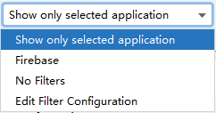
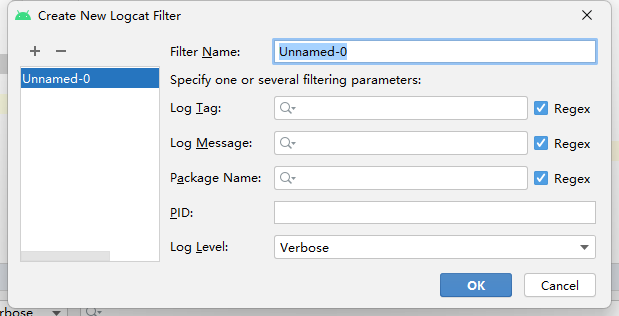
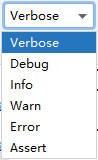

# Android 简介

## Android系统架构

> [平台架构](https://developer.android.com/guide/platform?hl=zh-cn)

**(1) Linux内核(Linux Kerenl)**

**基础**：Android平台的核心，负责硬件驱动、内存管理、进程管理、电源管理和安全性。

**功能**：提供线程处理和低级内存管理，利用关键安全功能，并支持硬件驱动开发。

**(2) 硬件抽象层(HAL)**

**接口**：提供标准接口，将设备硬件功能暴露给高级Java API框架。

**模块**：包含多个库模块，每个模块为特定硬件组件（如相机、蓝牙）实现接口，确保框架API能够正确访问硬件。

**(3) 原生 C/C++ 库(Native C/C++ Libraries)**

**核心功能**：许多Android系统的核心组件和服务（如ART和HAL）使用C/C++编写的原生库构建。比如SQLite、OpenGL ES、WebKit。

**访问方法**：通过 Android NDK 可以直接使用C/C++代码访问原生平台库，或使用Java框架API来访问这些库。

**(4) Android 运行时(Android Runtime)**

**1. Android Runtime (ART)**

**独立进程**：对于搭载Android 5.0（API级别21）或更高版本的设备，每个应用在其自己的进程中运行，并有其自己的ART实例。

**DEX文件**：ART通过执行Dalvik可执行文件格式（DEX）文件运行，这种格式针对最小内存占用进行了优化。构建工具（如d8）将Java源代码编译成DEX字节码。

**主要功能**：

1. 预先编译 (AOT) 和即时编译 (JIT)
2. 优化的垃圾回收 (GC)
3. 调试支持
4. 更紧凑的机器代码

**历史兼容性**：在Android 5.0之前，Dalvik是Android运行时。如果应用在ART上运行良好，也可以在Dalvik上运行，但反过来不一定。

**2. 核心运行时库(Core Libraries)**

提供了 Java API 框架所使用的 Java 编程语言中的大部分功能，包括一些 Java 8 语言功能。

包含 Java 标准库和 Android 特有的库，支持应用开发所需的各种功能。

**(5) 应用框架层(Java API Framework)**

在 Android 中，Java API 框架为开发者提供了使用 Android 操作系统全部功能的工具。这些 API 是构建 Android 应用的基础，可以简化核心系统组件和服务的重用。以下是 Java API 框架的主要组件和服务：

* **视图系统（View System）**：用于构建应用的用户界面。支持各种 UI 组件，如列表、网格、文本框、按钮，甚至嵌入的网络浏览器。。
* **内容提供者（Content Provider）**：允许应用访问其他应用中的数据或共享自己的数据。
* **管理器（Managers）**：提供各种系统服务和功能的管理接口。
  * **活动管理器（Activity）**：管理应用的生命周期和任务栈，处理活动的启动、停止和恢复。
  * 包管理器（Package）：管理应用包和安装状态。
  * **通知管理器（Notification）**：允许应用在状态栏中显示自定义提醒，通知用户重要信息。
  * **资源管理器（Resource）**：用于访问非代码资源，如本地化的字符串、图形和布局文件。
  * 位置管理器（Location）：处理位置和 GPS 数据。
  * 电话管理器（Telephony）：访问电话相关的信息和功能。
  * 窗口管理器（Window）：管理窗口的显示和布局。

这些 API 使开发者能够充分利用 Android 系统的功能来构建应用。

**(5) 应用层(System Apps)**

应用层是 Android 架构的顶层，涵盖了所有应用程序，包括系统自带的、第三方应用和用户自定义的应用。

## Android应用开发概述

**1. 开发环境**

**IDE**：Android Studio 是 Google 官方推荐的集成开发环境（IDE），它提供了完整的开发工具链，包括代码编辑、调试、性能分析等。
**编程语言**：主要使用 Java 和 Kotlin。Kotlin 是 Google 推广的现代编程语言，具有简洁、安全和强大的特点。

**2. 应用架构**

**组件**：Android 应用主要由四种组件构成：

* **Activity**：表示用户界面，一个 Activity 通常对应一个屏幕。
* **Service**：在后台执行长时间运行的操作。
* **Broadcast Receiver**：用于接收和处理广播消息。
* **Content Provider**：管理应用与外部存储的数据共享。

**架构模式**：推荐使用 MVVM（Model-View-ViewModel）架构，以便更好地管理代码和提高可维护性。

**3. 关键技术**

**UI 设计**：使用 XML 定义布局，也可以使用 Jetpack Compose 进行声明式 UI 开发。
**多线程**：通过使用 AsyncTask、Handler、Thread、ExecutorService 或 Jetpack 的 WorkManager、Coroutine 来处理多线程任务。
**网络通信**：使用 HttpURLConnection、OkHttp、Retrofit 等库进行网络请求。
**数据存储**：使用 SQLite、Room 持久化库、SharedPreferences 或者文件系统来存储数据。
**依赖注入**：使用 Dagger 或 Hilt 实现依赖注入，简化对象创建和管理。

**4. 权限管理**

**动态权限**：从 Android 6.0 开始，应用需要在运行时请求危险权限，使用 `ContextCompat.checkSelfPermission` 和 `ActivityCompat.requestPermissions` 方法。
**权限组**：权限被分为正常权限和危险权限，危险权限需要在运行时请求，正常权限只需在安装时声明。

**5. 兼容性和优化**

**最低支持版本**：用户的应用需要支持 Android 5.0（API 级别 21）及以上版本。
**适配不同屏幕**：通过使用 res 文件夹下的不同资源目录（如 layout, layout-land, layout-sw600dp 等）来适配不同屏幕尺寸和分辨率。
**性能优化**：优化布局、减少过度绘制、使用内存分析工具（如 Android Profiler）来检测内存泄漏。

**6. 测试和发布**

**测试**：包括单元测试（使用 JUnit）、UI 测试（使用 Espresso）和集成测试。还可以使用 Firebase Test Lab 进行云端测试。
**发布**：通过 Google Play 商店发布应用，遵循 Play 商店的发布政策和指南，确保应用安全、稳定和高质量。

**7. 逆向工程**

安卓逆向工作，需要掌握安卓系统的内部机制，包括 APK 反编译、调试、代码注入等技术。

## 开发环境搭建

**(1) JDK（Java Development Kit）**

**作用**：提供 Java 编程语言的开发工具和运行环境。
**版本**：对于 Android 开发，通常使用 OpenJDK 8 或 Oracle JDK 8。自 Android Studio 2.2.1 开始，Android Studio 内置了 OpenJDK 8，因此不需要单独安装 JDK。

**(2). **[Android Studio](https://developer.android.com/studio/archive)** 4.1.2**

**作用**：官方推荐的集成开发环境（IDE），集成了所有开发 Android 应用所需的工具。
**功能**：包括代码编辑、调试、构建、测试和发布应用的工具，以及 Android SDK 和模拟器的管理功能。

**(3) Android SDK（Software Development Kit）**

**作用**：提供开发 Android 应用所需的 API 和工具。

**组成**：

* **SDK Platforms**：不同版本的 Android 操作系统的 API 和系统镜像。
* **SDK Tools**：如 adb（Android Debug Bridge）、fastboot、sdkmanager 等，用于设备管理和 SDK 组件管理。
* **Build Tools**：编译和打包应用的工具，如 aapt、dx。
* **Android Emulator**：模拟 Android 设备，用于测试应用程序。
  
**(4) Gradle**

**作用**：构建工具，用于自动化构建和管理项目依赖。
**功能**：用于编译、打包、测试和发布 Android 应用，Android Studio 使用 Gradle 作为默认的构建系统。

**(5) 设备或模拟器**

**物理设备**：实际的 Android 设备用于测试应用。

1. 打开开发者模式
2. 开启USB调试

**Android Emulator**：虚拟设备，用于在没有物理设备的情况下测试应用，支持不同 Android 版本和设备配置。

**(6) 命令行工具**

**1. ADB**

ADB 是 Android SDK 中自带的一个调试工具，使用这个工具可以直接对连接在电脑上的手机或模拟器进行调试操作

ADB 存放在 sdk 的 platform-tools 目录下，如果想要在命令行中使用这个工具，就需要先把它的路径配置到环境变量中

* **windows 配置环境变量**
  * 可以右击计算机->属性->高级系统设置->环境变量，然后在系统变量里找到 Path 并点击编辑，将 platform-tools 目录配置进去

## 创建项目

**(1) 选择模板**

Empty Activity

**(2) 创建活动和布局命名**

Language：Java
Minimum：API 21: Android 5.0

**(3) Android 11（API 级别 30），推荐的版本配置如下**

修改 \app\build.gradle

```
android {
    compileSdkVersion 30
    buildToolsVersion "30.0.3"

    defaultConfig {
        minSdkVersion 21
        targetSdkVersion 30
    }
}

dependencies {
    implementation 'androidx.appcompat:appcompat:1.3.1'
    implementation 'com.google.android.material:material:1.4.0'
    implementation 'androidx.constraintlayout:constraintlayout:2.1.0'
    testImplementation 'junit:junit:4.13.2'
    androidTestImplementation 'androidx.test.ext:junit:1.1.3'
    androidTestImplementation 'androidx.test.espresso:espresso-core:3.4.0'
}
```

## 目录结构

Android Studio 视图模式

1. Android 模式 - 按组件区分
2. Project 模式 - 按文件夹区分

**Project 模式**

```
├─app - Android 项目的模块，包含应用程序的主要代码和资源
│  ├─build - 包含构建过程生成的文件，包括APK文件、临时文件等
│  ├─libs - 第三方jar包，会被自动添加到构建路径中
│  └─src
│      ├─androidTest - Android 测试的源代码
│      ├─main
│      │  ├─java - Java 源代码文件
│      │  ├─AndroidManifest.xml - 配置文件
│      │  └─res - 资源文件
│      │      ├─drawable - 图形资源
│      │      ├─drawable-hdpi - 240dpi 图形资源
│      │      ├─drawable-mdpi - 160dpi 图形资源
│      │      ├─drawable-xhdpi - 320dpi 图形资源
│      │      ├─drawable-xxhdpi - 480dpi 图形资源 1080x1920
│      │      ├─drawable-xxxhdpi - 640dpi 图形资源 1440x2560
│      │      ├─drawable-v24 - API 级别 24 及以上版本的图形资源
│      │      ├─layout - 布局文件
│      │      ├─mipmap-anydpi-v26 - API 级别 26及以上版本的应用图标
│      │      ├─mipmap-hdpi - 240dpi 应用图标
│      │      ├─mipmap-mdpi - 160dpi 应用图标
│      │      ├─mipmap-xhdpi - 320dpi 应用图标
│      │      ├─mipmap-xxhdpi - 480dpi 应用图标
│      │      ├─mipmap-xxxhdpi - 640dpi 应用图标
│      │      ├─values - 各种常量资源值，例如字符串、颜色、尺寸等
│      │      └─values-night - 夜间模式下的常量资源值
│      ├─.gitignore - 模块的git忽略文件
│      ├─build.gradle - 模块的构建设置，包括编译配置和依赖关系
│      ├─proguard-rules.pro - Proguard 的规则，用于混淆和优化代码
│      └─test - 单元测试的源代码
├─gradle
│    └─wrapper - 指定 Gradle 的特定版本，而无需手动安装该版本
│       ├─gradle-wrapper.properties - Gradle Wrapper 的配置文件
│       └─gradle-wrapper.jar - Gradle Wrapper 的 JAR 文件
├─.gitignore - git忽略文件
├─build.gradle - 定义项目的全局构建配置，包括构建脚本的依赖和仓库
├─gradle.properties - 全局gradle的配置文件
├─gradlew - 在Linux或Mac系统中命令行界面中执行 Gradle 命令
├─gradlew.bat - 在Windows系统中命令行界面中执行 Gradle 命令
├─local.properties - 指定本地环境相关的配置信息，Android SDK 的路径等
└─settings.gradle - 定义项目的模块和其他配置
```

Android 提供了多个 drawable/mipmap 子文件夹，每个文件夹对应不同的屏幕密度（DPI）和不同分辨率的设备上都能提供最佳的图像质量和用户体验。当使用 `@drawable`/`@mipmap` 时，系统会根据当前设备的屏幕密度自动选择最合适的资源文件夹。

## 文件详解

### AndroidManifest 详解

```xml
<?xml version="1.0" encoding="utf-8"?>
<manifest xmlns:android="http://schemas.android.com/apk/res/android"
    package="com.example.demo01">

    <application
        android:allowBackup="true"
        android:icon="@mipmap/ic_launcher"
        android:label="@string/app_name"
        android:roundIcon="@mipmap/ic_launcher_round"
        android:supportsRtl="true"
        android:theme="@style/Theme.Demo01">
        <activity android:name=".MainActivity">
            <intent-filter>
                <action android:name="android.intent.action.MAIN" />

                <category android:name="android.intent.category.LAUNCHER" />
            </intent-filter>
        </activity>
    </application>

</manifest>
```

**(1) XML 声明**

声明这是一个 XML 文件，指定 XML 的版本为 1.0，并使用 UTF-8 编码。

```xml
<?xml version="1.0" encoding="utf-8"?>
```

**(2) manifest 标签**

在 AndroidManifest.xml 文件中，所有的 XML 标签都必须位于 `<manifest>` 元素内部。

`<manifest>` 元素是清单文件的根元素，定义了应用程序的基本结构和全局属性。

```xml
<manifest xmlns:android="http://schemas.android.com/apk/res/android"
    package="com.example.demo">
```

* 必须属性
  * xmlns:android
      * 描述：以 android: 前缀开头的属性都被认为是属于 Android 命名空间
      * xmlns
        * XML 命名空间（XML Namespace）的缩写。这是一个 XML 属性，用于声明命名空间。
      * :android
        * 命名空间前缀 `android:` 用于标识属于 Android 特有命名空间的属性和元素。
    * 示例：`http://schemas.android.com/apk/res/android`
      * 示例 URI 是 Android 平台识别和处理特有属性和元素的标准 URI，如果 URI 更改，Android 工具和运行时将无法正确解析这些属性和元素。
  * **package**
    * 描述：应用程序的包名，是应用程序在设备上的唯一标识符。
    * 示例：`package="com.example.demo`
* 可选属性
  * **android:versionCode**
    * 描述：表示应用程序的版本号，通常用于内部版本管理。
    * 示例：`android:versionCode="1"`
  * **android:versionName**
    * 描述：表示用户可见的版本名称。
    * 示例：`android:versionName="1.0"`
  * **android:installLocation**
    * 描述：指定应用程序的安装位置
    * 可选值：
      * internalOnly(默认)：只允许安装在内部存储。
      * preferExternal：优先安装在外部存储，如果不可用则安装在内部存储。
      * auto：系统决定安装位置
    * 示例：`android:installLocation="auto"`
  * **android:sharedUserId**
    * 描述：允许多个应用共享相同的 Linux 用户 ID，从而共享数据和代码。
    * 示例：`android:sharedUserId="com.example.shared"`
  * **android:sharedUserLabel**
    * 描述：为共享用户 ID 指定一个用户可见的标签。依赖于 android:sharedUserId。
    * 示例：`android:sharedUserLabel="@string/shared_user_label"`
* 子元素
    * `<application>` 用于定义应用程序的全局配置及其组件
    * `<uses-permission>` 声明应用所需的权限
    * `<uses-permission-sdk-23>` 针对 Android 6.0（API 级别 23）及更高版本声明的权限
    * `<permission>` 自定义应用的权限，通常用于限制其他应用与当前应用的交互
    * `<permission-group>` 定义权限组，权限组包含多个相关的权限
    * `<permission-tree>` 定义一棵权限树，允许应用动态定义权限的名称空间
    * `<uses-feature>` 声明应用所使用的硬件或软件特性，如摄像头、GPS 等
    * `<uses-sdk>` 定义应用的最小、目标和最大 SDK 版本
    * `<supports-screens>`  声明应用支持的屏幕尺寸和密度
    * `<compatible-screens>` 定义应用专门支持的屏幕配置
    * `<supports-gl-texture>` 声明应用支持的 OpenGL ES 纹理格式
    * `<instrumentation>` 声明与应用打包在一起的测试框架
    * `<uses-configuration>` 声明应用所需的系统配置
    * `<uses-library>` 声明应用需要链接的外部库
    * `<meta-data>` 声明应用级别的元数据

**(3) `<application>` 标签**

`<application>` 标签用于定义应用程序的全局配置及其组件。

所有应用程序的组件（如活动、服务、广播接收器和内容提供者）都包含在 `<application>` 元素内。

```xml
<application
    android:allowBackup="true"
    android:icon="@mipmap/ic_launcher"
    android:label="@string/app_name"
    android:roundIcon="@mipmap/ic_launcher_round"
    android:supportsRtl="true"
    android:theme="@style/Theme.Demo01">
</application>
```

* 必须属性
  * **android:icon**
    * 描述：指定应用程序的图标资源，用于在设备的应用抽屉和主屏幕上显示。
    * 示例：`android:icon="@mipmap/ic_launcher"`
  * **android:label**
    * 描述：指定应用程序的用户可见名称，显示在应用抽屉、主屏幕以及最近任务列表中。
    * 示例：`android:label="@string/app_name"`
* 可选属性
  * **android:name**
    * 描述: 指定应用程序的 Application 子类名，用于自定义全局状态管理、初始化操作或其他应用级别的逻辑。如果不指定，则默认使用系统提供的 Application 类。
    * 示例: android:name=".MyApplication"
  * **android:allowBackup**
    * 描述:  指定是否允许系统自动备份应用程序的数据，例如在重新安装应用时还原数据。
    * 可选值
      * true(默认): 允许
      * false: 禁止
  * **android:roundIcon**
    * 描述: 指定应用程序的圆形图标资源，用于在支持圆形图标的设备和界面上显示。通常用于 Android 7.1（API 级别 25）及以上的设备。
    * 示例: `android:roundIcon="@mipmap/ic_launcher_round"`
  * **android:supportsRtl**
    * 描述: 指定应用程序是否支持从右到左的布局方向，适用于阿拉伯语等右到左语言。
    * 可选值
      * true: 支持 RTL 布局
      * false(默认): 不支持 RTL 布局
  * **android:theme**
    * 描述: 设置应用程序的默认主题，影响应用程序的外观和样式。
    * 示例: `android:theme="@style/AppTheme"`
  * **android:debuggable**
    * 描述: 指定应用程序是否可通过调试工具进行调试。开发阶段通常设置为 true，发布时应设置为 false。
    * 可选值:
      * true: 允许调试。
      * false (默认): 禁止调试。
  * **android:hardwareAccelerated**
    * 描述: 指定是否启用硬件加速，以提高应用程序的图形性能。
    * 可选值: 
      * true (默认): 启用硬件加速。
      * false: 禁用硬件加速。
  * **android:largeHeap**
    * 描述: 指定应用程序是否请求更大的堆内存，适用于内存密集型应用。
    * 可选值:
      * true: 请求更大的堆内存。
      * false (默认): 使用标准堆内存大小。
  * **android:usesCleartextTraffic**
    * 描述: 指定应用程序是否允许通过明文（非加密）HTTP 传输数据。
    * 可选值:
      * true (默认): 允许明文流量。
      * false: 禁止明文流量，仅允许加密流量。
  * **android:networkSecurityConfig**
    * 描述: 指定应用程序的网络安全配置文件，定义证书验证、域名验证等网络安全策略。
    * 示例: `android:networkSecurityConfig="@xml/network_security_config"`
* 子元素
  * `<activity>`：定义一个应用的活动（Activity），通常代表应用的一个单独的界面。
  * `<service>`：定义一个后台服务（Service），用于执行长时间运行的操作。
  * `<receiver>`：定义一个广播接收器（BroadcastReceiver），用于监听并响应广播消息。
  * `<provider>`：定义一个内容提供者（ContentProvider），用于管理应用的数据共享。
  * `<activity-alias>`：为一个已经存在的活动定义一个别名，通常用于动态切换启动的活动。
  * `<meta-data>`：用于在应用或组件中添加任意的元数据信息，可以在运行时通过代码访问。
  * `<uses-library>`：指定应用所需的外部库，以确保运行时环境中有必要的库。
  * `<permission>`：定义应用所声明的权限。
  * `<intent-filter>`：定义组件可以响应的 Intent，如 activity、service 或 receiver 内使用。
  * `<grant-uri-permission>`：用于内容提供者中，允许指定的 URI 进行读写操作。
  * `<path-permission>`：用于内容提供者中，定义对特定路径的 URI 的权限。
  * `<profileable>`：Android 10 引入的元素，用于标记是否允许应用进程的性能分析。
  * `<backup>`：Android 11 引入的元素，用于配置应用的备份行为。
  * `<component-alias>`：在 Android 12 中引入，用于创建现有组件的别名，类似于 <activity-alias>。


**(4) `<activity>` 标签**

```xml
<activity android:name=".MainActivity">
    <intent-filter>
        <action android:name="android.intent.action.MAIN" />
        <category android:name="android.intent.category.LAUNCHER" />
    </intent-filter>
</activity>
```

**描述**:  `<activity>` 标签用于声明应用程序中的一个 Activity。

Activity 是 Android 应用程序的基本组件，表示应用的一个独立屏幕，每个 Activity 都必须在 AndroidManifest.xml 文件中声明。

`android:name=".MainActivity"`

**描述**: 指定 Activity 的类名。.MainActivity 表示 MainActivity 类位于应用程序的根包中，此路径是相对于应用程序的包名的相对路径。

**(5) `<intent-filter>` 标签**

**描述**: `<intent-filter>` 标签用于定义 Activity 可以响应的 Intent 类型。

Intent 是 Android 中的一种消息传递机制，常用于在应用程序组件之间传递信息或启动新的 Activity。

**意图过滤器（Intent Filter）**: 一个 Activity 可以有多个意图过滤器。每个过滤器可以定义一组特定的操作、类别和数据。

只有当传入的 Intent 匹配 Activity 的意图过滤器时，系统才会启动该 Activity。

**(6) `<action>` 标签**

**描述**: `<action>` 标签定义了此 Activity 能处理的操作类型。

操作（Action）是 Intent 的一个核心部分，指定了要执行的基本操作（例如，查看、编辑、拨打电话等）。

`android:name="android.intent.action.MAIN"`

**描述**: android:name 指定此 Intent 过滤器可以处理的操作类型。

`android.intent.action.MAIN` 是一个标准的 Intent 操作，**用于标识应用程序的主入口 Activity**。

这意味着，当应用程序启动时，系统会将此 Activity 作为主界面加载。

**(7) `<category>` 标签**

**描述**: `<category>` 标签用于进一步描述此 Intent 的类型。

类别（Category）为 Intent 提供了更多的上下文信息，使系统能够更准确地找到匹配的 Activity。一个 Intent 可以有多个类别，以便精确匹配对应的 Activity。

`android:name="android.intent.category.LAUNCHER"`

**描述**: android:name 指定此 Activity 属于的类别。

`android.intent.category.LAUNCHER` 是一个标准的 Intent 类别，表示带有这个类别的 Activity 会显示在设备的启动器（通常是主屏幕或应用抽屉）中，用户可以通过点击应用图标来启动它。

当 Activity 同时包含 `android.intent.action.MAIN` 和 `android.intent.category.LAUNCHER` 时，Android 系统会将这个 Activity 视为应用程序的主入口。这样，这个 Activity 会显示在启动器中，用户点击应用图标后，系统会加载并显示这个 Activity。

### MainActivity

```java
package com.example.demo;

import androidx.appcompat.app.AppCompatActivity;

import android.os.Bundle;

public class MainActivity extends AppCompatActivity {

    @Override
    protected void onCreate(Bundle savedInstanceState) {
        super.onCreate(savedInstanceState);
        setContentView(R.layout.activity_main);
    }
}
```

AppCompatActivity 是 Activity 的子类，提供了向下兼容的支持和现代 UI 特性。

`onCreate(Bundle savedInstanceState)` 是活动生命周期中的关键方法，用于初始化活动。它在活动被创建时调用，通常用于设置界面的布局和初始化其他资源。

`setContentView(R.layout.activity_main)` 将布局文件绑定到当前活动上，使得活动显示该布局中的 UI 组件。

### 资源文件详解

* **布局文件 (`res/layout/`)**
  - **位置**: `res/layout/`
  - **描述**: 定义活动、片段、对话框等用户界面的 XML 文件。
  - **XML 引用**: 
    - 在 XML 文件中包含其他布局:
      ```xml
      <include layout="@layout/another_layout" />
      ```
  - **代码引用**: `R.layout.[layout_name]`
  - **示例**:
    ```xml
    <LinearLayout
        android:layout_width="match_parent"
        android:layout_height="wrap_content"
        android:orientation="vertical">
        <TextView
            android:layout_width="wrap_content"
            android:layout_height="wrap_content"
            android:text="@string/welcome_message"/>
        <Button
            android:id="@+id/button_submit"
            android:layout_width="wrap_content"
            android:layout_height="wrap_content"
            android:text="@string/submit"/>
    </LinearLayout>
    ```

* **图像资源 (`res/drawable/` & `res/mipmap/`)**
  - **位置**: `res/drawable/`, `res/mipmap/`
  - **描述**: 
    - **drawable**: 存储静态图像、状态列表、形状、矢量图等。
    - **mipmap**: 存储不同分辨率的应用图标。
  - **XML 引用**: `@drawable/[drawable_name]` 或 `@mipmap/[mipmap_name]`
  - **代码引用**: `R.drawable.[drawable_name]` 或 `R.mipmap/[mipmap_name]`
  - **示例**:
    ```xml
    <ImageView
        android:layout_width="wrap_content"
        android:layout_height="wrap_content"
        android:src="@drawable/sample_image" />
    ```

* **字符串资源 (`res/values/strings.xml`)**
  - **位置**: `res/values/strings.xml`
  - **描述**: 存储应用中使用的所有字符串，便于国际化和本地化。
  - **XML 引用**: `@string/[string_name]`
  - **代码引用**: `R.string.[string_name]`
  - **示例**:
    ```xml
    <resources>
        <string name="app_name">MyApp</string>
        <string name="welcome_message">Welcome to MyApp!</string>
        <string name="submit">Submit</string>
    </resources>
    ```

* **样式文件 (`res/values/styles.xml`)**
  - **位置**: `res/values/styles.xml`
  - **描述**: 定义 UI 组件的样式和应用的主题。
  - **XML 引用**: `@style/[style_name]`
  - **代码引用**: 样式通常在 XML 中定义和应用。
  - **示例**:
    ```xml
    <style name="CustomButton">
        <item name="android:layout_width">match_parent</item>
        <item name="android:layout_height">wrap_content</item>
        <item name="android:backgroundTint">@color/colorPrimary</item>
    </style>
    ```
    在布局文件中应用样式：
    ```xml
    <Button
        style="@style/CustomButton"
        android:text="@string/submit"/>
    ```

* **尺寸资源 (`res/values/dimens.xml`)**
  - **位置**: `res/values/dimens.xml`
  - **描述**: 存储尺寸值（如字体大小、边距等），便于统一管理。
  - **XML 引用**: `@dimen/[dimen_name]`
  - **代码引用**: `R.dimen.[dimen_name]`
  - **示例**:
    ```xml
    <resources>
        <dimen name="text_size">16sp</dimen>
        <dimen name="margin">8dp</dimen>
    </resources>
    ```
    在布局文件中引用：
    ```xml
    <TextView
        android:layout_width="wrap_content"
        android:layout_height="wrap_content"
        android:textSize="@dimen/text_size"
        android:layout_margin="@dimen/margin"/>
    ```

* **颜色资源 (`res/values/colors.xml`)**
  - **位置**: `res/values/colors.xml`
  - **描述**: 存储应用中使用的颜色值。
  - **XML 引用**: `@color/[color_name]`
  - **代码引用**: `R.color.[color_name]`
  - **示例**:
    ```xml
    <resources>
        <color name="colorPrimary">#6200EE</color>
        <color name="colorAccent">#03DAC5</color>
    </resources>
    ```
    在布局文件中引用：
    ```xml
    <TextView
        android:layout_width="wrap_content"
        android:layout_height="wrap_content"
        android:textColor="@color/colorAccent"/>
    ```

* **整数和布尔值资源 (`res/values/integers.xml` & `res/values/bools.xml`)**
  - **位置**: `res/values/integers.xml`, `res/values/bools.xml`
  - **描述**: 存储整数和布尔值常量。
  - **XML 引用**: 布局文件和样式文件不能直接引用整数和布尔值资源，但可以间接地通过数据绑定等方式使用；其他 XML 文件中（如动画文件）都可以引用这些资源。
  - **代码引用**: 通过 `getResources()` 或 `ResourcesCompat` 获取。
  - **示例**:
    ```xml
    <!-- integers.xml -->
    <resources>
        <integer name="max_items">10</integer>
    </resources>

    <!-- bools.xml -->
    <resources>
        <bool name="is_feature_enabled">true</bool>
    </resources>
    ```
    在代码中使用：
    ```java
    int maxItems = getResources().getInteger(R.integer.max_items);
    boolean isEnabled = getResources().getBoolean(R.bool.is_feature_enabled);
    ```

* **数组资源 (`res/values/arrays.xml`)**
  - **位置**: `res/values/arrays.xml`
  - **描述**: 存储字符串、整数等类型的数组。
  - **XML 引用**: `@array/[array_name]`
  - **代码引用**: 通过 `getResources()` 获取数组资源。
  - **示例**:
    ```xml
    <resources>
        <string-array name="countries_array">
            <item>USA</item>
            <item>Canada</item>
        </string-array>
    </resources>
    ```
    ```xml
    <Spinner
    android:id="@+id/countries_spinner"
    android:layout_width="wrap_content"
    android:layout_height="wrap_content"
    android:entries="@array/countries_array" />
    ```
    在代码中使用：
    ```java
    String[] countries = getResources().getStringArray(R.array.countries_array);
    ```

* **Id 资源 (`res/values/ids.xml`)**
  - **位置**: `res/values/ids.xml`
  - **描述**: 定义唯一 ID，可在代码或布局文件中引用。
  - **XML 引用**: 
    - 在布局文件中使用 `@+id/` 前缀为视图组件分配一个新的 ID。
    - 在 `ids.xml` 文件中手动定义 ID:
      ```xml
      <!-- res/values/ids.xml -->
      <resources>
          <item name="button_submit" type="id"/>
      </resources>
      ```
      ```xml
      <!-- res/layout/activity_main.xml -->
      <Button
          android:id="@+id/button_submit"
          android:layout_width="wrap_content"
          android:layout_height="wrap_content"
          android:text="Submit" />


      <TextView
          android:layout_width="wrap_content"
          android:layout_height="wrap_content"
          android:layout_toRightOf="@id/button_submit"
          android:text="Hello" />

      ```
      ```java
      Button submitButton = findViewById(R.id.button_submit);
      submitButton.setOnClickListener(v -> {
          // Handle button click
      });
      ```
  - **代码引用**: 使用 `findViewById()` 查找视图。

* **主题资源 (`res/values/themes.xml`)**
  - **位置**: `res/values/themes.xml`
  - **描述**: 定义应用的全局主题，包括颜色、字体和样式等。
  - **XML 引用**: 
    - 在 `AndroidManifest.xml` 中使用 `@style` 设置应用级主题；在活动级别使用 `@style` 设置特定活动的主题。
    - 在 XML 布局文件中使用 `?attr/` 引用当前主题中的属性。
  - **代码引用**: 通过 `Context.getTheme()` 或 `AppCompatDelegate` 动态切换主题。
  - **示例**:
    ```xml
    <style name="AppTheme" parent="Theme.AppCompat.Light.DarkActionBar">
        <item name="colorPrimary">@color/colorPrimary</item>
    </style>
    ```
    在活动中使用主题：
    ```xml
    <activity android:name=".MainActivity"
              android:theme="@style/AppTheme"/>
    ```
    ```xml
    <Button
    android:layout_width="wrap_content"
    android:layout_height="wrap_content"
    android:text="Click Me"
    android:background="?attr/colorPrimary" />
    ```
  - **代码引用**:
    ```java
    // Java 示例
    TypedValue typedValue = new TypedValue();
    getTheme().resolveAttribute(R.attr.colorPrimary, typedValue, true);
    int color = typedValue.data;
    ```
    ```java
    // 动态切换主题
    AppCompatDelegate.setDefaultNightMode(AppCompatDelegate.MODE_NIGHT_YES); // 切换到夜间模式
    ```
* **动画资源 (`res/anim/`)**
  - **位置**: `res/anim/`
  - **描述**：定义简单的视图动画效果的 XML 文件。这些动画可以应用于视图对象，例如淡入淡出、旋转、缩放等。
  - **XML 引用**:
    1. 在 XML 布局文件中为视图组件应用动画:
      ```xml
      <ImageView
          android:layout_width="wrap_content"
          android:layout_height="wrap_content"
          android:src="@drawable/image"
          android:layout_animation="@anim/fade_in"/>
      ```
    2. 在动画 XML 文件中定义动画:
      ```xml
      <!-- res/anim/fade_in.xml -->
      <alpha
          android:fromAlpha="0.0"
          android:toAlpha="1.0"
          android:duration="500"/>
      ```
  - **代码引用**:
    - 在 Java 代码中加载和应用动画:
      ```java
      Animation animation = AnimationUtils.loadAnimation(context, R.anim.fade_in);
      view.startAnimation(animation);
      ```
* **过渡动画资源 (`res/animator/`)**
  - **位置**: `res/animator/`
  - **描述**：定义属性动画的 XML 文件，用于更复杂的动画效果，例如平移、旋转、缩放、改变透明度等。通常用于界面元素在状态改变时的过渡效果。
  - **XML 引用**:
    1. 在 XML 文件中定义属性动画:
      ```xml
      <!-- res/animator/scale.xml -->
      <objectAnimator
          android:duration="500"
          android:propertyName="scaleX"
          android:valueFrom="1.0"
          android:valueTo="2.0"
          android:valueType="floatType"/>
      ```
  - **代码引用**:
    - 在 Java 代码中加载和应用属性动画:
      ```java
      Animator animator = AnimatorInflater.loadAnimator(context, R.animator.scale);
      animator.setTarget(view);
      animator.start();
      ```
* **过渡资源 (`res/transition/`)**
  - **位置**: `res/transition/`
  - **描述**：定义场景转换动画的 XML 文件，通常用于不同 UI 状态之间的过渡。过渡资源文件可以指定动画效果，例如淡入淡出、滑动等，在界面状态或内容变更时应用这些动画。
  - **XML 引用**:
    1. 在 XML 文件中定义场景转换动画:
      ```xml
      <!-- res/transition/fade_slide.xml -->
      <transitionSet xmlns:android="http://schemas.android.com/apk/res/android">
          <fade android:duration="500"/>
          <slide android:duration="500"/>
      </transitionSet>
      ```
  - **代码引用**:
    - 在 Java 代码中应用过渡动画:
      ```java
      Transition transition = TransitionInflater.from(context).inflateTransition(R.transition.fade_slide);
      TransitionManager.beginDelayedTransition(viewGroup, transition);
      ```
* **菜单资源 (`res/menu/`)**
  - **位置**: `res/menu/`
  - **描述**：用于定义应用程序菜单的结构，如选项菜单、上下文菜单和弹出菜单。通过 XML 文件描述菜单项及其属性。
  - **XML 引用**:
    1. 定义菜单项和属性:
      ```xml
      <!-- res/menu/main_menu.xml -->
      <menu xmlns:android="http://schemas.android.com/apk/res/android">
          <item
              android:id="@+id/action_settings"
              android:title="Settings"
              android:orderInCategory="100"
              android:showAsAction="never"/>
      </menu>
      ```
  - **代码引用**:
    - 在 Java 代码中加载和显示菜单:
      ```java
      @Override
      public boolean onCreateOptionsMenu(Menu menu) {
          getMenuInflater().inflate(R.menu.main_menu, menu);
          return true;
      }
      ```
* **原始资源 (`res/raw/`)**
  - **位置**: `res/raw/`
  - **描述**：存储未经处理的原始文件，这些文件不会被编译器修改，可以是音频、视频、文本文件或其他数据文件。
  - **XML 引用**:
    - 无直接 XML 引用，通常通过代码访问。
  - **代码引用**:
    - 访问原始资源文件:
      ```java
      InputStream inputStream = getResources().openRawResource(R.raw.sample_file);
      ```
* **字体资源 (`res/font/`)**
  - **位置**: `res/font/`
  - **描述**：存储自定义字体文件（通常为 .ttf 或 .otf 格式），可以应用于文本组件的字体设置。  
  - **XML 引用**:
    1. 在 XML 布局文件中设置自定义字体:
      ```xml
      <TextView
          android:layout_width="wrap_content"
          android:layout_height="wrap_content"
          android:fontFamily="@font/custom_font"/>
      ```
  - **代码引用**:
    - 在 Java 代码中应用自定义字体:
      ```java
      Typeface typeface = ResourcesCompat.getFont(context, R.font.custom_font);
      textView.setTypeface(typeface);
      ```
* **XML 资源 (`res/xml/`)**
  - **位置**: `res/xml/`
  - **描述**：存储各种自定义的 XML 配置文件，如网络安全配置、应用偏好设置等，用于配置应用程序的行为和功能。
  - **XML 引用**:
    1. 在自定义 XML 配置文件中:
      ```xml
      <!-- res/xml/network_security_config.xml -->
      <network-security-config>
          <domain-config cleartextTrafficPermitted="true">
              <domain includeSubdomains="true">example.com</domain>
          </domain-config>
      </network-security-config>
      ```
  - **代码引用**:
    - 通过 `XmlResourceParser` 读取自定义 XML:
      ```java
      XmlResourceParser parser = getResources().getXml(R.xml.network_security_config);
    ```
* **插值器资源 (`res/interpolator/`)**
  - **描述**：定义插值器（Interpolator）资源，控制动画的进展率，如加速、减速或反弹，使动画效果更加自然和平滑。
  - **位置**: `res/interpolator/`
  - **XML 引用**:
    1. 定义插值器:
      ```xml
      <!-- res/interpolator/bounce.xml -->
      <bounce
          xmlns:android="http://schemas.android.com/apk/res/android"
          android:duration="500"/>
      ```
  - **代码引用**:
    - 在 Java 代码中应用插值器:
      ```java
      Animation animation = AnimationUtils.loadAnimation(context, R.anim.bounce);
      animation.setInterpolator(context, R.interpolator.bounce);
      view.startAnimation(animation);
      ```
* **导航资源 (`res/navigation/`)**
  - **位置**: `res/navigation/`
  - **描述**：定义导航图，用于管理应用程序的导航逻辑。通常包含不同的目的地（Destination）和它们之间的导航操作。
  - **XML 引用**:
    1. 定义导航图:
      ```xml
      <!-- res/navigation/nav_graph.xml -->
      <nav-graph xmlns:android="http://schemas.android.com/apk/res/android"
                  xmlns:app="http://schemas.android.com/apk/res-auto">
          <fragment
              android:id="@+id/fragment_home"
              android:name="com.example.HomeFragment"
              android:label="Home">
              <action
                  android:id="@+id/action_home_to_detail"
                  app:destination="@id/fragment_detail"/>
          </fragment>
          <fragment
              android:id="@+id/fragment_detail"
              android:name="com.example.DetailFragment"
              android:label="Detail"/>
      </nav-graph>
      ```
  - **代码引用**:
    - 使用 `NavController` 进行导航:
      ```java
      NavController navController = Navigation.findNavController(this, R.id.nav_host_fragment);
      navController.navigate(R.id.action_home_to_detail);
      ```

### \build.gradle

1. **buildscript** 闭包配置了构建脚本的仓库和依赖，**用于构建工具和插件**。
2. **allprojects** 闭包设置了所有子项目共享的远程仓库，**用于项目中的实际依赖项**。
3. **自定义任务**

```js
// buildscript 闭包用于配置构建脚本的依赖项和仓库
buildscript {
    // repositories 闭包，用于指定构建脚本所需的远程仓库
    repositories {
        // google() 包含 Android 开发所需的依赖项和工具
        google()
        // jcenter() 包含大量的开源 Java 库、Android 库以及其他项目的依赖项
        jcenter()
    }
    // dependencies 闭包，用于定义构建脚本所需的依赖项
    dependencies {
        // classpath 用于指定构建脚本本身所需的依赖项 
        classpath "com.android.tools.build:gradle:4.1.2" // Android Gradle 插件的版本
    }
}

// allprojects 闭包，用于配置所有子项目（模块）的共享设置
allprojects {
    // repositories 闭包，用于指定所有模块的远程仓库设置
    repositories {
        google()
        jcenter()
    }
}

// 定义了一个 Gradle 任务 clean，类型为 Delete，用于清理构建过程中生成的临时文件和输出目录
task clean(type: Delete) {
    delete rootProject.buildDir
}
```

### \app\build.gradle

* **plugins**：指定使用的 Gradle 插件
* **android**：配置 Android 应用的编译和构建选项，包括 SDK 版本、构建类型、编译选项等
* **dependencies**：定义项目所需的库和测试框架

```
// plugins 闭包用于声明项目中所使用的 Gradle 插件
plugins {
    // id 声明该项目是一个 Android 应用程序项目，会为项目提供构建和打包 Android 应用程序所需的功能
    // com.android.application 表示一个应用程序模块
    // com.android.library 表示一个库模块
    id 'com.android.application'
}

// android 闭包定义了应用程序的配置信息
android {
    // compileSdkVersion 指定编译项目时使用的 Android SDK 版本，决定了在编译过程中可以使用的 API 级别
    // compileSdkVersion 必须不低于 targetSdkVersion
    compileSdkVersion 30

    // buildToolsVersion 指定用于编译项目的构建工具版本
    // 通常建议使用与 compileSdkVersion 兼容的最新版本
    buildToolsVersion "30.0.3"
    
    // defaultConfig 定义应用程序的默认配置信息
    defaultConfig {
        // applicationId 指定应用程序的包名
        applicationId "com.example.demo01"

        // minSdkVersion 指定应用程序支持的最低 Android SDK 版本，应用程序可以在不同版本的 Android 系统上运行，低于这个版本的系统将无法安装该应用程序
        minSdkVersion 21 

        // targetSdkVersion 指定应用程序所针对的目标 Android SDK 版本
        // targetSdkVersion指定的值表示你在该目标版本上已经做过了充分的测试，系统将会为你的应用程序启用一些最新的功能和特性。
        
        // 比如说Android 6.0系统中引入了运行时权限这个功能，如果你将targetSdkVersion指定成23或者更高，那么系统就会为程序启用运行时权限功能
        // 而如果将targetSdkVersion指定成22，那么就说明程序最高只在Android 5.1系统上做过充分的测试，Android 6.0系统中引入的新功能自然就不会启用了
        targetSdkVersion 30

        // versionCode 指定应用程序的版本号码
            // 用于在 Google Play Store 中唯一标识一个应用程序的不同版本。
            // 每次发布新版本时，版本号都应该递增，以确保新版本的应用程序可以被正确识别和更新
        versionCode 1

        // versionName 指定应用程序的版本名称
        versionName "1.0"

        // testInstrumentationRunner 指定用于执行 Android 测试的测试运行器
            // 测试运行器负责启动测试应用程序，并执行测试用例
        testInstrumentationRunner "androidx.test.runner.AndroidJUnitRunner"
    }

    // buildTypes 用于定义不同的构建类型
    // debug 闭包用于指定生成测试版安装文件的配置，debug闭包是可以忽略不写
    // release 闭包用于指定生成正式版安装文件的配置
    buildTypes {
        release {
            // minifyEnabled 用于指定是否启用代码混淆
            minifyEnabled false

            // proguardFiles 用于指定混淆时使用的规则文件
            // getDefaultProguardFile('proguard-android-optimize.txt') 获取了默认的 ProGuard 配置文件
            // proguard-android.txt 在Android SDK目录下的，里面是所有项目通用的混淆规则
            // proguard-rules.pro 自定义的混淆规则
            proguardFiles getDefaultProguardFile('proguard-android-optimize.txt'), 'proguard-rules.pro'
        }
    }
    // compileOptions  用于配置 Java 编译选项，指定源代码和目标代码的兼容性
    compileOptions {
        // sourceCompatibility 指定了源代码的兼容性
        sourceCompatibility JavaVersion.VERSION_1_8

        // targetCompatibility 指定了目标代码的兼容性
        targetCompatibility JavaVersion.VERSION_1_8
    }
}

// dependencies 声明项目所依赖的库和组件

// 通常Android Studio项目一共有3种依赖方式：本地依赖、库依赖和远程依赖

// 本地依赖是指引入包括位于项目内的 .jar 文件或其他模块
// 库依赖是指引入其他模块、本地库文件或者远程仓库中的第三方库
// 远程依赖是指引入远程仓库中的第三方库

// implementation 指定了项目的主要依赖项，这些依赖项会被包含在最终的 APK 中
// testImplementation 指定了测试时使用的依赖项，这些依赖项仅在测试时被使用
// androidTestImplementation 指定了 Android 测试时使用的依赖项，这些依赖项仅在 Android 测试时被使用

dependencies {
    // 引入 libs 目录中的所有 .jar 文件
    // implementation fileTree(dir: 'libs', include: ['*.jar'])

    // 引入项目中的其他模块
    // implementation project(':mylibrary')

    // 使用 Android 应用兼容性库来确保应用程序在不同版本的 Android 平台上具有一致的外观和行为
    implementation 'androidx.appcompat:appcompat:1.3.1'

    // 使用 Material Design 库来创建符合 Material Design 规范的现代化用户界面
    implementation 'com.google.android.material:material:1.4.0'

    // 使用 ConstraintLayout 来创建灵活、响应式的用户界面布局
    implementation 'androidx.constraintlayout:constraintlayout:2.1.0'

    // 使用 JUnit 测试框架来编写和运行单元测试
    testImplementation 'junit:junit:4.13.2'

    // 使用 JUnit 测试框架来编写和运行 Android 单元测试
    androidTestImplementation 'androidx.test.ext:junit:1.1.3'
    
    // 使用 Espresso 测试框架来编写用户界面测试
    androidTestImplementation 'androidx.test.espresso:espresso-core:3.4.0'
}
```

## 日志工具 Log

Log 是 Android 提供的用于输出日志信息的工具类。它包含了一系列静态方法，用于打印不同级别的日志信息

**API**

* `Log.v(String tag, String msg)`: 打印 verbose 级别的日志信息，级别最低
* `Log.d(String tag, String msg)`: 打印 debug 级别的日志信息，调试信息
* `Log.i(String tag, String msg)`: 打印 info 级别的日志信息，重要信息
* `Log.w(String tag, String msg[, Throwable tr])`: 打印 warn 级别的日志信息，调试信息
* `Log.e(String tag, String msg[, Throwable tr])`: 打印 error 级别的日志信息，错误信息

**参数**

* `tag` 参数用于标识日志的来源，通常是当前类的名称或者一个用于标识日志类型的字符串
* `msg` 参数则是要输出的日志消息

**自动补全**

1. `log[diwe]` + `Tab` 键自动补全打印语句
2. 在类中输入 `logt` + `Tab` 键以当前的类名作为值自动生成一个TAG常量

**Log 和 logcat 配合**

**(1) 过滤器**



* Show only selected application 表示只显示当前选中程序的日志
* Firebase 谷歌提供的一个分析工具
* No Filters 没有过滤器，会把所有的日志都显示出来
* Edit Filter Configuration 自定义过滤器
  * 

**(2) 日志级别控制**



**(3) 关键字过滤**


