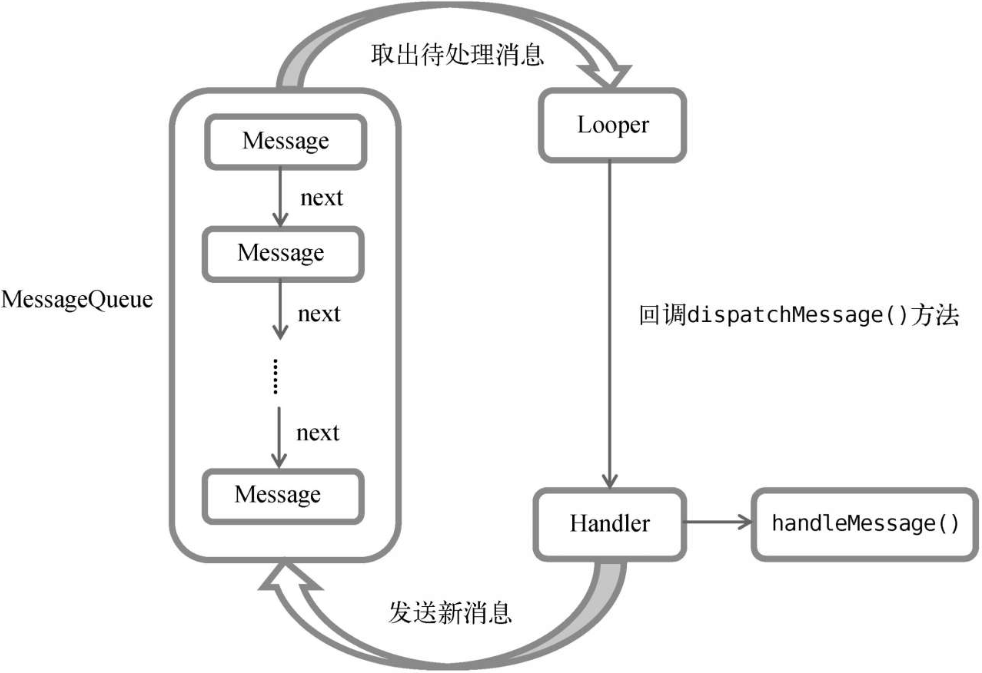

# 探究服务

## 服务

在Android中，服务（Service）用于实现程序在后台运行，适合处理无需与用户交互的长期任务。

服务在后台运行时**不依赖界面**，即使切换到其他应用程序也能保持运行。

需要注意的是，服务**依赖于创建它的应用进程**，当应用进程被杀掉时，服务也会停止。

此外，**服务默认在主线程中运行**，因此如果服务中有耗时操作，必须**手动创建子线程**来执行，以防主线程阻塞。

## Android多线程编程

在Android中，许多耗时任务需要放入子线程运行，以避免阻塞主线程。Java中已有的多线程编程方法在Android中同样适用。

### 线程的基本用法

1. **继承Thread类**：
   定义一个线程可以通过继承`Thread`类，并重写`run()`方法。
   ```java
   class MyThread extends Thread {
       @Override
       public void run() {
           // 处理具体的逻辑
       }
   }
   ```
   启动线程时，创建`MyThread`实例并调用`start()`方法。
   ```java
   new MyThread().start();
   ```

2. **实现Runnable接口**：
   另一种方式是实现`Runnable`接口，降低类之间的耦合度。
   ```java
   class MyThread implements Runnable {
       @Override
       public void run() {
           // 处理具体的逻辑
       }
   }
   ```
   启动方式如下：
   ```java
   MyThread myThread = new MyThread();
   new Thread(myThread).start();
   ```

3. **使用匿名类**：
   使用匿名类定义线程更加便捷：
   ```java
   new Thread(new Runnable() {
       @Override
       public void run() {
           // 处理具体的逻辑
       }
   }).start();
   ```

### 在子线程中更新UI

> demo34

Android的主线程（UI线程）负责处理用户界面和交互，因此必须保持流畅、迅速响应。如果在主线程中执行耗时任务，这些操作会让主线程“卡住”，用户界面会出现卡顿，甚至可能导致应用无响应（ANR）错误。

在Android中，许多**耗时任务**需要放入子线程运行，以避免阻塞主线程。

- **网络请求**（例如从服务器获取数据）
- **数据库查询**（例如复杂的数据库读写）
- **文件I/O操作**（例如读取或写入大文件）
- **复杂的计算任务**（例如图像处理、数据加密）

在Android中，Android 要求所有 UI 更新必须在 UI 线程（也称主线程）中完成，直接在子线程中更新UI会导致程序崩溃。

**1. 使用 `Handler`**

Handler 可以用来将任务投递到主线程的消息队列中，从而实现子线程与主线程之间的通信。

```java
public class MainActivity extends AppCompatActivity {
    private TextView textView;
    private Handler handler;

    @Override
    protected void onCreate(Bundle savedInstanceState) {
        super.onCreate(savedInstanceState);
        setContentView(R.layout.activity_main);

        // 获取视图组件
        textView = findViewById(R.id.text);
        Button updateButton = findViewById(R.id.update_button);  // 添加按钮

        // 创建 Handler，将更新 UI 的任务切换到主线程
        handler = new Handler(Looper.getMainLooper());

        // 设置按钮点击事件
        updateButton.setOnClickListener(v -> {
            // 在子线程中执行耗时操作
            new Thread(new Runnable() {
                @Override
                public void run() {
                    try {
                        Thread.sleep(2000);  // 模拟耗时操作
                    } catch (InterruptedException e) {
                        e.printStackTrace();
                    }

                    // 使用 Handler 将 UI 更新切换到主线程
                    handler.post(new Runnable() {
                        @Override
                        public void run() {
                            textView.setText("更新UI");  // 更新 UI
                        }
                    });
                }
            }).start();
        });
    }
}
```

 **2. 使用 `runOnUiThread()`**

Activity 提供了 runOnUiThread() 方法，用于将任务切换回主线程执行。

```java
import android.os.Bundle;
import android.widget.TextView;
import androidx.appcompat.app.AppCompatActivity;

public class MainActivity extends AppCompatActivity {
    private TextView textView;

    @Override
    protected void onCreate(Bundle savedInstanceState) {
        super.onCreate(savedInstanceState);
        setContentView(R.layout.activity_main);
        
        textView = findViewById(R.id.text);

        new Thread(new Runnable() {
            @Override
            public void run() {
                // 在子线程中执行耗时操作
                try {
                    Thread.sleep(2000);  // 模拟耗时操作
                } catch (InterruptedException e) {
                    e.printStackTrace();
                }
                
                // 使用 runOnUiThread 切换到主线程更新 UI
                runOnUiThread(new Runnable() {
                    @Override
                    public void run() {
                        textView.setText("更新UI");
                    }
                });
            }
        }).start();
    }
}
```

**3. 使用 `View.post()`**

View.post() 方法也可以用于将任务提交到主线程执行。这种方法非常简洁，适用于需要在特定 View 上更新 UI 的情况。

```java
import android.os.Bundle;
import android.widget.TextView;
import androidx.appcompat.app.AppCompatActivity;

public class MainActivity extends AppCompatActivity {
    private TextView textView;

    @Override
    protected void onCreate(Bundle savedInstanceState) {
        super.onCreate(savedInstanceState);
        setContentView(R.layout.activity_main);
        
        textView = findViewById(R.id.text);

        new Thread(new Runnable() {
            @Override
            public void run() {
                // 在子线程中执行耗时操作
                try {
                    Thread.sleep(2000);  // 模拟耗时操作
                } catch (InterruptedException e) {
                    e.printStackTrace();
                }

                // 使用 View.post() 切换到主线程更新 UI
                textView.post(new Runnable() {
                    @Override
                    public void run() {
                        textView.setText("更新UI");
                    }
                });
            }
        }).start();
    }
}
```

**4. 使用 `ExecutorService` + `Handler`**

ExecutorService 可以用来在后台线程池中执行任务，通过 Handler 切换到主线程更新 UI。

```java
import android.os.Bundle;
import android.os.Handler;
import android.os.Looper;
import android.widget.TextView;
import androidx.appcompat.app.AppCompatActivity;
import java.util.concurrent.ExecutorService;
import java.util.concurrent.Executors;

public class MainActivity extends AppCompatActivity {
    private TextView textView;
    private ExecutorService executorService;
    private Handler mainHandler;

    @Override
    protected void onCreate(Bundle savedInstanceState) {
        super.onCreate(savedInstanceState);
        setContentView(R.layout.activity_main);
        
        textView = findViewById(R.id.text);
        executorService = Executors.newSingleThreadExecutor();
        mainHandler = new Handler(Looper.getMainLooper());

        executorService.execute(new Runnable() {
            @Override
            public void run() {
                // 在子线程中执行耗时操作
                try {
                    Thread.sleep(2000);  // 模拟耗时操作
                } catch (InterruptedException e) {
                    e.printStackTrace();
                }

                // 使用 Handler 切换到主线程更新 UI
                mainHandler.post(new Runnable() {
                    @Override
                    public void run() {
                        textView.setText("更新UI");
                    }
                });
            }
        });
    }

    @Override
    protected void onDestroy() {
        super.onDestroy();
        executorService.shutdown();  // 关闭线程池
    }
}
```

**5. 使用 `LiveData` 和 `ViewModel`**

LiveData 和 ViewModel 是 Android 推荐的架构组件，能够自动在主线程中更新 UI。当后台任务完成时，LiveData 会通知主线程进行 UI 更新。

**ViewModel 类**

```java
import androidx.lifecycle.LiveData;
import androidx.lifecycle.MutableLiveData;
import androidx.lifecycle.ViewModel;

public class MyViewModel extends ViewModel {
    private MutableLiveData<String> text = new MutableLiveData<>();

    public LiveData<String> getText() {
        return text;
    }

    public void updateText(String newText) {
        text.postValue(newText);  // 使用 postValue 在后台线程更新数据
    }
}
```

**Activity 类**

```java
import android.os.Bundle;
import android.widget.TextView;
import androidx.activity.viewModels;
import androidx.appcompat.app.AppCompatActivity;

public class MainActivity extends AppCompatActivity {
    private TextView textView;
    private MyViewModel viewModel;

    @Override
    protected void onCreate(Bundle savedInstanceState) {
        super.onCreate(savedInstanceState);
        setContentView(R.layout.activity_main);
        
        textView = findViewById(R.id.text);
        viewModel = new ViewModelProvider(this).get(MyViewModel.class);

        // 观察 LiveData，当数据更新时更新 UI
        viewModel.getText().observe(this, newText -> {
            textView.setText(newText);
        });

        new Thread(new Runnable() {
            @Override
            public void run() {
                // 在子线程中执行耗时操作
                try {
                    Thread.sleep(2000);  // 模拟耗时操作
                } catch (InterruptedException e) {
                    e.printStackTrace();
                }

                // 使用 ViewModel 更新数据，LiveData 会自动通知 UI 线程更新
                viewModel.updateText("更新UI");
            }
        }).start();
    }
}
```

**6. AsyncTask**

```java
public class MainActivity extends AppCompatActivity {
    private TextView textView;

    @Override
    protected void onCreate(Bundle savedInstanceState) {
        super.onCreate(savedInstanceState);
        setContentView(R.layout.activity_main);

        textView = findViewById(R.id.text);

        // 执行 AsyncTask
        new UpdateTextTask().execute();
    }

    // 创建 AsyncTask 类
    private class UpdateTextTask extends AsyncTask<Void, Void, String> {

        // 该方法在后台线程执行
        @Override
        protected String doInBackground(Void... voids) {
            try {
                Thread.sleep(2000);  // 模拟耗时操作
            } catch (InterruptedException e) {
                e.printStackTrace();
            }
            return "更新UI";  // 返回结果
        }

        // 该方法在主线程执行，用于更新 UI
        @Override
        protected void onPostExecute(String result) {
            super.onPostExecute(result);
            textView.setText(result);  // 更新 UI
        }
    }
}
```

### 子线程中更新UI方式的区别

**1. `runOnUiThread()`**

- **概述**：这是 `Activity` 提供的一个方法，专门用于在 **UI 线程** 更新 UI。即使当前线程是子线程，调用该方法也会把任务调度到主线程执行。
- **适用场景**：当在 `Activity` 内需要更新 UI 时，使用 `runOnUiThread()` 是一种非常简单且直接的方式。
- **优点**：简单易用，直接调用即可。
- **缺点**：仅限于 `Activity` 中使用，不适用于其他组件（如 `Fragment`）。如果 `Activity` 被销毁，这可能会抛出异常。

**2. `Handler`**

- **概述**：`Handler` 是一种常见的在 **子线程** 与 **主线程** 之间传递消息和执行任务的方式。通过 `Handler` 的 `post()` 或 `sendMessage()` 方法，可以将任务提交到主线程执行。
- **适用场景**：适用于需要通过消息或任务在子线程与主线程之间进行通信的场景。
- **优点**：非常灵活，支持传递消息和执行复杂任务。
- **缺点**：需要手动管理 `Handler` 的生命周期，防止内存泄漏。

**3. `View.post()`**

- **概述**：`View.post()` 方法可以将一个 **Runnable** 提交到 **UI 线程** 执行。这是一个 `View` 类提供的方法，它允许从任何线程将 UI 更新任务提交给主线程。
- **适用场景**：适用于需要直接在 **视图组件** 上执行更新任务的情况，特别是当没有直接访问 `Activity` 或 `Handler` 时。
- **优点**：简洁且直接，不需要额外的 `Handler` 或 `runOnUiThread()`。
- **缺点**：依赖于视图组件，不能单独用于非视图组件的更新。

**4. `LiveData` 和 `ViewModel`**
- **概述**：`LiveData` 是 Android 提供的一种观察者模式的实现，配合 `ViewModel` 使用，可以在 **UI 线程** 中观察数据变化并自动更新 UI。`LiveData` 使得 UI 和数据之间的通信更加清晰和简化。
- **适用场景**：用于具有生命周期感知能力的组件（如 `Activity`、`Fragment`）中，尤其适合 MVVM 架构。
- **优点**：自动管理生命周期，避免了内存泄漏和重复更新问题，支持界面与数据解耦。
- **缺点**：相对复杂，需要学习和使用 `ViewModel` 和 `LiveData` 组合。

**5. `ExecutorService` 与 `Handler`**

- **概述**：`ExecutorService` 提供了一个线程池管理框架，用于执行并发任务。可以通过 `ExecutorService` 执行后台任务，使用 `Handler` 将结果传递回 UI 线程。
- **适用场景**：适用于管理多个并发任务和线程池的场景。
- **优点**：支持多线程和任务调度，避免了直接管理线程。
- **缺点**：需要额外的线程池管理，相比其他方法更复杂。

**6. AsyncTask(已废弃)**

- **概述**：`AsyncTask` 是用于在后台线程执行任务并在完成后将结果传递到主线程的工具。它简化了异步任务的处理，自动切换线程。
- **适用场景**：适用于执行简单的后台任务，并且需要在任务完成后更新 UI 的场景。
- **优点**：简化了线程管理，自动切换线程，易于实现。
- **缺点**：可能导致内存泄漏，不适用于大规模并发任务或复杂的线程管理。

**总结**

- **`runOnUiThread()`** 和 **`View.post()`** 是简单易用的方式，适合少量 UI 更新。
- **`Handler`** 提供了更灵活的消息传递方式，适合复杂的线程间通信。
- **`LiveData` 和 `ViewModel`** 适合使用 MVVM 架构来管理数据和 UI 之间的通信，自动处理生命周期。
- **`ExecutorService` 与 `Handler`** 提供了线程池管理，适合需要并发任务管理的场景。

### 解析异步消息处理机制

**Android 异步消息处理机制组成部分**

1. **Message**：
   - `Message` 是用来在不同线程间传递数据的载体。它包含了多个字段用于存储消息的内容：
     - `what`：一个整型的标识符，用于区分不同的消息。
     - `arg1`、`arg2`：用于存储整数类型的附加数据，通常用于传递标识符或简单数据。
     - `obj`：用于存储任意类型的对象数据，通常用于传递复杂的对象或数据结构。

2. **Handler**：
   - `Handler` 是消息的发送者和接收者，负责在当前线程中发送和处理消息。它有两个主要功能：
     - 发送消息：使用 `sendMessage()` 方法将消息发送到消息队列。
     - 处理消息：重写 `handleMessage()` 方法来处理接收到的消息。
   - 每个 `Handler` 都会与特定的线程关联，通常情况下是主线程。每个线程都有自己的 `Looper` 和 `MessageQueue`，因此 `Handler` 在发送消息时，消息会被放入对应线程的消息队列中。

3. **MessageQueue**：
   - `MessageQueue` 是存放消息的队列，所有通过 `Handler` 发送的消息都会被放入到该队列中，等待被处理。每个线程都有一个独立的 `MessageQueue`，主线程和子线程的消息队列是不同的。

4. **Looper**：
   - `Looper` 是消息队列的管理者，负责从消息队列中获取消息并分发给对应的 `Handler` 来处理。`Looper` 通过 `loop()` 方法进入无限循环，反复从消息队列中取出消息并传递给 `Handler`。  
   - 每个线程只会有一个 `Looper`，主线程默认有 `Looper`，子线程则需要手动创建。子线程需要调用 `Looper.prepare()` 来创建 `Looper`，然后调用 `Looper.loop()` 来启动消息循环。

**异步消息处理流程**



1. **创建 Handler**：
   - 在主线程中创建 `Handler` 对象，并重写 `handleMessage()` 方法。这个 `Handler` 会接收消息并在主线程中处理它们。

2. **子线程发送消息**：
   - 在子线程中，创建 `Message` 对象，并通过主线程的 `Handler` 发送消息。即使是在子线程中，消息会被排入主线程的消息队列中。

3. **消息存入队列**：
   - 通过 `Handler` 发送的消息会被存放在对应线程的 `MessageQueue` 中，等待 `Looper` 来处理。

4. **Looper 分发消息**：
   - 主线程的 `Looper` 会进入一个无限循环，反复从 `MessageQueue` 中取出消息并分发到相应的 `Handler`。如果是主线程的 `Handler`，那么消息会被传递到主线程中的 `handleMessage()` 方法进行处理。

5. **UI 更新**：
   - 由于 `Handler` 在主线程中创建并与主线程的 `Looper` 和 `MessageQueue` 绑定，`handleMessage()` 方法会在主线程中执行，从而实现 UI 的更新。这样就避免了直接在子线程中更新 UI 的问题。

**总结**

这种机制使得子线程能够通过发送消息将任务委托给主线程处理，而主线程通过 Handler 安全地处理消息，从而更新 UI，避免了直接在子线程中操作 UI 的问题。

## 服务的基本用法

### 定义一个服务

> demo35

在Android项目中定义服务的步骤如下：

1. **创建服务**：
   - 新建一个`demo35`项目，右击`com.example.demo35` → `New` → `Service` → `Service`
   - 设置服务名称为`MyService`，`Exported`属性表示是否允许其他应用访问该服务，`Enabled`属性表示服务是否启用。勾选这两个属性后点击`Finish`完成创建。

2. **MyService类代码**：
   ```java
   public class MyService extends Service {
       public MyService() {
       }
       
       @Override
       public IBinder onBind(Intent intent) {
           throw new UnsupportedOperationException("Not yet implemented");
       }
   }
   ```
   - `MyService`继承自`Service`类，这是一个服务类。
   - `onBind()`方法是`Service`中的唯一抽象方法，必须在子类中实现。当前的实现抛出`UnsupportedOperationException`，表示暂时不处理绑定操作。

3. **重写服务的常用方法**：
   ```java
   public class MyService extends Service {
       ...
       @Override
       public void onCreate() {
           super.onCreate();
       }

       @Override
       public int onStartCommand(Intent intent, int flags, int startId) {
           return super.onStartCommand(intent, flags, startId);
       }

       @Override
       public void onDestroy() {
           super.onDestroy();
       }
   }
   ```
   - `onCreate()`：服务创建时调用，通常用于初始化资源。
   - `onStartCommand()`：每次服务启动时调用，用于执行服务的主要逻辑。
   - `onDestroy()`：服务销毁时调用，通常用于清理资源。

4. **注册服务**：
   每个服务必须在`AndroidManifest.xml`文件中注册才能生效。Android Studio通常会自动为完成此步骤。打开`AndroidManifest.xml`文件，会看到类似如下的代码：
   ```xml
   <manifest xmlns:android="http://schemas.android.com/apk/res/android"
       package="com.example.demo35">
       <application
           android:allowBackup="true"
           android:icon="@mipmap/ic_launcher"
           android:label="@string/app_name"
           android:supportsRtl="true"
           android:theme="@style/AppTheme">
           ...
           <service
               android:name=".MyService"
               android:enabled="true"
               android:exported="true">
           </service>
       </application>
   </manifest>
   ```
   - 这里的`<service>`标签用于注册`MyService`服务，设置`enabled`为`true`表示启用服务，`exported`为`true`表示允许其他应用访问该服务。

### 启动和停止服务

启动和停止服务主要通过`Intent`来实现。以下是如何在`ServiceTest`项目中启动和停止`MyService`服务的步骤。

1. **修改布局文件**：
   在`activity_main.xml`中，添加两个按钮，用于启动和停止服务：
   ```xml
   <LinearLayout xmlns:android="http://schemas.android.com/apk/res/android"
       android:orientation="vertical"
       android:layout_width="match_parent"
       android:layout_height="match_parent">
       <Button
           android:id="@+id/start_service"
           android:layout_width="match_parent"
           android:layout_height="wrap_content"
           android:text="Start Service" />
       <Button
           android:id="@+id/stop_service"
           android:layout_width="match_parent"
           android:layout_height="wrap_content"
           android:text="Stop Service" />
   </LinearLayout>
   ```

2. **修改`MainActivity`代码**：
   在`MainActivity`中获取按钮实例，并设置点击事件来启动和停止服务：
   ```java
   public class MainActivity extends AppCompatActivity implements View.OnClickListener {
       @Override
       protected void onCreate(Bundle savedInstanceState) {
           super.onCreate(savedInstanceState);
           setContentView(R.layout.activity_main);
           Button startService = findViewById(R.id.start_service);
           Button stopService = findViewById(R.id.stop_service);
           startService.setOnClickListener(this);
           stopService.setOnClickListener(this);
       }

       @Override
       public void onClick(View v) {
           switch (v.getId()) {
               case R.id.start_service:
                   Intent startIntent = new Intent(this, MyService.class);
                   startService(startIntent); // 启动服务
                   break;
               case R.id.stop_service:
                   Intent stopIntent = new Intent(this, MyService.class);
                   stopService(stopIntent); // 停止服务
                   break;
               default:
                   break;
           }
       }
   }
   ```

   - 在`onCreate()`方法中，分别为“Start Service”和“Stop Service”按钮设置了点击事件。
   - 在点击“Start Service”按钮时，创建一个`Intent`并调用`startService()`方法来启动`MyService`服务。
   - 在点击“Stop Service”按钮时，创建一个`Intent`并调用`stopService()`方法来停止`MyService`服务。
   - `startService()`和`stopService()`方法是`Context`类中的方法，可以直接在活动中调用。

3. **停止服务的自动调用**：
   - 服务可以通过调用`stopSelf()`方法自行停止。只需要在`MyService`的任何方法中调用它，服务会停止。

4. **验证服务的启动和停止**：
   为了验证服务是否启动和停止，可以在`MyService`中加入日志输出：
   ```java
   public class MyService extends Service {
       @Override
       public void onCreate() {
           super.onCreate();
           Log.d("MyService", "onCreate executed");
       }

       @Override
       public int onStartCommand(Intent intent, int flags, int startId) {
           Log.d("MyService", "onStartCommand executed");
           return super.onStartCommand(intent, flags, startId);
       }

       @Override
       public void onDestroy() {
           super.onDestroy();
           Log.d("MyService", "onDestroy executed");
       }
   }
   ```

   - 点击“Start Service”按钮后，`onCreate()`和`onStartCommand()`方法会执行，证明服务已经成功启动。
   - 也可以在`Settings` → `Developer options` → `Running services`中查看正在运行的服务。
   - 点击“Stop Service”按钮后，`onDestroy()`方法会执行，证明服务已成功停止。

5. **`onCreate()`与`onStartCommand()`的区别**：
   - `onCreate()`方法是在服务第一次创建时调用的。
   - `onStartCommand()`方法在每次启动服务时调用。
   - 第一次点击“Start Service”按钮时，`onCreate()`和`onStartCommand()`都会执行，因为服务还未创建过。
   - 如果继续点击“Start Service”按钮，只会执行`onStartCommand()`方法，因为服务已被创建。

### 活动与服务通信

启动服务后，活动与服务之间的联系基本就断开了，活动无法控制服务内部的操作。

因此，若想让活动能够控制服务的行为并获取其状态，必须通过服务绑定来建立更紧密的联系。

**1. 服务端：定义和绑定 Binder**

首先，在 `MyService` 中定义一个 `Binder` 类，用于提供服务的功能方法。

例如，提供一个下载功能：

```java
public class MyService extends Service {
    private DownloadBinder mBinder = new DownloadBinder();
    
    class DownloadBinder extends Binder {
        public void startDownload() {
            Log.d("MyService", "startDownload executed");
        }

        public int getProgress() {
            Log.d("MyService", "getProgress executed");
            return 0; // 模拟返回进度
        }
    }

    @Override
    public IBinder onBind(Intent intent) {
        return mBinder; // 返回Binder实例
    }
}
```

在上面的代码中，`DownloadBinder` 提供了两个方法：`startDownload()` 和 `getProgress()`。这两个方法只是简单地打印日志，模拟下载操作。

在 `onBind()` 中返回了 `DownloadBinder` 的实例，这使得活动能够与服务进行绑定并调用这些方法。

**2. 客户端：活动绑定服务**

在活动中，通过 `bindService()` 方法绑定服务，并通过 `ServiceConnection` 获取服务提供的 `Binder`。

活动与服务通过 `Binder` 类提供的公共方法进行交互。首先，修改 `activity_main.xml` 文件，添加两个按钮用于绑定和解绑服务：

```xml
<LinearLayout xmlns:android="http://schemas.android.com/apk/res/android"
    android:orientation="vertical"
    android:layout_width="match_parent"
    android:layout_height="match_parent">
    ...
    <Button
        android:id="@+id/bind_service"
        android:layout_width="match_parent"
        android:layout_height="wrap_content"
        android:text="Bind Service" />
    <Button
        android:id="@+id/unbind_service"
        android:layout_width="match_parent"
        android:layout_height="wrap_content"
        android:text="Unbind Service" />
</LinearLayout>
```

然后，在 `MainActivity` 中，通过 `ServiceConnection` 来绑定和解绑服务：

```java
public class MainActivity extends AppCompatActivity implements View.OnClickListener {
    private MyService.DownloadBinder downloadBinder;
    
    private ServiceConnection connection = new ServiceConnection() {
        @Override
        public void onServiceDisconnected(ComponentName name) {
            // 处理服务断开连接时的情况
        }

        @Override
        public void onServiceConnected(ComponentName name, IBinder service) {
            downloadBinder = (MyService.DownloadBinder) service;
            downloadBinder.startDownload(); // 调用服务方法
            downloadBinder.getProgress();  // 获取服务进度
        }
    };

    @Override
    protected void onCreate(Bundle savedInstanceState) {
        super.onCreate(savedInstanceState);
        setContentView(R.layout.activity_main);
        
        Button bindService = findViewById(R.id.bind_service);
        Button unbindService = findViewById(R.id.unbind_service);
        
        bindService.setOnClickListener(this);
        unbindService.setOnClickListener(this);
    }

    @Override
    public void onClick(View v) {
        switch (v.getId()) {
            case R.id.bind_service:
                Intent bindIntent = new Intent(this, MyService.class);
                bindService(bindIntent, connection, BIND_AUTO_CREATE); // 绑定服务
                break;
            case R.id.unbind_service:
                unbindService(connection); // 解绑服务
                break;
            default:
                break;
        }
    }
}
```

- **`ServiceConnection`**: 用于定义服务绑定后的操作，`onServiceConnected()` 方法获取 `DownloadBinder` 实例，并调用服务中的方法。
- **`bindService()`**: 将活动与服务绑定，绑定后活动可以调用服务中的公共方法。

**3. 测试和调试**

在活动绑定服务后，点击 "Bind Service" 按钮，会看到 `MyService` 的 `onCreate()` 方法被调用，然后 `startDownload()` 和 `getProgress()` 方法也会执行，说明服务和活动的通信已经成功建立。

**注意**：`bindService()` 需要传入三个参数：
- `Intent` 对象，用于指定绑定的服务；
- `ServiceConnection`，用于处理连接和断开连接的回调；
- 标志位 `BIND_AUTO_CREATE`，表示绑定后自动创建服务。

如果需要解除绑定，点击 "Unbind Service" 按钮，调用 `unbindService()` 来解除绑定。

**4. 服务共享**

在整个应用中，`MyService` 服务是全局的，它不仅可以与 `MainActivity` 绑定，还可以与其他活动绑定，并且它们可以共享相同的 `DownloadBinder` 实例。因此，无论哪个活动绑定了 `MyService`，它们都可以通过相同的 `Binder` 实例调用服务方法。

**5. 总结**

通过绑定服务，可以在活动中与服务进行更紧密的通信。活动通过 `Binder` 对象控制服务的行为，服务通过 `ServiceConnection` 将自身提供的方法暴露给活动。这样，活动可以更灵活地指挥服务执行具体任务，并实时获取服务的状态。

## 服务的生命周期

服务（Service）作为 Android 中的一种组件，它具有自己的生命周期，类似于活动（Activity）和碎片（Fragment）的生命周期。在实际开发中，理解服务的生命周期及其方法的调用顺序非常重要。以下是服务生命周期的详细说明：

**1. 服务的启动与创建**

- **`onCreate()`**：当服务首次启动时，系统会调用 `onCreate()` 方法。这个方法用于初始化服务的资源，类似于活动的 `onCreate()` 方法。如果服务之前已经存在，`onCreate()` 不会再次调用。
  
- **`onStartCommand()`**：当调用 `startService()` 方法启动服务时，系统会调用 `onStartCommand()` 方法。这个方法会在服务每次启动时被执行，并用于处理启动服务后的具体逻辑。需要注意的是，虽然每次调用 `startService()` 会触发 `onStartCommand()`，但一个服务只有一个实例，即使多次调用 `startService()`，服务依然只会运行一个实例。

**2. 绑定服务**

- **`onBind()`**：当调用 `bindService()` 方法时，服务会被绑定，并调用 `onBind()` 方法。此时服务会返回一个 `IBinder` 对象，使得绑定服务的组件（通常是活动）可以通过该对象与服务进行通信。

- **`onCreate()` 与 `onBind()` 的顺序**：如果服务未被创建过，`onCreate()` 会先于 `onBind()` 被调用，初始化服务资源后，`onBind()` 方法再返回 `IBinder` 对象。

**3. 服务的停止与销毁**

- **`stopService()` / `stopSelf()`**：服务停止时，系统会调用 `onDestroy()` 方法。当调用 `stopService()` 或 `stopSelf()` 时，服务的生命周期将结束，`onDestroy()` 被调用，服务将销毁。

**4. 解绑服务**：当通过 `unbindService()` 解绑服务时，如果服务之前是通过 `bindService()` 绑定的，`onDestroy()` 也会被调用。

**5. 多种调用方式的影响**

服务可以同时通过 `startService()` 启动和通过 `bindService()` 绑定，但这两种操作的生命周期规则需要特别注意：

- 如果一个服务既被启动又被绑定，服务不会立即销毁。服务必须同时满足以下两个条件才能销毁：
  - **没有启动服务**：即调用 `stopService()`。
  - **没有绑定服务**：即调用 `unbindService()`。

只有当这两种条件都不满足时，服务才会销毁，系统才会调用 `onDestroy()` 方法。

**5. 总结**

服务的生命周期包括：
- **创建**：通过 `startService()` 或 `bindService()` 启动服务，`onCreate()` 会被调用。
- **启动**：每次调用 `startService()` 时，`onStartCommand()` 会执行。
- **绑定**：调用 `bindService()` 时，`onBind()` 会被调用。
- **销毁**：当不再需要服务时，可以通过 `stopService()` 和 `unbindService()` 销毁服务，`onDestroy()` 会被调用。

## 使用前台服务

在 Android 中，服务（Service）通常运行在后台，并默默完成任务。然而，后台服务的系统优先级较低，当设备内存不足时，这些服务可能会被系统回收。

如果希望服务能始终保持运行而不受内存不足的影响，可以使用 **前台服务**（Foreground Service）。

**1. 前台服务与普通服务的区别**

- **普通服务**：在后台运行，优先级较低，可能被系统回收。
- **前台服务**：在系统状态栏中始终显示一个图标，并提供详细的通知信息。即使内存紧张，前台服务也不会轻易被回收。

**2. 前台服务的应用场景**

除了防止被系统回收外，前台服务也常用于需要在状态栏持续显示信息的场景。例如：
- **天气应用**：持续更新天气数据，同时在状态栏显示当前天气信息。
- **音乐播放器**：播放音乐时显示控制选项和歌曲信息。

**3. 创建前台服务的步骤**

修改 `MyService` 类的代码：

```java
public class MyService extends Service {
    @Override
    public void onCreate() {
        super.onCreate();
        Log.d("MyService", "onCreate executed");

        // 创建一个意图，用于启动 MainActivity
        Intent intent = new Intent(this, MainActivity.class);
        PendingIntent pi = PendingIntent.getActivity(this, 0, intent, 0);

        // 构建通知
        Notification notification = new NotificationCompat.Builder(this)
                .setContentTitle("This is content title")   // 通知标题
                .setContentText("This is content text")     // 通知内容
                .setWhen(System.currentTimeMillis())        // 通知时间
                .setSmallIcon(R.mipmap.ic_launcher)         // 小图标
                .setLargeIcon(BitmapFactory.decodeResource(getResources(),
                    R.mipmap.ic_launcher))                 // 大图标
                .setContentIntent(pi)                      // 设置点击行为
                .build();

        // 启动前台服务
        startForeground(1, notification);
    }
    ...
}
```

代码说明：
- **`NotificationCompat.Builder`**：用于构建通知。
- **`startForeground(int id, Notification notification)`**：
  - **`id`**：通知的唯一标识。
  - **`notification`**：通知对象，用于在状态栏显示前台服务的详细信息。

调用 `startForeground()` 方法后，`MyService` 会以 **前台服务** 的模式运行，并在系统状态栏显示通知图标。

**4. 权限**

在 Android 9.0（API 28）及更高版本中

```xml
<uses-permission android:name="android.permission.FOREGROUND_SERVICE" />
```

**4. 运行效果**

当程序启动前台服务后：
- 状态栏会显示一个通知图标。
- 下拉状态栏可以看到详细的通知信息。

通过调用 **Start Service** 或 **Bind Service** 按钮启动服务，通知会在状态栏显示，是无法清除的状态。


## 使用IntentService

IntentService 是 Android 中的一种服务类型，专门用于处理异步任务。

它是继承自 Service 类的一个特殊子类，**具有自动在后台线程中执行任务的特性，并在任务完成后自动停止服务**。

**1. 传统服务中的问题**

服务默认运行在主线程中，如果直接在服务中处理耗时操作，可能导致应用无响应（ANR）。

为了避免这种情况，可以通过在服务中手动启动子线程来处理耗时任务，同时确保在任务完成后调用 `stopSelf()` 停止服务。

**示例代码：手动启动子线程并停止服务**

```java
public class MyService extends Service {
    @Override
    public int onStartCommand(Intent intent, int flags, int startId) {
        new Thread(new Runnable() {
            @Override
            public void run() {
                // 处理具体的耗时逻辑
                stopSelf();  // 任务完成后停止服务
            }
        }).start();
        return super.onStartCommand(intent, flags, startId);
    }
}
```

此方法需要开发者手动管理线程启动和服务停止，易于出错。

**2. `IntentService` 的优势**

`IntentService` 专为简化这种需求设计，具备以下特点：

- **自动管理子线程**：`IntentService` 会自动在子线程中运行任务。
- **任务完成后自动停止**：任务执行完毕后，`IntentService` 会自动停止，无需手动调用 `stopSelf()`。
- **按队列顺序处理任务**：多个任务按顺序在同一子线程中依次执行。

**3. 创建 `IntentService`**

**步骤 1**: 创建一个继承自 `IntentService` 的类。

```java
public class MyIntentService extends IntentService {

    public MyIntentService() {
        super("MyIntentService");  // 调用父类构造函数，指定线程名称
    }

    @Override
    protected void onHandleIntent(Intent intent) {
        // 在子线程中处理耗时逻辑
        Log.d("MyIntentService", "Thread id is " + Thread.currentThread().getId());
    }

    @Override
    public void onDestroy() {
        super.onDestroy();
        Log.d("MyIntentService", "onDestroy executed");  // 服务任务完成后自动停止
    }
}
```

**步骤 2**: 注册服务

在 `AndroidManifest.xml` 中注册服务：

```xml
<service android:name=".MyIntentService" />
```

**4. 使用 `IntentService`**

**修改布局文件 `activity_main.xml`**：

```xml
<Button
    android:id="@+id/start_intent_service"
    android:layout_width="match_parent"
    android:layout_height="wrap_content"
    android:text="Start IntentService" />
```

**在 `MainActivity` 中启动服务**：

```java
public class MainActivity extends AppCompatActivity implements View.OnClickListener {

    @Override
    protected void onCreate(Bundle savedInstanceState) {
        super.onCreate(savedInstanceState);
        setContentView(R.layout.activity_main);

        Button startIntentService = findViewById(R.id.start_intent_service);
        startIntentService.setOnClickListener(this);
    }

    @Override
    public void onClick(View v) {
        if (v.getId() == R.id.start_intent_service) {
            Log.d("MainActivity", "Thread id is " + Thread.currentThread().getId());
            Intent intent = new Intent(this, MyIntentService.class);
            startService(intent);
        }
    }
}
```

**5. 验证效果**

点击 **Start IntentService** 按钮后：
- `onHandleIntent()` 在子线程中运行，打印子线程的 ID。
- 任务完成后，`onDestroy()` 方法被调用，服务自动停止。

```
D/MainActivity: Thread id is 2
D/MyIntentService: Thread id is 602
D/MyIntentService: onDestroy executed
```

**6. `IntentService` 的总结**

- **简化多线程处理**：自动管理线程，避免手动启动和停止服务的繁琐操作。
- **自动停止**：任务完成后无需额外操作，服务会自动停止。
- **线程安全**：任务按顺序在同一子线程中执行，避免并发问题。

`IntentService` 是处理异步任务的便捷工具，但请注意从 Android 11 开始，它被标记为 **过时**，推荐使用更现代的 `WorkManager`。

## 服务的最佳实践-完整版的下载示例

> demo36

**1. 定义回调接口**

新建一个 `DownloadListener` 接口，用于监听和回调下载过程中的各种状态。

```java
public interface DownloadListener {
    void onProgress(int progress);
    void onSuccess();
    void onFailed();
    void onPaused();
    void onCanceled();
}
```

**回调方法功能说明：**  
- `onProgress(int progress)`: 通知当前下载进度 
- `onSuccess()`: 通知下载成功 
- `onFailed()`: 通知下载失败 
- `onPaused()`: 通知下载暂停 
- `onCanceled()`: 通知下载取消

**2. 实现下载任务（DownloadTask）**

新建一个 `DownloadTask` 继承自 `AsyncTask`，用于执行具体的下载操作。

```java
public class DownloadTask extends AsyncTask<String, Integer, Integer> {
    public static final int TYPE_SUCCESS = 0;
    public static final int TYPE_FAILED = 1;
    public static final int TYPE_PAUSED = 2;
    public static final int TYPE_CANCELED = 3;

    private DownloadListener listener;
    private boolean isCanceled = false;
    private boolean isPaused = false;
    private int lastProgress;

    public DownloadTask(DownloadListener listener) {
        this.listener = listener;
    }

    @Override
    protected Integer doInBackground(String... params) {
        InputStream is = null;
        RandomAccessFile savedFile = null;
        File file = null;
        try {
            long downloadedLength = 0;
            String downloadUrl = params[0];
            String fileName = downloadUrl.substring(downloadUrl.lastIndexOf("/"));
            String directory = Environment.getExternalStoragePublicDirectory(
                Environment.DIRECTORY_DOWNLOADS).getPath();
            file = new File(directory + fileName);
            if (file.exists()) {
                downloadedLength = file.length();
            }

            long contentLength = getContentLength(downloadUrl);
            if (contentLength == 0) return TYPE_FAILED;
            if (contentLength == downloadedLength) return TYPE_SUCCESS;

            OkHttpClient client = new OkHttpClient();
            Request request = new Request.Builder()
                .addHeader("RANGE", "bytes=" + downloadedLength + "-")
                .url(downloadUrl)
                .build();
            Response response = client.newCall(request).execute();

            if (response != null) {
                is = response.body().byteStream();
                savedFile = new RandomAccessFile(file, "rw");
                savedFile.seek(downloadedLength);
                byte[] b = new byte[1024];
                int total = 0;
                int len;
                while ((len = is.read(b)) != -1) {
                    if (isCanceled) return TYPE_CANCELED;
                    if (isPaused) return TYPE_PAUSED;

                    total += len;
                    savedFile.write(b, 0, len);
                    int progress = (int) ((total + downloadedLength) * 100 / contentLength);
                    publishProgress(progress);
                }
                response.body().close();
                return TYPE_SUCCESS;
            }
        } catch (Exception e) {
            e.printStackTrace();
        } finally {
            try {
                if (is != null) is.close();
                if (savedFile != null) savedFile.close();
                if (isCanceled && file != null) file.delete();
            } catch (Exception e) {
                e.printStackTrace();
            }
        }
        return TYPE_FAILED;
    }

    @Override
    protected void onProgressUpdate(Integer... values) {
        int progress = values[0];
        if (progress > lastProgress) {
            listener.onProgress(progress);
            lastProgress = progress;
        }
    }

    @Override
    protected void onPostExecute(Integer status) {
        switch (status) {
            case TYPE_SUCCESS:
                listener.onSuccess();
                break;
            case TYPE_FAILED:
                listener.onFailed();
                break;
            case TYPE_PAUSED:
                listener.onPaused();
                break;
            case TYPE_CANCELED:
                listener.onCanceled();
                break;
            default:
                break;
        }
    }

    public void pauseDownload() {
        isPaused = true;
    }

    public void cancelDownload() {
        isCanceled = true;
    }

    private long getContentLength(String downloadUrl) throws IOException {
        OkHttpClient client = new OkHttpClient();
        Request request = new Request.Builder().url(downloadUrl).build();
        Response response = client.newCall(request).execute();
        if (response != null && response.isSuccessful()) {
            long contentLength = response.body().contentLength();
            response.body().close();
            return contentLength;
        }
        return 0;
    }
}
```

**关键点：**  

1. **AsyncTask 的泛型参数**
    `AsyncTask` 是一个泛型类，它有三个参数，分别是：
    - 第一个泛型参数：`String`，表示传递给后台任务的参数类型。
    - 第二个泛型参数：`Integer`，表示在后台任务执行过程中用于显示进度的单位。
    - 第三个泛型参数：`Integer`，表示后台任务执行结束时的返回结果类型。

2. **常量定义**
    接下来定义了四个常量，用于表示下载任务的不同状态：
    - `TYPE_SUCCESS`：下载成功。
    - `TYPE_FAILED`：下载失败。
    - `TYPE_PAUSED`：下载暂停。
    - `TYPE_CANCELED`：下载取消。

3. **DownloadTask 构造函数**
    在 `DownloadTask` 的构造函数中，传入一个 `DownloadListener` 参数，这个参数用于回调下载的不同状态。例如：下载成功、下载失败、暂停下载等。

4. **重写 AsyncTask 的三个方法**
    在 `AsyncTask` 中，需要重写三个方法：`doInBackground()`、`onProgressUpdate()` 和 `onPostExecute()`，每个方法的作用如下：

    - **doInBackground()**：在后台线程执行下载任务，处理耗时操作。
    - **onProgressUpdate()**：用于在主线程更新 UI，显示当前下载进度。
    - **onPostExecute()**：下载任务完成后，通知下载结果，并更新 UI。

5. **实现 `doInBackground()` 方法**
    `doInBackground()` 方法实现了实际的下载逻辑：
    - **获取下载 URL**：从传入的参数中获取文件的 URL 地址，解析出文件名。
    - **文件存储路径**：指定下载文件存储到 SD 卡的 `Download` 目录下。
    - **文件是否存在**：如果文件已存在，则计算已下载的字节数，准备进行断点续传。
    - **获取文件总长度**：通过 `getContentLength()` 获取文件的总长度。
        - 如果文件长度为 0，返回 `TYPE_FAILED`，表示文件有问题。
        - 如果文件长度等于已下载的长度，表示文件已经下载完成，返回 `TYPE_SUCCESS`。
    - **断点续传**：使用 `OkHttp` 发送请求，传递 `Range` 头部，告诉服务器从哪个字节开始下载。
    - **下载数据**：使用文件流不断读取数据并写入本地文件，直至文件下载完成。在此过程中，会检查暂停或取消操作，并更新进度。
    - **暂停与取消**：使用布尔变量来控制下载任务的暂停和取消操作。

6. **实现 `onProgressUpdate()` 方法**
    `onProgressUpdate()` 方法用于更新当前下载进度：
    - **比较下载进度**：从参数中获取当前下载进度，并与上一次的进度进行比较。
    - **通知更新进度**：如果进度发生变化，则调用 `DownloadListener` 的 `onProgress()` 方法，更新进度 UI。

7. **实现 `onPostExecute()` 方法**
    `onPostExecute()` 方法用于处理下载结果：
    - **下载成功**：如果任务成功完成，调用 `DownloadListener` 的 `onSuccess()` 方法。
    - **下载失败**：如果下载失败，调用 `onFailed()` 方法。
    - **下载暂停**：如果任务被暂停，调用 `onPaused()` 方法。
    - **下载取消**：如果任务被取消，调用 `onCanceled()` 方法。


**3. 创建下载服务（DownloadService）**

右击`com.example.demo36→New→Service→Service`，新建`DownloadService`，用于后台运行下载任务

```java
public class DownloadService extends Service {
    private DownloadTask downloadTask;
    private String downloadUrl;

    private DownloadListener listener = new DownloadListener() {
        @Override
        public void onProgress(int progress) {
            getNotificationManager().notify(1, getNotification("Downloading...", progress));
        }

        @Override
        public void onSuccess() {
            downloadTask = null;
            stopForeground(true);
            getNotificationManager().notify(1, getNotification("Download Success", -1));
            Toast.makeText(DownloadService.this, "Download Success", Toast.LENGTH_SHORT).show();
        }

        @Override
        public void onFailed() {
            downloadTask = null;
            stopForeground(true);
            getNotificationManager().notify(1, getNotification("Download Failed", -1));
            Toast.makeText(DownloadService.this, "Download Failed", Toast.LENGTH_SHORT).show();
        }

        @Override
        public void onPaused() {
            downloadTask = null;
            Toast.makeText(DownloadService.this, "Paused", Toast.LENGTH_SHORT).show();
        }

        @Override
        public void onCanceled() {
            downloadTask = null;
            stopForeground(true);
            Toast.makeText(DownloadService.this, "Canceled", Toast.LENGTH_SHORT).show();
        }
    };

    private DownloadBinder mBinder = new DownloadBinder();

    @Override
    public IBinder onBind(Intent intent) {
        return mBinder;
    }

    class DownloadBinder extends Binder {
        public void startDownload(String url) {
            if (downloadTask == null) {
                downloadUrl = url;
                downloadTask = new DownloadTask(listener);
                downloadTask.execute(downloadUrl);
                startForeground(1, getNotification("Downloading...", 0));
                Toast.makeText(DownloadService.this, "Downloading...", Toast.LENGTH_SHORT).show();
            }
        }

        public void pauseDownload() {
            if (downloadTask != null) {
                downloadTask.pauseDownload();
            }
        }

        public void cancelDownload() {
            if (downloadTask != null) {
                downloadTask.cancelDownload();
            }
            if (downloadUrl != null) {
                String fileName = downloadUrl.substring(downloadUrl.lastIndexOf("/"));
                String directory = Environment.getExternalStoragePublicDirectory(
                    Environment.DIRECTORY_DOWNLOADS).getPath();
                File file = new File(directory + fileName);
                if (file.exists()) file.delete();

                getNotificationManager().cancel(1);
                stopForeground(true);
                Toast.makeText(DownloadService.this, "Canceled", Toast.LENGTH_SHORT).show();
            }
        }
    }

    private NotificationManager getNotificationManager() {
        return (NotificationManager) getSystemService(NOTIFICATION_SERVICE);
    }

    private Notification getNotification(String title, int progress) {
        Intent intent = new Intent(this, MainActivity.class);
        PendingIntent pi = PendingIntent.getActivity(this, 0, intent, 0);
        NotificationCompat.Builder builder = new NotificationCompat.Builder(this);
        builder.setSmallIcon(R.mipmap.ic_launcher);
        builder.setLargeIcon(BitmapFactory.decodeResource(getResources(), R.mipmap.ic_launcher));
        builder.setContentIntent(pi);
        builder.setContentTitle(title);
        if (progress >= 0) {
            builder.setContentText(progress + "%");
            builder.setProgress(100, progress, false);
        }
        return builder.build();
    }
}
```

1. **DownloadListener 匿名类的实现**
    首先，创建了一个 `DownloadListener` 的匿名类实例，并在该类中实现了以下方法：

    - **onProgress()**：更新下载进度。在方法中，调用 `getNotification()` 方法构建一个显示下载进度的通知，并通过 `NotificationManager` 的 `notify()` 方法触发该通知。这会让用户在状态栏中看到实时的下载进度。
    
    - **onSuccess()**：下载成功后，关闭正在下载的前台通知，并创建一个新的通知告知用户下载成功。

    - **onFailed()**：下载失败后，通知用户下载失败。

    - **onPaused()**：下载暂停时，通知用户下载被暂停。

    - **onCanceled()**：下载被取消时，通知用户下载已被取消。

2. **DownloadService 与活动通信**
    为了让 `DownloadService` 能与活动进行通信，我们创建了一个 `DownloadBinder` 类，`DownloadBinder` 提供了如下方法：

    - **startDownload()**：开始下载操作，创建 `DownloadTask` 实例，传入 `DownloadListener`，然后调用 `execute()` 方法启动下载任务。传入的参数是文件的 URL 地址。
    
    - **pauseDownload()**：暂停下载操作，直接调用 `DownloadTask` 的 `pauseDownload()` 方法。

    - **cancelDownload()**：取消下载操作，除了停止下载，还需要删除已下载的文件，因此此方法会在取消时删除文件。

3. **前台服务管理**
    为了确保下载任务在后台持续运行，并且能够显示通知，`DownloadService` 需要作为前台服务运行。为此，在 `startDownload()` 中调用了 `startForeground()` 方法，该方法会在系统状态栏中创建一个持续显示的通知。

4. **通知进度条**
    在 `DownloadService` 中，所有的通知都通过 `getNotification()` 方法进行构建，`getNotification()` 方法中用到了 `setProgress()` 方法。`setProgress()` 方法接收三个参数：

    - **最大进度**：通知的最大值，通常是文件的总大小。
    - **当前进度**：通知的当前进度，通常是已下载的字节数。
    - **是否使用模糊进度条**：表示是否使用模糊进度条（这里传入了 `false`，表示不使用）。
    通过调用 `setProgress()`，通知的进度条会实时更新，帮助用户了解下载进度

    以下是对前端部分代码的整理与分析，主要包括 `activity_main.xml` 布局和 `MainActivity.java` 中的代码逻辑：

**4. 布局文件 (`activity_main.xml`)**

在 `activity_main.xml` 文件中，使用 `LinearLayout` 布局，放置了 3 个按钮，分别用于开始下载、暂停下载和取消下载。

```xml
<LinearLayout xmlns:android="http://schemas.android.com/apk/res/android"
    android:orientation="vertical"
    android:layout_width="match_parent"
    android:layout_height="match_parent">

    <Button
        android:id="@+id/start_download"
        android:layout_width="match_parent"
        android:layout_height="wrap_content"
        android:text="Start Download" />
    
    <Button
        android:id="@+id/pause_download"
        android:layout_width="match_parent"
        android:layout_height="wrap_content"
        android:text="Pause Download" />
    
    <Button
        android:id="@+id/cancel_download"
        android:layout_width="match_parent"
        android:layout_height="wrap_content"
        android:text="Cancel Download" />
</LinearLayout>
```
- `LinearLayout` 布局使得按钮排列为垂直方向。
- 3 个按钮分别对应下载的不同状态：开始、暂停和取消。

**5. `MainActivity` 类代码**

`MainActivity` 类主要用于处理按钮点击事件和与 `DownloadService` 进行通信。

```java
public class MainActivity extends AppCompatActivity implements View.OnClickListener {
    private DownloadService.DownloadBinder downloadBinder;
    private ServiceConnection connection = new ServiceConnection() {
        @Override
        public void onServiceDisconnected(ComponentName name) {
        }

        @Override
        public void onServiceConnected(ComponentName name, IBinder service) {
            downloadBinder = (DownloadService.DownloadBinder) service;
        }
    };

    @Override
    protected void onCreate(Bundle savedInstanceState) {
        super.onCreate(savedInstanceState);
        setContentView(R.layout.activity_main);

        Button startDownload = findViewById(R.id.start_download);
        Button pauseDownload = findViewById(R.id.pause_download);
        Button cancelDownload = findViewById(R.id.cancel_download);

        startDownload.setOnClickListener(this);
        pauseDownload.setOnClickListener(this);
        cancelDownload.setOnClickListener(this);

        Intent intent = new Intent(this, DownloadService.class);
        startService(intent);  // 启动服务
        bindService(intent, connection, BIND_AUTO_CREATE);  // 绑定服务

        // 权限请求
        if (ContextCompat.checkSelfPermission(MainActivity.this, Manifest.permission.WRITE_EXTERNAL_STORAGE) != PackageManager.PERMISSION_GRANTED) {
            ActivityCompat.requestPermissions(MainActivity.this, new String[]{Manifest.permission.WRITE_EXTERNAL_STORAGE}, 1);
        }
    }

    @Override
    public void onClick(View v) {
        if (downloadBinder == null) {
            return;
        }
        switch (v.getId()) {
            case R.id.start_download:
                String url = "https://vscode.download.prss.microsoft.com/dbazure/download/stable/e8653663e8840adaf45af01eab5c627a5af81807/VSCodeUserSetup-x64-1.95.2.exe";
                downloadBinder.startDownload(url);  // 启动下载
                break;
            case R.id.pause_download:
                downloadBinder.pauseDownload();  // 暂停下载
                break;
            case R.id.cancel_download:
                downloadBinder.cancelDownload();  // 取消下载
                break;
            default:
                break;
        }
    }

    @Override
    public void onRequestPermissionsResult(int requestCode, String[] permissions, int[] grantResults) {
        if (requestCode == 1) {
            if (grantResults.length > 0 && grantResults[0] != PackageManager.PERMISSION_GRANTED) {
                Toast.makeText(this, "拒绝权限将无法使用程序", Toast.LENGTH_SHORT).show();
                finish();  // 如果权限被拒绝，退出应用
            }
        }
    }

    @Override
    protected void onDestroy() {
        super.onDestroy();
        unbindService(connection);  // 解绑服务
    }
}
```

**代码解析**

- **服务绑定与启动**：
    - 在 `onCreate()` 方法中，通过 `startService()` 启动了 `DownloadService`，并通过 `bindService()` 将 `MainActivity` 与 `DownloadService` 绑定，确保能通过 `downloadBinder` 调用 `DownloadService` 中的方法。

- **按钮点击事件**：
    - 通过 `setOnClickListener()` 为每个按钮设置点击事件。
    - 在 `onClick()` 方法中，根据不同按钮的 ID 来调用相应的下载方法：
        - **Start Download**：调用 `downloadBinder.startDownload(url)`，开始下载文件。
        - **Pause Download**：调用 `downloadBinder.pauseDownload()`，暂停下载。
        - **Cancel Download**：调用 `downloadBinder.cancelDownload()`，取消下载。

- **权限管理**：
    - 在 `onCreate()` 中，检查是否拥有 `WRITE_EXTERNAL_STORAGE` 权限，如果没有权限，则请求权限。
    - 如果用户拒绝权限请求，则显示提示并退出应用。

- **服务解绑**：
    - 在 `onDestroy()` 中调用 `unbindService()` 解除与 `DownloadService` 的绑定，确保应用退出时不再占用系统资源。

**6. `AndroidManifest.xml`**

1. **声明权限**

在 `AndroidManifest.xml` 中声明了程序所需的权限，包括访问网络和存储设备的权限：
- **INTERNET**：允许应用访问网络，下载文件。
- **WRITE_EXTERNAL_STORAGE**：允许应用写入外部存储，保存下载的文件。
- **FOREGROUND_SERVICE**： 从 Android 9（API 28）开始引入的一项权限，专门用于允许应用启动前台服务
    - 从 Android 9 开始，所有调用 startForeground() 的服务都需要声明 android.permission.FOREGROUND_SERVICE 权限

```xml
<uses-permission android:name="android.permission.INTERNET" />
<uses-permission android:name="android.permission.WRITE_EXTERNAL_STORAGE" />
<uses-permission android:name="android.permission.FOREGROUND_SERVICE" />
```

2. **声明应用组件**
在 `<application>` 标签中，声明了两个主要的应用组件：
- **MainActivity**：应用的主活动，用于启动和展示界面。
- **DownloadService**：后台下载服务，用于执行文件下载任务。

```xml
<application
    android:requestLegacyExternalStorage="true"
    android:allowBackup="true"
    android:icon="@mipmap/ic_launcher"
    android:label="@string/app_name"
    android:supportsRtl="true"
    android:theme="@style/AppTheme">

    <!-- 主活动声明 -->
    <activity android:name=".MainActivity">
        <intent-filter>
            <action android:name="android.intent.action.MAIN" />
            <category android:name="android.intent.category.LAUNCHER" />
        </intent-filter>
    </activity>

    <!-- 下载服务声明 -->
    <service
        android:name=".DownloadService"
        android:enabled="true"
        android:exported="true" />
</application>
```

**7. 操作流程**

1. **权限请求**
程序启动后，会立即申请访问SD卡的权限。用户需要点击 **ALLOW** 以允许程序访问存储。

2. **开始下载**
点击 **Start Download** 按钮，程序会开始下载文件。下载过程中，可以通过下拉系统状态栏查看实时的下载进度。

3. **暂停和取消下载**
- 点击 **Pause Download** 可以暂停下载。
- 点击 **Cancel Download** 会取消下载，并删除已下载的文件。
- 还可以通过断网操作来测试下载程序的健壮性。

4. **下载完成通知**
下载完成后，系统会弹出一个 **Download Success** 的通知，提示用户下载成功。

5. **查看下载文件**
通过任意文件浏览器访问 SD 卡的 **Download** 目录，可以看到文件已成功下载。

6. **重复下载处理**
- 当点击 **Start Download** 按钮时，程序会检测文件是否已下载完成。如果已下载，程序会弹出 **Download Success** 的提示，并不会重新下载文件。
- 如果点击 **Cancel Download** 删除已下载文件后，再次点击 **Start Download** 按钮，程序会重新开始下载。

**8. 需要修改的内容**

1. 低于 Android 10 的设备可以继续使用传统存储，Android 10 及以上版本，尽量使用 Scoped Storage，提高应用安全性和用户隐私保护。