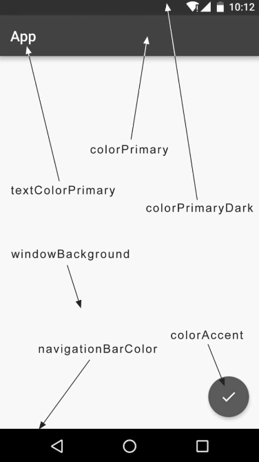

# Material Design实战

**什么是Material Design**

Material Design 是由谷歌的设计工程师基于传统优秀设计原则、结合创意和现代技术，发明的一套全新的界面设计语言。它不仅包含视觉设计，还包括运动、互动效果等特性，旨在提升用户体验和界面一致性。

**谷歌为何认为Material Design能够解决界面风格不统一的问题？**

谷歌认为，Material Design能够通过其精美的设计解决Android平台界面风格不统一的问题，简单来说，就是“好看”。这种设计风格注重美学、易用性和一致性，被认为是Android界面设计上的一大突破，甚至有媒体评论称，Material Design使得Android在UI设计上首次超越了iOS。

**Material Design的推广**

为了起到示范作用，谷歌从Android 5.0系统开始，所有内置应用都采用Material Design风格进行设计。这不仅提升了Android界面的统一性，也为其他开发者树立了榜样，推动了Material Design的广泛应用。

**Material Design的挑战**

Material Design是面向UI设计人员的推荐规范，而不是开发者的工具。很多开发者可能对什么样的界面和效果符合Material Design标准不够清晰，即使了解了这些标准，实现起来也会非常困难，因为很多效果需要开发者自行实现，而Android平台并没有提供直接支持。

**谷歌的解决方案**

意识到这一问题后，谷歌在2015年的Google I/O大会上推出了Design Support库。这个库封装了Material Design中最具代表性的控件和效果，帮助开发者即使不熟悉Material Design，也能轻松将应用“Material化”。

## Toolbar

1. **ActionBar 和 Toolbar 的关系**
   - **ActionBar**：每个活动的顶部标题栏，之前在许多应用中使用，但它的位置固定，无法实现一些 Material Design 的效果。因此，Google 不再推荐使用 `ActionBar`。
   - **Toolbar**：继承了 `ActionBar` 的功能，同时提供更高的灵活性，可以与其他控件配合使用，实现更多的 Material Design 效果。因此，现代开发中推荐使用 `Toolbar` 替代 `ActionBar`。

2. **隐藏 ActionBar**
   - 默认情况下，Android 项目会显示 `ActionBar`。它的显示是通过 `AndroidManifest.xml` 文件中`android:theme`属性指定的主题。示例如下：

   ```xml
   <application
       android:allowBackup="true"
       android:icon="@mipmap/ic_launcher"
       android:label="@string/app_name"
       android:supportsRtl="true"
       android:theme="@style/AppTheme">
       ...
   </application>
   ```

   - `AppTheme` 指定了应用的主题，`AppTheme` 继承自 `Theme.AppCompat.Light.DarkActionBar`，该主题自动显示 `ActionBar`
   - 为了使用 `Toolbar` 替代 `ActionBar`，需要在 `res/values/styles.xml`指定不带 `ActionBar` 的主题，比如 `Theme.AppCompat.Light.NoActionBar`
   - 通常有`Theme.AppCompat.NoActionBar`和`Theme.AppCompat.Light.NoActionBar`这两种主题可选
        - `Theme.AppCompat.NoActionBar`表示深色主题，它会将界面的主体颜色设成深色，陪衬颜色设成淡色
        - `Theme.AppCompat.Light.NoActionBar`表示淡色主题，它会将界面的主体颜色设成淡色，陪衬颜色设成深色

   ```xml
   <!-- res/values/styles.xml -->
   <resources>
       <style name="AppTheme" parent="Theme.AppCompat.Light.NoActionBar">
           <item name="colorPrimary">@color/colorPrimary</item>
           <item name="colorPrimaryDark">@color/colorPrimaryDark</item>
           <item name="colorAccent">@color/colorAccent</item>
       </style>
   </resources>
   ```
   - 
   - `colorPrimary`、`colorPrimaryDark` 和 `colorAccent` 控制了主题中的主要颜色、深色背景颜色和强调颜色。
   - `colorAccent` 指定应用中强调部分的颜色

   
3. **替代 ActionBar 使用 Toolbar**
   在 `activity_main.xml` 中替换 `ActionBar` 为 `Toolbar`，如下所示：

   ```xml
    <FrameLayout xmlns:android="http://schemas.android.com/apk/res/android"
        xmlns:app="http://schemas.android.com/apk/res-auto"
        android:layout_width="match_parent"
        android:layout_height="match_parent">
        <androidx.appcompat.widget.Toolbar
            android:id="@+id/toolbar"
            android:layout_width="match_parent"
            android:layout_height="?attr/actionBarSize"
            android:background="?attr/colorPrimary"
            android:theme="@style/ThemeOverlay.AppCompat.Dark.ActionBar"
            app:popupTheme="@style/ThemeOverlay.AppCompat.Light" />
    </FrameLayout>
   ```
   - 通过 `xmlns:app` 声明命名空间，使得可以使用 `app:popupTheme` 等属性。
   - `?attr/actionBarSize` 用于指定标准 ActionBar 的高度
   - `android:background="?attr/colorPrimary"` 设置背景颜色为主题中的主色
   - `android:theme="@style/ThemeOverlay.AppCompat.Dark.ActionBar"` 设置在深色主题下图标和文本颜色
   - `app:popupTheme="@style/ThemeOverlay.AppCompat.Light"` 指定在弹出菜单的背景和内容使用一个亮色主题

4. **设置 Toolbar 为 ActionBar**
   在 `MainActivity` 中设置 `Toolbar` 为 `ActionBar`：

   ```java
   public class MainActivity extends AppCompatActivity {
       @Override
       protected void onCreate(Bundle savedInstanceState) {
           super.onCreate(savedInstanceState);
           setContentView(R.layout.activity_main);
           Toolbar toolbar = (Toolbar) findViewById(R.id.toolbar);
           setSupportActionBar(toolbar);
       }
   }
   ```

   - 使用 `setSupportActionBar(toolbar)` 将 `Toolbar` 设置为 `ActionBar`。

5. **修改 Toolbar 中显示的文字**
   - 可以通过在 `AndroidManifest.xml` 中为 `activity` 添加 `android:label` 属性来指定 `Toolbar` 中显示的文字。如果没有指定，默认使用应用的 `label`。

   ```xml
   <activity
       android:name=".MainActivity"
       android:label="Fruits">
       ...
   </activity>
   ```

6. **添加 Action 按钮**
   - 创建 `menu` 资源文件并定义菜单项
        - 右击res目录→New→Directory-> menu
        - 右击menu文件夹→New→Menu resource file，创建一个toolbar.xml文件
   ```xml
   <menu xmlns:android="http://schemas.android.com/apk/res/android"
       xmlns:app="http://schemas.android.com/apk/res-auto">
       <item
           android:id="@+id/backup"
           android:icon="@drawable/ic_backup"
           android:title="Backup"
           app:showAsAction="always" />
       <item
           android:id="@+id/delete"
           android:icon="@drawable/ic_delete"
           android:title="Delete"
           app:showAsAction="ifRoom" />
       <item
           android:id="@+id/settings"
           android:icon="@drawable/ic_settings"
           android:title="Settings"
           app:showAsAction="never" />
   </menu>
   ```
    - 再次使用了app命名空间，同样是为了能够兼容低版本的系统
   - `showAsAction` 属性控制按钮在 `Toolbar` 中的显示方式：
     - `always`：始终显示在 `Toolbar` 中；
     - `ifRoom`：空间足够时显示；
     - `never`：始终在菜单中显示。

7. **处理按钮点击事件**
   - 在 `MainActivity` 中重写 `onCreateOptionsMenu()` 和 `onOptionsItemSelected()` 方法：

   ```java
   public class MainActivity extends AppCompatActivity {
       @Override
       public boolean onCreateOptionsMenu(Menu menu) {
           getMenuInflater().inflate(R.menu.toolbar, menu);
           return true;
       }

       @Override
       public boolean onOptionsItemSelected(MenuItem item) {
           switch (item.getItemId()) {
               case R.id.backup:
                   Toast.makeText(this, "You clicked Backup", Toast.LENGTH_SHORT).show();
                   break;
               case R.id.delete:
                   Toast.makeText(this, "You clicked Delete", Toast.LENGTH_SHORT).show();
                   break;
               case R.id.settings:
                   Toast.makeText(this, "You clicked Settings", Toast.LENGTH_SHORT).show();
                   break;
               default:
                   return super.onOptionsItemSelected(item);
           }
           return true;
       }
   }
   ```


## 滑动菜单

**概述**

滑动菜单是 Material Design 中常见的一种设计模式，它通过隐藏菜单选项来节省屏幕空间，用户可以通过滑动或点击导航按钮来显示菜单。

**常见应用场景**：Gmail、Google+ 等。

### 使用 DrawerLayout

**DrawerLayout** 是一个专门用于实现滑动菜单的布局控件，其特点是：
- **支持左右侧菜单**：可以定义左侧或右侧滑动菜单。
- **流畅的动画过渡**：显示和隐藏菜单时，伴随动画效果。

**1. 布局文件示例**

在 `activity_main.xml` 文件中使用 `DrawerLayout`：

```xml
<?xml version="1.0" encoding="utf-8"?>
<androidx.drawerlayout.widget.DrawerLayout
    xmlns:android="http://schemas.android.com/apk/res/android"
    xmlns:app="http://schemas.android.com/apk/res-auto"
    android:id="@+id/drawer_layout"
    android:layout_width="match_parent"
    android:layout_height="match_parent">

    <!-- 主界面内容 -->
    <FrameLayout xmlns:android="http://schemas.android.com/apk/res/android"
        xmlns:app="http://schemas.android.com/apk/res-auto"
        android:layout_width="match_parent"
        android:layout_height="match_parent">
        <androidx.appcompat.widget.Toolbar
            android:id="@+id/toolbar"
            android:layout_width="match_parent"
            android:layout_height="?attr/actionBarSize"
            android:background="?attr/colorPrimary"
            android:theme="@style/ThemeOverlay.AppCompat.Dark.ActionBar"
            app:popupTheme="@style/ThemeOverlay.AppCompat.Light" />
    </FrameLayout>

    <!-- 滑动菜单内容 -->
    <TextView
        android:layout_width="match_parent"
        android:layout_height="match_parent"
        android:layout_gravity="start"
        android:text="This is menu"
        android:textSize="30sp"
        android:background="#FFF" />
</androidx.drawerlayout.widget.DrawerLayout>

```

- **`DrawerLayout`**：外层容器，用于定义主内容和滑动菜单
- **`FrameLayout`**：主屏幕内容，包含 `Toolbar`
- **`TextView`**：滑动菜单内容，`layout_gravity="start"` 表示菜单位于屏幕左侧

**2. 为滑动菜单添加导航按钮**

为了提升用户体验，可以在 `Toolbar` 左侧添加一个导航按钮，用于打开滑动菜单

**修改 `MainActivity` 代码**：
   
```java
public class MainActivity extends AppCompatActivity {
    private DrawerLayout mDrawerLayout;

    @Override
    protected void onCreate(Bundle savedInstanceState) {
        super.onCreate(savedInstanceState);
        setContentView(R.layout.activity_main);
        Toolbar toolbar = findViewById(R.id.toolbar);
        setSupportActionBar(toolbar);

        mDrawerLayout = findViewById(R.id.drawer_layout);

        ActionBar actionBar = getSupportActionBar();
        if (actionBar != null) {
            actionBar.setDisplayHomeAsUpEnabled(true);
            actionBar.setHomeAsUpIndicator(R.drawable.ic_menu);  // 自定义导航按钮图标
        }
    }

    @Override
    public boolean onOptionsItemSelected(MenuItem item) {
        switch (item.getItemId()) {
            case android.R.id.home:
                mDrawerLayout.openDrawer(GravityCompat.START);
                break;
            ...
            default:
        }
        return true;
    }
}
```

**导航按钮说明**：
   - **`setDisplayHomeAsUpEnabled(true)`**：显示导航按钮。
   - **`setHomeAsUpIndicator()`**：自定义导航按钮图标。
   - **`onOptionsItemSelected()`**：监听导航按钮点击事件，调用 `openDrawer(GravityCompat.START)` 打开滑动菜单。

**3. 功能验证**

- **滑动打开菜单**：从屏幕左侧边缘向右滑动
- **点击导航按钮打开菜单**：点击 `Toolbar` 左侧导航按钮
- **关闭菜单**：点击菜单外部区域或向左滑动

### 滑动菜单页面 NavigationView

谷歌推荐使用 **NavigationView** 来构建滑动菜单页面。不仅遵循 Material Design 规范，而且能简化滑动菜单的开发过程。

**1. 引入依赖**

首先，需要在项目中引入 一个圆形图片开源库 **CircleImageView**。在 `app/build.gradle` 文件中添加如下内容：

```gradle
dependencies {
     implementation 'de.hdodenhof:circleimageview:3.1.0'  // 或者最新版本
}
```

**2. 创建菜单项 `menu` 资源文件**

- 在 `res/menu` 文件夹下新建 `nav_menu.xml`：

```xml
<?xml version="1.0" encoding="utf-8"?>
<menu xmlns:android="http://schemas.android.com/apk/res/android">
    <group android:checkableBehavior="single">
        <item
            android:id="@+id/nav_call"
            android:icon="@drawable/nav_call"
            android:title="Call" />
        <item
            android:id="@+id/nav_friends"
            android:icon="@drawable/nav_friends"
            android:title="Friends" />
        <item
            android:id="@+id/nav_location"
            android:icon="@drawable/nav_location"
            android:title="Location" />
        <item
            android:id="@+id/nav_mail"
            android:icon="@drawable/nav_mail"
            android:title="Mail" />
        <item
            android:id="@+id/nav_task"
            android:icon="@drawable/nav_task"
            android:title="Tasks" />
    </group>
</menu>
```

上述 `menu` 文件定义了 5 个菜单项，每个菜单项包含一个 `id`、图标 `icon` 和标题 `title`。

2. 创建头部布局 `headerLayout`

- 在 `res/layout` 文件夹下新建 `nav_header.xml`：

```xml
<?xml version="1.0" encoding="utf-8"?>
<RelativeLayout xmlns:android="http://schemas.android.com/apk/res/android"
    android:layout_width="match_parent"
    android:layout_height="180dp"
    android:padding="10dp"
    android:background="?attr/colorPrimary">

    <com.google.android.material.imageview.ShapeableImageView
        android:id="@+id/icon_image"
        android:layout_width="70dp"
        android:layout_height="70dp"
        android:src="@drawable/nav_icon"
        android:layout_centerInParent="true" />

    <TextView
        android:id="@+id/username"
        android:layout_width="wrap_content"
        android:layout_height="wrap_content"
        android:layout_above="@id/mail"
        android:text="Tony Green"
        android:textColor="#FFF"
        android:textSize="14sp" />

    <TextView
        android:id="@+id/mail"
        android:layout_width="wrap_content"
        android:layout_height="wrap_content"
        android:layout_alignParentBottom="true"
        android:text="tonygreendev@gmail.com"
        android:textColor="#FFF"
        android:textSize="14sp" />
</RelativeLayout>
```

`headerLayout` 包含头像、用户名和邮箱地址，其中头像使用 **CircleImageView** 显示圆形图片。


**3. 修改主布局文件**

- 修改 `activity_main.xml`：

```xml
<?xml version="1.0" encoding="utf-8"?>
<androidx.drawerlayout.widget.DrawerLayout
    xmlns:android="http://schemas.android.com/apk/res/android"
    xmlns:app="http://schemas.android.com/apk/res-auto"
    android:id="@+id/drawer_layout"
    android:layout_width="match_parent"
    android:layout_height="match_parent">

    <!-- 主界面内容 -->
    <FrameLayout xmlns:android="http://schemas.android.com/apk/res/android"
        xmlns:app="http://schemas.android.com/apk/res-auto"
        android:layout_width="match_parent"
        android:layout_height="match_parent">
        <androidx.appcompat.widget.Toolbar
            android:id="@+id/toolbar"
            android:layout_width="match_parent"
            android:layout_height="?attr/actionBarSize"
            android:background="?attr/colorPrimary"
            android:theme="@style/ThemeOverlay.AppCompat.Dark.ActionBar"
            app:popupTheme="@style/ThemeOverlay.AppCompat.Light" />
    </FrameLayout>

    <!-- 滑动菜单内容 -->
    <com.google.android.material.navigation.NavigationView
        android:id="@+id/nav_view"
        android:layout_width="wrap_content"
        android:layout_height="match_parent"
        android:layout_gravity="start"
        app:menu="@menu/nav_menu"
        app:headerLayout="@layout/nav_header" />
</androidx.drawerlayout.widget.DrawerLayout>
```

**4. 设置菜单点击事件**

- 在 `MainActivity` 中设置菜单事件：

```java
public class MainActivity extends AppCompatActivity {

        private DrawerLayout mDrawerLayout;

    @Override
    protected void onCreate(Bundle savedInstanceState) {
        super.onCreate(savedInstanceState);
        setContentView(R.layout.activity_main);
        Toolbar toolbar = (Toolbar) findViewById(R.id.toolbar);
        setSupportActionBar(toolbar);

        mDrawerLayout = findViewById(R.id.drawer_layout);
        NavigationView navView = findViewById(R.id.nav_view);

        ActionBar actionBar = getSupportActionBar();
        if (actionBar != null) {
            actionBar.setDisplayHomeAsUpEnabled(true);
            actionBar.setHomeAsUpIndicator(R.drawable.ic_menu);  // 自定义导航按钮图标
        }

        navView.setCheckedItem(R.id.nav_call);
        navView.setNavigationItemSelectedListener(item -> {
            mDrawerLayout.closeDrawers();
            return true;
        });
    }
}
```

- **解释**：
  1. 设置默认选中的菜单项。
  2. 监听菜单项点击事件，并关闭滑动菜单。

## 悬浮按钮和可交互提示

立面设计是 Material Design 中非常重要的设计理念，它强调界面不应该只是平面的，而应该具有一定的立体效果。

最具代表性的例子就是 **悬浮按钮（FloatingActionButton）**。悬浮按钮通常不属于主界面的一部分，而是位于另一个维度上，因此给人一种浮动的感觉。

### 悬浮按钮 FloatingActionButton

**FloatingActionButton** 是一种可以轻松实现悬浮效果的按钮，它在屏幕上方漂浮，通常显示一个图标来表明按钮的功能。它的默认颜色通常使用 `colorAccent`，并且可以通过设置 `src` 属性指定一个图标。

**1. 添加悬浮按钮到 `activity_main.xml` 布局文件中**

```xml
<?xml version="1.0" encoding="utf-8"?>
<androidx.drawerlayout.widget.DrawerLayout
    xmlns:android="http://schemas.android.com/apk/res/android"
    xmlns:app="http://schemas.android.com/apk/res-auto"
    android:id="@+id/drawer_layout"
    android:layout_width="match_parent"
    android:layout_height="match_parent">

    <!-- 主界面内容 -->
    <FrameLayout xmlns:android="http://schemas.android.com/apk/res/android"
        xmlns:app="http://schemas.android.com/apk/res-auto"
        android:layout_width="match_parent"
        android:layout_height="match_parent">
        <androidx.appcompat.widget.Toolbar
            android:id="@+id/toolbar"
            android:layout_width="match_parent"
            android:layout_height="?attr/actionBarSize"
            android:background="?attr/colorPrimary"
            android:theme="@style/ThemeOverlay.AppCompat.Dark.ActionBar"
            app:popupTheme="@style/ThemeOverlay.AppCompat.Light" />

        <!-- 悬浮按钮 -->
        <com.google.android.material.floatingactionbutton.FloatingActionButton
            android:id="@+id/fab"
            android:layout_width="wrap_content"
            android:layout_height="wrap_content"
            android:layout_gravity="bottom|end"
            android:layout_margin="16dp"
            android:src="@drawable/ic_done"
            app:elevation="8dp"/>
    </FrameLayout>


    <!-- 滑动菜单内容 -->
    <com.google.android.material.navigation.NavigationView
        android:id="@+id/nav_view"
        android:layout_width="wrap_content"
        android:layout_height="match_parent"
        android:layout_gravity="start"
        app:menu="@menu/nav_menu"
        app:headerLayout="@layout/nav_header" />
</androidx.drawerlayout.widget.DrawerLayout>
```

在此示例中，`FloatingActionButton` 被放置在屏幕的右下角，使用 `layout_gravity="bottom|end"` 来设置位置，`layout_margin="16dp"` 留出边距，确保按钮不会紧贴屏幕边缘，保持良好的视觉效果。

此外，`src` 属性设置了按钮的图标为 `ic_done`。

**2. 悬浮效果和阴影**

`FloatingActionButton` 默认会有一个阴影效果，这使得它看起来像是浮动在屏幕上的元素。给用户一种深度感和立体感。

如果想调整悬浮按钮的阴影效果，可以通过 `app:elevation` 属性来设置按钮的悬浮高度：

```xml
    <com.google.android.material.floatingactionbutton.FloatingActionButton
    android:id="@+id/fab"
    android:layout_width="wrap_content"
    android:layout_height="wrap_content"
    android:layout_gravity="bottom|end"
    android:layout_margin="16dp"
    android:src="@drawable/ic_done"
    app:elevation="8dp" />
```

较大的 `elevation` 值会让投影更加淡化，较小的 `elevation` 值则使投影效果更加明显。通常情况下，默认的 `FloatingActionButton` 阴影效果已经足够。

**3. 点击事件**

要使悬浮按钮响应点击事件，使用 `setOnClickListener` 来为按钮注册点击事件监听器。比如，在 `MainActivity` 中处理按钮点击事件：

```java
public class MainActivity extends AppCompatActivity {
    private DrawerLayout mDrawerLayout;

    @Override
    protected void onCreate(Bundle savedInstanceState) {
        super.onCreate(savedInstanceState);
        setContentView(R.layout.activity_main);

        // 获取悬浮按钮
        FloatingActionButton fab = findViewById(R.id.fab);

        // 设置点击事件监听器
        fab.setOnClickListener(new View.OnClickListener() {
            @Override
            public void onClick(View v) {
                // 点击按钮时，显示一个 Toast 提示
                Toast.makeText(MainActivity.this, "FAB clicked", Toast.LENGTH_SHORT).show();
            }
        });
    }
}
```

### 可交互提示工具 Snackbar

在日常开发中，经常使用 **Toast** 来显示简短的信息，但 **Toast** 的缺点是它无法与用户进行交互。

为了弥补这个缺陷，Android 提供了其他交互式提示工具，比如 **Snackbar**。Snackbar 提供了与用户交互的能力，用户可以在Snackbar上点击某些按钮进行操作。


可以通过调用 `Snackbar.make()` 创建一个 `Snackbar`，并使用 `setAction()` 为它添加一个交互按钮。比如：

```java
Snackbar.make(view, "This is a message", Snackbar.LENGTH_LONG)
        .setAction("Undo", new View.OnClickListener() {
            @Override
            public void onClick(View v) {
                // 执行 Undo 操作
                Toast.makeText(MainActivity.this, "Undo clicked", Toast.LENGTH_SHORT).show();
            }
        })
        .show();
```

这样，当用户点击 `Undo` 按钮时，可以执行相应的操作，而不像 `Toast` 那样无法进行交互。

### CoordinatorLayout

`CoordinatorLayout` 是 Android Design Support 库中的一个强大的布局容器，主要用于实现 Material Design 中的交互式布局效果。它本质上是一个**加强版的 `FrameLayout`**，可以用来管理和协调多个子控件的交互，尤其是用于实现复杂的动画、滚动、浮动元素等效果。

* `CoordinatorLayout` 的特点和功能：
    1. **自动协调布局子控件的行为**：
    - `CoordinatorLayout` 允许将多个控件放在其中，并且它能够监听这些控件的状态和事件。例如，当 `Snackbar` 弹出时，`CoordinatorLayout` 会自动将悬浮按钮（`FloatingActionButton`）向上偏移，避免被遮挡，且偏移过程伴随动画效果。
    
    2. **支持复杂的交互效果**：
    - 它能自动响应各种布局中的子控件的行为，譬如浮动按钮、滚动视图等。`CoordinatorLayout` 的设计使得控件间的交互更加简洁和直观，开发者不需要手动管理这些交互。

    3. **管理和协调子控件**：
    - 在 `CoordinatorLayout` 中，子控件可以定义自己的行为。例如，`FloatingActionButton` 可以响应 `Snackbar` 的弹出，自动进行位置调整，`AppBarLayout` 可以与滚动视图（如 `RecyclerView`）配合使用，实现滚动折叠效果。
    
    4. **支持 `Behavior` 机制**：
    - `CoordinatorLayout` 允许为每个子控件定义特定的行为，称为 `Behavior`。例如，可以为 `AppBarLayout` 定义一个行为，使其在滚动时折叠。可以自定义或使用已有的 `Behavior` 来控制子控件的交互效果。

* 常见用法：
    1. **布局替代**：
    - `CoordinatorLayout` 可以替代 `FrameLayout`，并且由于它能够协调和处理更复杂的子控件行为，它经常用于实现 Material Design 中的各种交互效果。

    2. **实现 `Snackbar` 的动画**：
    - `Snackbar` 是一个常用的提示框，在 `CoordinatorLayout` 中，`Snackbar` 会自动适应布局，防止遮挡其他重要控件（例如 `FloatingActionButton`）。

    3. **浮动元素和滚动行为**：
    - `CoordinatorLayout` 支持与滚动视图（如 `RecyclerView`、`NestedScrollView`）结合，能够控制顶部工具栏（`Toolbar`）或其他控件的折叠或滚动效果。

**1. `CoordinatorLayout` 替代 `FrameLayout`**

`CoordinatorLayout` 的使用非常简单，只需要将原来的 `FrameLayout` 替换成 `CoordinatorLayout` 即可。它会监听所有子控件的事件，并在合适的时候做出自动的响应。

**修改 `activity_main.xml` 布局文件：**

```xml
 <!-- 主界面内容 -->
    <androidx.coordinatorlayout.widget.CoordinatorLayout
        android:layout_width="match_parent"
        android:layout_height="match_parent">
        <androidx.appcompat.widget.Toolbar
            android:id="@+id/toolbar"
            android:layout_width="match_parent"
            android:layout_height="?attr/actionBarSize"
            android:background="?attr/colorPrimary"
            android:theme="@style/ThemeOverlay.AppCompat.Dark.ActionBar"
            app:popupTheme="@style/ThemeOverlay.AppCompat.Light" />

        <!-- 悬浮按钮 -->
        <com.google.android.material.floatingactionbutton.FloatingActionButton
            android:id="@+id/fab"
            android:layout_width="wrap_content"
            android:layout_height="wrap_content"
            android:layout_gravity="bottom|end"
            android:layout_margin="16dp"
            android:src="@drawable/ic_done"
            app:elevation="8dp"/>
    </androidx.coordinatorlayout.widget.CoordinatorLayout>
```

**2. `CoordinatorLayout` 的自动事件响应**

`CoordinatorLayout` 的一个重要功能是它能够监听其子控件的事件，并根据需要自动做出调整。例如，在弹出 `Snackbar` 时，它会自动调整悬浮按钮的位置，避免被遮挡。

**运行程序时，观察以下效果：**

- 当点击悬浮按钮时，`Snackbar` 会弹出，且悬浮按钮会自动向上偏移，确保不会被 `Snackbar` 遮挡。
- 当 `Snackbar` 消失时，悬浮按钮会自动向下偏移回原位置。
- 这一切变化伴随着动画效果，且悬浮按钮的移动与 `Snackbar` 完全同步，看起来非常自然和流畅。

**3. `Snackbar` 与 `CoordinatorLayout` 的关系**

虽然 `Snackbar` 不是 `CoordinatorLayout` 的直接子控件，但它仍然能够被 `CoordinatorLayout` 监听。原因在于，当调用 `Snackbar.make()` 方法时，可以指定一个 View 作为它的触发源。

**如何工作：**

- 在 `Snackbar.make()` 方法中传入的第一个参数就是用来指定 `Snackbar` 是基于哪个 View 来触发的。
- 如果将 `FloatingActionButton` 作为触发源，那么 `Snackbar` 会被认为是与 `CoordinatorLayout` 相关联的，并且 `CoordinatorLayout` 会自动调整悬浮按钮的位置。
  
例如：

```java
Snackbar.make(fab, "Snackbar message", Snackbar.LENGTH_LONG).show();
```

在这个例子中，`FloatingActionButton` 是 `Snackbar` 的触发源，而 `FloatingActionButton` 是 `CoordinatorLayout` 的子控件，因此 `CoordinatorLayout` 会自动调整悬浮按钮的位置。

**反例：**

如果将 `Snackbar.make()` 方法中的第一个参数换成 `DrawerLayout`（即 `CoordinatorLayout` 的父控件），那么 `CoordinatorLayout` 就无法监听到 `Snackbar` 的弹出事件，从而导致 `FloatingActionButton` 被 `Snackbar` 遮挡住。

```java
// 获取 DrawerLayout
DrawerLayout drawerLayout = findViewById(R.id.drawer_layout);

// 使用 DrawerLayout 作为触发源
Snackbar.make(drawerLayout, "This is a message", Snackbar.LENGTH_LONG)
        .setAction("Undo", new View.OnClickListener() {
            @Override
            public void onClick(View v) {
                // 执行 Undo 操作
                Toast.makeText(MainActivity.this, "Undo clicked", Toast.LENGTH_SHORT).show();
            }
        })
        .show();
```

## 卡片式布局

卡片式布局是Materials Design中提出的一个新的概念，可以让页面中的元素看起来就像在卡片中一样，并且还能拥有圆角和投影。

### CardView

CardView 是 Android 中用于实现卡片式布局的一种控件。卡片式布局（Card UI）是 Material Design 设计语言的一部分，它提供了一个更具层次感、结构化和清晰的界面，特别适合展示信息、图片或内容列表。

CardView 作为一个容器控件，可以让轻松地为 UI 元素添加阴影、圆角和其他效果，使其在视觉上呈现为浮动的卡片。

**1. 添加依赖**

```
dependencies {
    implementation 'androidx.cardview:cardview:1.0.0'
}
```

**2. 创建 fruit_item.xml**

```xml
<?xml version="1.0" encoding="utf-8"?>
<androidx.cardview.widget.CardView
    xmlns:android="http://schemas.android.com/apk/res/android"
    xmlns:app="http://schemas.android.com/apk/res-auto"
    android:layout_width="match_parent"
    android:layout_height="wrap_content"
    app:cardCornerRadius="4dp"
    app:elevation="5dp">
    <TextView
        android:id="@+id/info_text"
        android:layout_width="match_parent"
        android:layout_height="wrap_content"/>
</androidx.cardview.widget.CardView>
```

**属性说明**

- `app:cardCornerRadius`：指定卡片圆角的弧度，数值越大，圆角的弧度也越大。
- `app:elevation`：指定卡片的高度，高度值越大，投影范围也越大，但是投影效果越淡；高度值越小，投影范围也越小，但投影效果越浓。

**3. Glide**

Glide 是一个强大的图像加载库，可以用于加载本地图片、网络图片、GIF 动图等。在 Android 开发中，Glide 提供了非常简便和高效的图片加载方式，尤其在处理大量图片和复杂的图片加载时，Glide 可以自动优化内存管理和图片缓存。

准备多张水果图片，并将它们复制到项目中。

```
implementation 'com.github.bumptech.glide:glide:4.15.0' 
annotationProcessor 'com.github.bumptech.glide:compiler:4.15.0'  // Glide 编译时需要的注解处理器
```

**4. 修改 `activity_main.xml`**

在 `CoordinatorLayout` 中添加了一个 `RecyclerView`，使其占满整个布局的空间。

```xml
<androidx.recyclerview.widget.RecyclerView
    android:id="@+id/recycler_view"
    android:layout_width="match_parent"
    android:layout_height="match_parent"/>
```

**5. 定义水果实体类 `Fruit`**

```java
public class Fruit {
    private String name;
    private int imageId;
    
    public Fruit(String name, int imageId) {
        this.name = name;
        this.imageId = imageId;
    }

    public String getName() {
        return name;
    }

    public int getImageId() {
        return imageId;
    }
}
```

**6. 修改 `fruit_item.xml` 布局**

使用 `CardView` 包裹每个水果项，并使用 `LinearLayout` 嵌套图片和名称。

```xml
<?xml version="1.0" encoding="utf-8"?>
<androidx.cardview.widget.CardView
    xmlns:android="http://schemas.android.com/apk/res/android"
    xmlns:app="http://schemas.android.com/apk/res-auto"
    android:layout_width="match_parent"
    android:layout_height="wrap_content"
    app:cardCornerRadius="4dp"
    app:elevation="5dp">
    <LinearLayout
        android:orientation="vertical"
        android:layout_width="match_parent"
        android:layout_height="wrap_content">
        <ImageView
            android:id="@+id/fruit_image"
            android:layout_width="match_parent"
            android:layout_height="100dp"
            android:scaleType="centerCrop" />
        <TextView
            android:id="@+id/fruit_name"
            android:layout_width="wrap_content"
            android:layout_height="wrap_content"
            android:layout_gravity="center_horizontal"
            android:layout_margin="5dp"
            android:textSize="16sp" />
    </LinearLayout>
</androidx.cardview.widget.CardView>
```

**7. 定义适配器 `FruitAdapter`**

```java
public class FruitAdapter extends RecyclerView.Adapter<FruitAdapter.ViewHolder> {
    private Context mContext;
    private List<Fruit> mFruitList;

    static class ViewHolder extends RecyclerView.ViewHolder {
        CardView cardView;
        ImageView fruitImage;
        TextView fruitName;

        public ViewHolder(View view) {
            super(view);
            cardView = (CardView) view;
            fruitImage = (ImageView) view.findViewById(R.id.fruit_image);
            fruitName = (TextView) view.findViewById(R.id.fruit_name);
        }
    }

    public FruitAdapter(List<Fruit> fruitList) {
        mFruitList = fruitList;
    }

    @Override
    public ViewHolder onCreateViewHolder(ViewGroup parent, int viewType) {
        if (mContext == null) {
            mContext = parent.getContext();
        }
        View view = LayoutInflater.from(mContext).inflate(R.layout.fruit_item, parent, false);
        return new ViewHolder(view);
    }

    @Override
    public void onBindViewHolder(ViewHolder holder, int position) {
        Fruit fruit = mFruitList.get(position);
        holder.fruitName.setText(fruit.getName());
        Glide.with(mContext).load(fruit.getImageId()).into(holder.fruitImage);
    }

    @Override
    public int getItemCount() {
        return mFruitList.size();
    }
}
```

* Glide 的使用
    ```java
    Glide.with(mContext).load(fruit.getImageId()).into(holder.fruitImage);
    ```
    Glide 会自动处理图片的加载和内存管理，避免因高分辨率图片导致的内存溢出。

**8. MainActivity**

```java
public class MainActivity extends AppCompatActivity {
    private DrawerLayout mDrawerLayout;
    private Fruit[] fruits = { new Fruit("Apple", R.drawable.apple), 
        new Fruit("Banana", R.drawable.banana),
        new Fruit("Orange", R.drawable.orange), new Fruit("Watermelon", R.drawable.watermelon),
        new Fruit("Pear", R.drawable.pear), new Fruit("Grape", R.drawable.grape),
        new Fruit("Pineapple", R.drawable.pineapple), new Fruit("Strawberry", R.drawable.strawberry),
        new Fruit("Cherry", R.drawable.cherry), new Fruit("Mango", R.drawable.mango) };
    
    private List<Fruit> fruitList = new ArrayList<>();
    private FruitAdapter adapter;

    @Override
    protected void onCreate(Bundle savedInstanceState) {
        super.onCreate(savedInstanceState);
        setContentView(R.layout.activity_main);

        initFruits();
        RecyclerView recyclerView = findViewById(R.id.recycler_view);
        GridLayoutManager layoutManager = new GridLayoutManager(this, 2);
        recyclerView.setLayoutManager(layoutManager);
        adapter = new FruitAdapter(fruitList);
        recyclerView.setAdapter(adapter);
    }

    private void initFruits() {
        fruitList.clear();
        for (int i = 0; i < 50; i++) {
            Random random = new Random();
            int index = random.nextInt(fruits.length);
            fruitList.add(fruits[index]);
        }
    }
}
```

* **设置布局管理器**
    * 使用 `GridLayoutManager` 来实现每行两个水果项。
    ```java
    GridLayoutManager layoutManager = new GridLayoutManager(this, 2);
    ```

### AppBarLayout

**问题分析：RecyclerView遮挡Toolbar**

首先来分析一下为什么 `RecyclerView` 会把 `Toolbar` 给遮挡住。其实并不难理解，由于 `RecyclerView` 和 `Toolbar` 都是放置在 `CoordinatorLayout` 中的，而前面已经提到过，`CoordinatorLayout` 是一个加强版的 `FrameLayout`，那么 `FrameLayout` 中的所有控件在不进行明确定位的情况下，默认都会摆放在布局的左上角，从而也就产生了遮挡的现象。

**问题解决思路：使用 `AppBarLayout`**

既然已经找到了问题的原因，那么该如何解决呢？传统情况下，使用偏移是唯一的解决办法，即让 `RecyclerView` 向下偏移一个 `Toolbar` 的高度，从而保证不会遮挡到 `Toolbar`。不过，使用的并不是普通的 `FrameLayout`，而是 `CoordinatorLayout`，因此自然会有一些更加巧妙的解决办法。

**使用 `AppBarLayout` 解决问题**

准备使用 `Design Support 库` 中提供的另一个工具——`AppBarLayout`

`AppBarLayout` 实际上是一个垂直方向的 `LinearLayout`，它在内部做了很多滚动事件的封装，并应用了一些 `Material Design` 的设计理念

- 解决前面的覆盖问题
    - **第一步**：将 `Toolbar` 嵌套到 `AppBarLayout` 中
    - **第二步**：给 `RecyclerView` 指定一个布局行为

**1. 修改布局代码：**

修改 `activity_main.xml` 中的代码如下：

```xml
<?xml version="1.0" encoding="utf-8"?>
<androidx.drawerlayout.widget.DrawerLayout
    xmlns:android="http://schemas.android.com/apk/res/android"
    xmlns:app="http://schemas.android.com/apk/res-auto"
    android:id="@+id/drawer_layout"
    android:layout_width="match_parent"
    android:layout_height="match_parent">

    <!-- 主界面内容 -->
    <androidx.coordinatorlayout.widget.CoordinatorLayout
        android:layout_width="match_parent"
        android:layout_height="match_parent">
        <com.google.android.material.appbar.AppBarLayout
            android:layout_width="match_parent"
            android:layout_height="wrap_content">
            <androidx.appcompat.widget.Toolbar
                android:id="@+id/toolbar"
                android:layout_width="match_parent"
                android:layout_height="?attr/actionBarSize"
                android:background="?attr/colorPrimary"
                android:theme="@style/ThemeOverlay.AppCompat.Dark.ActionBar"
                app:popupTheme="@style/ThemeOverlay.AppCompat.Light" />
        </com.google.android.material.appbar.AppBarLayout>
        <androidx.recyclerview.widget.RecyclerView
            android:id="@+id/recycler_view"
            android:layout_width="match_parent"
            android:layout_height="match_parent"
            app:layout_behavior="@string/appbar_scrolling_view_behavior"/>

        <!-- 悬浮按钮 -->
        <com.google.android.material.floatingactionbutton.FloatingActionButton
            android:id="@+id/fab"
            android:layout_width="wrap_content"
            android:layout_height="wrap_content"
            android:layout_gravity="bottom|end"
            android:layout_margin="16dp"
            android:src="@drawable/ic_done"
            app:elevation="8dp"
            />
    </androidx.coordinatorlayout.widget.CoordinatorLayout>

    <!-- 滑动菜单内容 -->
    <com.google.android.material.navigation.NavigationView
        android:id="@+id/nav_view"
        android:layout_width="wrap_content"
        android:layout_height="match_parent"
        android:layout_gravity="start"
        app:menu="@menu/nav_menu"
        app:headerLayout="@layout/nav_header" />
</androidx.drawerlayout.widget.DrawerLayout>
```

在这段代码中：
- 首先定义了一个 `AppBarLayout`，并将 `Toolbar` 放置在了 `AppBarLayout` 里面。
- 然后在 `RecyclerView` 中使用 `app:layout_behavior` 属性指定了一个布局行为，`appbar_scrolling_view_behavior` 这个字符串是由 `Design Support 库` 提供的。

**2. 效果验证**

现在重新运行程序，会发现一切都正常了，`RecyclerView` 不会再遮挡住 `Toolbar`。

**3. 优化：实现 Material Design 效果**

提到过，`AppBarLayout` 中应用了一些 `Material Design` 的设计理念，但在上面的例子中似乎没有完全体现出来。事实上，当 `RecyclerView` 滚动的时候，滚动事件已经通知给了 `AppBarLayout`，只是还没有进行处理。为了进一步优化，可以让 `AppBarLayout` 实现更多的 `Material Design` 效果。

**4. 添加 `app:layout_scrollFlags` 属性**

`AppBarLayout` 在接收到滚动事件时，内部的子控件其实可以指定如何去影响这些事件的，通过 `app:layout_scrollFlags` 属性来实现。修改 `activity_main.xml` 中的代码如下：

```xml
            <androidx.appcompat.widget.Toolbar
                android:id="@+id/toolbar"
                android:layout_width="match_parent"
                android:layout_height="?attr/actionBarSize"
                android:background="?attr/colorPrimary"
                android:theme="@style/ThemeOverlay.AppCompat.Dark.ActionBar"
                app:popupTheme="@style/ThemeOverlay.AppCompat.Light"
                app:layout_scrollFlags="scroll|enterAlways|snap"/>
```

在这段代码中：
- 在 `Toolbar` 中添加了一个 `app:layout_scrollFlags` 属性，并将其值设置为 `scroll|enterAlways|snap`。
    - `scroll`：当 `RecyclerView` 向上滚动时，`Toolbar` 会跟着一起向上滚动并实现隐藏。
    - `enterAlways`：当 `RecyclerView` 向下滚动时，`Toolbar` 会跟着一起向下滚动并重新显示。
    - `snap`：当 `Toolbar` 还没有完全隐藏或显示时，会根据当前滚动的距离，自动选择是隐藏还是显示。

**5. 效果验证：滚动 `RecyclerView` 时 `Toolbar` 的行为**

重新运行程序并向上滚动 `RecyclerView`，会看到：
- 当向上滚动时，`Toolbar` 会逐渐消失；
- 当向下滚动时，`Toolbar` 会重新出现。

这种设计方式符合 `Material Design` 的设计思想，它通过动态隐藏和显示 `Toolbar` 来提供更好的阅读体验。当用户向上滚动 `RecyclerView` 时，其注意力集中在内容上，此时隐藏 `Toolbar` 可以避免占用屏幕空间，而用户需要使用 `Toolbar` 时，只需轻微向下滚动即可重新显示。

## 下拉刷新

谷歌在 Material Design 中制定了一个官方的设计规范，并提供了 `SwipeRefreshLayout` 控件来方便实现该功能。

**核心类介绍**  

`SwipeRefreshLayout` 是一个用于实现下拉刷新效果的控件，常用于列表控件（如 `RecyclerView` 和 `ListView`）的外层包裹，为其添加下拉刷新功能。

**添加依赖**

```
implementation 'androidx.swiperefreshlayout:swiperefreshlayout:1.1.0'
```

**1. 修改 `activity_main.xml` 文件**

```xml
<androidx.drawerlayout.widget.DrawerLayout
    xmlns:android="http://schemas.android.com/apk/res/android"
    xmlns:app="http://schemas.android.com/apk/res-auto"
    android:id="@+id/drawer_layout"
    android:layout_width="match_parent"
    android:layout_height="match_parent">

    <androidx.coordinatorlayout.widget.CoordinatorLayout
        android:layout_width="match_parent"
        android:layout_height="match_parent">
        
        <!-- SwipeRefreshLayout 负责下拉刷新功能 -->
        <androidx.swiperefreshlayout.widget.SwipeRefreshLayout
            android:id="@+id/swipe_refresh"
            android:layout_width="match_parent"
            android:layout_height="match_parent"
            app:layout_behavior="@string/appbar_scrolling_view_behavior">

            <androidx.recyclerview.widget.RecyclerView
                android:id="@+id/recycler_view"
                android:layout_width="match_parent"
                android:layout_height="match_parent"/>
        </androidx.swiperefreshlayout.widget.SwipeRefreshLayout>

    </android.support.design.widget.CoordinatorLayout>
</androidx.drawerlayout.widget.DrawerLayout>
```

**说明**：

- 将 `RecyclerView` 放在 `SwipeRefreshLayout` 中，自动为 `RecyclerView` 添加下拉刷新功能。
- 布局行为 `app:layout_behavior` 需要移动到 `SwipeRefreshLayout`

**2. 代码逻辑实现**

修改 `MainActivity`：

```java
public class MainActivity extends AppCompatActivity {
    private SwipeRefreshLayout swipeRefresh;

    @Override
    protected void onCreate(Bundle savedInstanceState) {
        super.onCreate(savedInstanceState);
        setContentView(R.layout.activity_main);

        swipeRefresh = findViewById(R.id.swipe_refresh);
        
        // 设置刷新进度条颜色
        swipeRefresh.setColorSchemeResources(R.color.colorPrimary);
        
        // 设置下拉刷新监听器
        swipeRefresh.setOnRefreshListener(new SwipeRefreshLayout.OnRefreshListener() {
            @Override
            public void onRefresh() {
                refreshFruits();
            }
        });
    }

    // 模拟数据刷新操作
    private void refreshFruits() {
        new Thread(new Runnable() {
            @Override
            public void run() {
                try {
                    Thread.sleep(2000); // 模拟网络延迟
                } catch (InterruptedException e) {
                    e.printStackTrace();
                }

                runOnUiThread(new Runnable() {
                    @Override
                    public void run() {
                        initFruits(); // 重新初始化数据
                        adapter.notifyDataSetChanged(); // 通知数据已更新
                        swipeRefresh.setRefreshing(false); // 结束刷新
                    }
                });
            }
        }).start();
    }
}
```

1. **`findViewById` 获取实例**：  
   通过 `findViewById` 获取 `SwipeRefreshLayout` 的实例。

2. **设置进度条颜色**：  
   使用 `setColorSchemeResources` 方法设置下拉刷新进度条颜色。

3. **设置监听器**：  
   通过 `setOnRefreshListener` 方法添加下拉刷新监听器，当用户下拉刷新时，会触发 `onRefresh` 方法。

4. **刷新数据逻辑**：  
   - 模拟耗时操作（如网络请求）在 `refreshFruits` 方法中进行。
   - 通过 `Thread.sleep(2000)` 模拟网络延迟。
   - 使用 `runOnUiThread` 更新主线程 UI，重新初始化数据，并刷新 `RecyclerView`。
   - 调用 `setRefreshing(false)` 结束刷新，隐藏进度条。

**3. 运行效果**

- 在主界面下拉，出现下拉刷新进度条。
- 松手后自动刷新数据，刷新过程持续两秒。
- 数据更新后，进度条自动隐藏。

## 可折叠式标题栏

### CollapsingToolbarLayout 可折叠式标题栏

`CollapsingToolbarLayout` 是 Android 中一种高级的布局组件，通常用于创建具有丰富滚动效果的标题栏。它是 Material Design 中 `CoordinatorLayout` 的一部分，能够在用户滚动页面时动态地调整标题栏的大小和样式。

**1. 准备活动和布局文件**

创建一个 `FruitActivity` 来作为水果详情展示界面右击`com.example.demo38包→New→Activity→Empty Activity`，创建一个`FruitActivity`，并将布局名指定成`activity_fruit.xml`

界面主要包括两部分：
- 水果标题栏
- 水果内容详情

**2. 编写标题栏布局**

**（1）CoordinatorLayout 外层布局**

```xml
<?xml version="1.0" encoding="utf-8"?>
<androidx.coordinatorlayout.widget.CoordinatorLayout
    xmlns:android="http://schemas.android.com/apk/res/android"
    android:layout_width="match_parent"
    android:layout_height="match_parent">

</androidx.coordinatorlayout.widget.CoordinatorLayout>
```

**（2）嵌套 AppBarLayout**

```xml
<androidx.coordinatorlayout.widget.CoordinatorLayout
        android:layout_width="match_parent"
        android:layout_height="match_parent">
    <com.google.android.material.appbar.AppBarLayout
        android:id="@+id/appBar"
        android:layout_width="match_parent"
        android:layout_height="250dp">

    </com.google.android.material.appbar.AppBarLayout>
</androidx.coordinatorlayout.widget.CoordinatorLayout>
```

**（3）嵌套 CollapsingToolbarLayout**

```xml
<com.google.android.material.appbar.AppBarLayout
    android:layout_width="match_parent"
    android:layout_height="wrap_content">
    <com.google.android.material.appbar.CollapsingToolbarLayout
        android:id="@+id/collapsing_toolbar"
        android:layout_width="match_parent"
        android:layout_height="match_parent"
        android:theme="@style/ThemeOverlay.AppCompat.Dark.ActionBar"
        app:contentScrim="?attr/colorPrimary"
        app:layout_scrollFlags="scroll|exitUntilCollapsed"/>
</com.google.android.material.appbar.AppBarLayout>
```

1. **`android:theme` 属性**
   - **作用**：指定 `CollapsingToolbarLayout` 的主题样式。
   - **示例**：`ThemeOverlay.AppCompat.Dark.ActionBar`
     - 这个主题提供深色的 ActionBar 样式。
   - **作用范围**：与 `Toolbar` 相关的样式在 `CollapsingToolbarLayout` 里设置，使整体布局风格统一。
2. **`app:contentScrim` 属性**
   - **作用**：设置 `CollapsingToolbarLayout` 折叠后的背景颜色。
   - **推荐值**：`?attr/colorPrimary`
     - `CollapsingToolbarLayout` 折叠后，背景颜色会变为应用的主要主题色。
   - **视觉效果**：当标题栏折叠时，这个颜色会填充背景，保持风格一致。
3. **`app:layout_scrollFlags` 属性**
   - **作用**：定义 `CollapsingToolbarLayout` 的滚动行为。
   - **常见值**：
     - `scroll`：随着页面内容滚动而滚动。
     - `exitUntilCollapsed`：折叠后停留在屏幕上，而不是完全退出视图。
   - **详细说明**：
     - `scroll` 使标题栏可以随页面内容滚动，营造动态效果。
     - `exitUntilCollapsed` 确保折叠状态的标题栏固定在屏幕顶部，不完全消失。

**（4）定义标题栏的具体内容**

- **ImageView 和 Toolbar**

```xml
<androidx.coordinatorlayout.widget.CoordinatorLayout
    android:layout_width="match_parent"
    android:layout_height="match_parent">

    <com.google.android.material.appbar.AppBarLayout
        android:layout_width="match_parent"
        android:layout_height="wrap_content">
        <com.google.android.material.appbar.CollapsingToolbarLayout
            android:id="@+id/collapsing_toolbar"
            android:layout_width="match_parent"
            android:layout_height="match_parent"
            android:theme="@style/ThemeOverlay.AppCompat.Dark.ActionBar"
            app:contentScrim="?attr/colorPrimary"
            app:layout_scrollFlags="scroll|exitUntilCollapsed">

            <ImageView
                android:id="@+id/fruit_image_view"
                android:layout_width="match_parent"
                android:layout_height="match_parent"
                android:scaleType="centerCrop"
                app:layout_collapseMode="parallax" />
            <androidx.appcompat.widget.Toolbar
                android:id="@+id/toolbar"
                android:layout_width="match_parent"
                android:layout_height="?attr/actionBarSize"
                app:layout_collapseMode="pin" />
            
        </com.google.android.material.appbar.CollapsingToolbarLayout>
    </com.google.android.material.appbar.AppBarLayout>
```

**1. 基础属性**
- **`id`**、**`layout_width`** 和 **`layout_height`**：这些是基础属性，用于定义布局的标识和尺寸。
  
**2. `android:theme`**
- **值：`ThemeOverlay.AppCompat.Dark.ActionBar`**  
  - 用途：为 **CollapsingToolbarLayout** 应用一个深色主题。  
  - 说明：此主题之前已在 `Toolbar` 上使用过。为了实现更加复杂的效果，需要将主题的应用范围扩大到 **CollapsingToolbarLayout**。

**3. `app:contentScrim`**
- **值：`@color/colorPrimary`**  
  - 用途：指定 **CollapsingToolbarLayout** 在 **折叠状态** 和 **完全折叠** 后的背景颜色。  
  - 说明：折叠后，**CollapsingToolbarLayout** 的效果类似于普通的 **Toolbar**，因此背景色一般设为 **colorPrimary**。

**4. `app:layout_scrollFlags`**
- **值：`scroll|exitUntilCollapsed`**  
  - **`scroll`**：  
    表示 **CollapsingToolbarLayout** 会随着页面内容的滚动而滚动。  
  - **`exitUntilCollapsed`**：  
    当布局折叠到一定程度后，停止滚动，保留在界面上，充当 Toolbar 的作用。  

**实际效果**
- **滚动行为**：  
  随着页面内容的滚动，**CollapsingToolbarLayout** 会动态调整其大小，逐渐从扩展状态转变为折叠状态。
- **折叠后效果**：  
  折叠到最小状态时，背景色变为 **colorPrimary**，并停留在屏幕顶部，作为一个简化版的 Toolbar。

**3. 编写水果内容详情布局**

**（1）使用 NestedScrollView**

```xml
<androidx.coordinatorlayout.widget.CoordinatorLayout
    xmlns:android="http://schemas.android.com/apk/res/android"
    xmlns:app="http://schemas.android.com/apk/res-auto"
    android:layout_width="match_parent"
    android:layout_height="match_parent">
    <com.google.android.material.appbar.AppBarLayout
            android:id="@+id/appBar"
            android:layout_width="match_parent"
            android:layout_height="250dp">
    ...
    </com.google.android.material.appbar.AppBarLayout>
    <androidx.core.widget.NestedScrollView
        android:layout_width="match_parent"
        android:layout_height="match_parent"
        app:layout_behavior="@string/appbar_scrolling_view_behavior">
        <LinearLayout
            android:orientation="vertical"
            android:layout_width="match_parent"
            android:layout_height="wrap_content">
        </LinearLayout>
    </androidx.core.widget.NestedScrollView>
</androidx.coordinatorlayout.widget.CoordinatorLayout>
```

在实现水果内容详情页面时，最外层布局使用了一个 **NestedScrollView**，它与 **AppBarLayout** 是平级的。

1. **NestedScrollView 与 ScrollView 的区别**
    - **ScrollView**：允许通过滚动查看屏幕外的数据。
    - **NestedScrollView**：在 ScrollView 的基础上增加了对嵌套滚动事件的支持，可以更好地与支持嵌套滚动的布局（如 `CoordinatorLayout` 和 `RecyclerView`）协同工作。

2. **使用 NestedScrollView 的原因**
    - 由于 **CoordinatorLayout** 本身可以响应滚动事件，因此在它的内部布局中，需要使用支持嵌套滚动的 **NestedScrollView** 或 **RecyclerView**。

3. **app:layout_behavior 属性**
    - 在 **NestedScrollView** 中，通过 `app:layout_behavior` 属性指定了一个布局行为，这与之前在 **RecyclerView** 中的用法相同，用于与 **AppBarLayout** 进行联动。

4. **布局限制**
    - 与 **ScrollView** 一样，**NestedScrollView** 的内部只能包含一个直接子布局。如果需要放入多个子元素，可以先嵌套一个 **LinearLayout**，然后将具体的内容放入 **LinearLayout** 中。


**（2）在 LinearLayout 中放置具体内容**

使用一个`TextView`来显示水果的内容详情，并将`TextView`放在一个卡片式布局当中

- **CardView + TextView**

```xml
<LinearLayout
    android:orientation="vertical"
    android:layout_width="match_parent"
    android:layout_height="wrap_content">
    <androidx.cardview.widget.CardView
        android:layout_width="match_parent"
        android:layout_height="wrap_content"
        android:layout_margin="15dp"
        app:cardCornerRadius="4dp">
        <TextView
            android:id="@+id/fruit_content_text"
            android:layout_width="wrap_content"
            android:layout_height="wrap_content"
            android:layout_margin="10dp" />
    </androidx.cardview.widget.CardView>
</LinearLayout>
```

**4. 添加悬浮按钮**

加入一个表示评论作用的悬浮按钮，放置了一张`ic_comment.png`到`drawable-xxhdpi`目录下

```xml
 <androidx.core.widget.NestedScrollView>...</androidx.core.widget.NestedScrollView>
<com.google.android.material.floatingactionbutton.FloatingActionButton
    android:layout_width="wrap_content"
    android:layout_height="wrap_content"
    android:layout_margin="16dp"
    android:src="@drawable/ic_comment"
    app:layout_anchor="@id/appBar"
    app:layout_anchorGravity="bottom|end" />
```

在布局中，添加了一个 **FloatingActionButton**，它与 **AppBarLayout** 和 **NestedScrollView** 是平级的。

1. **app:layout_anchor 属性**
    - **作用**：指定悬浮按钮的锚点位置。
    - **设置**：将锚点设置为 **AppBarLayout**，使悬浮按钮出现在水果标题栏的区域内。

2. **app:layout_anchorGravity 属性**
    - **作用**：定义悬浮按钮相对于锚点的位置。
    - **设置**：将悬浮按钮定位在标题栏区域的 **右下角**。

**完整的xml**

```xml
<?xml version="1.0" encoding="utf-8"?>
<androidx.coordinatorlayout.widget.CoordinatorLayout
    xmlns:android="http://schemas.android.com/apk/res/android"
    xmlns:app="http://schemas.android.com/apk/res-auto"
    android:layout_width="match_parent"
    android:layout_height="match_parent">

    <com.google.android.material.appbar.AppBarLayout
        android:id="@+id/appBar"
        android:layout_width="match_parent"
        android:layout_height="250dp">

        <com.google.android.material.appbar.CollapsingToolbarLayout
            android:id="@+id/collapsing_toolbar"
            android:layout_width="match_parent"
            android:layout_height="match_parent"
            android:theme="@style/ThemeOverlay.AppCompat.Dark.ActionBar"
            app:contentScrim="?attr/colorPrimary"
            app:layout_scrollFlags="scroll|exitUntilCollapsed">
            <ImageView
                android:id="@+id/fruit_image_view"
                android:layout_width="match_parent"
                android:layout_height="match_parent"
                android:scaleType="centerCrop"
                app:layout_collapseMode="parallax" />
            <androidx.appcompat.widget.Toolbar
                android:id="@+id/toolbar"
                android:layout_width="match_parent"
                android:layout_height="?attr/actionBarSize"
                app:layout_collapseMode="pin" />
        </com.google.android.material.appbar.CollapsingToolbarLayout>

    </com.google.android.material.appbar.AppBarLayout>

    <androidx.core.widget.NestedScrollView
        android:layout_width="match_parent"
        android:layout_height="match_parent"
        app:layout_behavior="@string/appbar_scrolling_view_behavior">
        <LinearLayout
            android:orientation="vertical"
            android:layout_width="match_parent"
            android:layout_height="wrap_content">
            <androidx.cardview.widget.CardView
                android:layout_width="match_parent"
                android:layout_height="wrap_content"
                android:layout_margin="15dp"
                app:cardCornerRadius="4dp">
                <TextView
                    android:id="@+id/fruit_content_text"
                    android:layout_width="wrap_content"
                    android:layout_height="wrap_content"
                    android:layout_margin="10dp" />
            </androidx.cardview.widget.CardView>
        </LinearLayout>
    </androidx.core.widget.NestedScrollView>

    <com.google.android.material.floatingactionbutton.FloatingActionButton
        android:layout_width="wrap_content"
        android:layout_height="wrap_content"
        android:layout_margin="16dp"
        android:src="@drawable/ic_comment"
        app:layout_anchor="@id/appBar"
        app:layout_anchorGravity="bottom|end" />


</androidx.coordinatorlayout.widget.CoordinatorLayout>
```


**5. 修改FruitActivity代码**

```java
public class FruitActivity extends AppCompatActivity {
    public static final String FRUIT_NAME = "fruit_name";
    public static final String FRUIT_IMAGE_ID = "fruit_image_id";
    @Override
    protected void onCreate(Bundle savedInstanceState) {
        super.onCreate(savedInstanceState);
        setContentView(R.layout.activity_fruit);
        Intent intent = getIntent();
        String fruitName = intent.getStringExtra(FRUIT_NAME);
        int fruitImageId = intent.getIntExtra(FRUIT_IMAGE_ID, 0);
        Toolbar toolbar = (Toolbar) findViewById(R.id.toolbar);
        CollapsingToolbarLayout collapsingToolbar = (CollapsingToolbarLayout)
                findViewById(R.id.collapsing_toolbar);
        ImageView fruitImageView = (ImageView) findViewById(R.id.fruit_image_view);
        TextView fruitContentText = (TextView) findViewById(R.id.fruit_content_text);
        setSupportActionBar(toolbar);
        ActionBar actionBar = getSupportActionBar();
        if (actionBar != null) {
            actionBar.setDisplayHomeAsUpEnabled(true);
        }
        collapsingToolbar.setTitle(fruitName);
        Glide.with(this).load(fruitImageId).into(fruitImageView);
        String fruitContent = generateFruitContent(fruitName);
        fruitContentText.setText(fruitContent);
    }
    private String generateFruitContent(String fruitName) {
        StringBuilder fruitContent = new StringBuilder();
        for (int i = 0; i < 500; i++) {
            fruitContent.append(fruitName);
        }
        return fruitContent.toString();
    }
    @Override
    public boolean onOptionsItemSelected(MenuItem item) {
        switch (item.getItemId()) {
            case android.R.id.home:
                finish();
                return true;
        }
        return super.onOptionsItemSelected(item);
    }

}
```

1. **数据初始化**
- 在 `onCreate()` 方法中，通过 `Intent` 获取传入的 **水果名** 和 **水果图片资源 ID**。
- 使用 `findViewById()` 获取布局文件中各控件的实例。

2. **设置 Toolbar**
- 将 **Toolbar** 作为 **ActionBar** 显示。
- 启用 **HomeAsUp** 按钮，其默认图标为返回箭头，无需额外设置。

3. **界面内容填充**
- 调用 **CollapsingToolbarLayout** 的 `setTitle()` 方法，将水果名设置为标题。
- 使用 **Glide** 加载水果图片，设置到标题栏的 **ImageView**。
- 通过 `generateFruitContent()` 方法，生成包含水果名的长字符串并设置到 **TextView**。

4. **返回按钮处理**
- 在 `onOptionsItemSelected()` 方法中处理 **HomeAsUp** 按钮点击事件，调用 `finish()` 方法关闭当前活动，返回上一个活动。


**6. 处理RecyclerView的点击事件**

修改`FruitAdapter`中的代码，给`CardView`注册了一个点击事件监听器，然后在点击事件中获取当前点击项的水果名和水果图片资源id，把它们传入到`Intent`中，最后调用`startActivity()`方法启动`FruitActivit`

```java
    @Override
    public ViewHolder onCreateViewHolder(ViewGroup parent, int viewType) {
        if (mContext == null) {
            mContext = parent.getContext();
        }
        View view = LayoutInflater.from(mContext).inflate(R.layout.fruit_item, parent, false);
        final ViewHolder holder = new ViewHolder(view);
        holder.cardView.setOnClickListener(new View.OnClickListener() {
            @Override
            public void onClick(View v) {
                int position = holder.getBindingAdapterPosition();  // 替换为 getBindingAdapterPosition()
                if (position != RecyclerView.NO_POSITION) {  // 确保位置有效
                    Fruit fruit = mFruitList.get(position);
                    Intent intent = new Intent(mContext, FruitActivity.class);
                    intent.putExtra(FruitActivity.FRUIT_NAME, fruit.getName());
                    intent.putExtra(FruitActivity.FRUIT_IMAGE_ID, fruit.getImageId());
                    mContext.startActivity(intent);
                }
            }
        });
        return holder;
    }
```


```java

```

### 充分利用系统状态栏空间


在提升水果详情展示界面的视觉效果时，可以考虑将背景图与系统状态栏融合。

然而，Android 5.0及之前的系统不支持直接操作状态栏的背景或颜色，而Android 5.0及之后的系统则支持该功能。

因此，可以通过以下方式实现系统差异化的效果：在Android 5.0及以上系统中，使用背景图和状态栏融合的模式；在更低版本的系统中，使用普通模式。

**1. 使用 `android:fitsSystemWindows` 属性**

为了使背景图与状态栏融合，需要在布局中使用 `android:fitsSystemWindows="true"` 属性。该属性会让视图元素适配状态栏，显示在状态栏下方。具体操作步骤如下：

1. 在 `CoordinatorLayout`、`AppBarLayout`、`CollapsingToolbarLayout` 等嵌套布局的元素中设置 `android:fitsSystemWindows="true"`。
2. 同时，将 `ImageView` 以及它的父布局（如 `CollapsingToolbarLayout`）都设置该属性，确保背景图可以与状态栏融合。

修改后的布局代码如下：
```xml
<androidx.coordinatorlayout.widget.CoordinatorLayout
    xmlns:android="http://schemas.android.com/apk/res/android"
    xmlns:app="http://schemas.android.com/apk/res-auto"
    android:layout_width="match_parent"
    android:layout_height="match_parent"
    android:fitsSystemWindows="true">

    <com.google.android.material.appbar.AppBarLayout
        android:id="@+id/appBar"
        android:layout_width="match_parent"
        android:layout_height="250dp"
        android:fitsSystemWindows="true">

        <com.google.android.material.appbar.CollapsingToolbarLayout
            android:id="@+id/collapsing_toolbar"
            android:layout_width="match_parent"
            android:layout_height="match_parent"
            android:theme="@style/ThemeOverlay.AppCompat.Dark.ActionBar"
            android:fitsSystemWindows="true"
            app:contentScrim="?attr/colorPrimary"
            app:layout_scrollFlags="scroll|exitUntilCollapsed">
            <ImageView
                android:id="@+id/fruit_image_view"
                android:layout_width="match_parent"
                android:layout_height="match_parent"
                android:scaleType="centerCrop"
                android:fitsSystemWindows="true"
                app:layout_collapseMode="parallax" />
            <androidx.appcompat.widget.Toolbar
                android:id="@+id/toolbar"
                android:layout_width="match_parent"
                android:layout_height="?attr/actionBarSize"
                app:layout_collapseMode="pin" />
        </com.google.android.material.appbar.CollapsingToolbarLayout>
```
**
2. 设置透明状态栏**

为了使背景图能够与状态栏融合，还需要将状态栏的颜色设置为透明。这个功能仅在Android 5.0及以上版本支持，因此需要为不同系统版本指定不同的主题。

1. **对于Android 5.0及以上版本：**

   在 `values-v21` 目录下创建 `styles.xml` 文件，并为 `FruitActivity` 设置透明状态栏：
   ```xml
   <resources>
       <style name="FruitActivityTheme" parent="AppTheme">
           <item name="android:statusBarColor">@android:color/transparent</item>
       </style>
   </resources>
   ```

2. **对于Android 5.0之前的版本：**
   在 `values/styles.xml` 文件中定义一个空的 `FruitActivityTheme` 主题，因为这些版本的系统无法设置状态栏颜色：
   ```xml
   <resources>
       <style name="AppTheme" parent="Theme.AppCompat.Light.NoActionBar">
           <item name="colorPrimary">@color/colorPrimary</item>
           <item name="colorPrimaryDark">@color/colorPrimaryDark</item>
           <item name="colorAccent">@color/colorAccent</item>
       </style>
       <style name="FruitActivityTheme" parent="AppTheme">
       </style>
   </resources>
   ```

**3. 在 `AndroidManifest.xml` 中指定主题**

最后，需要确保 `FruitActivity` 使用了正确的主题。在 `AndroidManifest.xml` 中为 `FruitActivity` 指定 `FruitActivityTheme` 主题：
```xml
<manifest xmlns:android="http://schemas.android.com/apk/res/android"
    package="com.example.materialtest">
    <application
        android:allowBackup="true"
        android:icon="@mipmap/ic_launcher"
        android:label="@string/app_name"
        android:supportsRtl="true"
        android:theme="@style/AppTheme">
        ...
        <activity
            android:name=".FruitActivity"
            android:theme="@style/FruitActivityTheme">
        </activity>
    </application>
</manifest>
```

通过这些步骤，`FruitActivity` 在Android 5.0及以上版本的设备上将会有融合背景图和状态栏的效果，而在Android 5.0之前的设备上，则会使用普通的模式。