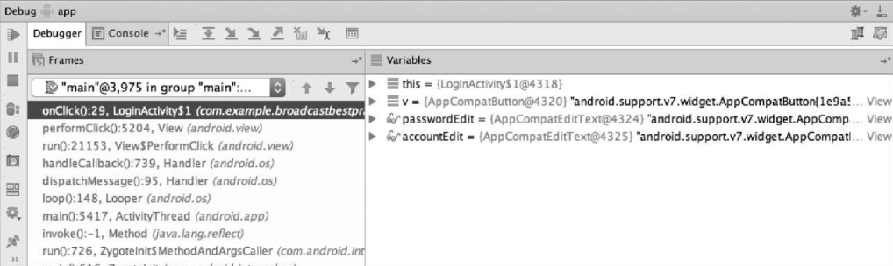
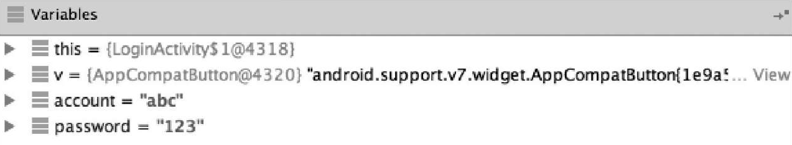
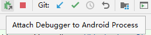
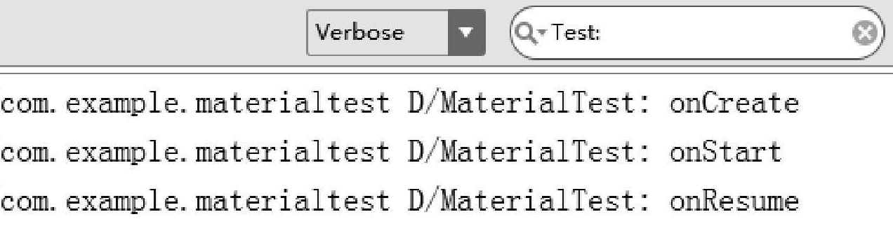
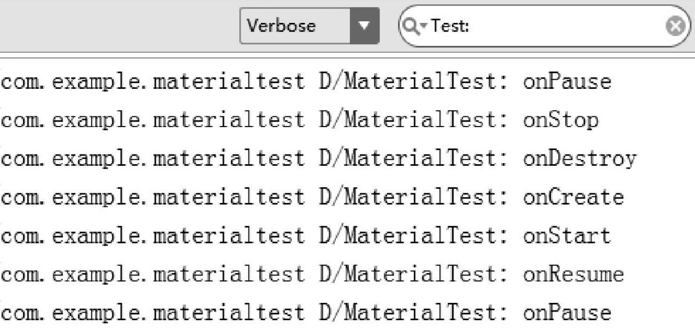

# 高级技巧

## 全局获取 Context

在 Android 开发中，许多地方都需要使用 `Context`，例如弹出 `Toast`、启动活动、发送广播、操作数据库、使用通知等。通常在 `Activity` 类中，`Context` 是可用的，但当应用程序架构变得复杂时，很多逻辑代码可能脱离 `Activity` 类，这时就需要一种方法来在其他地方访问 `Context`。

举个例子，有一个 `HttpUtil` 类，用来发送 HTTP 请求。代码如下：

```java
public class HttpUtil {
    public static void sendHttpRequest(final String address, final HttpCallbackListener listener) {
        new Thread(new Runnable() {
            @Override
            public void run() {
                HttpURLConnection connection = null;
                try {
                    URL url = new URL(address);
                    connection = (HttpURLConnection) url.openConnection();
                    connection.setRequestMethod("GET");
                    connection.setConnectTimeout(8000);
                    connection.setReadTimeout(8000);
                    connection.setDoInput(true);
                    connection.setDoOutput(true);
                    InputStream in = connection.getInputStream();
                    BufferedReader reader = new BufferedReader(new InputStreamReader(in));
                    StringBuilder response = new StringBuilder();
                    String line;
                    while ((line = reader.readLine()) != null) {
                        response.append(line);
                    }
                    if (listener != null) {
                        listener.onFinish(response.toString());
                    }
                } catch (Exception e) {
                    if (listener != null) {
                        listener.onError(e);
                    }
                } finally {
                    if (connection != null) {
                        connection.disconnect();
                    }
                }
            }
        }).start();
    }
}
```

这段代码能够正常工作，但如果想在检测到网络不可用时弹出 `Toast` 提示，就会遇到问题，因为 `Toast` 需要一个 `Context` 参数，而在 `HttpUtil` 类中无法直接获取到 `Context`。

一种解决方法是将 `Context` 作为参数传递给 `sendHttpRequest()` 方法：

```java
public class HttpUtil {
    public static void sendHttpRequest(final Context context, final String address, final HttpCallbackListener listener) {
        if (!isNetworkAvailable()) {
            Toast.makeText(context, "network is unavailable", Toast.LENGTH_SHORT).show();
            return;
        }
        new Thread(new Runnable() {
            @Override
            public void run() {
                // 发送请求的代码
            }
        }).start();
    }

    private static boolean isNetworkAvailable() {
        // 检查网络是否可用的代码
    }
}
```

虽然这种方法有效，但它将获取 `Context` 的任务转移给了调用方，这可能导致某些问题。

因此，为了解决这个问题，可以使用 Android 提供的 `Application` 类来全局管理 `Context`。

**1. 定制 Application 类**

Android 提供了 `Application` 类，每当应用程序启动时，系统会自动初始化它。可以继承 `Application` 类并管理全局的 `Context`。下面是如何实现这一点：

```java
public class MyApplication extends Application {
    private static Context context;

    @Override
    public void onCreate() {
        super.onCreate();
        context = getApplicationContext();
    }

    public static Context getContext() {
        return context;
    }
}
```

在 `MyApplication` 类中，通过 `getApplicationContext()` 获取了应用级别的 `Context`，并提供了一个静态方法 `getContext()` 来返回它。

**2. 配置 AndroidManifest.xml**

接下来，需要告诉系统在应用启动时使用的 `MyApplication` 类，而不是默认的 `Application` 类。在 `AndroidManifest.xml` 文件中，进行如下配置：

```xml
<manifest xmlns:android="http://schemas.android.com/apk/res/android"
    package="com.example.networktest"
    android:versionCode="1"
    android:versionName="1.0">
    
    <application
        android:name="com.example.networktest.MyApplication"
        ... >
        ...
    </application>
</manifest>
```

注意，在 `android:name` 属性中指定 `MyApplication` 时，需要使用完整的包名。

**3. 优化 sendHttpRequest 方法**

现在已经实现了全局获取 `Context` 的功能，因此可以在 `sendHttpRequest()` 方法中直接调用 `MyApplication.getContext()`，而不需要通过传参获取 `Context`。优化后的代码如下：

```java
public static void sendHttpRequest(final String address, final HttpCallbackListener listener) {
    if (!isNetworkAvailable()) {
        Toast.makeText(MyApplication.getContext(), "network is unavailable", Toast.LENGTH_SHORT).show();
        return;
    }
    // 发送请求的代码
}
```

通过这种方法，可以在项目的任何地方方便地访问全局 `Context`，而无需担心无法获取 `Context` 的问题。

**4. 在自定义 `Application` 中初始化 `LitePal`**


在使用 `LitePal` 时，要求在 `AndroidManifest.xml` 中配置一个特定的 `Application` 类，如下所示：

```xml
<application
    android:name="org.litepal.LitePalApplication"
    ...>
    ...
</application>
```

这一配置确保 `LitePal` 能够正常工作，并自动获取到 `Context`。但如果已经在项目中配置了自己的 `Application` 类，会产生一个问题：项目中只能配置一个 `Application` 类，如何解决这一冲突？

`LitePal` 提供了一种解决方案：在自己的 `Application` 类中调用 `LitePal` 的初始化方法。这种方式既能保证自定义的 `Application` 类可以正常工作，又能让 `LitePal` 正常初始化。

示例代码如下：

```java
public class MyApplication extends Application {
    private static Context context;

    @Override
    public void onCreate() {
        super.onCreate();
        context = getApplicationContext();
        LitePal.initialize(context);  // 初始化 LitePal
    }

    public static Context getContext() {
        return context;
    }
}
```

在这个例子中，`LitePal.initialize(context)` 方法在自定义的 `Application` 类中被调用，确保了 `LitePal` 能够正确初始化，并获取到全局的 `Context` 对象。这样做的效果与在 `AndroidManifest.xml` 中配置 `LitePalApplication` 类是一样的。


## 使用Intent传递对象

**`Intent` 的基本用法**

`Intent` 是 Android 中用于启动活动、发送广播、启动服务等的核心类。可以通过 `Intent` 来传递数据，以下是一个常见的例子：

```java
Intent intent = new Intent(FirstActivity.this, SecondActivity.class);
intent.putExtra("string_data", "hello");
intent.putExtra("int_data", 100);
startActivity(intent);
```

在上面的代码中，通过 `putExtra()` 方法向 `Intent` 中添加了要传递的数据：`string_data` 和 `int_data`。

在目标 `Activity`（例如 `SecondActivity`）中，可以通过 `getIntent()` 获取传递的 `Intent`，然后提取数据，如下所示：

```java
getIntent().getStringExtra("string_data");
getIntent().getIntExtra("int_data", 0);
```

**限制：只能传递基本数据类型**

`putExtra()` 方法支持一些常见的基本数据类型，如 `String`、`int`、`boolean` 等，但当你需要传递自定义对象时，`Intent` 本身并不直接支持。

在使用 `Intent` 传递自定义对象时，可以选择两种实现方式：`Serializable` 和 `Parcelable`。

### 使用 `Serializable` 方式传递对象

`Serializable` 是序列化的意思，它将一个对象转换为可存储或可传输的状态。序列化后的对象可以在网络上传输或存储到本地。

实现 `Serializable` 很简单，只需让对象的类实现 `Serializable` 接口。

**1. 创建可序列化的对象类**

例如，定义一个 `Person` 类，其中包含 `name` 和 `age` 字段，并实现 `Serializable` 接口：

```java
public class Person implements Serializable {
    private String name;
    private int age;

    public String getName() {
        return name;
    }

    public void setName(String name) {
        this.name = name;
    }

    public int getAge() {
        return age;
    }

    public void setAge(int age) {
        this.age = age;
    }
}
```

**2. 在 `FirstActivity` 中传递 `Person` 对象**

在 `FirstActivity` 中创建 `Person` 对象，并通过 `putExtra()` 方法传递：

```java
Person person = new Person();
person.setName("Tom");
person.setAge(20);
Intent intent = new Intent(FirstActivity.this, SecondActivity.class);
intent.putExtra("person_data", person);
startActivity(intent);
```

**3. 在 `SecondActivity` 中获取 `Person` 对象**

在 `SecondActivity` 中，使用 `getSerializableExtra()` 方法获取传递过来的对象，并将其转换为 `Person` 类型：

```java
Person person = (Person) getIntent().getSerializableExtra("person_data");
```

### 使用 `Parcelable` 方式传递对象

`Parcelable` 将一个对象分解成多个部分，每个部分都是 `Intent` 所支持的数据类型。这样就实现了对象的传递。

**1. 修改 `Person` 类实现 `Parcelable` 接口**

为了使用 `Parcelable`，需要让对象类实现 `Parcelable` 接口，并重写 `describeContents()` 和 `writeToParcel()` 方法

- `describeContents()` 方法通常返回0
- 在 `writeToParcel()` 中，字段是通过 `Parcel` 对象的 `writeXxx()` 方法按**顺序**写入的
    - 例如，先写入 `name`，再写入 `age`
- `CREATOR` 常量是必须的，它是 `Parcelable.Creator` 的实现，负责从 `Parcel` 中读取数据并创建对象
- 重写 `createFromParcel()` 方法
    - 必须**按相同的顺序**使用 `Parcel` 的 `readXxx()` 方法读取数据，并创建一个`Person`对象进行返回
    - **注意这里读取的顺序一定要和刚才写出的顺序完全相同**
- 重写 `newArray()` 方法
    - 只需要`new`出一个`Person`数组，并使用方法中传入的`size`作为数组大小就可以


以下是修改后的 `Person` 类：

```java
public class Person implements Parcelable {
    private String name;
    private int age;
    
    // describeContents() 方法直接返回0
    @Override
    public int describeContents() {
        return 0;
    }

    // writeToParcel() 方法用于将对象的字段写入 Parcel
    @Override
    public void writeToParcel(Parcel dest, int flags) {
        dest.writeString(name);  //  第一步：写出 name
        dest.writeInt(age);  // 第二步：写出 age
    }

    // CREATOR 常量用于创建对象的 Parcelable.Creator 实例
    public static final Parcelable.Creator<Person> CREATOR = new Parcelable.Creator<Person>() {
        @Override
        public Person createFromParcel(Parcel source) {
            Person person = new Person();
            person.name = source.readString();  // 第一步：读取 name
            person.age = source.readInt();  // 第二步：读取 age
            return person;
        }

        @Override
        public Person[] newArray(int size) {
            return new Person[size];  // 创建一个新的 Person 数组
        }
    };
}
```

**2. 在 `FirstActivity` 中传递 `Person` 对象**

在 `FirstActivity` 中，传递 `Person` 对象的代码和之前的方式类似：

```java
Person person = new Person();
person.setName("Tom");
person.setAge(20);
Intent intent = new Intent(FirstActivity.this, SecondActivity.class);
intent.putExtra("person_data", person);
startActivity(intent);
```

**3. 在 `SecondActivity` 中获取 `Person` 对象**

在 `SecondActivity` 中，获取传递过来的 `Person` 对象时，需要使用 `getParcelableExtra()` 方法：

```java
Person person = (Person) getIntent().getParcelableExtra("person_data");
```

**4. 对比 `Serializable` 和 `Parcelable`**

- **`Serializable`** 的方式较为简单，它将整个对象序列化为字节流，因此传递对象时比较简单，但效率较低
- **`Parcelable`** 更高效，因为它不会进行全序列化，而是将对象的字段分解成可以传递的类型，因此在效率上优于 `Serializable`

通常情况下，建议使用 `Parcelable` 方式进行对象传递，特别是在需要频繁传递对象的场景中

## 定制自己的日志工具

- 在开发大型项目时，代码中往往会插入大量的日志用于调试
- 项目上线后，这些日志仍然会打印，可能会导致：
  - 程序运行效率降低
  - 潜在的数据泄露风险

**解决方案：定制 LogUtil 工具类**

通过自定义一个日志工具类，可以轻松控制日志的打印行为。

**1. LogUtil 类实现**

```java
public class LogUtil {
    public static final int VERBOSE = 1;
    public static final int DEBUG = 2;
    public static final int INFO = 3;
    public static final int WARN = 4;
    public static final int ERROR = 5;
    public static final int NOTHING = 6;

    public static int level = VERBOSE;

    public static void v(String tag, String msg) {
        if (level <= VERBOSE) {
            Log.v(tag, msg);
        }
    }

    public static void d(String tag, String msg) {
        if (level <= DEBUG) {
            Log.d(tag, msg);
        }
    }

    public static void i(String tag, String msg) {
        if (level <= INFO) {
            Log.i(tag, msg);
        }
    }

    public static void w(String tag, String msg) {
        if (level <= WARN) {
            Log.w(tag, msg);
        }
    }

    public static void e(String tag, String msg) {
        if (level <= ERROR) {
            Log.e(tag, msg);
        }
    }
}
```

1. **日志级别常量**  
   定义了 6 个日志级别常量：
   - `VERBOSE`：最详细的日志
   - `DEBUG`：调试信息
   - `INFO`：普通信息
   - `WARN`：警告信息
   - `ERROR`：错误信息
   - `NOTHING`：屏蔽所有日志

2. **日志级别控制变量**  
   使用静态变量 `level` 来控制日志的打印行为。通过改变 `level` 的值，可以动态调整日志的输出级别。

3. **自定义日志方法**  
   每个日志方法都包含一个 `if` 判断，只有在 `level` 值小于或等于对应级别时才打印日志。例如：
   ```java
   public static void d(String tag, String msg) {
       if (level <= DEBUG) {
           Log.d(tag, msg);
       }
   }
   ```

**2. 使用示例**

在项目中使用自定义日志工具与使用普通日志工具类似：

- 打印 DEBUG 级别日志：
  ```java
  LogUtil.d("TAG", "debug log");
  ```
- 打印 WARN 级别日志：
  ```java
  LogUtil.w("TAG", "warn log");
  ```

**3. 日志控制示例**

- **开发阶段**  
  将 `level` 设置为 `VERBOSE`，打印所有日志：
  ```java
  LogUtil.level = LogUtil.VERBOSE;
  ```

- **上线阶段**  
  将 `level` 设置为 `NOTHING`，屏蔽所有日志：
  ```java
  LogUtil.level = LogUtil.NOTHING;
  ```

## 调试Android程序

在开发过程中，如果遇到难以定位的 Bug，调试是最有效的解决方法。

调试可以逐行执行代码，并实时观察内存中的数据，从而快速查明问题原因。

以下是**使用 Android Studio 进行调试的两种方法**：

**1. 基础调试方法**

- **缺点**
    1. 在调试模式下，程序的运行效率将会大大地降低，如果断点加在一个比较靠后的位置，需要执行很多的操作才能运行到这个断点
    2. 适用于初次调试，操作简单，但运行效率较低。 

1. **添加断点**  
   首先，在目标代码行的左边点击即可添加断点  
   - 如果需要取消断点，再次点击即可

2. **启动调试模式**  
   点击 Android Studio 顶部工具栏中的 **Debug 按钮**，以调试模式启动程序

3. **运行程序并触发断点**  
   - 程序启动后，会弹出一个提示框，随后自动消失
   - 操作之后，程序会停在断点处，Android Studio 自动打开 **Debug 窗口**
   - 

4. **逐行执行代码**  
   - 按 **F8**，代码逐行执行，并通过 **Variables 视图**查看内存中的数据。
    - 

5. **结束调试**  
   - 点击 Debug 窗口中的 **Stop 按钮**结束调试
   - 

**2. Attach Debugger 调试方法**

* 优点
    - 更加灵活，可以随时进入调试模式，更适合实际开发中的复杂场景。

使用正常的方式来启动程序，可以让程序随时进入到调试模式

1. **正常启动程序**  
   直接以普通模式启动程序，不选择调试模式

2. **附加调试器**  
   - 点击 Android Studio 顶部工具栏的 **Attach Debugger to Android Process 按钮**
   - 

3. **选择进程**  
   弹出进程选择提示框，选中当前程序的进程并点击 **OK**

5. **进入调试模式**  
   程序进入调试模式，继续操作，Android Studio 自动打开 **Debug 窗口**

6. **后续操作**  
   之后的调试流程与第一种方法相同

## 创建定时任务

在 Android 中，可以通过以下两种方式来实现定时任务：

1. **Timer 类**
    - **简介**：Timer 是 Java 提供的一个基础类，用于执行定时任务。
    - **短板**：  
    Timer 不适合需要长期在后台运行的定时任务。
    - 当设备进入休眠状态时，CPU 可能会暂停运行，导致 Timer 任务无法正常执行。
    - 适合短期、简单的任务调度。

2. **Alarm 机制**
    - **简介**：Alarm 机制依赖于 Android 提供的 `AlarmManager` 类。
    - **优势**：
    - 可以唤醒 CPU，即使设备处于休眠状态，依然能保证定时任务的执行。
    - 适用于需要长期运行的定时任务。

- **注意**：  
  唤醒 CPU 不等于唤醒屏幕，Alarm 机制不会改变设备屏幕状态。

### Alarm 机制

**1. 获取 `AlarmManager` 实例**

`AlarmManager` 是实现定时任务的核心类，通过调用 `Context.getSystemService()` 获取实例：

```java
AlarmManager manager = (AlarmManager) getSystemService(Context.ALARM_SERVICE);
```

**2. 设置定时任务**

使用 `AlarmManager` 的 `set()` 方法来设置定时任务，例如在 10 秒后触发任务：

```java
long triggerAtTime = SystemClock.elapsedRealtime() + 10 * 1000;
manager.set(AlarmManager.ELAPSED_REALTIME_WAKEUP, triggerAtTime, pendingIntent);
```

**3. `set()` 方法参数解析**
- **第一个参数：工作类型**
  - `ELAPSED_REALTIME`：从设备开机时间开始计算，不唤醒 CPU。
  - `ELAPSED_REALTIME_WAKEUP`：从设备开机时间开始计算，唤醒 CPU。
  - `RTC`：从 1970 年 1 月 1 日 0 点开始计算，不唤醒 CPU。
  - `RTC_WAKEUP`：从 1970 年 1 月 1 日 0 点开始计算，唤醒 CPU。

- **第二个参数：触发时间**
  - 如果使用 `ELAPSED_REALTIME` 或 `ELAPSED_REALTIME_WAKEUP`，传入 `SystemClock.elapsedRealtime()`（设备开机时间）加上延迟时间。
  - 如果使用 `RTC` 或 `RTC_WAKEUP`，传入 `System.currentTimeMillis()`（1970 年 1 月 1 日 0 点到现在的时间）加上延迟时间。

- **第三个参数：`PendingIntent`**
  - 用于指定任务触发时的操作，比如启动服务或发送广播。
  - 通过 `PendingIntent.getService()` 或 `PendingIntent.getBroadcast()` 来创建。

**示例：10 秒后启动服务**

```java
long triggerAtTime = System.currentTimeMillis() + 10 * 1000;
manager.set(AlarmManager.RTC_WAKEUP, triggerAtTime, pendingIntent);
```

**4. 后台长期定时任务实现**

如果需要长期在后台定时运行任务，可以创建一个服务，并在`onStartCommand()`方法实现定时逻辑。

1. **创建服务 `LongRunningService`**

```java
public class LongRunningService extends Service {
    @Override
    public IBinder onBind(Intent intent) {
        return null;
    }

    @Override
    public int onStartCommand(Intent intent, int flags, int startId) {
        new Thread(new Runnable() {
            @Override
            public void run() {
                // 在这里执行具体的逻辑操作
            }
        }).start();

        AlarmManager manager = (AlarmManager) getSystemService(ALARM_SERVICE);
        int anHour = 60 * 60 * 1000;  // 一小时的毫秒数
        long triggerAtTime = SystemClock.elapsedRealtime() + anHour;

        Intent i = new Intent(this, LongRunningService.class);
        PendingIntent pi = PendingIntent.getService(this, 0, i, 0);
        manager.set(AlarmManager.ELAPSED_REALTIME_WAKEUP, triggerAtTime, pi);

        return super.onStartCommand(intent, flags, startId);
    }
}
```

2. **逻辑说明**
    - 在 `onStartCommand()` 中启动一个子线程以执行耗时任务，避免阻塞主线程
    - 获取到了`Alarm-Manager`的实例，然后定义任务的触发时间为一小时后，再使用`PendingIntent`指定处理定时任务的服务为`LongRunningService`，最后调用`set()`方法完成设定
    - 设置定时任务：每小时重新启动 `LongRunningService`，形成循环
    - 因为一旦启动了`LongRunningService`，就会在`onStartCommand()`方法里设定一个定时任务，这样一小时后将会再次启动`LongRunningService`，从而也就形成了一个永久的循环，保证`LongRunningService`的`onStartCommand()`方法可以每隔一小时就执行一次

3. **启动服务**

在需要启动定时服务时，调用以下代码：

```java
Intent intent = new Intent(context, LongRunningService.class);
context.startService(intent);
```

4. **注意事项：Alarm 任务的触发时间**

    1. **Alarm 任务的触发延迟**
    从 **Android 4.4 (API 19)** 开始，`AlarmManager` 触发任务的时间可能会不准确，存在一定延迟。这是系统为优化电池续航所做的调整。

        - **优化机制**：  
        系统会将触发时间相近的多个 Alarm 任务合并在一起执行，从而减少 CPU 唤醒的频率，延长电池寿命。

        - **影响**：  
        任务可能会在设定时间后的一段时间才被触发。

    2. **确保准时触发**
    如果任务的执行时间必须严格准时，Android 提供了更精确的方法：

    - 使用 `setExact()` 方法替代 `set()` 方法，能够保证任务在设定的时间准时触发。

```java
AlarmManager manager = (AlarmManager) getSystemService(Context.ALARM_SERVICE);
long triggerAtTime = SystemClock.elapsedRealtime() + 10 * 1000;
manager.setExact(AlarmManager.ELAPSED_REALTIME_WAKEUP, triggerAtTime, pendingIntent);
```

### Doze模式

**1. Doze 模式的引入背景**

为了解决后台服务泛滥导致的电量消耗问题，Google 在 **Android 6.0 (API 23)** 中引入了 **Doze 模式**，极大程度延长了电池续航。

**2. Doze 模式的触发条件**
- 设备运行 **Android 6.0 或以上** 系统。
- **未接电源**。
- **静止状态**（从 Android 7.0 开始，不再需要此条件）。
- **屏幕关闭**一段时间后。

在满足上述条件时，设备会进入 Doze 模式。

**3. Doze 模式的特性**
- **间歇性退出**：  
  系统会周期性退出 Doze 模式，允许应用在短时间内执行必要的操作，如同步和 Alarm 任务。
  
  - 随着 Doze 模式持续时间的增加，退出的间隔也会变长，进一步节省电量。

**4. Doze 模式下的功能限制**
- **网络访问被禁止**。
- **系统忽略唤醒 CPU 或屏幕的操作**。
- **不执行 WiFi 扫描**。
- **不执行同步服务**。
- **Alarm 任务推迟至下次退出 Doze 模式时执行**。

**5. 处理 Alarm 任务在 Doze 模式中的限制**

在 Doze 模式下，Alarm 任务会被推迟，这通常是合理的。

但在某些情况下，你可能需要**确保 Alarm 任务能够准时执行**。为此，Android 提供了以下方法：

1. **`setAndAllowWhileIdle()`**  
   允许定时任务在 Doze 模式下执行，但不保证高精度。

2. **`setExactAndAllowWhileIdle()`**  
   允许定时任务在 Doze 模式下执行，并保证高精度。

```java
AlarmManager manager = (AlarmManager) getSystemService(Context.ALARM_SERVICE);
long triggerAtTime = SystemClock.elapsedRealtime() + 10 * 1000;
manager.setExactAndAllowWhileIdle(AlarmManager.ELAPSED_REALTIME_WAKEUP, triggerAtTime, pendingIntent);
```


## 多窗口模式编程

由于手机屏幕尺寸的限制，传统的移动操作系统（如 Android、iOS、Windows Phone）通常只能在屏幕上同时运行一个应用程序。然而，随着屏幕尺寸的增大，这种单任务模式已经无法满足用户的多任务需求。

Android 7.0 引入了 多窗口模式，允许用户在同一屏幕上同时运行两个应用程序，从而提升了多任务处理能力和用户体验。这一功能尤其适用于大屏设备，为用户带来更高效的使用体验。

### 进入多窗口模式

**多窗口模式可通过以下方式启动：**
1. **从Overview列表进入：** 在导航栏中点击 **Overview** 按钮，显示最近的应用活动。长按某个活动的标题并拖动到屏幕上部突出显示的区域，应用即进入多窗口模式。
2. **通过长按Overview按钮：** 打开任意应用，长按Overview按钮，直接进入多窗口模式。

**多窗口模式的显示方式**  
进入多窗口模式后，屏幕会被分为两个部分：
- **垂直分屏：** 如果设备处于竖屏状态，屏幕上下分割，显示两个应用。
- **水平分屏：** 如果设备旋转为横屏，屏幕左右分割。

**应用界面适配**  
在多窗口模式下，应用界面会被缩小。因此，为了保证应用界面在不同屏幕尺寸下的良好显示，开发者应使用 **`match_parent`** 属性，以及 **`RecyclerView`**、**`ListView`**、**`ScrollView`** 等控件，确保界面能适配各种屏幕大小，避免出现显示不完整的情况。

**退出多窗口模式**  
要退出多窗口模式，可以通过：
- 再次长按 **Overview** 按钮，或
- 将屏幕中央的分隔线拖动到屏幕的一侧。

### 多窗口模式下的生命周期


**生命周期变化概述**  

在多窗口模式下，活动的生命周期并未发生根本性变化。进入多窗口模式时，系统会将用户最近交互的活动置为运行状态，而将另一个可见活动置为暂停状态。当用户与暂停状态的活动交互时，该活动会切换为运行状态，之前运行的活动则会被暂停。

下面通过示例代码来帮助理解这一过程。

1. **MaterialTest 项目的 MainActivity：**
   ```java
   public class MainActivity extends AppCompatActivity {
       private static final String TAG = "MaterialTest";
       ...
       @Override
       protected void onCreate(Bundle savedInstanceState) {
           super.onCreate(savedInstanceState);
           Log.d(TAG, "onCreate");
           ...
       }
       @Override
       protected void onStart() {
           super.onStart();
           Log.d(TAG, "onStart");
       }
       @Override
       protected void onResume() {
           super.onResume();
           Log.d(TAG, "onResume");
       }
       @Override
       protected void onPause() {
           super.onPause();
           Log.d(TAG, "onPause");
       }
       @Override
       protected void onStop() {
           super.onStop();
           Log.d(TAG, "onStop");
       }
       @Override
       protected void onDestroy() {
           super.onDestroy();
           Log.d(TAG, "onDestroy");
       }
       @Override
       protected void onRestart() {
           super.onRestart();
           Log.d(TAG, "onRestart");
       }
       ...
   }
   ```

2. **LBSTest 项目的 MainActivity：**
   ```java
   public class MainActivity extends AppCompatActivity {
       private static final String TAG = "LBSTest";
       ...
       @Override
       protected void onCreate(Bundle savedInstanceState) {
           super.onCreate(savedInstanceState);
           Log.d(TAG, "onCreate");
           ...
       }
       @Override
       protected void onStart() {
           super.onStart();
           Log.d(TAG, "onStart");
       }
       @Override
       protected void onResume() {
           super.onResume();
           Log.d(TAG, "onResume");
           mapView.onResume();
       }
       @Override
       protected void onPause() {
           super.onPause();
           Log.d(TAG, "onPause");
           mapView.onPause();
       }
       @Override
       protected void onStop() {
           super.onStop();
           Log.d(TAG, "onStop");
       }
       @Override
       protected void onDestroy() {
           super.onDestroy();
           Log.d(TAG, "onDestroy");
           mLocationClient.stop();
           mapView.onDestroy();
           baiduMap.setMyLocationEnabled(false);
       }
       @Override
       protected void onRestart() {
           super.onRestart();
           Log.d(TAG, "onRestart");
       }
       ...
   }
   ```

**执行步骤与日志观察：**

1. 运行 **MaterialTest** 项目，观察 logcat 输出。此时，`onCreate()`, `onStart()`, 和 `onResume()` 方法会依次执行。
    - 
2. 长按Overview按钮，进入多窗口模式，打印信息如下：
   - **MaterialTest** 的活动被重新创建，这是**因为进入多窗口模式会发生屏幕大小变化，默认情况下会重新创建活动**，横竖屏切换也是会重新创建活动的
    - 
3. 接着在Overview列表界面选中LBSTest程序
   - **LBSTest** 程序的 `onCreate()`, `onStart()`, 和 `onResume()` 方法依次执行，说明 **LBSTest** 变为运行状态。
3. 切换回 **MaterialTest** 程序，观察 logcat：
   - 
   - **LBSTest** 的 `onPause()` 方法被调用，**MaterialTest** 的 `onResume()` 方法执行。此时 **MaterialTest** 恢复为运行状态，**LBSTest** 切换为暂停状态。

**生命周期总结与注意事项：**

- 在多窗口模式下，用户交互的活动变为运行状态，未交互的活动则变为暂停状态。
- **视频播放器** 等需要持续播放的应用，应避免在 `onPause()` 方法中处理暂停逻辑，应该在 `onStop()` 中处理，确保在 `onStart()` 时恢复播放。
  
**防止活动重新创建：**  
若希望在多窗口模式下活动不被重新创建，可以在 `AndroidManifest.xml` 中为活动配置如下属性：

```xml
<activity
    android:name=".MainActivity"
    android:label="Fruits"
    android:configChanges="orientation|keyboardHidden|screenSize|screenLayout">
    ...
</activity>
```

通过这一配置，活动不会重新创建，而会将屏幕变化的事件传递给 `onConfigurationChanged()` 方法，从而可以在此方法中进行相应的逻辑处理。

### 禁用多窗口模式

尽管多窗口模式非常强大，但并不适用于所有应用。例如，手机游戏在多窗口模式下运行会影响体验，因为用户难以同时操作多个应用。为了应对这种情况，Android 提供了禁用多窗口模式的选项。

**1. 禁用多窗口模式的方法**

要禁用多窗口模式，只需在 `AndroidManifest.xml` 的 `<application>` 或 `<activity>` 标签中添加如下属性：

```xml
<application
    ...
    android:resizeableActivity="false">
    ...
</application>
```

- `android:resizeableActivity="true"`：应用支持多窗口模式。
- `android:resizeableActivity="false"`：应用不支持多窗口模式。
- 如果未设置该属性，默认值为 `true`。

**示例：**  
将 `MaterialTest` 设置为不支持多窗口模式：

```xml
<application
    ...
    android:resizeableActivity="false">
    ...
</application>
```

重新运行应用后，长按 Overview 按钮，此时无法进入多窗口模式，且屏幕下方会弹出 Toast 提示告知用户当前应用不支持多窗口模式。

**`android:resizeableActivity` 的限制**

这个属性仅在项目的 `targetSdkVersion` 为 24 或更高版本时有效。如果 `targetSdkVersion` 低于 24，则该属性无效。

例如，当 `targetSdkVersion` 设置为 23 时，即使设置了 `android:resizeableActivity="false"`，应用仍可能进入多窗口模式，并显示提示信息。

**2. 另一种禁用多窗口模式的方法**

如果项目的 `targetSdkVersion` 低于 24，并且活动是不允许横竖屏切换的，那么该应用也将不支持多窗口模式。

要实现这一点，可以在 `AndroidManifest.xml` 的 `<activity>` 标签中配置：

```xml
<activity
    android:name=".MainActivity"
    android:screenOrientation="portrait">
    ...
</activity>
```

- `android:screenOrientation="portrait"`：活动只支持竖屏。
- `android:screenOrientation="landscape"`：活动只支持横屏。

**示例：**  
将 `MaterialTest` 的 `MainActivity` 设置为只支持竖屏：

```xml
<activity
    android:name=".MainActivity"
    android:label="Fruits"
    android:screenOrientation="portrait">
    ...
</activity>
```

重新运行应用后，应用不支持横竖屏切换，并且长按 Overview 按钮会显示与前述相同的提示，表明多窗口模式已被禁用。

## Lambda表达式

`Java 8` 引入了一些非常有特色的功能，如 `Lambda` 表达式、`Stream API` 和接口默认实现等。

`Java 8`的新特性种 `Stream API` 和接口默认实现等特性只支持 `Android 7.0` 及以上版本，而 `Lambda` 表达式最低兼容 `Android 2.3` 系统，因此可以覆盖大多数 `Android` 手机。

**1. 启用 Java 8 特性**

要在 Android 项目中使用 Lambda 表达式或其他 Java 8 新特性，首先需要在 `app/build.gradle` 中添加以下配置：

```gradle
android {
    ...
    defaultConfig {
        ...
        jackOptions.enabled = true
    }
    compileOptions {
        sourceCompatibility JavaVersion.VERSION_1_8
        targetCompatibility JavaVersion.VERSION_1_8
    }
    ...
}
```

**2. Lambda 表达式的基本写法**

Lambda 表达式本质上是一个匿名方法，没有方法名、访问修饰符或返回值类型，代码更加简洁易读。

**传统写法：**

传统上，开启一个子线程通常使用以下方式：

```java
new Thread(new Runnable() {
    @Override
    public void run() {
        // 处理具体的逻辑
    }
}).start();
```

**Lambda 表达式写法：**

使用 Lambda 表达式，可以简化为：

```java
new Thread(() -> {
    // 处理具体的逻辑
}).start();
```

这种写法的优势在于更简洁，减少了冗余的代码和缩进。

**3. 适用 Lambda 表达式的接口**

Lambda 表达式适用于那些只有一个待实现方法的接口。以 `Runnable` 接口为例，它只有一个 `run()` 方法：

```java
public interface Runnable {
    void run();
}
```

传统上，创建 `Runnable` 接口的匿名类实现方式如下：

```java
Runnable runnable = new Runnable() {
    @Override
    public void run() {
        // 添加具体的实现
    }
};
```

有了 Lambda 表达式后，可以简化为：

```java
Runnable runnable1 = () -> {
    // 添加具体的实现
};
```

**4. 自定义接口与 Lambda 表达式**

可以自定义接口并使用 Lambda 表达式进行实现。比如，定义一个 `MyListener` 接口：

```java
public interface MyListener {
    String doSomething(String a, int b);
}
```

`MyListener` 接口有一个带参数并且有返回值的方法 `doSomething()`，使用 Lambda 表达式实现该接口：

```java
MyListener listener = (String a, int b) -> {
    String result = a + b;
    return result;
};
```

此外，Java 还可以根据上下文自动推断 Lambda 表达式中的参数类型，因此可以进一步简化为：

```java
MyListener listener = (a, b) -> {
    String result = a + b;
    return result;
};
```

通过这种方式，代码变得更加精简易读。

**5. 传递 Lambda 表达式作为方法参数**

假设有一个方法，接收一个 `MyListener` 类型的参数，代码如下：

```java
public void hello(MyListener listener) {
    String a = "Hello Lambda";
    int b = 1024;
    String result = listener.doSomething(a, b);
    Log.d("TAG", result);
}
```

在调用 `hello()` 方法时，可以直接传递 Lambda 表达式：

```java
hello((a, b) -> {
    String result = a + b;
    return result;
});
```

在这个例子中，`doSomething()` 方法将 `a` 和 `b` 两个参数进行相加，最终打印的结果将是 "Hello Lambda1024"。

**6. 在 Android 中使用 Lambda 表达式**

Lambda 表达式非常适合用于替代那些符合以下条件的接口实现：接口中只有一个待实现方法。除了之前提到的开启子线程外，设置点击事件也是一个非常常见的用例。

**传统写法：** 设置按钮点击事件时，通常会这样写：

```java
Button button = (Button) findViewById(R.id.button);
button.setOnClickListener(new View.OnClickListener() {
    @Override
    public void onClick(View v) {
        // 处理点击事件
    }
});
```

**Lambda 表达式写法：** 使用 Lambda 表达式后，代码可以简化为：

```java
Button button = (Button) findViewById(R.id.button);
button.setOnClickListener((v) -> {
    // 处理点击事件
});
```

**进一步简化：** 当接口的待实现方法只有一个参数时，可以去掉参数外面的括号，代码进一步简化为：

```java
Button button = (Button) findViewById(R.id.button);
button.setOnClickListener(v -> {
    // 处理点击事件
});
```
