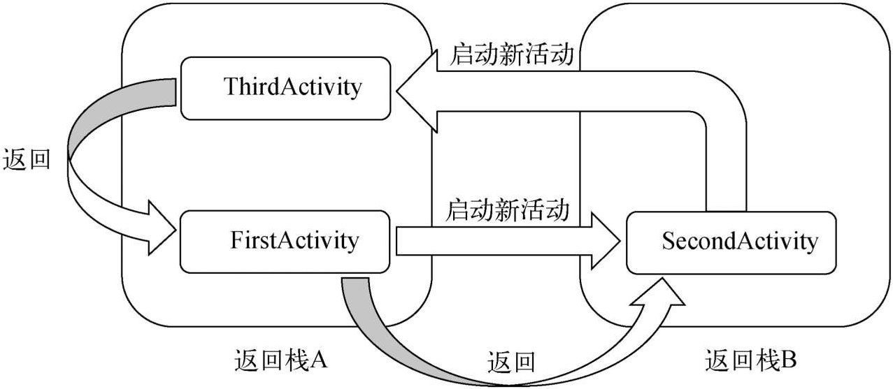

# 活动（Activity）

Activity 是应用程序中的一个基本组件，它代表一个用户可以与之交互的单一屏幕。每个 Activity 都有自己的生命周期，负责处理用户的界面和响应用户的操作。

## 活动的基本用法

### 手动创建活动

* 右击com.example.demo01包→New→Activity→Empty Activity->FristActivity
* （不勾选）勾选Generate Layout File表示会自动为 Activity 创建一个对应的布局文件
* （不勾选）勾选Launcher Activity表示会自动将 Activity 设置为当前项目的主活动


在 Android 开发中，每个 Activity 都应该重写 onCreate() 方法。这是因为 onCreate() 在 Activity 创建时调用，并负责初始化活动的状态和界面。

### 创建和加载布局

右击app/src/main/res/layout目录→New→Layout Resource File，又会弹出一个新建布局资源文件的窗口，将这个布局文件命名为first_layout，根元素就设置为LinearLayout


可视化布局编辑器

* Design是当前的可视化布局编辑器，不仅可以预览当前的布局，还可以通过拖放的方式编辑布局。
* Code是通过XML文件的方式来编辑布局的。


```xml
<?xml version="1.0" encoding="utf-8"?>
        <LinearLayout xmlns:android="http://schemas.android.com/apk/res/android"
            android:orientation="vertical"
            android:layout_width="match_parent"
            android:layout_height="match_parent">
            <Button
                android:id="@+id/button_1"
                android:layout_width="match_parent"
                android:layout_height="wrap_content"
                android:text="Button 1"
                />
        </LinearLayout>
```

* `android:id` 是给当前的元素定义一个唯一标识符
* `android:layout_width` 指定了当前元素的宽度
    * `match_parent`表示让当前元素和父元素一样宽
* `android:layout_height` 指定了当前元素的高度
    * `wrap_content`表示当前元素的高度只要能刚好包含里面的内容
* `android:text` 指定了元素中显示的文字内容

```java
package com.example.demo;

import androidx.appcompat.app.AppCompatActivity;

import android.os.Bundle;

public class FirstActivity extends AppCompatActivity {

    @Override
    protected void onCreate(Bundle savedInstanceState) {
        super.onCreate(savedInstanceState);
        setContentView(R.layout.first_layout);
    }
}
```

1. 项目中添加的任何资源都会在R文件中生成一个相应的资源id
2. 调用 `R.layout.first_layout` 得到 `first_layout.xml` 布局的id
3. 调用 `setContentView()` 方法传入布局的id来给当前的活动加载布局

### 在AndroidManifest文件中注册

* **所有的活动都要在AndroidManifest.xml中进行注册才能生效**
    * 活动的注册声明要放在 `<application>` 标签内，通过 `<activity>` 标签来对活动进行注册
* 在 Android Studio 中手动创建一个新的 Activity 时，IDE 会自动在 AndroidManifest.xml 文件中为你添加相应的 `<activity>` 标签
* **`android:name`** 指定注册的活动
    * 由于在最外层的 `<manifest>` 标签中已经通过package属性指定了程序的包名，`android:name` 属性可以省略包名部分，直接使用相对路径形式（即以 . 开头）
* **`android:label`** 指定了 Activity 在界面顶部的标题栏中显示的文字
    * 主活动的 label 会成为设备启动器（Launcher）中应用程序图标下显示的名称
    * 主活动的 label 会覆盖 `<application>` 中设置的应用程序名称
* 将 `.FirstActivity` 配置为主活动
* 如果应用程序中**没有声明任何一个活动作为主活动**，这个程序仍然是可以正常安装的，但无法在启动器中看到或者打开这个程序。这种程序一般都是作为第三方服务供其他应用在内部进行调用的。

```xml
<?xml version="1.0" encoding="utf-8"?>
<manifest xmlns:android="http://schemas.android.com/apk/res/android"
    package="com.example.demo01">

    <application
        android:allowBackup="true"
        android:icon="@mipmap/ic_launcher"
        android:label="@string/app_name"
        android:roundIcon="@mipmap/ic_launcher_round"
        android:supportsRtl="true"
        android:theme="@style/Theme.Demo01">
<!--        <activity android:name=".MainActivity">-->
        <activity android:name=".FirstActivity" android:label="This is FirstActivity">
            <intent-filter>
                <action android:name="android.intent.action.MAIN" />

                <category android:name="android.intent.category.LAUNCHER" />
            </intent-filter>
        </activity>
    </application>

</manifest>
```

### 事件绑定

```java
package com.example.demo01;

import androidx.appcompat.app.AppCompatActivity;

import android.os.Bundle;
import android.view.View;
import android.widget.Button;
import android.widget.Toast;

public class FirstActivity extends AppCompatActivity {

    @Override
    protected void onCreate(Bundle savedInstanceState) {
        super.onCreate(savedInstanceState);
        setContentView(R.layout.first_layout);
        Button button1 = (Button) findViewById(R.id.button_1);
        button1.setOnClickListener(new View.OnClickListener() {
            @Override
            public void onClick(View v) {
                Toast.makeText(FirstActivity.this, "You clicked Button 1",
                        Toast.LENGTH_SHORT).show();
            }
        });
    }
}
```

**1. 点击事件**

* 可以通过 `findViewById()` 方法获取到在布局文件中定义的元素
    * 使用 `R.id` 获取 XML 中定义的 View
    * `findViewById()` 方法返回的是一个**View**对象，需要向下转型转成Button对象
* 调用按钮对象的 `setOnClickListener()` 方法，为按钮注册一个点击事件监听器
    * `setOnClickListener` 方法接收一个实现了 `View.OnClickListener` 接口的对象
        * `View.OnClickListener` 是一个接口，定义了一个 `onClick(View v)` 方法，用于处理点击事件
            * `v` 参数代表被点击的 `View` 对象，可以用来区分不同的点击事件
        * 使用匿名内部类实现接口
* 当按钮被点击时，系统会调用这个 `onClick()` 方法

**2. Toast 用法**

* 创建 Toast 对象： 通过 Toast.makeText(Context context, CharSequence text, int duration) 方法创建一个 Toast 对象
    * Context：上下文对象，通常是当前活动实例（如 Activity.this）
    * Text：要显示的文本内容
    * Duration：显示的时长
        * 内置常量 `Toast.LENGTH_SHOR`(2s) `TToast.LENGTH_LONG`(3-4s)
* 显示 Toast： 调用 show() 方法来显示 Toast

### 菜单 Menu

**在活动中使用Menu**

1. 在res目录下新建一个menu文件夹，右击res目录→New→Directory，输入文件夹名menu，点击OK。
2. 右击menu文件夹→New→Menu resource file，文件名输入main，点击OK完成创建。
3. 定义菜单的资源文件
    * `<menu>`：菜单资源的根元素，所有菜单项都必须放在 <menu> 标签内
    * `<item>`：用于定义菜单中的各个项
        * `android:title` 属性定义此菜单项的显示文本

```xml
<?xml version="1.0" encoding="utf-8"?>
<menu xmlns:android="http://schemas.android.com/apk/res/android">
    <item
        android:id="@+id/add_item"
        android:title="Add"/>
    <item
        android:id="@+id/remove_item"
        android:title="Remove"/>
</menu>
```

在FirstActivity中重写 `onCreateOptionsMenu()` 方法和重写 `onCreateOptionsMenu()` 方法（Ctrl+O快捷键）

* **用于创建和初始化应用的选项菜单**：重写 `onCreateOptionsMenu()` 方法
    * `return super.onCreateOptionsMenu(menu);`
        * 在 Activity 类中，默认的 `onCreateOptionsMenu` 方法通常返回 false，表示没有默认的菜单要显示
    * 使用菜单加载器将 XML 资源文件中的菜单项加载到 Menu 对象中
        * `getMenuInflater()` 返回一个 `MenuInflater` 对象
            * `MenuInflater` 是一个用于将菜单资源文件（XML）加载到 Menu 对象中的工具类。
        * `inflate(int resource, Menu menu)` `MenuInflater` 类的方法，用于将指定的菜单资源文件加载到传入的 Menu 对象中
            * `resource` 参数是菜单资源文件的 ID，。例如，R.menu.main 指向 res/menu/main.xml 文件
            * `menu` 参数是指菜单项将添加到的Menu对象，即在 `onCreateOptionsMenu(Menu menu)` 方法传入的 Menu 对象
    * 返回 true 表示显示菜单
* **处理用户在选项菜单中选择的菜单项**：重写 `onCreateOptionsMenu()` 方法
    * `onOptionsItemSelected(MenuItem item)` 方法接受一个 `MenuItem` 对象，表示用户点击的菜单项
    * `.getItemId()`：获取被点击的菜单项的 ID
    * 返回 true：表示事件被处理，不需要系统做更多的处理

```java
package com.example.demo;

import androidx.appcompat.app.AppCompatActivity;

import android.os.Bundle;
import android.view.Menu;
import android.view.MenuItem;
import android.view.View;
import android.widget.Button;
import android.widget.Toast;

public class FirstActivity extends AppCompatActivity {

    @Override
    protected void onCreate(Bundle savedInstanceState) {
        super.onCreate(savedInstanceState);
        setContentView(R.layout.first_layout);
        Button button1 = (Button) findViewById(R.id.button_1);
        button1.setOnClickListener(new View.OnClickListener() {
            @Override
            public void onClick(View v) {
                Toast.makeText(FirstActivity.this, "You clicked Button 1",
                        Toast.LENGTH_SHORT).show();
            }
        });
    }

    @Override
    public boolean onCreateOptionsMenu(Menu menu) {
        // return super.onCreateOptionsMenu(menu);
        getMenuInflater().inflate(R.menu.main, menu);
        return true;
    }

    @Override
    public boolean onOptionsItemSelected(MenuItem item) {
        switch (item.getItemId()) {
            case R.id.add_item:
            Toast.makeText(this, "You clicked Add", Toast.LENGTH_SHORT).show();
                break;
            case R.id.remove_item:
            Toast.makeText(this, "You clicked Remove", Toast.LENGTH_SHORT).show();
                break;
            default:
        }
        return true;
    }
}

```

### 销毁活动

1. Back 键
2. Activity 类的 `finish()` 方法

```java
button1.setOnClickListener(new View.OnClickListener() {
    @Override
    public void onClick(View v) {
        finish();
    }
});
```

## Intent

Intent是Android程序中各组件之间进行交互的一种重要方式，不仅可以指明当前组件想要执行的动作，还可以在不同组件之间传递数据。

Intent一般可被用于启动活动、启动服务以及发送广播等场景

### 显式 Intent

显式 Intent 是用于启动特定组件（如 Activity 或 Service）的 Intent。开发者明确指定要启动的组件。

**特点**
- **明确目标**：指定要启动的组件的类名。
- **通常用于内部组件**：多用于同一应用程序内的不同活动或服务。

**构造方法**
- `Intent(Context context, Class<?> cls)`：创建一个显式 Intent 对象，用于启动指定的组件。
  - **context**：当前活动或应用的上下文。
  - **cls**：目标组件的类对象。

**启动 Activity**
- 使用 `startActivity(intent);` 方法，`Activity` 继承自 `Context`。

**实现步骤**

1. **创建 SecondActivity**:
   - 右击 `com.example.demo01` 包 → `New` → `Activity` → `Empty Activity` → `SecondActivity`
   - 勾选 **Generate Layout File**，将布局文件命名为 `second_layout`。
   - 这将自动生成 `SecondActivity.java` 和 `second_layout.xml` 文件。

**`second_layout.xml`**
```xml
<?xml version="1.0" encoding="utf-8"?>
<LinearLayout xmlns:android="http://schemas.android.com/apk/res/android"
    android:orientation="vertical"
    android:layout_width="match_parent"
    android:layout_height="match_parent">
    <Button
        android:id="@+id/button_2"
        android:layout_width="match_parent"
        android:layout_height="wrap_content"
        android:text="Button 2" />
</LinearLayout>
```

**`FirstActivity.java`** 
```java
package com.example.demo01;

import androidx.appcompat.app.AppCompatActivity;
import android.content.Intent;
import android.os.Bundle;
import android.view.View;
import android.widget.Button;

public class FirstActivity extends AppCompatActivity {

    @Override
    protected void onCreate(Bundle savedInstanceState) {
        super.onCreate(savedInstanceState);
        setContentView(R.layout.first_layout);
        
        Button button1 = findViewById(R.id.button_1);
        button1.setOnClickListener(new View.OnClickListener() {
            @Override
            public void onClick(View v) {
                Intent intent = new Intent(FirstActivity.this, SecondActivity.class);
                startActivity(intent);
            }
        });
    }
}
```

### 隐式 Intent

隐式 Intent 并不明确指定要启动的组件，而是通过声明一些意图的属性（如操作、数据和类别），让系统决定哪个组件应该响应这个 Intent。系统会根据注册的 Intent Filter 寻找合适的组件。

**特点**
- **不指定具体组件**：隐式 Intent 通过描述要执行的动作或使用的数据类型，而不直接指定要启动的组件。
- **用于跨应用调用**：隐式 Intent 通常用于在不同应用之间共享功能，如打开浏览器、发送短信、拨打电话等。

**构造方法**
- `Intent(String action)`：用于创建隐式 Intent，指定动作（action），用于启动能够处理指定动作的组件。

**配置 Intent Filter**

通过在 `<activity>` 标签下配置 `<intent-filter>`，可以指定当前活动能够响应的 action 和 category。

```xml
<activity android:name=".SecondActivity">
    <intent-filter>
        <action android:name="com.example.demo01.ACTION_START" />
        <category android:name="android.intent.category.DEFAULT" />
    </intent-filter>
</activity>
```

**示例代码**

```java
@Override
protected void onCreate(Bundle savedInstanceState) {
    super.onCreate(savedInstanceState);
    setContentView(R.layout.first_layout);
    
    Button button1 = findViewById(R.id.button_1);
    button1.setOnClickListener(new View.OnClickListener() {
        @Override
        public void onClick(View v) {
            Intent intent = new Intent("com.example.demo01.ACTION_START");
            startActivity(intent);
        }
    });
}
```

**Intent Filter 详解**

- **`<intent-filter>`**:
  - 定义组件（如 Activity、Service 或 BroadcastReceiver）如何响应特定的 Intent。
  - 用于定义组件能够处理的 Intent 的动作、数据和类别。
  - 系统根据 Intent 的内容找到合适的组件来处理它。

- **`<action>`**:
  - 指定 Intent 的动作。
  - 例如，`com.example.demo01.ACTION_START` 是一个自定义的动作字符串，仅会被带有此动作的 Intent 处理。

- **`<category>`**:
  - 提供附加信息，以精确指明当前组件能够响应的 Intent 中可能包含的类别。
  - `DEFAULT` 类别表示这是一个默认的处理类别，用于匹配没有明确指定类别的 Intent。

**隐式 Intent 匹配**

- 系统在处理 Intent 时，只有当 Intent 的 `action` 和所有的 `category` 同时匹配 `<intent-filter>` 中定义的 `action` 和所有的 `category` 时，才会将该 Intent 发送到匹配的组件（Activity、Service 或 BroadcastReceiver）。

**Android 隐式 Intent 的标准行为**

- 使用 Intent 启动 Activity 而没有显式指定 category 时，系统会自动为隐式 Intent 添加 `android.intent.category.DEFAULT`，因此 `<intent-filter>` 中需要包含 `android.intent.category.DEFAULT`。
- 如果在隐式启动 Activity 时，未在 `<intent-filter>` 中设置 `android.intent.category.DEFAULT`，即使 action 匹配，系统也无法将 Intent 发送到目标 Activity

***

**多个 Category**

在使用隐式 Intent 时，如果没有活动响应该 Intent，可能会导致应用崩溃。每个 Intent 中只能指定一个 action，但可以指定多个 category。


**添加 Category**

使用 `intent.addCategory(String category)` 方法可以为一个 Intent 添加一个或多个分类。

**示例代码**

```java
button1.setOnClickListener(new View.OnClickListener() {
    @Override
    public void onClick(View v) {
        Intent intent = new Intent("com.example.demo.ACTION_START");
        intent.addCategory("com.example.demo.MY_CATEGORY");
        startActivity(intent);
    }
});
```

**配置 Activity**

在 `AndroidManifest.xml` 中配置相应的 `<intent-filter>`，以支持多个 category：

```xml
<activity android:name=".SecondActivity">
    <intent-filter>
        <action android:name="com.example.demo.ACTION_START" />
        <category android:name="android.intent.category.DEFAULT" />
        <category android:name="com.example.demo.MY_CATEGORY" />
    </intent-filter>
</activity>
```

确保**每个 category 的配置在相应的 Activity 中正确设置**，以避免因没有匹配的组件而导致应用崩溃。

#### 启动其他程序的活动

通过使用 Intent.ACTION_VIEW 和设置相应的数据 URI，开发者可以轻松地启动其他程序（如浏览器）来执行操作。这种方式灵活且常用于跨应用的功能调用，如打开网页、拨打电话等。

1. **创建隐式 Intent**
    * `Intent.ACTION_VIEW` 是 Android 中 Intent 的一种标准动作，用于查看指定的数据
    * 隐式 Intent 的一种常用类型，通过结合 `setData(Uri uri)` 方法
    * 使用 `ACTION_VIEW` 和 `URI` 来启动浏览器并打开指定网页
2. **设置数据 URI**
    * setData 方法接受一个 Uri 对象，表示当前Intent正在操作的数据
    * 数据通常都是以字符串的形式传入到Uri.parse()方法中解析产生的
3. **启动 Activity**

```java
button1.setOnClickListener(new View.OnClickListener() {
    @Override
    public void onClick(View v) {
        Intent intent = new Intent(Intent.ACTION_VIEW);
        intent.setData(Uri.parse("http://www.baidu.com"));
        startActivity(intent);
    }
});
```


#### 常见的 Intent 操作

1. **`Intent.ACTION_VIEW`**：
   - **用途**：查看数据（如网页、地图位置）。
   - **示例**：
     ```java
     Intent viewIntent = new Intent(Intent.ACTION_VIEW);
     viewIntent.setData(Uri.parse("https://www.example.com"));
     startActivity(viewIntent);
     ```
2. **`Intent.ACTION_EDIT`**：
   - **用途**：编辑数据（如联系人、文档）。
   - **示例**：
     ```java
     Intent editIntent = new Intent(Intent.ACTION_EDIT);
     editIntent.setDataAndType(uri, "vnd.android.cursor.item/contact");
     startActivity(editIntent);
     ```
3. **`Intent.ACTION_DIAL`**：
   - **用途**：显示拨号界面，允许用户拨打电话。
   - **示例**：
     ```java
     Intent dialIntent = new Intent(Intent.ACTION_DIAL);
     dialIntent.setData(Uri.parse("tel:123456789"));
     startActivity(dialIntent);
     ```
4. **`Intent.ACTION_CALL`**：
   - **用途**：直接拨打电话（需要 `CALL_PHONE` 权限）。
   - **示例**：
     ```java
     Intent callIntent = new Intent(Intent.ACTION_CALL);
     callIntent.setData(Uri.parse("tel:123456789"));
     startActivity(callIntent);
     ```
5. **`Intent.ACTION_SEND`**：
   - **用途**：发送数据（如文本、图片）到其他应用。
   - **示例**：
     ```java
     Intent sendIntent = new Intent(Intent.ACTION_SEND);
     sendIntent.setType("text/plain");
     sendIntent.putExtra(Intent.EXTRA_TEXT, "Hello World!");
     startActivity(Intent.createChooser(sendIntent, "Send message"));
     ```
6. **`Intent.ACTION_SENDTO`**：
   - **用途**：发送数据到指定 URI（如短信、电子邮件）。
   - **示例**：
     ```java
     Intent sendToIntent = new Intent(Intent.ACTION_SENDTO);
     sendToIntent.setData(Uri.parse("smsto:123456789"));
     sendToIntent.putExtra("sms_body", "Hello World!");
     startActivity(sendToIntent);
     ```
7. **`Intent.ACTION_PICK`**：
   - **用途**：选择数据（如从联系人中选择）。
   - **示例**：
     ```java
     Intent pickIntent = new Intent(Intent.ACTION_PICK);
     pickIntent.setType("image/*");
     startActivity(pickIntent);
     ```
8. **`Intent.ACTION_SEARCH`**：
   - **用途**：启动搜索功能。
   - **示例**：
     ```java
     Intent searchIntent = new Intent(Intent.ACTION_SEARCH);
     startActivity(searchIntent);
     ```
9. **`Intent.ACTION_MAIN`**：
   - **用途**：启动应用的主界面（如主活动）。
   - **示例**：
     ```java
     Intent mainIntent = new Intent(Intent.ACTION_MAIN);
     mainIntent.addCategory(Intent.CATEGORY_HOME);
     startActivity(mainIntent);
     ```
10. **`Intent.ACTION_CAMERA_BUTTON`**：
    - **用途**：触发相机快门按钮（通常用于自定义相机应用）。
    - **示例**：
      ```java
      Intent cameraIntent = new Intent(Intent.ACTION_CAMERA_BUTTON);
      startActivity(cameraIntent);
      ```

#### `<data>` 标签响应数据

`<data>` 标签用于更精确地指定当前活动能够响应什么类型的数据

**1. 配置 `<intent-filter>` 中的 `<data>` 标签**

- 在 Android 中，可以通过 `<data>` 标签更加精确地指定一个 `Activity` 能够响应的数据类型。
- 只有当 `<data>` 标签中的内容与 `Intent` 中携带的数据完全一致时，当前 `Activity` 才能响应该 `Intent`。

**2. `<data>` 标签属性**

- **`android:scheme`**: 指定数据的协议部分（如 `http`）。
- **`android:host`**: 指定数据的主机名部分（如 `www.baidu.com`）。
- **`android:port`**: 指定数据的端口部分（跟在主机名之后的数字）。
- **`android:path`**: 指定 URL 中主机名和端口之后的路径。
- **`android:mimeType`**: 指定可以处理的数据类型，支持通配符。

**3. `<data>` 标签场景**

1. 浏览器功能
2. 拨打电话
3. 发送电子邮件
4. 文件处理
5. 处理特定的 URI
6. 蓝牙和 NFC
7. 地理位置
8. ...

**4. 示例**

- 右击`com.example.demo01包→New→Activity→Empty Activity`，新建`ThirdActivity`，并勾选`Generate Layout File`，给布局文件起名为`third_layout`，点击`Finish`完成创建
- 通过 `<intent-filter>` 配置 `action` 为 `Intent.ACTION_VIEW`
- 通过 `<data>` 标签指定了 `http` 协议，使得该 `Activity` 能够响应打开网页的 Intent

 **5. UI 布局 (`third_layout.xml`)**

```xml
<LinearLayout xmlns:android="http://schemas.android.com/apk/res/android"
    android:orientation="vertical"
    android:layout_width="match_parent"
    android:layout_height="match_parent">
    <Button
        android:id="@+id/button_3"
        android:layout_width="match_parent"
        android:layout_height="wrap_content"
        android:text="Button 3"/>
</LinearLayout>
```

**6. `AndroidManifest.xml` 配置**

```xml
<activity android:name=".ThirdActivity">
    <intent-filter>
        <action android:name="android.intent.action.VIEW" />
        <category android:name="android.intent.category.DEFAULT" />
        <data android:scheme="http" />
    </intent-filter>
</activity>
```

**7. 系统响应**

- 在FirstActivity的界面点击一下按钮，当应用响应一个 `Intent` 时，系统会弹出一个列表，显示所有能够处理该 `Intent` 的应用程序。如果用户选择应用本身，会启动 `ThirdActivity`。
- 由于 `ThirdActivity` 实际上不具备浏览网页的功能，这种行为可能会误导用户。因此在实际项目中，需要确保 `Activity` 能够正确处理其声明的 Intent，以避免用户体验问题


### 向下一个活动传递数据

将数据附加到 Intent 中，以便在组件（如 Activities、Services）之间传递数据。

`putExtra` 有多个重载版本，可以处理各种数据类型，包括基本类型、字符串、数组、`Serializable` 和 `Parcelable` 对象等。

```java
button1.setOnClickListener(new View.OnClickListener() {
    @Override
    public void onClick(View v) {
        String data = "Hello SecondActivity";
        Intent intent = new Intent(FirstActivity.this, SecondActivity.class);
        intent.putExtra("extra data", data);
        startActivity(intent);
    }
});
```

```java
public class SecondActivity extends AppCompatActivity {
    @Override
    protected void onCreate(Bundle savedInstanceState) {
        super.onCreate(savedInstanceState);
        setContentView(R.layout.second_layout);
        Intent intent = getIntent();
        String data = intent.getStringExtra("extra data");
        Log.d("SecondActivity", data);
    }
}
```

**（1）传递数据**

1. **传递字符串 (`String`)：**
   ```java
   intent.putExtra(String name, String value);
   ```
   - **参数说明：**
     - `name`：键名，用于标识数据，类型为 `String`。
     - `value`：要传递的字符串数据，类型为 `String`。
   **示例：**
   ```java
   intent.putExtra("username", "JohnDoe");
   ```
2. **传递整数 (`int`)：**
   ```java
   intent.putExtra(String name, int value);
   ```
   - **参数说明：**
     - `name`：键名，类型为 `String`。
     - `value`：要传递的整数数据，类型为 `int`。

   **示例：**
   ```java
   intent.putExtra("age", 25);
   ```
3. **传递布尔值 (`boolean`)：**
   ```java
   intent.putExtra(String name, boolean value);
   ```
   - **参数说明：**
     - `name`：键名，类型为 `String`。
     - `value`：要传递的布尔值，类型为 `boolean`。

   **示例：**
   ```java
   intent.putExtra("isLoggedIn", true);
   ```
4. **传递浮点数 (`float`)：**
   ```java
   intent.putExtra(String name, float value);
   ```
   - **参数说明：**
     - `name`：键名，类型为 `String`。
     - `value`：要传递的浮点数，类型为 `float`。

   **示例：**
   ```java
   intent.putExtra("rating", 4.5f);
   ```
5. **传递数组（例如 `int[]`、`String[]`）：**
   ```java
   intent.putExtra(String name, int[] value);
   intent.putExtra(String name, String[] value);
   ```
   - **参数说明：**
     - `name`：键名，类型为 `String`。
     - `value`：要传递的数组数据，类型可以是各种基本类型的数组（如 `int[]`、`String[]`）。

   **示例：**
   ```java
   intent.putExtra("scores", new int[]{100, 95, 90});
   ```
6. **传递 `Serializable` 对象：**
   ```java
   intent.putExtra(String name, Serializable value);
   ```
   - **参数说明：**
     - `name`：键名，类型为 `String`。
     - `value`：实现了 `Serializable` 接口的对象。

   **示例：**
   ```java
   intent.putExtra("user", mySerializableUserObject);
   ```
7. **传递 `Parcelable` 对象：**
   ```java
   intent.putExtra(String name, Parcelable value);
   ```
   - **参数说明：**
     - `name`：键名，类型为 `String`。
     - `value`：实现了 `Parcelable` 接口的对象。

   **示例：**
   ```java
   intent.putExtra("location", myParcelableLocationObject);
   ```

**（2）接收数据**

getIntent 方法用于在 Activity 中获取启动该 Activity 的 Intent 对象。通过获取这个 Intent 对象，可以访问从其他组件传递过来的数据。

`getXxxExtra` 方法系列是 `Intent` 类提供的用于从 Intent 中提取附加数据的各种方法，这些方法依赖于附加数据的类型。

1. **`getStringExtra(String name)`**
   - **用法：** 提取与指定键名关联的字符串数据。
   - **参数：**
     - `name`：附加数据的键名。
   - **返回：** 对应的字符串数据，如果键不存在，返回 `null`。
   - **示例：**
     ```java
     String data = getIntent().getStringExtra("extra data");
     ```
2. **`getIntExtra(String name, int defaultValue)`**
   - **用法：** 提取与指定键名关联的整数数据。
   - **参数：**
     - `name`：附加数据的键名。
     - `defaultValue`：当键不存在时返回的默认值。
   - **返回：** 对应的整数数据，如果键不存在，返回 `defaultValue`。
   - **示例：**
     ```java
     int number = getIntent().getIntExtra("number", 0);
     ```
3. **`getBooleanExtra(String name, boolean defaultValue)`**
   - **用法：** 提取与指定键名关联的布尔值数据。
   - **参数：**
     - `name`：附加数据的键名。
     - `defaultValue`：当键不存在时返回的默认值。
   - **返回：** 对应的布尔值数据，如果键不存在，返回 `defaultValue`。
   - **示例：**
     ```java
     boolean isLoggedIn = getIntent().getBooleanExtra("isLoggedIn", false);
     ```
4. **`getFloatExtra(String name, float defaultValue)`**
   - **用法：** 提取与指定键名关联的浮点数数据。
   - **参数：**
     - `name`：附加数据的键名。
     - `defaultValue`：当键不存在时返回的默认值。
   - **返回：** 对应的浮点数数据，如果键不存在，返回 `defaultValue`。
   - **示例：**
     ```java
     float rating = getIntent().getFloatExtra("rating", 0.0f);
     ```
5. **`getLongExtra(String name, long defaultValue)`**
   - **用法：** 提取与指定键名关联的长整数数据。
   - **参数：**
     - `name`：附加数据的键名。
     - `defaultValue`：当键不存在时返回的默认值。
   - **返回：** 对应的长整数数据，如果键不存在，返回 `defaultValue`。
   - **示例：**
     ```java
     long timestamp = getIntent().getLongExtra("timestamp", 0L);
     ```
6. **`getDoubleExtra(String name, double defaultValue)`**
   - **用法：** 提取与指定键名关联的双精度浮点数数据。
   - **参数：**
     - `name`：附加数据的键名。
     - `defaultValue`：当键不存在时返回的默认值。
   - **返回：** 对应的双精度浮点数数据，如果键不存在，返回 `defaultValue`。
   - **示例：**
     ```java
     double value = getIntent().getDoubleExtra("value", 0.0);
     ```
7. **`getParcelableExtra(String name)`**
   - **用法：** 提取与指定键名关联的 `Parcelable` 对象。
   - **参数：**
     - `name`：附加数据的键名。
   - **返回：** 对应的 `Parcelable` 对象，如果键不存在，返回 `null`。
   - **示例：**
     ```java
     MyParcelableObject obj = getIntent().getParcelableExtra("parcelableKey");
     ```
8. **`getSerializableExtra(String name)`**
   - **用法：** 提取与指定键名关联的 `Serializable` 对象。
   - **参数：**
     - `name`：附加数据的键名。
   - **返回：** 对应的 `Serializable` 对象，需要强制类型转换。
   - **示例：**
     ```java
     MySerializableObject obj = (MySerializableObject) getIntent().getSerializableExtra("serializableKey");
     ```
9. **getExtras()**
    - **用法：** 用于获取 Intent 中所有附加数据的 Bundle 对象。
    - **返回：** 包含所有附加数据的 Bundle 对象，如果没有数据则返回 null。
    - **示例：**
    ```java
    // 从 Intent 中获取 Bundle
    Bundle extras = getIntent().getExtras();
    if (extras != null) {
        // 从 Bundle 中获取数据
        String value1 = extras.getString("key1");
        int value2 = extras.getInt("key2");
        MySerializableObject obj = (MySerializableObject) extras.getSerializable("serializableKey");
    }
    ```

**注意事项**

- **数据类型匹配：** `getXxxExtra` 方法的 `Xxx` 必须与传递数据时的数据类型一致，否则可能会导致运行时错误或异常。
- **默认值：** 对于基本类型（如 `int`、`boolean` 等），当键不存在时，`getXxxExtra` 方法会返回指定的默认值。对于对象类型（如 `String`、`Parcelable` 等），如果键不存在，会返回 `null`。
- **类型强制转换：** 使用 `getSerializableExtra` 时，提取的对象需要进行强制类型转换。

### 返回数据给上一个活动

> 在 Android 11 及更高版本中，startActivityForResult() 已被弃用，官方推荐使用 ResultLauncher 搭配 ActivityResultContracts 作为替代。

1. **定义合同**：`ActivityResultContracts.StartActivityForResult()` 定义了如何启动一个活动和返回结果的方式
2. **注册合同**：通过 `registerForActivityResult()` 方法来注册该合同，并且提供一个回调函数来处理活动的返回结果
3. **启动活动**：使用 `ActivityResultLauncher.launch()` 方法启动活动，合同会处理活动的启动和返回数据的回调
4. **返回键**：`onBackPressed()` 逻辑来处理返回键按下的自定义操作

在第一个活动 FirstActivity 中，定义一个 ActivityResultLauncher 用来启动 SecondActivity 并接收返回的数据。

```java
// FirstActivity.java
public class FirstActivity extends AppCompatActivity {

    // 1. 定义 ActivityResultLauncher 变量
    private ActivityResultLauncher<Intent> resultLauncher;

    @Override
    protected void onCreate(Bundle savedInstanceState) {
        super.onCreate(savedInstanceState);
        setContentView(R.layout.activity_first);

        // 2. 注册 ActivityResultLauncher，指定 contract 和处理回调
        resultLauncher = registerForActivityResult(
                new ActivityResultContracts.StartActivityForResult(),
                new ActivityResultCallback<ActivityResult>() {
                    @Override
                    public void onActivityResult(ActivityResult result) {
                        // 检查结果代码是否为 RESULT_OK
                        if (result.getResultCode() == Activity.RESULT_OK) {
                            // 获取返回的 Intent 数据
                            Intent data = result.getData();
                            if (data != null) {
                                String resultValue = data.getStringExtra("key");
                                // 在这里处理返回的数据
                                Toast.makeText(FirstActivity.this, "Result: " + resultValue, Toast.LENGTH_SHORT).show();
                            }
                        }
                    }
                }
        );

        // 3. 使用注册的 ActivityResultLauncher 来启动新活动
        Button button = findViewById(R.id.button_1);
        button.setOnClickListener(new View.OnClickListener() {
            @Override
            public void onClick(View v) {
                Intent intent = new Intent(FirstActivity.this, SecondActivity.class);
                resultLauncher.launch(intent); // 使用 launch() 方法启动活动
            }
        });
    }

    // 自定义 onBackPressed 逻辑
    @Override
    public void onBackPressed() {
        Intent intent = new Intent();
        intent.putExtra("data_return", "Hello FirstActivity");
        setResult(RESULT_OK, intent);
        finish();
    }
}
```

在新活动 `SecondActivity` 中返回数据
在 `SecondActivity` 中，通过 `setResult()` 方法将数据返回到 `FirstActivity`，然后调用 `finish()` 结束当前活动。

```java
// SecondActivity.java
public class SecondActivity extends AppCompatActivity {

    @Override
    protected void onCreate(Bundle savedInstanceState) {
        super.onCreate(savedInstanceState);
        setContentView(R.layout.second_layout);

        // 按钮点击事件，返回数据到 FirstActivity
        Button returnResultButton = findViewById(R.id.button_2);
        returnResultButton.setOnClickListener(new View.OnClickListener() {
            @Override
            public void onClick(View v) {
                // 创建 Intent，存放返回的数据
                Intent resultIntent = new Intent();
                resultIntent.putExtra("key", "Returned Value");

                // 设置结果并返回
                setResult(Activity.RESULT_OK, resultIntent);
                finish(); // 结束活动，返回上一个活动
            }
        });
    }

    
}
```

### 返回栈

Android是使用任务（Task）来管理活动的，一个任务就是一组存放在栈里的活动的集合，这个栈也被称作返回栈（Back Stack）​。

栈是一种**后进先出**的数据结构，在默认情况下，每当启动了一个新的活动，它会在返回栈中入栈，并处于栈顶的位置。

而每当按下Back键或调用finish()方法去销毁一个活动时，处于栈顶的活动会出栈，这时前一个入栈的活动就会重新处于栈顶的位置。

系统总是会显示处于栈顶的活动给用户


## 活动的生命周期

1. **运行状态（Active/Running）**：
   - 当一个活动位于返回栈的栈顶时，它处于运行状态
   - 活动对用户完全可见且可以与之交互
   - 这是系统最不愿意回收的状态，因为回收运行状态的活动会严重影响用户体验
2. **暂停状态（Paused）**：
   - 当一个活动不再处于栈顶，但仍然可见时，它进入暂停状态
   - 这种情况通常发生在另一个活动部分覆盖当前活动时，例如对话框形式的活动只占据屏幕的一部分
   - 暂停状态的活动仍然存活，系统通常不会回收它们，除非内存极低
3. **停止状态（Stopped）**：
   - 当一个活动不再处于栈顶，并且完全不可见时，它进入停止状态
   - 在停止状态下，系统保存活动的状态和成员变量，但这种保存并不绝对可靠
   - 系统可能会在内存不足时回收这些停止状态的活动
4. **销毁状态（Destroyed）**：
   - 当一个活动从返回栈中被移除后，它进入销毁状态
   - 在销毁状态下，活动的资源被完全释放，系统最倾向于回收这些活动，以保持内存充足

### 活动的生命周期回调方法

1. **`onCreate()`**：
   - 当活动第一次被创建时调用
   - 用于初始化活动，例如加载布局、初始化组件和绑定事件等
2. **`onStart()`**：
   - 当活动由不可见变为可见时调用
   - 表示活动即将进入前台，但尚未准备好与用户交互
3. **`onResume()`**：
   - 当活动准备好与用户交互时调用
   - 活动此时处于返回栈的栈顶，并处于运行状态
4. **`onPause()`**：
   - 当系统准备去启动或恢复另一个活动时调用
   - 应该在此方法中释放一些资源和保存关键数据，以确保新的栈顶活动可以顺利使用
   - 这个方法需要迅速完成，以避免影响用户体验
5. **`onStop()`**：
   - 当活动完全不可见时调用
   - 与 `onPause()` 不同，如果新启动的是对话框式的活动（部分覆盖当前活动），则 `onStop()` 不会执行，而 `onPause()` 会执行
6. **`onDestroy()`**：
   - 当活动即将被销毁之前调用
   - 之后活动的状态变为销毁状态，所有资源都将被释放
7. **`onRestart()`**：
   - 当活动由停止状态重新进入运行状态之前调用
   - 表示活动正在重新启动，通常紧接着 `onStart()` 方法被调用


### 活动的三种生存期

1. **完整生存期（Entire Lifetime）**：
   - 范围：从 `onCreate()` 到 `onDestroy()`
   - 描述：完整生存期覆盖了活动从被创建到销毁的整个过程。
        - 在 `onCreate()` 方法中，活动通常会执行各种初始化操作，如加载布局、设置数据等
        - 在 `onDestroy()` 方法中，活动应完成清理操作，例如释放内存和资源。
2. **可见生存期（Visible Lifetime）**：
   - 范围：从 `onStart()` 到 `onStop()`
   - 描述：在可见生存期内，活动对于用户是可见的，但不一定能够与用户交互。比如活动可能被另一个部分透明或对话框形式的活动覆盖。
    - 通过 `onStart()` 和 `onStop()` 方法，可以合理管理那些对用户可见的资源。
        - 例如，在 `onStart()` 中加载资源，在 `onStop()` 中释放资源，以确保停止状态的活动不会占用过多内存。
3. **前台生存期（Foreground Lifetime）**：
   - 范围：从 `onResume()` 到 `onPause()`
   - 描述：前台生存期内，活动总是处于运行状态，且可以与用户进行交互。这个状态下的活动是用户最常见的状态，处于返回栈的栈顶，可以响应用户的输入。常见的场景包括活动正在使用、点击、输入等交互。

### 体验活动的生命周期

**创建项目**

新建一个`demo02`项目，创建两个子活动`NormalActivity`和`DialogActivity`

右击`com.example.demo02包→New→Activity→Empty Activity`，新建`NormalActivity`，布局起名为`normal_layout`。

使用同样的方式创建`DialogActivity`，布局起名为`dialog_layout`。

**具体步骤**

1. 当MainActivity第一次被创建时会依次执行**onCreate()** 、 **onStart()** 和 **onResume()** 方法
    * 
2. 点击第一个按钮，启动NormalActivity，由于NormalActivity已经把MainActivity完全遮挡住，因此 **onPause()** 和 **onStop()** 方法都会得到执行
    * 
3. 按下Back键返回MainActivity,由于之前MainActivity已经进入了停止状态，所以onRestart()方法会得到执行
    * 
4. 点击第二个按钮，启动`DialogActivity`，只有 **onPause()** 方法得到了执行，onStop()方法并没有执行，这是因为DialogActivity并没有完全遮挡住MainActivity，此时MainActivity只是进入了暂停状态，并没有进入停止状态。
    * 
5. 按下Back键返回MainActivity，只有 **onResume()** 方法会得到执行
    * 
6. 在MainActivity按下Back键退出程序，依次会执行 **onPause()** 、**onStop()** 和 **onDestroy()** 方法，最终销毁MainActivity
    * 

```java
package com.example.demo02;

import androidx.appcompat.app.AppCompatActivity;

import android.content.Intent;
import android.os.Bundle;
import android.util.Log;
import android.view.View;
import android.widget.Button;

public class DialogMain extends AppCompatActivity {
    public static final String TAG = "MainActivity";
    @Override
    protected void onCreate(Bundle savedInstanceState) {
        super.onCreate(savedInstanceState);
        Log.d(TAG, "onCreate");
        setContentView(R.layout.dialog_main);

        Button startNormalActivity = (Button) findViewById(R.id.start_normal_activity);
        Button startDialogActivity = (Button) findViewById(R.id.start_dialog_activity);

        startNormalActivity.setOnClickListener(new View.OnClickListener() {
            @Override
            public void onClick(View v) {
                Intent intent = new Intent(DialogMain.this, NormalActivity.class);
                startActivity(intent);
            }
        });
        startDialogActivity.setOnClickListener(new View.OnClickListener() {
            @Override
            public void onClick(View v) {
                Intent intent = new Intent(DialogMain.this, DialogActivity.class);
                startActivity(intent);
            }
        });
    }
    @Override
    protected void onStart() {
        super.onStart();
        Log.d(TAG, "onStart");
    }
    @Override
    protected void onResume() {
        super.onResume();
        Log.d(TAG, "onResume");
    }
    @Override
    protected void onPause() {
        super.onPause();
        Log.d(TAG, "onPause");
    }
    @Override
    protected void onStop() {
        super.onStop();
        Log.d(TAG, "onStop");
    }
    @Override
    protected void onDestroy() {
        super.onDestroy();
        Log.d(TAG, "onDestroy");
    }
    @Override
    protected void onRestart() {
        super.onRestart();
        Log.d(TAG, "onRestart");
    }
}
```

```xml
<!-- activity_main.xml -->
<?xml version="1.0" encoding="utf-8"?>
<LinearLayout xmlns:android="http://schemas.android.com/apk/res/android"
    android:orientation="vertical"
    android:layout_width="match_parent"
    android:layout_height="match_parent">
    <Button
        android:id="@+id/start_normal_activity"
        android:layout_width="match_parent"
        android:layout_height="wrap_content"
        android:text="Start NormalActivity" />
    <Button
        android:id="@+id/start_dialog_activity"
        android:layout_width="match_parent"
        android:layout_height="wrap_content"
        android:text="Start DialogActivity" />
</LinearLayout>
```

### 保存和恢复活动的临时状态

1. **保存数据**: 在活动的 `onSaveInstanceState()` 方法中，可以将需要保存的状态信息存储到 `Bundle` 对象中。

2. **恢复数据**:
    - `onCreate()`: 在创建活动时检查 savedInstanceState，并从中恢复数据。
    - `onRestoreInstanceState()`（推荐）: 当活动重新创建时，可以在这个方法中恢复数据，确保界面状态更新。

**场景分析**

- 当用户在活动 A 上启动了活动 B，活动 A 进入停止状态。
- 由于系统内存不足，活动 A 被回收。
- 用户按下 Back 键返回活动 A，系统将重新创建活动 A，而不会调用 `onRestart()`，而是调用 `onCreate()`。
- 因为活动 A 被重新创建，所有临时数据和状态（如文本框中的输入）都丢失了，影响用户体验。

**解决方案：`onSaveInstanceState()` 和 `onRestoreInstanceState()`**

为了避免上述问题，Android 提供了 `onSaveInstanceState()` 和 `onRestoreInstanceState()` 方法，来保存和恢复活动的临时状态。

1. **`onSaveInstanceState(Bundle outState)`**：
   - 当活动即将被系统销毁（例如内存不足导致活动被回收）时，这个方法会被调用。
   - 可以在此方法中将需要保存的数据（如用户输入、活动状态等）存入 `Bundle` 对象。
   - 系统会自动保存此 `Bundle`，并在活动重新创建时传递回来。
2. **`onRestoreInstanceState(Bundle savedInstanceState)`**：
   - 在活动被重新创建时（即从 `onCreate()` 方法中），这个方法会在 `onStart()` 之后调用。
   - 可以在此方法中从 `Bundle` 中恢复之前保存的状态和数据。
   - **`onCreate()` 方法中的 `savedInstanceState` 参数同样可以用来恢复状态**
   - **`onRestoreInstanceState()` 提供了一个更明确的位置用于恢复操作**
   - 如果你选择使用 `onRestoreInstanceState()`，可以移除 `onCreate()` 中的状态恢复逻辑，因为 `onRestoreInstanceState()` 会在适当的时机恢复状态。
   - 如果简化代码，建议只在 `onCreate()` 中恢复状态，因为它也能处理恢复的场景。
3. Bundle类型的参数
    * 在一般情况下都是 `null` ，但是如果在活动被系统回收之前有通过 `onSaveInstanceState()` 方法来保存数据的话，这个参数就会带有之前所保存的全部数据

**示例代码**

```java
public class MainActivity extends AppCompatActivity {

    private EditText editText;

    @Override
    protected void onCreate(Bundle savedInstanceState) {
        super.onCreate(savedInstanceState);
        setContentView(R.layout.activity_main);

        // 获取 EditText 控件
        editText = findViewById(R.id.editText);

        // 如果有保存的状态，则恢复 EditText 中的内容
        if (savedInstanceState != null) {
            String savedText = savedInstanceState.getString("savedText");
            editText.setText(savedText); // 恢复之前输入的内容
        }
    }

    @Override
    protected void onSaveInstanceState(Bundle outState) {
        super.onSaveInstanceState(outState);

        // 保存文本框中的内容
        String text = editText.getText().toString();
        outState.putString("savedText", text);
    }

    @Override
    protected void onRestoreInstanceState(Bundle savedInstanceState) {
        super.onRestoreInstanceState(savedInstanceState);

        // 从 Bundle 中恢复 EditText 的内容
        if (savedInstanceState != null) {
            String savedText = savedInstanceState.getString("savedText");
            editText.setText(savedText); // 恢复输入的内容
        }
    }
}
```

###  Intent 和 Bundle 的结合使用

- **Intent**：用于在不同组件（如活动、服务、广播接收器）之间传递数据或启动它们。
- **Bundle**：用于存储数据，是一种轻量级的键值对数据结构，可以存储字符串、整数、布尔值、数组等多种数据类型。

**使用场景**

1. **数据封装**：将多个数据项封装到一个 `Bundle` 对象中，便于管理和传输。
2. **传递复杂数据**：如果传递的数据比较多或复杂，直接将它们放入 `Intent` 可能会显得杂乱无章，将这些数据放入 `Bundle` 可以更清晰地组织和管理。


**1. 创建 Bundle 并存放数据**

在源活动中，你可以先创建一个 `Bundle` 对象，将数据存入 `Bundle`：

```java
// 创建 Bundle 对象
Bundle bundle = new Bundle();

// 向 Bundle 中添加数据
bundle.putString("key1", "Hello, World!");
bundle.putInt("key2", 123);
```

**2. 将 Bundle 存入 Intent**

接着，将这个 `Bundle` 存入 `Intent` 中：

```java
// 创建 Intent 对象
Intent intent = new Intent(this, TargetActivity.class);

// 将 Bundle 存入 Intent
intent.putExtras(bundle);

// 启动目标活动
startActivity(intent);
```

**3. 在目标活动中接收 Bundle**

到了目标活动后，可以从 `Intent` 中获取 `Bundle`，并从中读取数据：

```java
@Override
protected void onCreate(Bundle savedInstanceState) {
    super.onCreate(savedInstanceState);
    setContentView(R.layout.activity_target);

    // 获取 Intent 中的 Bundle
    Bundle bundle = getIntent().getExtras();

    if (bundle != null) {
        // 从 Bundle 中读取数据
        String value1 = bundle.getString("key1");
        int value2 = bundle.getInt("key2");

        // 使用获取的数据
        TextView textView = findViewById(R.id.textView);
        textView.setText(value1 + " " + value2);  // 显示: Hello, World! 123
    }
}
```

## 活动的启动模式

> demo03

在 Android 中，活动（Activity）的启动模式可以通过 `android:launchMode` 属性在 `AndroidManifest.xml` 文件中进行指定。

启动模式一共有4种，分别是 `standard`、`singleTop`、`singleTask`和`singleInstance`。

* **standard**: 默认启动模式，每次启动活动时都会创建一个新的实例，无论该活动是否已经存在
* **singleTop**: 如果待启动的活动已经位于栈顶，则重用该实例并调用其 onNewIntent() 方法；否则，创建一个新实例
* **singleTask**：如果待启动的活动在返回栈中已经存在，则会清除其上方的所有活动实例，并将该活动实例复用，并调用 onNewIntent() 方法
* **singleInstance**: 启动该活动时会创建一个新的任务栈，并保证该活动在这个任务栈中是唯一实例。即使其他应用启动这个活动，也会复用该实例

### standard 模式

standard 模式确实是活动的默认启动模式，当你在 AndroidManifest.xml 中没有显式指定启动模式时，所有的活动都会自动采用 standard 模式。

**每次启动一个活动时，它会被添加到返回栈（back stack）中，并位于栈顶位置**。即使该活动已经存在于返回栈中，使用 standard 模式时，**每次启动都会创建该活动的一个新实例**。

* **默认模式**：如果在 AndroidManifest.xml 中没有明确指定启动模式，那么活动将使用 standard 作为默认模式。
* **启动行为**：每次启动一个活动时，系统都会创建一个新的活动实例，而不会检查该活动是否已经存在于栈中。这个新的实例会被放到返回栈的栈顶。
* **适用场景**：当需要在每次调用时都创建一个新的活动实例，或者活动中的状态不需要与之前的实例共享时，使用 standard 模式是合适的

**实践 standard 模式**

1. 在onCreate()方法中添加了一行打印信息，用于打印当前活动的实例
2. 在FirstActivity界面连续点击两次按钮，从打印信息中就可以看出，每点击一次按钮就会创建出一个新的FirstActivity实例
3. 此时返回栈中也会存在3个FirstActivity的实例，因此需要连按3次Back键才能退出程序


```java
package com.example.demo03;

import androidx.appcompat.app.AppCompatActivity;

import android.content.Intent;
import android.os.Bundle;
import android.util.Log;
import android.view.View;
import android.widget.Button;

public class FirstActivity extends AppCompatActivity {

    @Override
    protected void onCreate(Bundle savedInstanceState) {
        super.onCreate(savedInstanceState);
        Log.d("FirstActivity", this.toString());
        setContentView(R.layout.first_layout);
        Button button1 = (Button) findViewById(R.id.button_1);
        button1.setOnClickListener(new View.OnClickListener() {
            @Override
            public void onClick(View v) {
                Intent intent = new Intent(FirstActivity.this, FirstActivity.class);
                startActivity(intent);
            }
        });
    }
}
```

### singleTop 模式

当活动的启动模式指定为 singleTop，**在启动活动时如果发现返回栈的栈顶已经是该活动，则认为可以直接使用，不会再创建新的活动实例，否则创建新的实例**

**singleTop 模式的详细解释**

* **启动行为**：如果指定活动的启动模式为 singleTop，当活动已经位于返回栈的栈顶时，再次启动该活动时，系统不会创建新的实例，而是直接复用栈顶的现有实例
* **如何处理**：当 singleTop 模式的活动在栈顶被复用时，会调用 `onNewIntent(Intent intent)` 方法，这样可以在该方法中处理新的启动请求，而不是创建新实例
* **适用场景**：singleTop 模式非常适用于那些可能会被多次重复启动但又不需要多个实例的场景


**singleTop 模式的实践**

1. 重新运行程序，查看logcat会看到已经创建了一个`FirstActivity`的实例
2. 之后不管点击多少次按钮都不会再有新的打印信息出现，因为目前FirstActivity已经处于返回栈的栈顶，每当想要再启动一个`FirstActivity`时都会直接使用栈顶的活动，因此`FirstActivity`也只会有一个实例，仅按一次`Back`键就可以退出程序
3. **活动在栈顶被复用时，会调用 `onNewIntent(Intent intent)` 方法**

在 `FirstActivity` 的 `onCreate()` 和 `onNewIntent()` 方法中添加日志，以确认何时会调用 `onCreate()`，何时会调用 `onNewIntent()`

```java
// FirstActivity
@Override
protected void onCreate(Bundle savedInstanceState) {
    super.onCreate(savedInstanceState);
    Log.d("FirstActivity", this.toString());
    setContentView(R.layout.first_layout);
    Button button1 = (Button) findViewById(R.id.button_1);
    button1.setOnClickListener(new View.OnClickListener() {
        @Override
        public void onClick(View v) {
            Intent intent = new Intent(FirstActivity.this, FirstActivity.class);
            startActivity(intent);
        }
    });
}

@Override
protected void onNewIntent(Intent intent) {
    super.onNewIntent(intent);
    Log.d("SecondActivity", "onNewIntent: " + this.toString());
}
```

设置启动模式： 在 AndroidManifest.xml 文件中，将活动的 launchMode 设置为 singleTop

```xml
<activity
    android:name=".FirstActivity"
    android:launchMode="singleTop"
    android:label="This is FirstActivity">
    <intent-filter>
        <action android:name="android.intent.action.MAIN" />
        <category android:name="android.intent.category.LAUNCHER" />
    </intent-filter>
</activity>
```

1. 不过当`FirstActivity`并未处于栈顶位置时，这时再启动`FirstActivity`，还是会创建新的实例的
2. 在`SecondActivity`中的按钮点击事件里又加入了启动`FirstActivity`的代码
3. 在FirstActivity界面点击按钮进入到SecondActivity，然后在SecondActivity界面点击按钮，又会重新进入到FirstActivity
4. 查看`logcat`中的打印信息，可以看到系统创建了两个不同的`FirstActivity`实例，这是由于在`SecondActivity`中再次启动`FirstActivity`时，栈顶活动已经变成了`SecondActivity`，因此会创建一个新的`FirstActivity`实例。现在按下`Back`键会返回到`SecondActivity`，再次按下Back键又会回到`FirstActivity`，再按一次`Back`键才会退出程序

```java
// FirstActivity.java
@Override
protected void onCreate(Bundle savedInstanceState) {
    super.onCreate(savedInstanceState);
    Log.d("FirstActivity", this.toString());
    setContentView(R.layout.first_layout);
    Button button1 = (Button) findViewById(R.id.button_1);
    button1.setOnClickListener(new View.OnClickListener() {
        @Override
        public void onClick(View v) {
            Intent intent = new Intent(FirstActivity.this, SecondActivity.class);
            startActivity(intent);
        }
    });
}
```

```java
// SecondActivity.java
@Override
protected void onCreate(Bundle savedInstanceState) {
    super.onCreate(savedInstanceState);
    Log.d("SecondActivity", this.toString());
    setContentView(R.layout.second_layout);
    Button button2 = (Button) findViewById(R.id.button_2);
    button2.setOnClickListener(new View.OnClickListener() {
        @Override
        public void onClick(View v) {
            Intent intent = new Intent(SecondActivity.this, FirstActivity.class);
            startActivity(intent);
        }
    });
}
```

### singleTask 模式

当活动的启动模式指定为singleTask，**每次启动该活动时系统首先会在返回栈中检查是否存在该活动的实例，如果发现已经存在则直接使用该实例，并把在这个活动之上的所有活动统统出栈**，如果没有发现就会创建一个新的活动实例

**singleTask 模式**

* **唯一实例**: 当活动的启动模式设为 singleTask，系统会确保该活动在整个任务栈中只有一个实例。如果活动已经存在于任务栈中，再次启动该活动时，系统会直接使用现有实例，而不会创建新实例
* **任务栈清理**: 如果该活动已经在任务栈中存在，但不是栈顶，系统会将该活动之上的所有其他活动出栈（即销毁这些活动），从而将该活动移至栈顶
* **应用场景**: 适用于那些在应用程序生命周期内不希望被重复创建的活动。例如，应用的主屏幕、导航活动或者登录页等，用户可能多次导航回这些页面，singleTask 模式可以确保返回时清理栈顶的其他活动，直接使用现有实例

**使用 singleTask 的注意事项**

* **重用实例**: 当活动被重新使用时，不会触发 onCreate() 方法，而是调用 `onNewIntent()` 方法。因此，需要在 onNewIntent() 中处理新传递的数据或状态更新
* **影响用户体验**: 因为在这个活动之上的所有活动都会被移除，可能会影响用户的返回体验。用户可能预期按返回键时回到之前的活动，但由于这些活动被移除，返回键会直接退出应用


**singleTask 模式的实践**


```xml
<activity
    android:name=".FirstActivity"
    android:launchMode="singleTask"
    android:label="This is FirstActivity">
    <intent-filter>
        <action android:name="android.intent.action.MAIN" />
        <category android:name="android.intent.category.LAUNCHER" />
    </intent-filter>
</activity>
```

在FirstActivity中添加onRestart()

```java
@Override
protected void onRestart() {
    super.onRestart();
    Log.d("FirstActivity", "onRestart");
}
```

在SecondActivity中添加onDestroy()方法

```java
@Override
protected void onDestroy() {
    super.onDestroy();
    Log.d("SecondActivity", "onDestroy");
}
```

1. 在`FirstActivity`界面点击按钮进入到`SecondActivit`，然后在`SecondActivity`界面点击按钮，又会重新进入到`FirstActivity`
    * 
2. 从打印信息中就可以明显看出了，在`SecondActivity`中启动`FirstActivity`时，会发现返回栈中已经存在一个`FirstActivity`的实例，并且是在`SecondActivity`的下面，于是`SecondActivity`会从返回栈中出栈，而`FirstActivity`重新成为了栈顶活动，因此`FirstActivity`的`onRestart()`方法和`SecondActivity`的`onDestroy()`方法会得到执行
3. 现在返回栈中应该只剩下一个`FirstActivity`的实例了，按一下`Back`键就可以退出程序

### singleInstance

singleInstance 模式会为指定的活动**启用一个单独的返回栈**。这种模式主要用于需要共享实例的场景，尤其是跨应用程序共享同一个活动实例的情况。

**singleInstance 模式**

* **独立的返回栈**：singleInstance 模式的活动不在应用程序的默认返回栈中管理，而是启用一个单独的返回栈。这个栈专门用于管理这个特定的活动实例，无论哪个应用程序启动它，都使用同一个返回栈
* **实例共享**：当活动被设置为 singleInstance，不同应用程序访问这个活动时，都会使用同一个实例。这样就实现了跨应用程序共享活动实例的能力
* **启动和返回行为**：当该模式的活动启动后，它会成为该返回栈的唯一活动。启动其他活动将会创建新任务栈（返回栈），并在新的栈中运行。如果从这个活动返回，则会回到原来的任务栈
* **应用场景**：适用于那些需要在多个应用之间共享同一实例的活动，例如电话拨号器、媒体播放器、浏览器等

**重要注意事项**

* **复杂性**：由于 singleInstance 会创建独立的任务栈，它在启动其他活动时行为与其他模式有所不同，特别是跨应用场景下的返回逻辑更为复杂。
* **性能和用户体验**：单独的栈和共享实例虽然提供了独特的共享能力，但也可能因为上下文切换或栈管理的复杂性带来潜在的用户体验问题。

**singleTask 模式的实践**



1. 修改`AndroidManifest.xml`中`SecondActivity`的启动模式

```xml
<activity android:name=".SecondActivity"
    android:launchMode="singleInstance">
    <intent-filter>
        <action android:name="com.example.activitytest.ACTION_START" />
        <category android:name="android.intent.category.DEFAULT" />
        <category android:name="com.example.activitytest.MY_CATEGORY" />
    </intent-filter>
</activity>
```

2. 修改`FirstActivity`中`onCreate()`方法的代码，在`onCreate()`方法中打印了当前返回栈的id

```java
// FirstActivity
@Override
protected void onCreate(Bundle savedInstanceState) {
    super.onCreate(savedInstanceState);
    Log.d("FirstActivity", "Task id is " + getTaskId());
    setContentView(R.layout.first_layout);
    Button button1 = (Button) findViewById(R.id.button_1);
    button1.setOnClickListener(new View.OnClickListener() {
        @Override
        public void onClick(View v) {
            Intent intent = new Intent(FirstActivity.this, SecondActivity.class);
            startActivity(intent);
        }
    });
}
```

3. 修改`SecondActivity`中`onCreate()`方法的代码，同样在`onCreate()`方法中打印了当前返回栈的`id`，然后又修改了按钮点击事件的代码，用于启动`ThirdActivity`

```java
@Override
protected void onCreate(Bundle savedInstanceState) {
    super.onCreate(savedInstanceState);
    Log.d("SecondActivity", "Task id is " + getTaskId());
    setContentView(R.layout.second_layout);
    Button button2 = (Button) findViewById(R.id.button_2);
    button2.setOnClickListener(new View.OnClickListener() {
        @Override
        public void onClick(View v) {
            Intent intent = new Intent(SecondActivity.this, ThirdActivity.class);
            startActivity(intent);
        }
    });
}
```

4. 修改`ThirdActivity`中`onCreate()`方法的代码，仍然是在`onCreate()`方法中打印了当前返回栈的id

```java
@Override
protected void onCreate(Bundle savedInstanceState) {
    super.onCreate(savedInstanceState);
    Log.d("ThirdActivity", "Task id is " + getTaskId());
    setContentView(R.layout.third_layout);
}
```


1. 重新运行程序，在`FirstActivity`界面点击按钮进入到`SecondActivity`，然后在`SecondActivity`界面点击按钮进入到`ThirdActivity`
2. 可以看到，`SecondActivity`的`Task id`不同于`FirstActivity`和`ThirdActivity`，这说明`SecondActivity`确实是存放在一个单独的返回栈里的，而且这个栈中只有`SecondActivity`这一个活动
    * 
3. 按下`Back`键进行返回，会发现`ThirdActivity`竟然直接返回到了`FirstActivity`，再按下`Back`键又会返回到`SecondActivity`，再按下`Back`键才会退出程序
    * 由于`FirstActivity`和`ThirdActivity`是存放在同一个返回栈里的，当在`ThirdActivity`的界面按下`Back`键，`ThirdActivity`会从返回栈中出栈，那么`FirstActivity`就成为了栈顶活动显示在界面上，因此也就出现了从`ThirdActivity`直接返回到`FirstActivity`的情况
    * 然后在`FirstActivity`界面再次按下`Back`键，这时当前的返回栈已经空了，于是就显示了另一个返回栈的栈顶活动，即`SecondActivity`。最后再次按下`Back`键，这时所有返回栈都已经空了，也就自然退出了程序


## 活动的最佳实践

> demo04

### 基础活动类

可以通过创建一个基础活动类 `BaseActivity` 来简化项目中的代码结构，并在进入每个活动时打印当前活动的类名。

**1. 创建 BaseActivity 类**

首先，在 `com.example.demo04` 包中创建一个新的 Java 类 `BaseActivity`：

1. **步骤**:
   - 右击 `com.example.demo04` 包。
   - 选择 `New` → `Java Class`。
   - 在弹出的窗口中输入 `BaseActivity` 作为类名。

2. **实现**:
   - 由于 `BaseActivity` 不需要在 `AndroidManifest.xml` 中注册（它只是一个基类），创建一个普通的 Java 类即可。
   - 让 `BaseActivity` 继承自 `AppCompatActivity`，并重写 `onCreate()` 方法，在方法中获取当前实例的类名并通过 `Log` 打印出来。

```java
// BaseActivity.java
package com.example.demo04;

import android.os.Bundle;
import android.util.Log;
import androidx.appcompat.app.AppCompatActivity;

public class BaseActivity extends AppCompatActivity {
    @Override
    protected void onCreate(Bundle savedInstanceState) {
        super.onCreate(savedInstanceState);
        Log.d("BaseActivity", getClass().getSimpleName());
    }
}
```

**2. 修改子活动的继承结构**

将项目中所有的活动继承自 `BaseActivity` 而不是 `AppCompatActivity`。具体来说：

1. **修改 FirstActivity**:
   
   ```java
   // FirstActivity.java
   package com.example.activitytest;

   public class FirstActivity extends BaseActivity {
       // Existing code
   }
   ```

2. **修改 SecondActivity**:

   ```java
   // SecondActivity.java
   package com.example.activitytest;

   public class SecondActivity extends BaseActivity {
       // Existing code
   }
   ```

3. **修改 ThirdActivity**:

   ```java
   // ThirdActivity.java
   package com.example.activitytest;

   public class ThirdActivity extends BaseActivity {
       // Existing code
   }
   ```

**3. 功能说明**

- **继承关系**: 通过让 `BaseActivity` 继承自 `AppCompatActivity`，并让其他活动继承 `BaseActivity`，项目中所有活动都将共享 `BaseActivity` 中定义的功能。
- **现有功能不受影响**: 因为 `BaseActivity` 继承了 `AppCompatActivity`，所以所有子类活动依旧保持了原有的 `AppCompatActivity` 功能。
- **打印当前活动名称**: 在 `BaseActivity` 的 `onCreate()` 方法中通过 `Log.d()` 打印了当前类名，每次进入活动时会显示当前活动名称。这在调试和监控活动切换时非常有用。

**4. 实际效果**

现在，每次进入一个活动的界面时，该活动的类名会被打印在 Logcat 中，便于实时监控和调试。例如，当你启动 `FirstActivity` 时，你会看到以下日志输出：

```
D/BaseActivity: FirstActivity
```

这种设计既简化了代码管理，又提供了一个统一的切入点来添加通用功能（如日志记录、权限检查等），对于项目维护和扩展非常有帮助。

### 全局退出程序

可以使用一个活动管理器来集中管理所有的活动。通过这个管理器，可以方便地关闭应用的所有活动，实现“退出程序”的效果

**1. 创建 ActivityCollector 类**

首先，新建一个 `ActivityCollector` 类，用于管理所有活动的生命周期：

```java
// ActivityCollector.java
package com.example.activitytest;

import android.app.Activity;
import java.util.ArrayList;
import java.util.List;

public class ActivityCollector {
    public static List<Activity> activities = new ArrayList<>();

    // 添加活动到集合
    public static void addActivity(Activity activity) {
        activities.add(activity);
    }

    // 从集合中移除活动
    public static void removeActivity(Activity activity) {
        activities.remove(activity);
    }

    // 销毁所有活动
    public static void finishAll() {
        for (Activity activity : activities) {
            if (!activity.isFinishing()) {
                activity.finish();
            }
        }
        activities.clear();  // 清空列表
    }
}
```

**2. 修改 BaseActivity 类**

在 `BaseActivity` 中，需要在 `onCreate()` 方法中添加当前活动到 `ActivityCollector`，并在 `onDestroy()` 方法中移除该活动

```java
// BaseActivity.java
package com.example.activitytest;

import android.os.Bundle;
import android.util.Log;
import androidx.appcompat.app.AppCompatActivity;

public class BaseActivity extends AppCompatActivity {
    @Override
    protected void onCreate(Bundle savedInstanceState) {
        super.onCreate(savedInstanceState);
        Log.d("BaseActivity", getClass().getSimpleName());
        ActivityCollector.addActivity(this);  // 将活动添加到管理器
    }

    @Override
    protected void onDestroy() {
        super.onDestroy();
        ActivityCollector.removeActivity(this);  // 从管理器移除活动
    }
}
```

**3. 使用活动管理器退出程序**

在 `ThirdActivity` 中，通过点击按钮来实现退出程序的功能：

```java
// ThirdActivity.java
package com.example.activitytest;

import android.os.Bundle;
import android.util.Log;
import android.view.View;
import android.widget.Button;

public class ThirdActivity extends BaseActivity {
    @Override
    protected void onCreate(Bundle savedInstanceState) {
        super.onCreate(savedInstanceState);
        Log.d("ThirdActivity", "Task id is " + getTaskId());
        setContentView(R.layout.third_layout);

        Button button3 = findViewById(R.id.button3);  // 修正 button id
        button3.setOnClickListener(new View.OnClickListener() {
            @Override
            public void onClick(View v) {
                ActivityCollector.finishAll();  // 销毁所有活动
                android.os.Process.killProcess(android.os.Process.myPid());  // 杀掉当前进程
            }
        });
    }
}
```

**4. 完全退出当前进程**

可以在销毁所有活动的代码后面再加上杀掉当前进程的代码，以保证程序完全退出

```java
android.os.Process.killProcess(android.os.Process.myPid());
```

**4. 整体流程说明**

- **ActivityCollector 类**: 用于管理活动生命周期，通过 `addActivity()` 和 `removeActivity()` 方法来管理活动的添加和移除，通过 `finishAll()` 方法来销毁所有活动。
- **BaseActivity 类**: 继承自 `AppCompatActivity`，并在 `onCreate()` 和 `onDestroy()` 中分别调用 `ActivityCollector` 的相应方法，自动管理每个活动的加入和移除。
- **ThirdActivity 类**: 演示如何通过一个按钮点击事件退出应用，使用 `ActivityCollector.finishAll()` 来关闭所有活动，并调用 `android.os.Process.killProcess()` 来完全退出当前进程。

**5. 注意事项**

- **进程退出**: `killProcess()` 方法仅用于杀掉当前程序的进程，不能用于杀掉其他程序的进程。
    - killProcess()方法用于杀掉一个进程，它接收一个进程id参数，我们可以通过myPid()方法来获得当前程序的进程id
- **活动管理器的使用**: 任何时候需要退出应用，只需调用 `ActivityCollector.finishAll()` 即可。这种设计确保了应用在任何时候都能方便地关闭所有活动并退出

### 启动活动的最佳写法

在 Android 开发中，启动活动时传递数据是非常常见的操作。为了让启动活动的过程更简洁明了，特别是当活动之间有数据传递的需求时，可以在目标活动中添加一个专门的启动方法。

这种方法不仅让代码更清晰，还能减少对活动内部实现细节的依赖

**传统的活动启动方式**

通常情况下，启动一个活动并传递数据的代码如下：

```java
Intent intent = new Intent(FirstActivity.this, SecondActivity.class);
intent.putExtra("param1", "data1");
intent.putExtra("param2", "data2");
startActivity(intent);
```

这种写法虽然没有问题，但在实际项目中，如果不清楚目标活动（如 `SecondActivity`）需要哪些参数，可能会面临查阅代码或咨询他人的困扰。为了简化这个过程，可以使用一种更直观的方式。

**优化的活动启动方式**

为每个活动添加一个静态的启动方法，将启动所需的所有参数都放入这个方法的参数列表中。这种方式让启动活动的代码更具可读性，且更易于维护。下面是实现步骤：

**1. 修改目标活动（SecondActivity）**

在目标活动中添加一个静态的 `actionStart()` 方法，专门用于启动该活动，并通过参数传递所需的数据：

```java
// SecondActivity.java
package com.example.activitytest;

import android.content.Context;
import android.content.Intent;
import android.os.Bundle;

public class SecondActivity extends BaseActivity {
    // 定义静态方法，简化活动启动
    public static void actionStart(Context context, String data1, String data2) {
        Intent intent = new Intent(context, SecondActivity.class);
        intent.putExtra("param1", data1);  // 传递参数
        intent.putExtra("param2", data2);
        context.startActivity(intent);  // 启动活动
    }

    @Override
    protected void onCreate(Bundle savedInstanceState) {
        super.onCreate(savedInstanceState);
        setContentView(R.layout.activity_second);

        // 获取传递的数据
        String param1 = getIntent().getStringExtra("param1");
        String param2 = getIntent().getStringExtra("param2");
        
        // 进行相应的处理
        Log.d(TAG, "param1: "+param1);
        Log.d(TAG, "param2: "+param2);
    }
}
```

**2. 使用改进的启动方式**

通过调用 `SecondActivity` 的 `actionStart()` 方法来启动该活动，并传递必要的数据：

```java
// FirstActivity.java
package com.example.activitytest;

import android.os.Bundle;
import android.view.View;
import android.widget.Button;

public class FirstActivity extends BaseActivity {
    @Override
    protected void onCreate(Bundle savedInstanceState) {
        super.onCreate(savedInstanceState);
        setContentView(R.layout.activity_first);

        Button button1 = findViewById(R.id.button1);
        button1.setOnClickListener(new View.OnClickListener() {
            @Override
            public void onClick(View v) {
                // 调用 SecondActivity 的静态启动方法
                SecondActivity.actionStart(FirstActivity.this, "data1", "data2");
            }
        });
    }
}
```

**优化启动方式的优势**

1. **清晰明了**: `SecondActivity` 所需的数据在 `actionStart()` 方法的参数中直接体现，使得调用者不必查看 `SecondActivity` 的内部代码即可了解需要传递哪些数据。
2. **降低耦合**: 调用者不需要关心 `Intent` 的构建细节，只需调用 `actionStart()` 方法即可，减少了代码的重复性。
3. **简化代码**: 启动活动的代码从多行缩减为一行，代码更加简洁易读。
4. **方便维护**: 如果 `SecondActivity` 需要新增或修改参数，只需调整 `actionStart()` 方法，调用方代码几乎无需改动。


##  activity 标签

**`<activity>` 标签属性**

* `android:name`
    - **描述**: 指定需要注册的 `Activity` 唯一的类名
    - **可选值**:
    - 全类名：包含完整包路径，如 `com.example.app.MainActivity`。
    - 简写形式：相对于应用包名的简写形式，如 `.MainActivity`。
    - **示例**: `android:name=".MainActivity"`
* `android:label`
    - **描述**: 设置 `Activity` 的显示名称，通常用于应用程序标题栏或任务管理器中的显示。
    - **可选值**:
    - 字符串资源引用：如 `@string/app_name`。
    - 直接文本：如 `"Main Screen"`。
    - **示例**: `android:label="@string/title_main_activity"`
* `android:theme`
    - **描述**: 指定 `Activity` 使用的主题风格，控制界面的外观和行为。
    - **可选值**:
    - 主题资源引用：如 `@style/Theme.AppCompat.Light`。
    - 系统默认主题：如 `@android:style/Theme.Material.Light`。
    - **示例**: `android:theme="@style/Theme.AppCompat.Light"`
* `android:launchMode`
    - **描述**: 定义启动 `Activity` 的模式，控制 `Activity` 在任务栈中的行为。
    - **可选值**:
    - `standard`（默认）：每次启动都会创建新的实例。
    - `singleTop`：如果 `Activity` 已经位于栈顶，则不创建新实例。
    - `singleTask`：在一个新的任务中创建 `Activity` 实例，并清除该任务中已有的相同实例。
    - `singleInstance`：将 `Activity` 作为单实例运行在一个独立的任务中。
- **示例**: `android:launchMode="singleTop"`
* `android:exported`
    - **描述**: 指定 `Activity` 是否可以由其他应用程序启动。
    - **可选值**:
    - `true`：允许其他应用程序启动该 `Activity`。
    - `false`：不允许其他应用程序启动该 `Activity`。
    - **示例**: `android:exported="true"`
* `android:configChanges`
    - **描述**: 指定 `Activity` 在设备配置变化（如屏幕旋转、语言更改）时如何处理。
    - **可选值**:
    - `orientation`：屏幕方向改变。
    - `keyboardHidden`：软键盘可见性变化。
    - `screenSize`：屏幕大小改变。
    - 多个值可以用竖线 `|` 分隔，如 `orientation|screenSize`。
    - **示例**: `android:configChanges="orientation|screenSize"`
* `android:screenOrientation`
    - **描述**: 指定 `Activity` 的屏幕显示方向。
    - **可选值**:
    - `portrait`：竖屏。
    - `landscape`：横屏。
    - `sensor`：根据传感器自动调整方向。
    - **示例**: `android:screenOrientation="portrait"`
* `android:windowSoftInputMode`
    - **描述**: 控制软键盘的显示和调整模式。
    - **可选值**:
    - `stateUnspecified`：系统决定键盘状态。
    - `stateHidden`：启动时隐藏键盘。
    - `adjustResize`：调整界面大小以容纳键盘。
    - **示例**: `android:windowSoftInputMode="adjustResize"`

**<activity> 标签子元素**

* `<intent-filter>`
    - **描述**: 声明 `Activity` 可以响应的 Intent 类型，定义这些组件能够处理的 Intent 的动作、数据和类别，使其可以被系统或其他应用启动。
    - **用途**: 配置 `Activity` 的启动条件。
    - **常见子元素**:
    - `<action>`: 定义 `Activity` 响应的动作。
    - `<category>`: 指定 `Activity` 属于的类别。
    - `<data>`: 定义 `Activity` 可处理的数据类型或 URI 模式。
    - **示例**:
    ```xml
    <intent-filter>
        <action android:name="android.intent.action.VIEW" />
        <category android:name="android.intent.category.DEFAULT" />
        <data android:scheme="http" android:host="www.example.com" />
    </intent-filter>
    ```
* `<meta-data>`
    - **描述**: 提供额外的键值对配置数据，用于传递自定义配置信息。
    - **用途**: 传递配置数据给 `Activity` 或用于与第三方库集成。
    - **属性**:
    - `android:name`: 元数据的名称。
    - `android:value`: 元数据的值，可以是字符串、数值等。
    - **示例**:
    ```xml
    <meta-data
        android:name="com.example.API_KEY"
        android:value="YOUR_API_KEY_HERE" />
    ```
* `<layout>`
    - **描述**: 指定 `Activity` 使用的布局配置（较少使用，通常布局在布局文件中定义）。
    - **用途**: 在清单文件中指定 `Activity` 的布局细节。
    - **示例**:
    ```xml
    <layout
        android:layout_width="match_parent"
        android:layout_height="match_parent" />
    ```
* `<path-permission>`
    - **描述**: 控制对指定路径的读写权限，通常用于内容提供者的配置中。
    - **用途**: 限制或授予特定路径的数据访问权限。
    - **属性**:
    - `android:path`: 指定路径。
    - `android:readPermission`: 允许读取的权限。
    - `android:writePermission`: 允许写入的权限。
    - **示例**:
    ```xml
    <path-permission
        android:path="/data/files"
        android:readPermission="com.example.READ"
        android:writePermission="com.example.WRITE" />
    ```
* `<fragment>`
    - **描述**: 在 `Activity` 中声明静态 Fragment。
    - **用途**: 声明固定在 `Activity` 中的 Fragment（较少使用，现代开发中更常在布局文件中使用 Fragment）。
    - **示例**:
    ```xml
    <fragment
        android:name="com.example.app.MyFragment"
        android:layout_width="match_parent"
        android:layout_height="match_parent" />
    ```
* `<profileable>`
    - **描述**: 允许 `Activity` 使用性能分析工具进行性能分析。
    - **用途**: 帮助开发者分析和优化 `Activity` 的性能表现。
    - **属性**:
    - `android:shell`: 设置为 `true`，允许通过命令行工具如 `adb` 进行分析。
    - **示例**:
    ```xml
    <profileable
        android:shell="true" />
    ```
* `<banner>`
    - **描述**: 为 `Activity` 指定一个大图标（横幅），用于显示在设备的应用程序选择器或多任务视图中。
    - **用途**: 提升应用视觉标识的一致性。
    - **属性**:
    - `android:banner`: 图像资源的引用，如 `@drawable/banner_image`。
    - **示例**:
    ```xml
    <banner
        android:banner="@drawable/banner_image" />
    ```
* `<state-not-needed>`
    - **描述**: 指定 `Activity` 的状态在系统资源紧张时不需要保存。
    - **用途**: 当 `Activity` 不需要保留状态时使用。
    - **示例**:
    ```xml
    <state-not-needed />
    ```
* `<supports-pip>`
    - **描述**: 声明 `Activity` 支持画中画（Picture-in-Picture）模式。
    - **用途**: 允许 `Activity` 进入小窗口模式。
    - **属性**:
    - `android:resizeableActivity`: 设置为 `true` 表示支持画中画。
    - **示例**:
    ```xml
    <supports-pip
        android:resizeableActivity="true" />
    ```
* `<supports-screens>`
    - **描述**: 定义 `Activity` 支持的屏幕大小和方向。
    - **用途**: 控制 `Activity` 在不同屏幕尺寸设备上的表现。
    - **属性**:
    - `android:smallScreens`, `android:normalScreens`, `android:largeScreens`: 设置为 `true` 或 `false`。
    - **示例**:
    ```xml
    <supports-screens
        android:smallScreens="true"
        android:normalScreens="true"
        android:largeScreens="true" />
    ```
* `<maxAspectRatio>`
    - **描述**: 限制 `Activity` 的最大纵横比，避免在特定设备上拉伸变形。
    - **用途**: 保持 `Activity` 在各种设备上的显示效果一致。
    - **属性**:
    - `android:maxAspectRatio`: 例如 `2.1`。
    - **示例**:
    ```xml
    <maxAspectRatio
        android:maxAspectRatio="2.1" />
  ```
