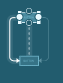
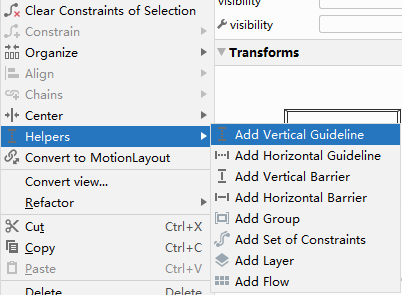

# 界面

* Android中所有的控件**都具有 `android:layout_width` 和`android:layout_height`** 两个属性，可选值有3种：`match_parent`、`fill_parent` 和 `wrap_content` ，其中 `match_parent` 和 `fill_parent` 的意义相同，现在官方更加推荐使用 `match_parent`
* 可以用 `|` 来同时指定多个值
* Android控件**都具有** **`android:visibility`** 属性
  * 属性
    * `visible` 表示控件是可见的，这个值是默认值，不指定android:visibility时，控件都是可见的。
    * `invisible` 表示控件不可见，但是它仍然占据着原来的位置和大小，可以理解成控件变成透明状态了
    * `gone` 表示控件不仅不可见，而且不再占用任何屏幕空间
  * 代码使用的是 `setVisibility()` 方法，可以传入 `View.VISIBLE`、`View.INVISIBLE` 和 `View.GONE`
  * 通过 `getVisibility()` 方法来判断是否可见
* **`android:gravity`**：用于指定**控件内容**在控件内部的对齐方式。适用于如 TextView、Button、EditText 等具有内部内容（文本、图像等）的控件，也适用于某些容器控件（如 LinearLayout、FrameLayout 等）
* **`android:layout_gravity`**：用于指定**控件自身**在父布局中的对齐方式。适用于任何作为子视图的控件，控制它们在父布局中的位置
    1. **水平对齐方式**
        - **`left`**：将控件放置在父容器的左侧
        - **`right`**：将控件放置在父容器的右侧
        - **`start`**：根据文本方向，将控件放置在起始位置（通常是左侧，支持国际化）
        - **`end`**：根据文本方向，将控件放置在结束位置（通常是右侧，支持国际化）
        - **`center_horizontal`**：将控件水平居中放置
    2. **垂直对齐方式**
        - **`top`**：将控件放置在父容器的顶部
        - **`bottom`**：将控件放置在父容器的底部
        - **`center_vertical`**：将控件垂直居中放置
    3. **综合对齐方式**
        - **`center`**：将控件在父容器的中心位置，既水平居中又垂直居中
        - **`fill`**：在水平和垂直方向上填满父容器（适用于 `FrameLayout`）

## 单位及转换

* Android中字体大小使用 `sp` 作为**单位**（比例无关像素）
* Android中布局尺寸使用 `dp` 作为**单位**（密度无关像素）
* 公式 `dp = px / (dpi / 160)`
* 常见的屏幕密度下的转换比例
    * mdpi（160 dpi）：dp = px / 1
    * hdpi（240 dpi）：dp = px / 1.5
    * xhdpi（320 dpi）：dp = px / 2
    * xxhdpi（480 dpi）：dp = px / 3
    * xxxhdpi（640 dpi）：dp = px / 4

## 视图大小

**1. 具体的尺寸**

当需要一个视图有固定的宽度或高度时，可以直接指定一个具体的尺寸。

`dp` 是一种密度无关像素，它会根据设备屏幕的密度进行缩放，确保在不同设备上的显示效果一致。

**示例**:
```xml
<TextView
    android:layout_width="200dp"
    android:layout_height="100dp"
    android:text="Fixed Size" />
```
在这个例子中，`TextView` 的宽度和高度被设置为 200dp 和 100dp。这意味着无论屏幕的密度如何，`TextView` 的宽度始终是 200dp，高度始终是 100dp。

**2. `wrap_content`**

当希望**视图的大小能够适应其内容的尺寸**时，可以使用 `wrap_content`。这会让视图的宽度或高度刚好适应其内容的大小。

**示例**:
```xml
<TextView
    android:layout_width="wrap_content"
    android:layout_height="wrap_content"
    android:text="Wrap Content" />
```
在这个例子中，`TextView` 的宽度和高度将调整为刚好包裹其内容的大小。如果 `TextView` 的内容是“一行文字”，则视图的宽度和高度将正好适应这一行文字的大小。

**3. `match_parent`**

当希望视图的宽度或高度能够**填满其父视图的剩余空间**时，可以使用 `match_parent`。这使得视图扩展到与父视图相同的大小。

**示例**:
```xml
<LinearLayout
    android:layout_width="match_parent"
    android:layout_height="match_parent">

    <TextView
        android:layout_width="match_parent"
        android:layout_height="wrap_content"
        android:text="Match Parent" />
</LinearLayout>
```
在这个例子中，`LinearLayout` 的宽度和高度都填满了其父视图的空间。`TextView` 的宽度也填满了 `LinearLayout` 的宽度，而高度则调整为适应内容的大小。

4. **`0dp` 和 `layout_weight`**

在 `LinearLayout` 中，`0dp` 结合 `layout_weight` 使用时，用于**动态分配剩余空间**。这种方法在有多个视图需要均匀分配空间时特别有用。

**示例**:
```xml
<LinearLayout
    android:layout_width="match_parent"
    android:layout_height="wrap_content">

    <TextView
        android:layout_width="0dp"
        android:layout_height="wrap_content"
        android:layout_weight="1"
        android:text="Weight 1" />

    <TextView
        android:layout_width="0dp"
        android:layout_height="wrap_content"
        android:layout_weight="2"
        android:text="Weight 2" />
</LinearLayout>
```
在这个例子中，`LinearLayout` 的宽度填满了父视图。两个 `TextView` 的宽度都设置为 `0dp`，并且通过 `layout_weight` 属性来分配剩余的宽度空间。第一个 `TextView` 的宽度将占据剩余空间的 1/3，而第二个 `TextView` 的宽度占据 2/3

## 控件

> demo05

### TextView

- **描述**: 用于显示静态文本。
- **属性**:
  - `android:text`：显示的文本内容
  - `android:textColor`：文本颜色
  - `android:textSize`：文本大小
  - `android:gravity`：文本对齐方式
  - `android:ellipsize`：处理文本过长时的显示方式
  - `android:includeFontPadding`：是否包含额外字体内边距的属性
- **可选属性值**:
  - `android:textColor`：`#000000`（黑色），`#FFFFFF`（白色），`@color/primary`（引用颜色资源）
  - `android:textSize`：`14sp`，`16sp`，`20sp`
  - `android:gravity`：`center`，`left`，`right`，`top`，`bottom`
  - `android:ellipsize`：`end`（结尾省略），`start`（开头省略），`middle`（中间省略），marquee（跑马灯效果）
- **示例**:
  ```xml
  <TextView
      android:layout_width="wrap_content"
      android:layout_height="wrap_content"
      android:text="Hello, World!"
      android:textColor="#000000"
      android:textSize="16sp"
      android:gravity="center" />
  ```
- **注意事项**:
  - `android:ellipsize` 用于文本过长时的处理
  - `android:includeFontPadding="false"` 可减少上下边距

### EditText

- **描述**: 用于接收用户输入的文本框
- **属性**:
  - `android:hint`：提示文本
  - `android:inputType`：输入类型
  - `android:maxLength`：最大输入长度
  - `android:maxLines`：设置文本控件显示的最大行数
  - `android:text`：默认文本
  - `android:imeOptions`：配置输入法的动作按钮和行为
- **可选属性值**:
  - `android:inputType`：`text`（普通文本），`number`（数字），`textPassword`（密码），`phone`（电话号码）
  - `android:imeOptions`：`actionDone`，`actionNext`，`actionSearch`
- **示例**:
  ```xml
  <EditText
      android:layout_width="match_parent"
      android:layout_height="wrap_content"
      android:hint="Enter your name"
      android:inputType="textPersonName"
      android:maxLength="20" />
  ```
- **注意事项**:
  - 确保输入类型和预期一致，例如使用 `textPassword` 保护敏感信息
  - 处理用户输入时注意数据验证和安全性

### Button

- **描述**: 可点击的按钮，用于触发事件
- **属性**:
  - `android:text`：按钮文本
  - `android:onClick`：点击事件处理方法
  - `android:background`：按钮背景
  - `android:enabled`：是否可用
  - `android:textAllCaps`：是否转换为全大写字母显示
- **可选属性值**:
  - `android:background`：`@color/primary`，`@drawable/button_background`
  - `android:textAllCaps`：`true`，`false`
  - `android:enabled`：`true`（启用），`false`（禁用）
- **示例**:
  ```xml
  <Button
      android:layout_width="wrap_content"
      android:layout_height="wrap_content"
      android:text="Submit"
      android:onClick="onSubmitClick"
      android:background="@drawable/button_background" />
  ```
- **注册监听器**
  1. 使用匿名类的方式
  2. 使用实现接口的方式
- **注意事项**:
  - 确保 `onClick` 方法已在相应的 Activity 或 Fragment 中定义。
  - 使用 `android:enabled="false"` 时，确保禁用状态有合适的视觉反馈。

```java
public class MainActivity extends AppCompatActivity implements View.OnClickListener {
    @Override
    protected void onCreate(Bundle savedInstanceState) {
        super.onCreate(savedInstanceState);
        setContentView(R.layout.activity_main);
        Button button = (Button) findViewById(R.id.button);
        button.setOnClickListener(this);
    }
    @Override
    public void onClick(View v) {
        switch (v.getId()) {
            case R.id.button:
                // 在此处添加逻辑
                break;
            default:
                break;
        }
    }
}
```

### ImageView

- **描述**: 用于显示图片的控件
- **属性**:
  - `android:src`：显示的图片资源
  - `android:scaleType`：图片缩放类型
  - `android:contentDescription`：无障碍描述
  - `android:tint`：颜色滤镜
- **可选属性值**:
  - `android:scaleType`：
    - `center`：居中显示
    - `centerCrop`：缩放并裁剪以填满视图
    - `fitCenter`：按比例缩放适应视图
    - `fitXY`：拉伸图片适应视图
  - `android:tint`：`@color/blue`，`#FF0000`
- **示例**:
  ```xml
  <ImageView
      android:layout_width="wrap_content"
      android:layout_height="wrap_content"
      android:src="@drawable/sample_image"
      android:scaleType="centerCrop"
      android:contentDescription="Sample Image" />
  ```
- **注意事项**:
  - 提供适当的 `android:contentDescription` 以提高无障碍支持
  - 使用合适的图片加载库（如 `Glide` 或 `Picasso`）处理大图，防止内存溢出

### ProgressBar

- **描述：**`ProgressBar` 用于显示进度状态。可以用作旋转进度指示器（不确定模式）或水平进度条（确定模式）。
- **属性：**
  
  - `android:progress`:
    - **类型**：integer
    - **可选值**：0 到 `max` 的值
    - **描述**：当前进度值，仅在确定模式下使用。
  - `android:max`:
    - **类型**：integer
    - **可选值**：大于 0 的值
    - **描述**：进度条的最大值，仅在确定模式下使用。
  - `android:style`:
    - **类型**：string
    - **可选值**： 
      - `?android:attr/progressBarStyle` 引用默认的 ProgressBar 样式
      - `?android:attr/progressBarStyleHorizontal` 引用水平进度条样式，用于显示确定模式的进度条
      - `?android:attr/progressBarStyleSmall` 引用小尺寸的进度条样式
      - `?android:attr/progressBarStyleLarge` 引用大尺寸的进度条样式
    - **描述**：进度条的样式。
  - `android:indeterminate`: 
    - **类型**：boolean
    - **可选值**：`true` 或 `false`（默认）
    - **描述**：是否使用不确定模式。设置为 `true` 时进度条会始终展示循环动画，表示后台任务正在进行；设置为 `false` 时显示水平进度条（需要设置 `progress` 和 `max`）
- **示例：**
  ```xml
  <ProgressBar
      android:id="@+id/progressBar"
      android:layout_width="wrap_content"
      android:layout_height="wrap_content"
      android:indeterminate="false" />
  ```
- **注意事项：**
- 在不确定模式下（`indeterminate="true"`），不需要设置 `progress` 和 `max`。
- 确定模式下（`indeterminate="false"`），务必设置 `progress` 和 `max` 以正确显示进度。
- `ProgressBar` 本身没有行为，通常需要与后台任务配合使用，例如使用 `AsyncTask`、`Handler` 或 `Thread`。


### AlertDialog

- **描述：**`AlertDialog` 是一个对话框控件，用于显示警告、确认或提示信息，常用于与用户交互。
- **属性：**
  - `setTitle(CharSequence title)`:
    - **类型**：String
    - **描述**：设置对话框的标题
  - `setMessage(CharSequence message)`:
    - **类型**：String
    - **描述**：设置对话框的消息内容
  - `setButton(int whichButton, CharSequence text, DialogInterface.OnClickListener listener)`:
    - **类型**：int, String, OnClickListener
    - **描述**：设置对话框的按钮和点击事件。`whichButton` 可以是 `DialogInterface.BUTTON_POSITIVE`、`DialogInterface.BUTTON_NEGATIVE` 或 `DialogInterface.BUTTON_NEUTRAL`
  - `setIcon(Drawable icon)`:
    - **类型**：Drawable
    - **描述**：设置对话框的图标
  - `setView(View view)`:
    - **类型**：View
    - **描述**：设置自定义的视图。
- **示例：**
  ```java
  public class MainActivity extends AppCompatActivity implements View.OnClickListener {

      @Override
      protected void onCreate(Bundle savedInstanceState) {
          super.onCreate(savedInstanceState);
          setContentView(R.layout.activity_main);

          Button button = findViewById(R.id.button);
          button.setOnClickListener(this);
      }

      @Override
      public void onClick(View v) {
          if (v.getId() == R.id.button) {
              showAlertDialog();
          }
      }

      private void showAlertDialog() {
          AlertDialog.Builder dialog = new AlertDialog.Builder(this);
          dialog.setTitle("This is Dialog");
          dialog.setMessage("Something important.");
          dialog.setCancelable(false);
          dialog.setPositiveButton("OK", (dialog1, which) -> {
              // Handle OK button click
          });
          dialog.setNegativeButton("Cancel", (dialog12, which) -> {
              // Handle Cancel button click
          });
          dialog.show();
      }
  }
  ```
- **注意事项：**
  - 对话框的样式和按钮文本可以根据需要进行自定义。
  - 在不同的 Android 版本中，对话框的外观可能有所不同，确保在设计时考虑到兼容性。

### ProgressDialog

ProgressDialog 在 API 级别 26（Android 8.0）之后逐渐被弃用，更建议使用自定义的 ProgressBar 或者使用其他的 Dialog 组件

### RecyclerView

- **描述**: 高效展示大数据集的列表控件，支持自定义布局。
- **属性**:
  - `android:layoutManager`：布局管理器类型。
  - `android:adapter`：数据适配器。
  - `android:clipToPadding`：是否剪裁内容到内边距。
- **可选属性值**:
  - `android:layoutManager`：
    - `LinearLayoutManager`：线性列表。
    - `GridLayoutManager`：网格布局。
    - `StaggeredGridLayoutManager`：错列网格布局。
  - `android:orientation`：`vertical`，`horizontal`（用于 `LinearLayoutManager`）。
- **示例**:
  ```xml
  <androidx.recyclerview.widget.RecyclerView
      android:layout_width="match_parent"
      android:layout_height="match_parent"
      android:id="@+id/recyclerView"
      android:clipToPadding="false" />
  ```
  ```java
  RecyclerView recyclerView = findViewById(R.id.recyclerView);
  recyclerView.setLayoutManager(new LinearLayoutManager(this));
  recyclerView.setAdapter(new MyAdapter(myDataList));
  ```
- **注意事项**:
  - 使用 `ViewHolder` 模式优化性能。
  - 确保数据集更新时调用适配器的 `notifyDataSetChanged()` 或其他更细粒度的更新方法。


### ListView

> demo06

#### 基本使用

**1. ListView 简介**

ListView 是 Android 中最常用的控件之一，用于展示大量数据。由于手机屏幕空间有限，ListView 允许用户通过滚动手指来查看不在当前屏幕显示的数据。例如，在 QQ 聊天记录或微博消息中，ListView 都是常用的实现方式。

**2. ListView 的基本使用步骤**

**（1）创建一个 ListView 项目**

首先，在 Android Studio 中新建一个项目 `demo06`，并让 Android Studio 自动生成活动。接着，修改布局文件 `activity_main.xml`，在其中添加一个 `ListView` 控件：

```xml
<LinearLayout xmlns:android="http://schemas.android.com/apk/res/android"
    android:layout_width="match_parent"
    android:layout_height="match_parent">
    <ListView
        android:id="@+id/list_view"
        android:layout_width="match_parent"
        android:layout_height="match_parent" />
</LinearLayout>
```

- **布局解释**：在 `LinearLayout` 布局中，添加了一个 `ListView` 控件，并为其指定 `id` 为 `@+id/list_view`。同时，设置宽度和高度为 `match_parent`，使得 `ListView` 占满整个屏幕空间。

**（2）在 `MainActivity` 中绑定数据**


接下来，修改 `MainActivity` 的代码，准备数据并将其与 `ListView` 绑定。

```java
public class MainActivity extends AppCompatActivity {
    private String[] data = { "Apple", "Banana", "Orange", "Watermelon",
        "Pear", "Grape", "Pineapple", "Strawberry", "Cherry", "Mango",
        "Apple", "Banana", "Orange", "Watermelon", "Pear", "Grape",
        "Pineapple", "Strawberry", "Cherry", "Mango" };

    @Override
    protected void onCreate(Bundle savedInstanceState) {
        super.onCreate(savedInstanceState);
        setContentView(R.layout.activity_main);
        
        // 使用 ArrayAdapter 适配器
        ArrayAdapter<String> adapter = new ArrayAdapter<String>(
            MainActivity.this, android.R.layout.simple_list_item_1, data);
        
        // 获取 ListView 实例，并设置适配器
        ListView listView = (ListView) findViewById(R.id.list_view);
        listView.setAdapter(adapter);
    }
}
```

- **数据准备**：使用了一个字符串数组 `data`，其中包含了一系列水果的名称作为测试数据。在实际应用中，数据可以从网络或数据库中获取。  
- **适配器**：由于 `ListView` 需要借助适配器来展示数据，Android 提供了多种适配器的实现。
    - 其中 `ArrayAdapter` 是最常用的一个适配器，用于将数组或列表中的数据绑定到 `ListView` 中。使用泛型指定数据类型为 `String`，并通过构造函数传入上下文、**布局资源 `android.R.layout.simple_list_item_1`**
    - `android.R.layout.simple_list_item_1`：**Android 内置的布局文件，包含一个 `TextView`和要显示的数据 `data`**
- **设置适配器**：通过 `setAdapter()` 方法将适配器对象传递给 `ListView`，从而完成 `ListView` 与数据的关联

#### 定制ListView的界面

为了让 `ListView` 显示更丰富的内容（如水果名称旁边显示对应的图片），需要进行以下步骤：定义实体类、创建自定义布局、编写自定义适配器、初始化数据并绑定到 `ListView`。

**1. 创建实体类 `Fruit`**

首先，定义一个实体类 `Fruit`，用于表示水果的名称和图片。代码如下：

```java
public class Fruit {
    private String name;
    private int imageId;

    public Fruit(String name, int imageId) {
        this.name = name;
        this.imageId = imageId;
    }

    public String getName() {
        return name;
    }

    public int getImageId() {
        return imageId;
    }
}
```

- **字段解释**：
  - `name`：表示水果名称。
  - `imageId`：表示水果图片的资源 ID。
  
**2. 定义自定义布局 `fruit_item.xml`**

为了显示水果图片和名称，需要创建一个自定义布局。在 `layout` 目录下新建 `fruit_item.xml`，代码如下：

```xml
<LinearLayout xmlns:android="http://schemas.android.com/apk/res/android"
    android:layout_width="match_parent"
    android:layout_height="wrap_content">
    <ImageView
        android:id="@+id/fruit_image"
        android:layout_width="wrap_content"
        android:layout_height="wrap_content" />
    <TextView
        android:id="@+id/fruit_name"
        android:layout_width="wrap_content"
        android:layout_height="wrap_content"
        android:layout_gravity="center_vertical"
        android:layout_marginLeft="10dp" />
</LinearLayout>
```

- **布局结构**：
  - `ImageView` 用于显示水果图片。
  - `TextView` 用于显示水果名称，并设置了左侧间距和垂直居中显示。

**3. 创建自定义适配器 `FruitAdapter`**

自定义适配器需要继承自 `ArrayAdapter`，并重写 `getView()` 方法来处理每个子项的显示。代码如下：

```java
public class FruitAdapter extends ArrayAdapter<Fruit> {
    private int resourceId;

    public FruitAdapter(Context context, int textViewResourceId, List<Fruit> objects) {
        super(context, textViewResourceId, objects);
        resourceId = textViewResourceId;
    }

    @Override
    public View getView(int position, View convertView, ViewGroup parent) {
        Fruit fruit = getItem(position); // 获取当前项的 Fruit 实例
        View view = LayoutInflater.from(getContext()).inflate(resourceId, parent, false);
        ImageView fruitImage = (ImageView) view.findViewById(R.id.fruit_image);
        TextView fruitName = (TextView) view.findViewById(R.id.fruit_name);
        fruitImage.setImageResource(fruit.getImageId()); // 设置水果图片
        fruitName.setText(fruit.getName()); // 设置水果名称
        return view;
    }
}
```

- **适配器解析**：
  - `resourceId`：存储布局的资源 ID。
  - `getView()`：用于加载每个子项的布局，并设置显示内容。`inflate()` 方法将布局加载进来，并通过 `findViewById()` 方法获取布局中的 `ImageView` 和 `TextView`，然后为其设置图片和文本。

**4. 初始化数据并绑定适配器**

在 `MainActivity` 中，初始化水果数据，并使用自定义适配器绑定数据到 `ListView`。代码如下：

```java
public class MainActivity extends AppCompatActivity {
    private List<Fruit> fruitList = new ArrayList<>();

    @Override
    protected void onCreate(Bundle savedInstanceState) {
        super.onCreate(savedInstanceState);
        setContentView(R.layout.activity_main);
        initFruits(); // 初始化水果数据
        FruitAdapter adapter = new FruitAdapter(MainActivity.this,
            R.layout.fruit_item, fruitList);
        ListView listView = (ListView) findViewById(R.id.list_view);
        listView.setAdapter(adapter);
    }

    private void initFruits() {
        for (int i = 0; i < 2; i++) { // 循环两遍以填充更多数据
            Fruit apple = new Fruit("Apple", R.drawable.apple_pic);
            fruitList.add(apple);
            Fruit banana = new Fruit("Banana", R.drawable.banana_pic);
            fruitList.add(banana);
            Fruit orange = new Fruit("Orange", R.drawable.orange_pic);
            fruitList.add(orange);
            Fruit watermelon = new Fruit("Watermelon", R.drawable.watermelon_pic);
            fruitList.add(watermelon);
            Fruit pear = new Fruit("Pear", R.drawable.pear_pic);
            fruitList.add(pear);
            Fruit grape = new Fruit("Grape", R.drawable.grape_pic);
            fruitList.add(grape);
            Fruit pineapple = new Fruit("Pineapple", R.drawable.pineapple_pic);
            fruitList.add(pineapple);
            Fruit strawberry = new Fruit("Strawberry", R.drawable.strawberry_pic);
            fruitList.add(strawberry);
            Fruit cherry = new Fruit("Cherry", R.drawable.cherry_pic);
            fruitList.add(cherry);
            Fruit mango = new Fruit("Mango", R.drawable.mango_pic);
            fruitList.add(mango);
        }
    }
}
```

- **初始化水果数据**：在 `initFruits()` 方法中，为每个水果创建一个 `Fruit` 对象，并传入水果名称和对应的图片资源 ID。将这些水果对象添加到 `fruitList` 中。为了填充更多数据，使用了循环将所有水果数据重复添加两次。
- **绑定适配器**：在 `onCreate()` 方法中，创建 `FruitAdapter` 对象，并将其作为适配器传递给 `ListView`，从而完成数据绑定。

#### 优化及点击事件

**1. 问题描述**

ListView 是 Android 开发中常用的控件，但在实际使用中，默认实现的性能较低，特别是在快速滚动时，频繁加载布局导致效率低下。优化主要集中在两点：
- **布局的重复加载**。
- **控件实例的重复查找**。

**2. 首次优化：重用 `convertView`**

`getView()` 方法中有一个 `convertView` 参数，它的作用是缓存之前加载的布局，从而避免每次都重新加载布局。在没有优化之前，每次滚动都会加载一次新布局，造成性能瓶颈。

**优化后的代码：**
```java
public class FruitAdapter extends ArrayAdapter<Fruit> {
    @Override
    public View getView(int position, View convertView, ViewGroup parent) {
        Fruit fruit = getItem(position);
        View view;
        if (convertView == null) {
            view = LayoutInflater.from(getContext()).inflate(resourceId, parent, false);
        } else {
            view = convertView;
        }
        ImageView fruitImage = (ImageView) view.findViewById(R.id.fruit_image);
        TextView fruitName = (TextView) view.findViewById(R.id.fruit_name);
        fruitImage.setImageResource(fruit.getImageId());
        fruitName.setText(fruit.getName());
        return view;
    }
}
```

**关键点：**
- 判断 `convertView` 是否为 `null`：
  - `null` 时，加载新布局。
  - 不为 `null` 时，重用已有的布局。
  
这样，避免了重复加载布局，提高了性能。

**3. 进一步优化：使用 `ViewHolder`**

虽然重用了 `convertView`，但每次 `getView()` 仍会通过 `findViewById()` 查找控件，查找控件也是一个耗时操作。为此，可以使用 `ViewHolder` 来缓存控件实例，进一步提升效率。

**优化后的代码：**
```java
public class FruitAdapter extends ArrayAdapter<Fruit> {
    @Override
    public View getView(int position, View convertView, ViewGroup parent) {
        Fruit fruit = getItem(position);
        View view;
        ViewHolder viewHolder;
        if (convertView == null) {
            view = LayoutInflater.from(getContext()).inflate(resourceId, parent, false);
            viewHolder = new ViewHolder();
            viewHolder.fruitImage = (ImageView) view.findViewById(R.id.fruit_image);
            viewHolder.fruitName = (TextView) view.findViewById(R.id.fruit_name);
            view.setTag(viewHolder); // 将 ViewHolder 存储在 View 中
        } else {
            view = convertView;
            viewHolder = (ViewHolder) view.getTag(); // 重新获取 ViewHolder
        }
        viewHolder.fruitImage.setImageResource(fruit.getImageId());
        viewHolder.fruitName.setText(fruit.getName());
        return view;
    }

    class ViewHolder {
        ImageView fruitImage;
        TextView fruitName;
    }
}
```

**关键点：**
- **ViewHolder 内部类**：用于缓存控件实例，如 `ImageView` 和 `TextView`。
- **`setTag()` 和 `getTag()`**：将 `ViewHolder` 与 `View` 关联，从而避免每次都调用 `findViewById()`。

通过 `ViewHolder` 缓存控件实例，进一步减少了资源开销，提升了滚动性能。

**4. 点击事件监听**

优化性能后，还需要实现用户点击 ListView 子项时能够响应事件。在 `MainActivity` 中，可以通过 `setOnItemClickListener()` 方法为 `ListView` 注册一个监听器，从而处理用户点击事件。

**代码示例：**
```java
public class MainActivity extends AppCompatActivity {
    private List<Fruit> fruitList = new ArrayList<>();

    @Override
    protected void onCreate(Bundle savedInstanceState) {
        super.onCreate(savedInstanceState);
        setContentView(R.layout.activity_main);
        initFruits(); // 初始化水果数据
        FruitAdapter adapter = new FruitAdapter(MainActivity.this, R.layout.fruit_item, fruitList);
        ListView listView = (ListView) findViewById(R.id.list_view);
        listView.setAdapter(adapter);

        // 设置点击事件监听器
        listView.setOnItemClickListener(new AdapterView.OnItemClickListener() {
            @Override
            public void onItemClick(AdapterView<?> parent, View view, int position, long id) {
                Fruit fruit = fruitList.get(position); // 获取点击的水果
                Toast.makeText(MainActivity.this, fruit.getName(), Toast.LENGTH_SHORT).show(); // 显示水果名称
            }
        });
    }
}
```

**关键点：**
- **`setOnItemClickListener()`**：为 ListView 注册点击事件监听器。
- **`onItemClick()`**：通过 `position` 获取点击的子项，并通过 `Toast` 显示其信息。

### RecyclerView

> demo07

#### 基本使用

**1. ListView 的贡献与局限**

在早期的 Android 开发中，**ListView** 功能强大，被广泛使用。然而，它并不是完美的，有以下局限性：
- **性能问题**：如果没有进行优化，ListView 的性能会较差，尤其是在数据量大的情况下。
- **扩展性不足**：ListView 仅支持纵向滚动，无法实现横向滚动的效果。

为了解决这些问题，Android 提供了一个更强大的滚动控件——**RecyclerView**。RecyclerView 不仅能实现 ListView 的效果，还优化了其不足，支持更多布局方式，成为官方推荐的列表控件。

**2. RecyclerView 的基本用法**

**（1）添加 RecyclerView 依赖**

RecyclerView 属于 Android 支持库的一部分，为了在所有 Android 版本上使用 RecyclerView，需要在 `build.gradle` 文件中添加依赖：
```gradle
dependencies {
   implementation 'androidx.recyclerview:recyclerview:1.2.1'
}
```
添加完依赖后，点击 **Sync Now** 进行同步。

**（2）布局文件中添加 RecyclerView**

在 `activity_main.xml` 中，添加 RecyclerView 控件：
```xml
<LinearLayout xmlns:android="http://schemas.android.com/apk/res/android"
    android:layout_width="match_parent"
    android:layout_height="match_parent">

    <androidx.recyclerview.widget.RecyclerView
        android:id="@+id/recycler_view"
        android:layout_width="match_parent"
        android:layout_height="match_parent"/>
</LinearLayout>
```
这里需要注意，RecyclerView 并不是系统 SDK 的内置控件，因此要写完整的包路径

**3. 准备数据和适配器**

首先，定义适配器 **FruitAdapter** 继承自 `RecyclerView.Adapter`，并指定泛型为自定义的 `ViewHolder`

由于FruitAdapter是继承自`RecyclerView.Adapter`的，那么就必须重写`onCreateViewHolder()`、`onBindViewHolder()`和`getItemCount()`这3个方法

为了展示数据，RecyclerView 需要一个适配器，并且通常需要一个 **ViewHolder** 类来缓存子视图，**ViewHolder** 内部类负责缓存子视图，避免每次都调用 `findViewById()`

1. **onCreateViewHolder()**: 创建 ViewHolder 实例，并将布局传递进去
2. **onBindViewHolder()**: 将数据绑定到 ViewHolder，RecyclerView 滚动时调用
3. **getItemCount()**: 返回数据项的数量

```java
public class FruitAdapter extends RecyclerView.Adapter<FruitAdapter.ViewHolder> {
    private List<Fruit> mFruitList;

    static class ViewHolder extends RecyclerView.ViewHolder {
        ImageView fruitImage;
        TextView fruitName;

        public ViewHolder(View view) {
            super(view);
            fruitImage = view.findViewById(R.id.fruit_image);
            fruitName = view.findViewById(R.id.fruit_name);
        }
    }

    public FruitAdapter(List<Fruit> fruitList) {
        mFruitList = fruitList;
    }

    @Override
    public ViewHolder onCreateViewHolder(ViewGroup parent, int viewType) {
        View view = LayoutInflater.from(parent.getContext()).inflate(R.layout.fruit_item, parent, false);
        return new ViewHolder(view);
    }

    @Override
    public void onBindViewHolder(ViewHolder holder, int position) {
        Fruit fruit = mFruitList.get(position);
        holder.fruitImage.setImageResource(fruit.getImageId());
        holder.fruitName.setText(fruit.getName());
    }

    @Override
    public int getItemCount() {
        return mFruitList.size();
    }
}
```

**4. 在 Activity 中使用 RecyclerView**

**（1）初始化数据**

在 `MainActivity` 中定义水果列表数据，创建 `initFruits()` 方法用于初始化数据：
```java
public class MainActivity extends AppCompatActivity {
    private List<Fruit> fruitList = new ArrayList<>();
    @Override
    protected void onCreate(Bundle savedInstanceState) {
        super.onCreate(savedInstanceState);
        setContentView(R.layout.activity_main);
        initFruits(); // 初始化水果数据
        RecyclerView recyclerView=(RecyclerView)findViewById(R.id.recycler view);
        LinearLayoutManager layoutManager = new LinearLayoutManager(this);
        recyclerView.setLayoutManager(layoutManager);
        FruitAdapter adapter = new FruitAdapter(fruitList);
        recyclerView.setAdapter(adapter);
    }
    private void initFruits() {
        for (int i = 0; i < 2; i++) {
            Fruit apple = new Fruit("Apple", R.drawable.apple pic);
            fruitList.add(apple);
            Fruit banana = new Fruit("Banana", R.drawable.banana pic);
            fruitList.add(banana);
            Fruit orange = new Fruit("Orange", R.drawable.orange pic);
            fruitList.add(orange);
            Fruit watermelon = new Fruit("Watermelon", R.drawable.watermelon pic);
            fruitList.add(watermelon);
            Fruit pear = new Fruit("Pear", R.drawable.pear pic);
            fruitList.add(pear);
            Fruit grape = new Fruit("Grape", R.drawable.grape pic);
            fruitList.add(grape);
            Fruit pineapple = new Fruit("Pineapple", R.drawable.pineapple pic);
            fruitList.add(pineapple);
            Fruit strawberry = new Fruit("Strawberry", R.drawable.strawberry pic);
            fruitList.add(strawberry);
            Fruit cherry = new Fruit("Cherry", R.drawable.cherry pic);
            fruitList.add(cherry);
            Fruit mango = new Fruit("Mango", R.drawable.mango pic);
            fruitList.add(mango);
        }
    }
}
```

**（2）设置 RecyclerView 和适配器**

在 `onCreate()` 方法中：

1. 获取 RecyclerView 实例
2. 创建并设置 `LinearLayoutManager` 来管理布局，指定为线性布局
3. 创建 `FruitAdapter` 实例并设置适配器

`LinearLayoutManager` 用于指定 RecyclerView 的布局方式，这里实现了和 ListView 类似的线性布局效果

通过 `setLayoutManager()` 设置管理器，可以控制 RecyclerView 的滚动方向。

```java
public class MainActivity extends AppCompatActivity {
    private List<Fruit> fruitList = new ArrayList<>();

    @Override
    protected void onCreate(Bundle savedInstanceState) {
        super.onCreate(savedInstanceState);
        setContentView(R.layout.activity_main);
        initFruits(); // 初始化水果数据

        RecyclerView recyclerView = findViewById(R.id.recycler_view);
        LinearLayoutManager layoutManager = new LinearLayoutManager(this);
        recyclerView.setLayoutManager(layoutManager);

        FruitAdapter adapter = new FruitAdapter(fruitList);
        recyclerView.setAdapter(adapter);
    }
}
```

#### 横向滚动

**1. 修改布局文件**

首先，需要对 `fruit_item.xml` 布局进行修改，使其适应横向滚动。当前布局中，元素是水平排列的，适用于纵向滚动。为了适应横向滚动，将元素调整为垂直排列，并设置固定宽度，以保证每个子项的宽度一致。

1. **垂直方向排列**：将 `LinearLayout` 的 `android:orientation` 属性设置为 `"vertical"`，确保 `ImageView` 和 `TextView` 垂直排列。
2. **固定宽度**：将布局的宽度设置为固定值 `100dp`，避免因不同水果名称长度导致子项宽度不一致。如果使用 `wrap_content`，子项会根据内容自动调整宽度，效果不美观；而使用 `match_parent` 会导致每个子项占满整个屏幕。
3. **居中显示**：通过 `layout_gravity="center_horizontal"`，让图片和文字在水平居中显示，同时添加 `layout_marginTop` 属性，调整文字与图片之间的距离。

```xml
<LinearLayout xmlns:android="http://schemas.android.com/apk/res/android"
    android:orientation="vertical"
    android:layout_width="100dp"
    android:layout_height="wrap_content" >

    <ImageView
        android:id="@+id/fruit_image"
        android:layout_width="wrap_content"
        android:layout_height="wrap_content"
        android:layout_gravity="center_horizontal" />

    <TextView
        android:id="@+id/fruit_name"
        android:layout_width="wrap_content"
        android:layout_height="wrap_content"
        android:layout_gravity="center_horizontal"
        android:layout_marginTop="10dp" />
</LinearLayout>
```

**2. 修改 MainActivity 实现横向滚动**

接下来，只需在 `MainActivity` 中做很小的调整，设置 RecyclerView 的布局方向为横向滚动。

1. **设置横向滚动**：通过 `LinearLayoutManager` 的 `setOrientation()` 方法，将布局方向设置为 **横向** (`LinearLayoutManager.HORIZONTAL`)。如果不设置，默认是纵向滚动 (`LinearLayoutManager.VERTICAL`)。
2. **保持其他逻辑不变**：RecyclerView 的适配器和其他初始化逻辑无需改变，依然和实现纵向滚动时相同。

```java
public class MainActivity extends AppCompatActivity {
    private List<Fruit> fruitList = new ArrayList<>();

    @Override
    protected void onCreate(Bundle savedInstanceState) {
        super.onCreate(savedInstanceState);
        setContentView(R.layout.activity_main);
        initFruits(); // 初始化水果数据

        RecyclerView recyclerView = findViewById(R.id.recycler_view);
        LinearLayoutManager layoutManager = new LinearLayoutManager(this);
        layoutManager.setOrientation(LinearLayoutManager.HORIZONTAL); // 设置为横向布局
        recyclerView.setLayoutManager(layoutManager);

        FruitAdapter adapter = new FruitAdapter(fruitList);
        recyclerView.setAdapter(adapter);
    }

    // 初始化水果数据的方法略...
}
```

#### 瀑布流布局

ListView 的局限性体现在其布局排列是固定的，由 ListView 自身管理，无法轻松定制复杂的布局。

**RecyclerView** 的强大在于其设计上的灵活性，它将布局管理的任务交给了 **LayoutManager**，通过实现不同的 LayoutManager 子类，子类只要按照接口的规范来实现，就能定制出各种不同排列方式的布局

RecyclerView 内置了几种常用的布局管理器，如 **LinearLayoutManager（线性布局）**、**GridLayoutManager（网格布局）**和 **StaggeredGridLayoutManager（瀑布流布局）**

**1. 修改布局文件**

为了适应瀑布流布局，需要对 `fruit_item.xml` 进行一些小的调整。

1. **宽度设为 `match_parent`**：不同于之前的固定宽度，瀑布流布局要求子项宽度根据列数自动适应，因此使用 `match_parent` 而不是 `100dp`。
2. **子项间距**：通过 `layout_margin="5dp"`，为每个子项设置一定的间距，避免它们紧贴在一起。
3. **文字左对齐**：将 `TextView` 的 `layout_gravity` 设置为 `left`，因为接下来会生成不同长度的水果名称，居左对齐会让布局看起来更加合理。

```xml
<LinearLayout xmlns:android="http://schemas.android.com/apk/res/android"
    android:orientation="vertical"
    android:layout_width="match_parent"
    android:layout_height="wrap_content"
    android:layout_margin="5dp" >

    <ImageView
        android:id="@+id/fruit_image"
        android:layout_width="wrap_content"
        android:layout_height="wrap_content"
        android:layout_gravity="center_horizontal" />

    <TextView
        android:id="@+id/fruit_name"
        android:layout_width="wrap_content"
        android:layout_height="wrap_content"
        android:layout_gravity="left"
        android:layout_marginTop="10dp" />
</LinearLayout>
```


**2. 修改 MainActivity 实现瀑布流布局**

接下来，在 `MainActivity` 中进行代码调整，使用 **StaggeredGridLayoutManager** 来实现瀑布流效果。

1. **瀑布流布局的设置**：创建 **StaggeredGridLayoutManager** 实例，传入两个参数，将这个布局管理器设置给 RecyclerView 后，即可实现瀑布流效果
   - `3` 表示将布局分为 3 列
   - `StaggeredGridLayoutManager.VERTICAL` 表示布局排列方向为 **纵向**
2. **随机长度的水果名称**：通过 `getRandomLengthName()` 方法生成随机长度的水果名称，确保每个子项的高度不一致，使得瀑布流效果更加明显

```java
public class MainActivity extends AppCompatActivity {
    private List<Fruit> fruitList = new ArrayList<>();

    @Override
    protected void onCreate(Bundle savedInstanceState) {
        super.onCreate(savedInstanceState);
        setContentView(R.layout.activity_main);
        initFruits(); // 初始化水果数据

        RecyclerView recyclerView = findViewById(R.id.recycler_view);
        StaggeredGridLayoutManager layoutManager = 
            new StaggeredGridLayoutManager(3, StaggeredGridLayoutManager.VERTICAL);
        recyclerView.setLayoutManager(layoutManager);

        FruitAdapter adapter = new FruitAdapter(fruitList);
        recyclerView.setAdapter(adapter);
    }

    private void initFruits() {
        for (int i = 0; i < 2; i++) {
            fruitList.add(new Fruit(getRandomLengthName("Apple"), R.drawable.apple_pic));
            fruitList.add(new Fruit(getRandomLengthName("Banana"), R.drawable.banana_pic));
            fruitList.add(new Fruit(getRandomLengthName("Orange"), R.drawable.orange_pic));
            fruitList.add(new Fruit(getRandomLengthName("Watermelon"), R.drawable.watermelon_pic));
            fruitList.add(new Fruit(getRandomLengthName("Pear"), R.drawable.pear_pic));
            fruitList.add(new Fruit(getRandomLengthName("Grape"), R.drawable.grape_pic));
            fruitList.add(new Fruit(getRandomLengthName("Pineapple"), R.drawable.pineapple_pic));
            fruitList.add(new Fruit(getRandomLengthName("Strawberry"), R.drawable.strawberry_pic));
            fruitList.add(new Fruit(getRandomLengthName("Cherry"), R.drawable.cherry_pic));
            fruitList.add(new Fruit(getRandomLengthName("Mango"), R.drawable.mango_pic));
        }
    }

    private String getRandomLengthName(String name) {
        Random random = new Random();
        int length = random.nextInt(20) + 1;
        StringBuilder builder = new StringBuilder();
        for (int i = 0; i < length; i++) {
            builder.append(name);
        }
        return builder.toString();
    }
}
```

#### 点击事件

RecyclerView 没有提供类似 `setOnItemClickListener()` 的方法，而是要求为子项中的具体控件单独注册点击事件。虽然在实现上稍微复杂一些，但这种设计更灵活，也更加人性化。

**ListView 的局限**  

在 ListView 中，`setOnItemClickListener()` 注册的是整个子项的点击事件。如果希望为子项中的某个具体控件（比如按钮）设置点击事件，虽然可以实现，但需要更多的额外处理。这并不方便。

**RecyclerView 的优势**  

RecyclerView 通过完全摒弃子项点击事件的监听器，让开发者自由选择在哪个控件上注册点击事件。这样可以轻松为 RecyclerView 的子项中的任意控件或布局注册不同的点击事件。

**在 RecyclerView 中注册点击事件**

通过修改 `FruitAdapter` 实现子项和具体控件的点击事件。

```java
// FruitAdapter.java
public class FruitAdapter extends RecyclerView.Adapter<FruitAdapter.ViewHolder> {
    private List<Fruit> mFruitList;

    static class ViewHolder extends RecyclerView.ViewHolder {
        View fruitView;
        ImageView fruitImage;
        TextView fruitName;

        public ViewHolder(View view) {
            super(view);
            fruitView = view;
            fruitImage = (ImageView) view.findViewById(R.id.fruit_image);
            fruitName = (TextView) view.findViewById(R.id.fruit_name);
        }
    }

    public FruitAdapter(List<Fruit> fruitList) {
        mFruitList = fruitList;
    }

    @Override
    public ViewHolder onCreateViewHolder(ViewGroup parent, int viewType) {
        View view = LayoutInflater.from(parent.getContext())
                                  .inflate(R.layout.fruit_item, parent, false);
        final ViewHolder holder = new ViewHolder(view);

        // 为整个子项布局注册点击事件
        holder.fruitView.setOnClickListener(new View.OnClickListener() {
            @Override
            public void onClick(View v) {
                int position = holder.getAdapterPosition();
                Fruit fruit = mFruitList.get(position);
                Toast.makeText(v.getContext(), "You clicked view " + fruit.getName(),
                               Toast.LENGTH_SHORT).show();
            }
        });

        // 为ImageView单独注册点击事件
        holder.fruitImage.setOnClickListener(new View.OnClickListener() {
            @Override
            public void onClick(View v) {
                int position = holder.getAdapterPosition();
                Fruit fruit = mFruitList.get(position);
                Toast.makeText(v.getContext(), "You clicked image " + fruit.getName(),
                               Toast.LENGTH_SHORT).show();
            }
        });

        return holder;
    }

    @Override
    public void onBindViewHolder(ViewHolder holder, int position) {
        Fruit fruit = mFruitList.get(position);
        holder.fruitImage.setImageResource(fruit.getImageId());
        holder.fruitName.setText(fruit.getName());
    }

    @Override
    public int getItemCount() {
        return mFruitList.size();
    }
}
```

**1. 自定义 ViewHolder**

在 `ViewHolder` 中，添加了一个 `fruitView` 变量，用于保存子项布局的最外层 `View`。同时，通过 `findViewById()` 获取 `ImageView` 和 `TextView` 的实例。

**2. 注册点击事件**

- **为子项布局注册点击事件**：在 `onCreateViewHolder()` 方法中，为 `fruitView` 注册点击事件。这意味着无论点击子项的哪个区域（除了有独立点击事件的控件），都会触发这个事件。
  
- **为具体控件注册点击事件**：这里还为 `ImageView` 单独注册了点击事件。点击图片时，会触发该事件，而不会触发整个子项的点击事件。

**3. 事件处理逻辑**

每次点击时，都会通过 `holder.getAdapterPosition()` 获取当前点击位置的 `position`，然后通过 `mFruitList.get(position)` 获取对应的 `Fruit` 实例，最后通过 `Toast` 显示对应的消息。

运行程序后，点击不同部分会触发不同的事件：

- 点击 **香蕉图片**，会触发 `ImageView` 的点击事件，显示对应消息。
- 点击 **菠萝的文字部分**，由于 `TextView` 没有注册点击事件，所以点击事件会被整个子项布局捕获。

### 自定义控件

> demo05

所有控件都是直接或间接继承自View的，所用的所有布局都是直接或间接继承自ViewGroup的。

View是Android中最基本的一种UI组件，它可以在屏幕上绘制一块矩形区域，并能响应这块区域的各种事件，因此，各种控件其实就是在View的基础之上又添加了各自特有的功能。

ViewGroup是一种特殊的View，它可以包含很多子View和子ViewGroup，是一个用于放置控件和布局的容器。


**（1）引入布局**

**1. 创建布局文件 `title.xml`**

在 `res/layout` 目录下创建一个新的布局文件 `title.xml`，用于定义标题栏的 UI。以下是一个简单的标题栏布局示例：

```xml
<!-- res/layout/title.xml -->
<LinearLayout xmlns:android="http://schemas.android.com/apk/res/android"
    android:layout_width="match_parent"
    android:layout_height="wrap_content"
    android:orientation="horizontal"
    android:padding="10dp"
    android:background="#ff6200ee">

    <TextView
        android:id="@+id/title_text"
        android:layout_width="0dp"
        android:layout_height="wrap_content"
        android:layout_weight="1"
        android:text="Title"
        android:textSize="20sp"
        android:textColor="#ffffff"/>

    <Button
        android:id="@+id/title_button"
        android:layout_width="wrap_content"
        android:layout_height="wrap_content"
        android:text="Button"
        android:textColor="#ffffff"/>
</LinearLayout>
```

**2. 引入布局**

```xml
<!-- res/layout/custom_layout.xml -->
<LinearLayout xmlns:android="http://schemas.android.com/apk/res/android"
    android:layout_width="match_parent"
    android:layout_height="match_parent" >
    <include layout="@layout/title" />
</LinearLayout>
```

**3. 隐藏系统标题栏**

```java
// CustomView
public class MainActivity extends AppCompatActivity {
    @Override
    protected void onCreate(Bundle savedInstanceState) {
        super.onCreate(savedInstanceState);
        setContentView(R.layout.activity_main);
        ActionBar actionbar = getSupportActionBar();
        if (actionbar ! = null) {
            actionbar.hide();
        }
    }
}
```

**(2) 创建自定义控件**

**1. 创建 `TitleLayout` 类**

首先，创建一个新的 Java 类 `TitleLayout`，并继承自 `LinearLayout`。

在该类中，重写 `LinearLayout` 带有两个参数的构造函数（`Context` 和 `AttributeSet`），并使用 `LayoutInflater` 来动态加载布局。

通过 `LayoutInflater` 的 `from()` 方法可以构建出一个`LayoutInflater`对象，然后调用`inflate()`方法就可以动态加载一个布局文件

`inflate()`方法接收两个参数，第一个参数是要加载的布局文件的id，第二个参数是给加载好的布局再添加一个父布局

```java
package com.example.demo05;

import android.content.Context;
import android.util.AttributeSet;
import android.view.LayoutInflater;
import android.widget.LinearLayout;

public class TitleLayout extends LinearLayout {
    public TitleLayout(Context context, AttributeSet attrs) {
        super(context, attrs);
        // // 动态加载自定义布局
        LayoutInflater.from(context).inflate(R.layout.title, this);

        Button titleBack = (Button) findViewById(R.id.title back);
        Button titleEdit = (Button) findViewById(R.id.title edit);
        titleBack.setOnClickListener(new OnClickListener() {
            @Override
            public void onClick(View v) {
                ((Activity) getContext()).finish();
            }
        });
        titleEdit.setOnClickListener(new OnClickListener() {
            @Override
            public void onClick(View v) {
                Toast.makeText(getContext(), "You clicked Edit button",
                    Toast.LENGTH SHORT).show();
            }
        });
    }
}
```


**2. 添加自定义控件**

```xml
<!-- res/layout/custom_layout.xml -->
<LinearLayout xmlns:android="http://schemas.android.com/apk/res/android"
    android:layout_width="match_parent"
    android:layout_height="match_parent" >
    <com.example.uicustomviews.TitleLayout
        android:layout_width="match_parent"
        android:layout_height="wrap_content" />
</LinearLayout>
```

## 布局

### LinearLayout 线性布局

- **描述**: 线性布局按指定的方向（水平或垂直）排列子视图
- **重要属性**:
  - **`android:orientation`**: 布局的方向，`horizontal`(水平)(默认) 或 `vertical`
  - **`android:gravity`**: 指定**控件内容**在控件内部的对齐方式
  - **`android:layout_gravity`**: 指定**控件自身**在父布局中的对齐方式
    - **需要注意 LinearLayout 的排列方向对 android:layout_gravity 的影响**
      - 水平排列 (`orientation="horizontal"`)：`android:layout_gravity` 只有垂直方向的对齐方式有效，因为子控件会水平排列，水平方向上每个控件的长度不固定。
      - 垂直排列 (`orientation="vertical"`)：`android:layout_gravity` 只有水平方向的对齐方式有效，因为子控件会垂直排列，垂直方向上每个控件的高度不固定。
  - **`android:layout_weight`**:  用于在 LinearLayout 布局中分配子控件的剩余空间
    - 这样控件的宽度或高度不再仅由 `android:layout_width` 或 `android:layout_height` 来决定，而是通过权重（`layout_weight`）的值来分配
    - 当控件的宽度或高度设为 **0dp**，并设置了 `layout_weight`，意味着该控件的宽度或高度主要由 `layout_weight` 来决定。这种做法被认为是**最佳实践**
    - **在其他布局**（如 `RelativeLayout` 或 `ConstraintLayout`）中，**该属性不起作用**
- **示例**:
  ```xml
  <LinearLayout xmlns:android="http://schemas.android.com/apk/res/android"
      android:orientation="horizontal"
      android:layout_width="match_parent"
      android:layout_height="match_parent">
      <EditText
          android:id="@+id/input_message"
          android:layout_width="0dp"
          android:layout_height="wrap_content"
          android:layout_weight="1"
          android:hint="Type something"
          />
      <Button
          android:id="@+id/send"
          android:layout_width="wrap content"
          android:layout_height="wrap_content"
          android:text="Send"
          />
  </LinearLayout>
  ```
- **注意事项**:
  - 在 `horizontal` 排列方向下，子元素的宽度不能为 `match_parent`，否则可能导致布局问题
  - 在 `vertical` 排列方向下，子元素的高度不能为 `match_parent`，同样会引发布局问题
  - 当`LinearLayout`的排列方向是`horizontal`时，只有垂直方向上的对齐方式才会生效
  - 当`LinearLayout`的排列方向是`vertical`时，只有水平方向上的对齐方式才会生效

### RelativeLayout 相对布局

- **描述**: 相对布局允许子元素相对于其他子元素或父布局的位置进行定位
- **重要属性**:
  - `android:layout_alignParentTop`: 与父布局顶部对齐
  - `android:layout_alignParentBottom`: 与父布局底部对齐
  - `android:layout_alignParentLeft`: 与父布局左对齐
  - `android:layout_alignParentRight`: 与父布局右对齐
  - `android:layout_centerInParent`: 父布局居中显示
  - `android:layout_toRightOf`: 与指定视图的右侧对齐
  - `android:layout_toRightOf`: 与指定视图的左侧对齐
  - `android:layout_below`: 位于指定视图的下方
  - `android:layout_above`：位于指定视图的上方
  - `android:layout_alignStart`：将当前视图的起始边与指定视图的起始边对齐
  - `android:android:layout_alignEnd`：将一个视图的右边与另一个视图的右边对齐
  - `android:layout_alignTop`：将当前视图的顶部边缘与指定视图的顶部边缘对齐
  - `android:layout_alignBottom`：将当前视图的顶部边缘与指定视图的底部边缘对齐
- **示例**:
    ```xml
    <RelativeLayout xmlns:android="http://schemas.android.com/apk/res/android"
        android:layout_width="match_parent"
        android:layout_height="match_parent">
        <Button
            android:id="@+id/button1"
            android:layout_width="wrap_content"
            android:layout_height="wrap_content"
            android:layout_alignParentLeft="true"
            android:layout_alignParentTop="true"
            android:text="Button 1" />
        <Button
            android:id="@+id/button2"
            android:layout_width="wrap_content"
            android:layout_height="wrap_content"
            android:layout_alignParentRight="true"
            android:layout_alignParentTop="true"
            android:text="Button 2" />
        <Button
            android:id="@+id/button3"
            android:layout_width="wrap_content"
            android:layout_height="wrap_content"
            android:layout_centerInParent="true"
            android:text="Button 3" />
        <Button
            android:id="@+id/button4"
            android:layout_width="wrap_content"
            android:layout_height="wrap_content"
            android:layout_alignParentBottom="true"
            android:layout_alignParentLeft="true"
            android:text="Button 4" />
        <Button
            android:id="@+id/button5"
            android:layout_width="wrap_content"
            android:layout_height="wrap_content"
            android:layout_alignParentBottom="true"
            android:layout_alignParentRight="true"
            android:text="Button 5" />
    </RelativeLayout>
    ```
    ```xml
    <RelativeLayout xmlns:android="http://schemas.android.com/apk/res/android"
        android:layout_width="match_parent"
        android:layout_height="match_parent">
        <Button
            android:id="@+id/button3"
            android:layout_width="wrap_content"
            android:layout_height="wrap_content"
            android:layout_centerInParent="true"
            android:text="Button 3" />
        <Button
            android:id="@+id/button1"
            android:layout_width="wrap_content"
            android:layout_height="wrap_content"
            android:layout_above="@id/button3"
            android:layout_toLeftOf="@id/button3"
            android:text="Button 1" />
        <Button
            android:id="@+id/button2"
            android:layout_width="wrap_content"
            android:layout_height="wrap_content"
            android:layout_above="@id/button3"
            android:layout_toRightOf="@id/button3"
            android:text="Button 2" />
        <Button
            android:id="@+id/button4"
            android:layout_width="wrap_content"
            android:layout_height="wrap_content"
            android:layout_below="@id/button3"
            android:layout_toLeftOf="@id/button3"
            android:text="Button 4" />
        <Button
            android:id="@+id/button5"
            android:layout_width="wrap_content"
            android:layout_height="wrap_content"
            android:layout_below="@id/button3"
            android:layout_toRightOf="@id/button3"
            android:text="Button 5" />
    </RelativeLayout>
  ```
- **注意事项**:
  - 注意，当一个控件去引用另一个控件的id时，该控件**一定要定义在引用控件的后面**，不然会出现找不到id的情况
  - 使用相对布局时，避免过度嵌套复杂的视图结构，以免影响性能
  - 确保所有子视图的相对位置关系明确，以避免布局不一致的问题

### FrameLayout 帧布局

FrameLayout由于定位方式的欠缺，导致它的应用场景也比较少

- **描述**: 帧布局通常用于堆叠多个视图，每个子元素都被放置在左上角，后面的视图可以覆盖前面的视图。
- **重要属性**:
  - `android:layout_gravity`: 控制自身在父布局的定位
- **示例**:
  ```xml
  <FrameLayout xmlns:android="http://schemas.android.com/apk/res/android"
        android:layout_width="match_parent"
        android:layout_height="match_parent">
        <TextView
            android:id="@+id/text_view"
            android:layout_width="wrap_content"
            android:layout_height="wrap_content"
            android:layout_gravity="left"
            android:text="This is TextView"
            />
        <ImageView
            android:id="@+id/button"
            android:layout_width="wrap_content"
            android:layout_height="wrap_content"
            android:layout_gravity="right"
            android:src="@mipmap/ic_launcher"
            />
    </FrameLayout>
  ```
- **注意事项**:
  - FrameLayout 适用于需要叠放视图的情况，但不适合复杂布局。
  - 注意视图的重叠顺序，后添加的视图会覆盖前面的视图。

### 百分比布局

> com.android.support:percent 库（PercentFrameLayout 和 PercentRelativeLayout）已经在 Android Support Library 28.0.0 之后被弃用

**使用百分比布局的步骤**

1. **添加依赖**：在 `build.gradle` 中添加百分比布局库的依赖，以确保在所有 Android 版本上都能使用
   ```gradle
   compile 'com.android.support:percent:24.2.1'
   ```
2. **使用布局**：在 XML 布局文件中，将 `FrameLayout` 或 `RelativeLayout` 替换为 `PercentFrameLayout` 或 `PercentRelativeLayout`，并使用百分比属性来设置控件的尺寸和位置
3. **属性设置**：使用 `app:layout_widthPercent`、`app:layout_heightPercent` 等属性来指定控件的宽度和高度百分比


**`PercentFrameLayout` 布局**

- **描述**：`PercentFrameLayout` 是对 `FrameLayout` 的扩展，允许子视图按百分比指定其宽度、高度及其位置。适合需要在 `FrameLayout` 中实现按比例布局的场景。
- **使用方法**：在布局文件中使用 `PercentFrameLayout` 代替 `FrameLayout`，并为其子视图设置百分比相关属性。
- **属性示例**：
  ```xml
  <android.support.percent.PercentFrameLayout
      xmlns:android="http://schemas.android.com/apk/res/android"
      xmlns:app="http://schemas.android.com/apk/res-auto"
      android:layout_width="match_parent"
      android:layout_height="match_parent">

      <ImageView
          android:layout_width="0dp"
          android:layout_height="0dp"
          android:layout_margin="16dp"
          app:layout_widthPercent="0.5"
          app:layout_heightPercent="0.5"
          android:src="@drawable/example_image" />
  </android.support.percent.PercentFrameLayout>
  ```

**`PercentRelativeLayout` 扩展**

- **描述**：`PercentRelativeLayout` 是对 `RelativeLayout` 的扩展，允许子视图按百分比指定其宽度、高度及其位置。适合需要在 `RelativeLayout` 中实现按比例布局的场景。
- **使用方法**：在布局文件中使用 `PercentRelativeLayout` 代替 `RelativeLayout`，并为其子视图设置百分比相关属性。
- **属性示例**：
  ```xml
  <android.support.percent.PercentRelativeLayout
      xmlns:android="http://schemas.android.com/apk/res/android"
      xmlns:app="http://schemas.android.com/apk/res-auto"
      android:layout_width="match_parent"
      android:layout_height="match_parent">

      <Button
          android:layout_width="0dp"
          android:layout_height="wrap_content"
          app:layout_widthPercent="0.8"
          app:layout_heightPercent="0.1"
          android:text="Button" />
  </android.support.percent.PercentRelativeLayout>
  ```

**注意事项**

- **兼容性**：使用支持库确保百分比布局在所有 Android 版本上兼容。
- **性能**：虽然百分比布局提供了灵活的布局方案，但在复杂布局中可能会对性能有一定影响，建议在性能要求高的应用中谨慎使用
- **属性设置**：在 `PercentFrameLayout` 和 `PercentRelativeLayout` 中，`0dp` 表示尺寸由百分比属性决定

### GridLayout 网格布局

- **描述**: 网格布局将视图放置在一个网格中，可以指定视图占用的行和列
- **重要属性**:
  - `android:rowCount`：定义网格的行数
  - `android:columnCount`：定义网格的列数
  - `android:layout_row`：指定子视图所在的行
  - `android:layout_column`：指定子视图所在的列  
- **跨行和跨列**
  - `android:layout_rowSpan`：定义视图跨越的行数
  - `android:layout_columnSpan`：定义视图跨越的列数
- **示例**:
  ```xml
  <?xml version="1.0" encoding="utf-8"?>
    <GridLayout
        xmlns:android="http://schemas.android.com/apk/res/android"
        android:layout_width="match_parent"
        android:layout_height="match_parent"
        android:columnCount="3"
        android:rowCount="2">

        <Button
            android:layout_width="wrap_content"
            android:layout_height="wrap_content"
            android:text="Button 1"
            android:layout_row="0"
            android:layout_column="0" />

        <Button
            android:layout_width="wrap_content"
            android:layout_height="wrap_content"
            android:text="Button 2"
            android:layout_row="0"
            android:layout_column="1" />

        <Button
            android:layout_width="wrap_content"
            android:layout_height="wrap_content"
            android:text="Button 3"
            android:layout_row="0"
            android:layout_column="2" />

        <Button
            android:layout_width="wrap_content"
            android:layout_height="wrap_content"
            android:text="Button 4Button 4Button 4Button"
            android:layout_row="1"
            android:layout_column="0"
            android:layout_columnSpan="3"
            />
    </GridLayout>
  ```
- **注意事项**:
  - 确保列数和行数配置正确，避免布局显示错误
  - 注意 `rowSpan` 和 `columnSpan` 的使用，以便视图正确地跨越多个单元格

### ConstraintLayout 约束布局

- **描述**: 约束布局是一种灵活的布局，允许子元素相对于父布局或其他子元素进行复杂的布局
- **添加依赖**: `implementation 'androidx.constraintlayout:constraintlayout:2.1.0'`
- **优点**
    1. 功能强大，ConstraintLayout几乎能实现其他布局所有的功能
    2. 能减少布局层次的嵌套，有性能的优势
    3. 可视化操作的增强，大部分界面用ConstraintLayout都能通过可视化编辑区域完成
- **基本操作**
    1. 从左侧的Palette区域拖动控件到中间的界面编辑区域
        - 
    2. 约束布局中，点中任意一个控件，该控件的上下左右四个方向各会出现一个圆圈，该圆圈代表可以添加的约束
        - 
    3. **将一个控件约束添加到父布局边缘**，当把鼠标移动到圆圈上，按住鼠标左键，然后移动鼠标到父布局的上下左右任意边缘再松开鼠标即可给该方向添加约束，添加完约束后该圆圈会由空心圆变成实心圆，同时控件也会移动到该父布局添加约束的方向的边缘
        - 
    4. 当给一个控件上下方向都添加约束后该控件会在垂直方向居中，同样的给一个控件左右方向都添加约束该控件会在水平方向居中
        - 
    5. 如果想给一个控件去掉约束，选中该控件后，在右上角Layout区域，点击该方向上的×符号即可去掉该方向上的约束
        - 
    6. 可以拖动Layout区域的水平条和垂直条来控制左右方向和上下方向两边约束的比例，该值越小，控件会越靠左和上
        - 
    7. 给控件某个方向添加约束后该控件默认会紧靠该方向约束的父布局边缘，可以设置控件在Layout区域设置该方向与父布局的边缘间距
        - 
- **控件间添加约束**
    - 当给一个控件左边添加约束到另外一个控件左边，该控件左边缘会平齐另外一个控件的左边缘。给一个控件的下边缘添加约束到另外一个控件的上边缘，该控件会紧贴另外一个控件的上边缘
        - 
    - 如果给一个控件左右两边都添加约束到另外一个控件的两边，这两个控件的大小又不一样，那么该两个控件的**中轴线会平齐**
        - 
- **约束对象**
    - `parent` 父布局
    - `@+id/xxx` 其他控件
- **属性**:
   - **layout_constraintStart_toStartOf**: 将视图的开始（左侧）与目标视图的开始对齐
   - **layout_constraintStart_toEndOf**: 将视图的开始（左侧）与目标视图的结束对齐
   - **layout_constraintEnd_toEndOf**: 将视图的结束（右侧）与目标视图的结束对齐
   - **layout_constraintEnd_toStartOf**: 将视图的结束（右侧）与目标视图的开始对齐
   - **layout_constraintTop_toTopOf**: 将视图的顶部与目标视图的顶部对齐
   - **layout_constraintTop_toBottomOf**: 将视图的顶部与目标视图的底部对齐
   - **layout_constraintBottom_toBottomOf**: 将视图的底部与目标视图的底部对齐
   - **layout_constraintBottom_toTopOf**: 将视图的底部与目标视图的顶部对齐
   - **layout_constraintHorizontal_bias** 和 **layout_constraintVertical_bias**: 控制视图在约束之间的位置
- **Chains链**
  - **用于在多个控件之间均匀分配空间**
  - 选中多个控件，右键`Chains->Create Horizontal Chains` 即可将父布局的剩余空间进行均匀分布
    - 
  - Chains链对父控件的剩余空间有三种分配方式，即`Spread`、`spread inside`、`packed`
    - （默认值）`Spread`即将控件包括第一个控件和最后一个两边均匀分配
    - `spread inside`值表示第一个控件和最后一个控件两边不分配空间
    - 
    - 
- **尺寸约束**
  - 其他布局中，控件的尺寸单位有`wrap_content`、`dp`固定值、`match_parent`三种值，在约束布局中的控件还可以给其设置 **`MATCH_CONSTRAINT(0dp)`** ，该值的含义代表约束尺寸，即控件的尺寸由其左右两边的约束来控制
    - 
    - 
- **百分比布局**（只有宽度和高度尺寸为0dp百分比属性才会生效）
  - `app:layout_constraintWidth_percent` 宽度占父布局百分比比例
  - `app:layout_constraintHeight_percent` 高度占父布局百分比比例
- **radio属性**
  - 属性允许定义控件的宽高比，从而自动调整控件的大小以维持该比率
  - 给图片宽度设置`match_parent`,高度设置成约束尺寸`0dp`，然后再添加一个`layout_constraintDimensionRatio`属性，属性的值可以设置`h,16:9`` 其中h表示高宽比的比值，也可以设置成将值设置`w,9:16`，`w`表示宽高比的比值
  - 
- **圆形定位**
  - 将一个控件的中心以一定的角度和距离约束到另一个控件的中心上，相当于在一个圆上放置一个控件
  - 
  - 属性
    - `layout_constraintCircle`：引用另一个控件的 id。
    - `layout_constraintCircleRadius`：到另一个控件中心的距离。
    - `layout_constraintCircleAngle`：控件的角度（顺时针，0 - 360 度）
- **Guideline 辅助线**（默认不可见，可以用于辅助布局）
  - 
  - 属性
    - `layout_constraintGuide_percent`：按照比例设置辅助线的位置
    - `layout_constraintGuide_begin`：按照值设置辅助线的位置
  - Guideline辅助线的位置既可以按照百分比来设置，也可以按照值来设置
    - 
- **Group 设置可见性**
  - 对一组的控件同时设置其可见性的值`Visible`、`Invisible`或者`Gone`
  - 在布局中右键添加`Group`,再将一组控件拖动到`Group`中，选中`Group`,通过控制`Group`的属性来调节一组控件的可见性
    1. 
    2. 
    3. 
- **Barrier：用于帮助布局中控件的对齐** （默认不可见，可以用于辅助布局）
    - TextView3 处于Button1或Button2的右边，对齐Button1和Button2中较宽的控件
        1. 首先在编辑区域右键添加一个垂直方向的Barrier，将Button1和Button2拖动到Barrier中
            - 
            - 
        2. 将Barrier的`barrierDerection`属性设置成`right`,`right`属性表示其他控件对齐`barrier`控件中的靠右的控件
            - 
        3. 将`textview3`左边的约束加到`Barrier`上
            ```xml
            <TextView
            android:id="@+id/textView3"
            android:layout_width="0dp"
            android:layout_height="wrap_content"
            android:text="TextView"
            app:layout_constraintEnd_toEndOf="parent"
            app:layout_constraintStart_toEndOf="@+id/barrier2"
            app:layout_constraintStart_toTopOf="parent" />
            ```
- **注意事项**:
  - ConstraintLayout 提供了更强大的布局灵活性，但需合理使用约束关系，以确保布局效果
  - 尽量避免在 ConstraintLayout 中进行深层嵌套，以提高性能

## 实践

### 聊天界面

**1. 创建项目**

首先创建一个名为 **demo08** 的项目，为接下来的实战做好准备。

**2. 制作Nine-Patch图片**

Nine-Patch图片是一种特殊处理过的PNG图片，**能够指定哪些区域可以拉伸，哪些区域不可拉伸**。通过这种方式，可以在聊天界面中防止背景图片变形。

修改activity_main.xml中的代码

```xml
<LinearLayout xmlns:android="http://schemas.android.com/apk/res/android"
    android:layout_width="match_parent"
    android:layout_height="wrap_content"
    android:background="@drawable/message_left"
    >
</LinearLayout>
```


**制作步骤：**

1. 将想要转换为 Nine-Patch 的 PNG 文件拖放到项目的 `res/drawable` 文件夹中
2. 双击打开要处理的PNG图片，例如 `message_left.png`
3. 在图片边缘绘制黑色标记，指定可拉伸区域和内容区域
    * 在上边框和左边框绘制的部分表示当图片需要拉伸时就拉伸黑点标记的区域，在下边框和右边框绘制的部分表示内容会被放置的区域
    * 使用鼠标在图片的边缘拖动就可以进行绘制
4. 保存处理好的Nine-Patch图片，文件名会变成 `message_left.9.png`


**3. 添加依赖**

在项目的 `app/build.gradle` 文件中，添加RecyclerView的依赖库

**4. 创建主界面**

主界面布局包含一个RecyclerView用于显示消息，一个EditText用于输入消息，以及一个Button用于发送消息。

修改activity_main.xml中的代码

```xml
<LinearLayout xmlns:android="http://schemas.android.com/apk/res/android"
    android:orientation="vertical"
    android:layout_width="match_parent"
    android:layout_height="match_parent"
    android:background="#d8e0e8" >
    <android.support.v7.widget.RecyclerView
        android:id="@+id/msg_recycler_view"
        android:layout_width="match_parent"
        android:layout_height="0dp"
        android:layout_weight="1" />
    <LinearLayout
        android:layout_width="match_parent"
        android:layout_height="wrap_content" >
        <EditText
            android:id="@+id/input_text"
            android:layout_width="0dp"
            android:layout_height="wrap_content"
            android:layout_weight="1"
            android:hint="Type something here"
            android:maxLines="2" />
        <Button
            android:id="@+id/send"
            android:layout_width="wrap_content"
            android:layout_height="wrap_content"
            android:text="Send" />
    </LinearLayout>
</LinearLayout>
```

**5. 消息实体类**

接下来定义消息的实体类 `Msg`，content表示消息的内容，type表示消息的类型。

其中消息类型有两个值可选，`TYPE_RECEIVED`表示这是一条收到的消息，`TYPE_SENT`表示这是一条发出的消息。

```java
public class Msg {
    public static final int TYPE_RECEIVED = 0;
    public static final int TYPE_SENT = 1;
    private String content;
    private int type;
    
    public Msg(String content, int type) {
        this.content = content;
        this.type = type;
    }
    
    public String getContent() {
        return content;
    }

    public int getType() {
        return type;
    }
}
```

**6. RecyclerView子项布局**

新建 `msg_item.xml` 用于定义消息项的布局

消息项布局包含两个LinearLayout，分别用于显示收到的消息和发出的消息，根据消息的类型来决定隐藏和显示哪种消息

```xml
<LinearLayout xmlns:android="http://schemas.android.com/apk/res/android"
    android:orientation="vertical"
    android:layout_width="match_parent"
    android:layout_height="wrap_content"
    android:padding="10dp" >
    <LinearLayout
        android:id="@+id/left_layout"
        android:layout_width="wrap_content"
        android:layout_height="wrap_content"
        android:layout_gravity="left"
        android:background="@drawable/message_left" >
        <TextView
            android:id="@+id/left_msg"
            android:layout_width="wrap_content"
            android:layout_height="wrap_content"
            android:layout_gravity="center"
            android:layout_margin="10dp"
            android:textColor="#fff" />
    </LinearLayout>
    <LinearLayout
        android:id="@+id/right_layout"
        android:layout_width="wrap_content"
        android:layout_height="wrap_content"
        android:layout_gravity="right"
        android:background="@drawable/message_right" >
        <TextView
            android:id="@+id/right_msg"
            android:layout_width="wrap_content"
            android:layout_height="wrap_content"
            android:layout_gravity="center"
            android:layout_margin="10dp" />
    </LinearLayout>
</LinearLayout>
```

**7. 创建RecyclerView适配器**

新建 `MsgAdapter` 类来为RecyclerView提供数据。

在`onBindViewHolder()`方法中增加了对消息类型的判断。如果这条消息是收到的，则显示左边的消息布局，如果这条消息是发出的，则显示右边的消息布局。

```java
public class MsgAdapter extends RecyclerView.Adapter<MsgAdapter.ViewHolder> {
    private List<Msg> mMsgList;

    static class ViewHolder extends RecyclerView.ViewHolder {
        LinearLayout leftLayout;
        LinearLayout rightLayout;
        TextView leftMsg;
        TextView rightMsg;

        public ViewHolder(View view) {
            super(view);
            leftLayout = (LinearLayout) view.findViewById(R.id.left_layout);
            rightLayout = (LinearLayout) view.findViewById(R.id.right_layout);
            leftMsg = (TextView) view.findViewById(R.id.left_msg);
            rightMsg = (TextView) view.findViewById(R.id.right_msg);
        }
    }

    public MsgAdapter(List<Msg> msgList) {
        mMsgList = msgList;
    }

    @Override
    public ViewHolder onCreateViewHolder(ViewGroup parent, int viewType) {
        View view = LayoutInflater.from(parent.getContext()).inflate(R.layout.msg_item, parent, false);
        return new ViewHolder(view);
    }

    @Override
    public void onBindViewHolder(ViewHolder holder, int position) {
        Msg msg = mMsgList.get(position);
        if (msg.getType() == Msg.TYPE_RECEIVED) {
            holder.leftLayout.setVisibility(View.VISIBLE);
            holder.rightLayout.setVisibility(View.GONE);
            holder.leftMsg.setText(msg.getContent());
        } else {
            holder.rightLayout.setVisibility(View.VISIBLE);
            holder.leftLayout.setVisibility(View.GONE);
            holder.rightMsg.setText(msg.getContent());
        }
    }

    @Override
    public int getItemCount() {
        return mMsgList.size();
    }
}
```

**8. 主活动代码**

最后，在 `MainActivity` 为RecyclerView初始化一些数据，并给发送按钮加入事件响应。

1. 在initMsgs()方法中先初始化了几条数据用于在RecyclerView中显示。
2. 然后在发送按钮的点击事件里获取了EditText中的内容，如果内容不为空字符串则创建出一个新的Msg对象，并把它添加到msgList列表中去。
3. 之后又调用了适配器的notifyItemInserted()方法，用于通知列表有新的数据插入，这样新增的一条消息才能够在RecyclerView中显示。
4. 接着调用RecyclerView的scrollToPosition()方法将显示的数据定位到最后一行，以保证一定可以看得到最后发出的一条消息。
5. 最后调用EditText的setText()方法将输入的内容清空。

```java
public class MainActivity extends AppCompatActivity {
    private List<Msg> msgList = new ArrayList<>();
    private EditText inputText;
    private Button send;
    private RecyclerView msgRecyclerView;
    private MsgAdapter adapter;

    @Override
    protected void onCreate(Bundle savedInstanceState) {
        super.onCreate(savedInstanceState);
        setContentView(R.layout.activity_main);
        initMsgs();
        
        inputText = findViewById(R.id.input_text);
        send = findViewById(R.id.send);
        msgRecyclerView = findViewById(R.id.msg_recycler_view);
        LinearLayoutManager layoutManager = new LinearLayoutManager(this);
        msgRecyclerView.setLayoutManager(layoutManager);
        adapter = new MsgAdapter(msgList);
        msgRecyclerView.setAdapter(adapter);
        
        send.setOnClickListener(new View.OnClickListener() {
            @Override
            public void onClick(View v) {
                String content = inputText.getText().toString();
                if (!"".equals(content)) {
                    Msg msg = new Msg(content, Msg.TYPE_SENT);
                    msgList.add(msg);
                    adapter.notifyItemInserted(msgList.size() - 1);
                    msgRecyclerView.scrollToPosition(msgList.size() - 1);
                    inputText.setText("");
                }
            }
        });
    }

    private void initMsgs() {
        Msg msg1 = new Msg("Hello guy.", Msg.TYPE_RECEIVED);
        msgList.add(msg1);
        Msg msg2 = new Msg("Hello. Who is that?", Msg.TYPE_SENT);
        msgList.add(msg2);
        Msg msg3 = new Msg("This is Tom. Nice talking to you.", Msg.TYPE_RECEIVED);
        msgList.add(msg3);
    }
}
```
