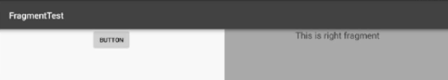
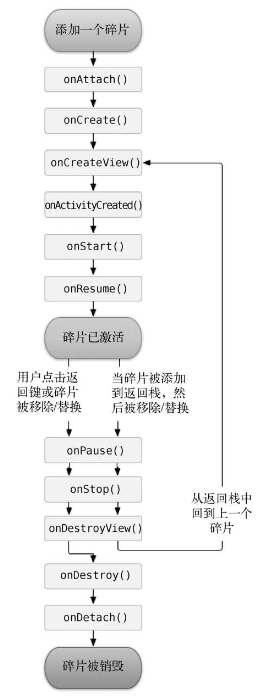
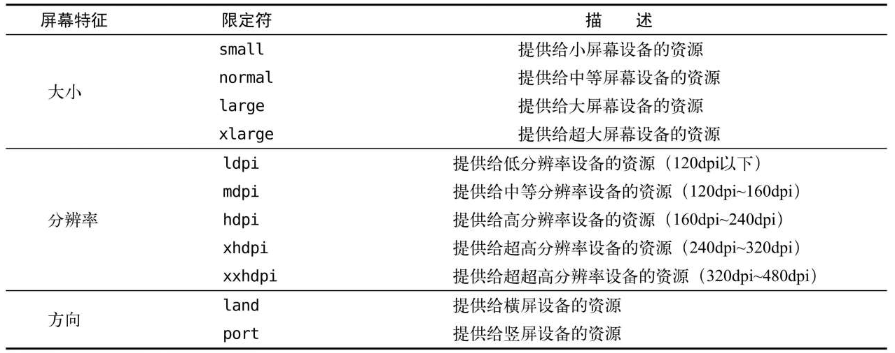

# Fragment 碎片 

碎片（Fragment）是一种能够嵌入在活动中的UI组件，它的出现使程序更好地适应大屏幕，尤其是在平板设备上的应用非常广泛。

虽然Fragment是一个新的概念，但它与活动（Activity）非常相似，包含布局并拥有自己的生命周期。因此，Fragment可以被看作一个迷你型的活动，并可以和活动一起合作来充分利用屏幕空间。

## 使用方式

> demo09

### 简单示例

**创建最简单的Fragment示例**

将通过一个示例展示如何在一个活动中添加两个Fragment，并让它们平分活动空间。

**1. 创建项目**

新建一个名为`demo09`的项目。

**2. 左侧Fragment布局 (`left_fragment.xml`)**

新建左侧碎片布局文件，代码如下：

```xml
<LinearLayout xmlns:android="http://schemas.android.com/apk/res/android"
    android:orientation="vertical"
    android:layout_width="match_parent"
    android:layout_height="match_parent">
    <Button
        android:id="@+id/button"
        android:layout_width="wrap_content"
        android:layout_height="wrap_content"
        android:layout_gravity="center_horizontal"
        android:text="Button"/>
</LinearLayout>
```

该布局中包含一个按钮，并让它水平居中显示。

**3. 右侧Fragment布局 (`right_fragment.xml`)**

新建右侧碎片布局文件，代码如下：

```xml
<LinearLayout xmlns:android="http://schemas.android.com/apk/res/android"
    android:orientation="vertical"
    android:background="#00ff00"
    android:layout_width="match_parent"
    android:layout_height="match_parent">
    <TextView
        android:layout_width="wrap_content"
        android:layout_height="wrap_content"
        android:layout_gravity="center_horizontal"
        android:textSize="20sp"
        android:text="This is right fragment"/>
</LinearLayout>
```

该布局背景色为绿色，并包含一个`TextView`用于显示文本。

**4. 创建左侧Fragment类 (`LeftFragment`)**

新建一个名为`LeftFragment`的类，代码如下：

```java
public class LeftFragment extends Fragment {
    @Override
    public View onCreateView(LayoutInflater inflater, ViewGroup container, Bundle savedInstanceState) {
        View view = inflater.inflate(R.layout.left_fragment, container, false);
        return view;
    }
}
```

**5. 创建右侧Fragment类 (`RightFragment`)**

同样，新建一个`RightFragment`类，代码如下：

```java
public class RightFragment extends Fragment {
    @Override
    public View onCreateView(LayoutInflater inflater, ViewGroup container, Bundle savedInstanceState) {
        View view = inflater.inflate(R.layout.right_fragment, container, false);
        return view;
    }
}
```

**6. 修改活动布局 (`activity_main.xml`)**

接下来，修改`activity_main.xml`文件，在布局中添加两个Fragment：

```xml
<LinearLayout xmlns:android="http://schemas.android.com/apk/res/android"
    android:orientation="horizontal"
    android:layout_width="match_parent"
    android:layout_height="match_parent">
    <fragment
        android:id="@+id/left_fragment"
        android:name="com.example.demo09.LeftFragment"
        android:layout_width="0dp"
        android:layout_height="match_parent"
        android:layout_weight="1" />
    <fragment
        android:id="@+id/right_fragment"
        android:name="com.example.demo09.RightFragment"
        android:layout_width="0dp"
        android:layout_height="match_parent"
        android:layout_weight="1" />
</LinearLayout>
```

- 使用了`<fragment>`标签在布局中添加两个Fragment
- 通过`android:name`属性显式指定了Fragment类的全路径
- 两个Fragment通过`layout_weight`属性平分了屏幕的布局空间



### 动态添加碎片
   
Fragment的真正强大之处在于可以**在程序运行时动态添加到活动中**。

通过动态添加Fragment，可以根据具体情况调整界面布局，使应用界面更加灵活多样。

**1. 新建 another_right_fragment.xml 布局文件**

```xml
<LinearLayout xmlns:android="http://schemas.android.com/apk/res/android"
    android:orientation="vertical"
    android:background="#ffff00"
    android:layout_width="match_parent"
    android:layout_height="match_parent">
    <TextView
        android:layout_width="wrap_content"
        android:layout_height="wrap_content"
        android:layout_gravity="center_horizontal"
        android:textSize="20sp"
        android:text="This is another right fragment" />
</LinearLayout>
```

**2. 创建 AnotherRightFragment**


接下来，新建一个 AnotherRightFragment 类，代码如下：

```java
public class AnotherRightFragment extends Fragment {
    @Override
    public View onCreateView(LayoutInflater inflater, ViewGroup container,
                              Bundle savedInstanceState) {
        View view = inflater.inflate(R.layout.another_right_fragment, container, false);
        return view;
    }
}
```

**3. 修改 activity_main.xml**

修改 activity_main.xml 文件，将右侧的 Fragment 替换为 FrameLayout，以便动态添加Fragment

使用 FrameLayout 来动态加载Fragment，而不再是静态的 Fragment 标签

```xml
<LinearLayout xmlns:android="http://schemas.android.com/apk/res/android"
    android:orientation="horizontal"
    android:layout_width="match_parent"
    android:layout_height="match_parent">
    <fragment
        android:id="@+id/left_fragment"
        android:name="com.example.demo09.LeftFragment"
        android:layout_width="0dp"
        android:layout_height="match_parent"
        android:layout_weight="1" />
    <FrameLayout
        android:id="@+id/right_layout"
        android:layout_width="0dp"
        android:layout_height="match_parent"
        android:layout_weight="1" />
</LinearLayout>
```

**4. 动态添加Fragment的MainActivity代码**

接着修改 MainActivity，实现动态添加和替换右侧 Fragment 的功能：

```java
public class MainActivity extends AppCompatActivity implements View.OnClickListener {
    @Override
    protected void onCreate(Bundle savedInstanceState) {
        super.onCreate(savedInstanceState);
        setContentView(R.layout.activity_main);
        Button button = (Button) findViewById(R.id.button);
        button.setOnClickListener(this);
        replaceFragment(new RightFragment());
    }

    @Override
    public void onClick(View v) {
        switch (v.getId()) {
            case R.id.button:
                replaceFragment(new AnotherRightFragment());
                break;
            default:
                break;
        }
    }

    private void replaceFragment(Fragment fragment) {
        FragmentManager fragmentManager = getSupportFragmentManager();
        FragmentTransaction transaction = fragmentManager.beginTransaction();
        transaction.replace(R.id.right_layout, fragment);
        transaction.commit();
    }
}       
```

**代码解析**

1. **点击事件注册**：给左侧碎片中的按钮注册了一个点击事件，然后调用`replaceFragment()`方法动态添加了`RightFragment`这个碎片
    * 当点击左侧碎片中的按钮时，又会调用`replaceFragment()`方法将右侧碎片替换成`AnotherRightFragment`
2. **`replaceFragment()` 方法**：动态添加碎片主要分为5步：
    1. 创建待添加的碎片实例
    2. 获取 `FragmentManager`：使用 `getSupportFragmentManager()` 获取活动的 `FragmentManager`
    3. 开启事务：通过 `beginTransaction()` 开启一个事务
    4. 替换Fragment：调用 `replace()` 方法，传入右侧容器的 `id` 和待添加的Fragment实例
    5. 提交事务：使用 `commit()` 提交事务以完成Fragment的替换

**运行效果**

当应用启动时，右侧默认显示 `RightFragment`，点击按钮后，右侧Fragment将替换为 `AnotherRightFragment`，实现动态切换界面内容。


### 在碎片中模拟返回栈

当点击按钮添加了一个碎片后，按下返回键时程序会直接退出。如果希望**实现类似返回栈的效果，使得按下返回键时可以回到上一个碎片**。

**实现返回栈效果**

在 `FragmentTransaction` 中提供了一个 `addToBackStack()` 方法，可以将某个事务添加到返回栈中。通过将碎片事务添加到返回栈，按下返回键时，系统会移除当前碎片并恢复前一个碎片，而不是直接退出程序。

**修改 `MainActivity` 的代码**

在 `MainActivity` 中，可以通过在 `replaceFragment()` 方法中添加 `addToBackStack()` 来实现返回栈功能。

```java
public class MainActivity extends AppCompatActivity implements View.OnClickListener {
    ...
    private void replaceFragment(Fragment fragment) {
        FragmentManager fragmentManager = getSupportFragmentManager();
        FragmentTransaction transaction = fragmentManager.beginTransaction();
        // 替换右侧布局中的碎片
        transaction.replace(R.id.right_layout, fragment);
        // 将事务添加到返回栈
        transaction.addToBackStack(null);
        // 提交事务
        transaction.commit();
    }
}
```

**关键点解释**

1. **`addToBackStack()` 方法**：
   - `addToBackStack()` 可以接收一个名字用于描述返回栈的状态。一般情况下，传入 `null` 即可，表示不指定具体名称
   - 通过调用 `addToBackStack(null)`，当前碎片事务会被添加到返回栈中
2. **效果**：
   - 当点击按钮将 `AnotherRightFragment` 添加到活动中时
   - 按下返回键时，程序不会直接退出，而是会回到上一个 `RightFragment` 界面
   - 再次按下返回键时，`RightFragment` 会消失，最后按下返回键，程序才会退出

### 碎片和活动之间进行通信

虽然碎片（Fragment）通常嵌入在活动（Activity）中，但它们的关系并没有那么紧密。碎片和活动各自存在于独立的类中，之间并没有直接的方式进行通信。然而，在开发中，经常需要在活动中调用碎片的方法，或者在碎片中调用活动的方法。

**1. 在活动中调用碎片的方法**

要在活动中调用某个碎片的方法，可以通过 `FragmentManager` 的 `findFragmentById()` 方法来获取碎片实例。这个方法类似于 `findViewById()`，可以从布局文件中找到对应的碎片并调用它的公共方法。

```java
// RightFragment.java
public class RightFragment extends Fragment {

    @Override
    public View onCreateView(LayoutInflater inflater, ViewGroup container, Bundle savedInstanceState) {
        View view = inflater.inflate(R.layout.right_fragment, container, false);
        return view;
    }

    public void showMessage(String message) {
        Toast.makeText(getActivity(), message, Toast.LENGTH_SHORT).show();
    }
}
```

```java
// MainActivity.java
@Override
public void onClick(View v) {
    switch (v.getId()) {
        case R.id.button:
            // 替换为 AnotherRightFragment
            replaceFragment(new AnotherRightFragment());

             // 1. 在活动中调用碎片的方法
            // 尝试获取 RightFragment 实例并调用方法
            Fragment rightFragment = getSupportFragmentManager().findFragmentById(R.id.right_layout);
            if (rightFragment instanceof RightFragment) {
                ((RightFragment) rightFragment).showMessage("Hello from MainActivity!");
            } else {
                Toast.makeText(this, "RightFragment is not available", Toast.LENGTH_SHORT).show();
            }
            break;
        default:
            break;
    }
}
```

通过上述代码，活动能够获取到 `RightFragment` 的实例，接着就可以轻松调用该碎片中的方法。

**2. 在碎片中调用活动的方法**

在碎片中调用活动的方法更加简单。每个碎片都可以通过 `getActivity()` 方法获取当前与之关联的活动实例，然后通过该实例调用活动中的方法。

```java

public class MainActivity extends AppCompatActivity implements View.OnClickListener {
...
    public void showToastMessage(String message) {
        Toast.makeText(this, message, Toast.LENGTH_SHORT).show();
    }
}
```

```java
// RightFragment.java
public class RightFragment extends Fragment {

    @Override
    public View onCreateView(LayoutInflater inflater, ViewGroup container, Bundle savedInstanceState) {
        View view = inflater.inflate(R.layout.right_fragment, container, false);

        // 2. 调用 MainActivity 的方法
        MainActivity activity = (MainActivity) getActivity();
        if (activity != null) {
            activity.showToastMessage("Hello from RightFragment!");
        }

        return view;
    }
}
```

有了活动实例后，碎片可以直接调用该活动的方法。此外，**当碎片中需要 `Context` 对象时**，也可以使用 `getActivity()`，因为活动本身就是 `Context` 的子类。

**3. 碎片与碎片之间的通信**

碎片之间的通信也可以实现，虽然没有直接的通信方法，但可以**通过活动作为中介来完成**。

- 首先，在一个碎片中使用 `getActivity()` 获取当前关联的活动。
- 然后，通过该活动使用 `findFragmentById()` 或 `findFragmentByTag()` 获取另一个碎片的实例。
- 这样，碎片之间就可以通过活动进行间接通信。

**示例步骤**：

1. 左侧碎片中点击按钮时，获取当前活动实例。
2. 通过活动实例调用 `findFragmentById()` 获取右侧碎片的实例。
3. 调用右侧碎片中的 updateMessage 方法，传递消息。

**1.  修改 RightFragment 类**

```java
public class RightFragment extends Fragment {
    private TextView textView;

    @Override
    public View onCreateView(LayoutInflater inflater, ViewGroup container, Bundle savedInstanceState) {
        View view = inflater.inflate(R.layout.right_fragment, container, false);
        textView = view.findViewById(R.id.text_view); // 添加 TextView
        return view;
    }

    public void updateMessage(String message) {
        textView.setText(message);
    }
}
```

**2. 修改 right_fragment.xml**

```xml
<TextView
    android:id="@+id/text_view"
    android:layout_width="wrap_content"
    android:layout_height="wrap_content"
    android:layout_gravity="center_horizontal"
    android:textSize="20sp"
    android:text="测试碎片与碎片" />
```

**3. 在 LeftFragment 中进行通信**

```java
public class LeftFragment extends Fragment {
    @Override
    public View onCreateView(LayoutInflater inflater, ViewGroup container, Bundle savedInstanceState) {
        View view = inflater.inflate(R.layout.left_fragment, container, false);
        Button button1 = view.findViewById(R.id.button);
        button1.setOnClickListener(v -> {
            MainActivity activity = (MainActivity) getActivity();
            if (activity != null) {
                RightFragment rightFragment = (RightFragment) activity.getSupportFragmentManager().findFragmentById(R.id.right_layout);
                if (rightFragment != null) {
                    rightFragment.updateMessage("Hello from LeftFragment!");
                }
            }
        });
        return view;
    }
}
```

**4. left_fragment.xml**

```xml
    <Button
        android:id="@+id/button1"
        android:layout_width="wrap_content"
        android:layout_height="wrap_content"
        android:layout_gravity="center_horizontal"
        android:text="Button 1"/>
```


## 碎片的生命周期

碎片（Fragment）与活动（Activity）类似，也有自己的生命周期。其生命周期状态与活动的状态非常相似，主要有运行状态、暂停状态、停止状态和销毁状态。

**1. 碎片的生命周期状态**

- **运行状态**：
  - 当一个碎片是可见的，并且它所关联的活动正处于运行状态时，该碎片也处于运行状态
  
- **暂停状态**：
  - 当一个活动进入暂停状态时（由于另一个未占满屏幕的活动被添加到了栈顶）​，与它相关联的可见碎片就会进入到暂停状态

- **停止状态**：
  - 当一个活动进入停止状态时，与它相关联的碎片就会进入到停止状态，或者通过 `FragmentTransaction` 的 `remove()` 或 `replace()` 方法将碎片从活动中移除，但如果在提交事务之前调用了 `addToBackStack()` 方法，这时的碎片也会进入到停止状态，但不会被销毁。
  - 进入停止状态的碎片对用户完全不可见，可能会被系统回收。

- **销毁状态**：
  - 碎片总是依附于活动而存在的，因此当活动被销毁时，相关的碎片也会进入销毁状态。
  - 或者通过调用`FragmentTransaction`的`remove()`、`replace()`方法将碎片从活动中移除，但在事务提交之前并没有调用`addToBackStack()`方法，这时的碎片也会进入到销毁状态。

**2. 碎片的生命周期回调方法**

与活动类似，碎片也有一系列回调方法用于管理生命周期。其中，活动中有的回调方法，碎片中几乎都有，不过碎片还提供了一些附加的回调方法。

- **`onAttach(Context context)`**：
  - 当碎片与活动建立关联时调用。
  
- **`onCreate(Bundle savedInstanceState)`**：
  - 碎片被创建时调用，用于初始化不与视图关联的资源。

- **`onCreateView(LayoutInflater inflater, ViewGroup container, Bundle savedInstanceState)`**：
  - 为碎片创建视图时（加载布局）调用。此方法用于加载和初始化碎片的布局。

- **`onActivityCreated(Bundle savedInstanceState)`**：
  - 确保与碎片相关联的活动一定已经创建完毕的时候调用。

- **`onStart()`**：
  - 碎片即将对用户可见时调用。

- **`onResume()`**：
  - 碎片进入运行状态，用户可以开始与之交互。

- **`onPause()`**：
  - 当碎片进入暂停状态时调用，通常在用户切换到其他活动或其他未完全覆盖屏幕的操作时触发。

- **`onStop()`**：
  - 碎片完全不可见时调用，可能因活动被停止或碎片被移除。

- **`onDestroyView()`**：
  - 当与碎片关联的视图被移除的时候调用，适用于释放视图相关的资源。

- **`onDestroy()`**：
  - 当碎片本身被销毁时调用，常用于清理资源。

- **`onDetach()`**：
  - 当碎片和活动解除关联的时候调用



**3. 实践碎片的生命周期**

为了体验碎片的生命周期，可以通过在每个回调方法中加入日志输出（如 `Log.d()`），观察碎片在不同状态下的生命周期变化。以下代码展示了 `RightFragment` 的回调日志：

```java
public class RightFragment extends Fragment {
    public static final String TAG = "RightFragment";
    @Override
    public View onCreateView(LayoutInflater inflater, ViewGroup container, Bundle savedInstanceState) {
        Log.d(TAG, "onCreateView");
        return inflater.inflate(R.layout.right_fragment, container, false);
    }
    @Override
    public void onAttach(@NonNull Context context) {
        super.onAttach(context);
        Log.d(TAG, "onAttach");
    }

    @Override
    public void onCreate(Bundle savedInstanceState) {
        super.onCreate(savedInstanceState);
        Log.d(TAG, "onCreate");
    }

    @Override
    public void onViewCreated(@NonNull View view, Bundle savedInstanceState) {
        super.onViewCreated(view, savedInstanceState);
        Log.d(TAG, "onViewCreated");
    }

    @Override
    public void onStart() {
        super.onStart();
        Log.d(TAG, "onStart");
    }

    @Override
    public void onResume() {
        super.onResume();
        Log.d(TAG, "onResume");
    }

    @Override
    public void onPause() {
        super.onPause();
        Log.d(TAG, "onPause");
    }

    @Override
    public void onStop() {
        super.onStop();
        Log.d(TAG, "onStop");
    }

    @Override
    public void onDestroyView() {
        super.onDestroyView();
        Log.d(TAG, "onDestroyView");
    }

    @Override
    public void onDestroy() {
        super.onDestroy();
        Log.d(TAG, "onDestroy");
    }

    @Override
    public void onDetach() {
        super.onDetach();
        Log.d(TAG, "onDetach");
    }
}
```

1. **第一次加载 `RightFragment`**:
   - 当 `RightFragment` 第一次被加载到屏幕上时，生命周期方法依次被调用：`onAttach()`、`onCreate()`、`onCreateView()`、`onViewCreated()`、`onStart()` 和 `onResume()`。
2. **点击 `LeftFragment` 中的按钮**:
   - 点击按钮后，`AnotherRightFragment` 替换了 `RightFragment`。此时，`RightFragment` 进入停止状态，依次执行 `onPause()`、`onStop()` 和 `onDestroyView()` 方法。
   - 如果在替换时没有调用 `addToBackStack()`，`RightFragment` 会进入销毁状态，执行 `onDestroy()` 和 `onDetach()` 方法。
3. **按下 Back 键**:
   - 按下 Back 键后，`RightFragment` 会重新回到屏幕。由于使用了 `addToBackStack()`，`RightFragment` 重新进入运行状态，依次执行 `onCreateView()`、`onViewCreated()`、`onStart()` 和 `onResume()` 方法。
   - 注意，此时 `onCreate()` 方法不会被执行，因为 `RightFragment` 并没有被销毁。
4. **再次按下 Back 键**:
   - 再次按下 Back 键，依次执行 `onPause()`、`onStop()`、`onDestroyView()`、`onDestroy()` 和 `onDetach()` 方法，最终将碎片销毁。

***

**4. 保存与恢复碎片状态**

在内存不足时，系统可能会回收处于停止状态的碎片。为了在恢复时保留碎片的数据，可以通过 `onSaveInstanceState()` 方法保存状态。恢复数据可以在以下方法中完成，这些方法都提供了 `Bundle` 参数 `savedInstanceState`：

1. **`onCreate()`**: 
   - **用途**: 在碎片首次创建或重建时恢复数据。适合恢复与碎片业务逻辑相关的持久数据。
   - **使用方式**: 通过 `savedInstanceState` 获取之前保存的数据，进行必要的初始化。
   - **注意事项**: 在此方法中不适合直接操作视图元素，因为视图可能尚未创建。

2. **`onCreateView()`**: 
   - **用途**: 在视图创建时恢复数据。适合设置一些初始数据，但不推荐在这里进行复杂的数据恢复操作。
   - **使用方式**: 可通过 `savedInstanceState` 获取数据并准备视图。
   - **注意事项**: 该方法返回的是视图对象，适合在此处对视图进行基本的设置。

3. **`onViewCreated()`**（推荐）: 
   - **用途**: 视图已经创建完毕，可以在此时恢复与界面相关的数据，直接操作视图元素。
   - **使用方式**: 在此方法中可以恢复数据并更新视图，确保用户界面能够反映最新的状态。
   - **注意事项**: 此时所有的视图组件都已初始化，适合进行详细的界面更新。

```java
@Override
public void onSaveInstanceState(@NonNull Bundle outState) {
    super.onSaveInstanceState(outState);
    // 保存需要恢复的数据
    outState.putString("key", "value"); // 将数据存入 Bundle 中
}

@Override
public void onCreate(Bundle savedInstanceState) {
    super.onCreate(savedInstanceState);
    if (savedInstanceState != null) {
        // 从 savedInstanceState 中恢复数据
        String value = savedInstanceState.getString("key");
        // 处理恢复的数据，可能需要初始化一些变量
    }
}

@Override
public View onCreateView(LayoutInflater inflater, ViewGroup container, Bundle savedInstanceState) {
    View view = inflater.inflate(R.layout.right_fragment, container, false);
    // 这里可以设置视图的基本状态或布局
    return view;
}

@Override
public void onViewCreated(View view, Bundle savedInstanceState) {
    super.onViewCreated(view, savedInstanceState);
    // 在此处恢复与界面相关的数据
    if (savedInstanceState != null) {
        String value = savedInstanceState.getString("key");
        // 更新视图元素，例如 TextView 的文本
        TextView textView = view.findViewById(R.id.textView);
        textView.setText(value); // 恢复状态并更新界面
    }
}
```

- **保存状态**: 使用 `onSaveInstanceState()` 方法保存需要在碎片被销毁后恢复的数据
- **恢复状态**: 推荐使用 `onViewCreated()` 方法在视图创建完成后恢复与界面相关的数据，这样可以确保视图元素已经初始化并可以进行操作

## 动态加载布局

动态添加碎片可以灵活应对开发中的问题，但如果程序能够根据设备的分辨率或屏幕大小在运行时决定加载哪个布局，那么就可以进一步增强应用的适配能力。这涉及到 **动态加载布局** 的技巧，主要通过**限定符**(Qualifiers)来实现不同设备间的布局切换。

**1. 限定符的概念**

限定符（Qualifiers）是一种用于指定资源文件的命名规则，Android 系统会根据设备的配置（如屏幕大小、语言、方向等）自动加载相应的资源文件。

**通过使用限定符，可以根据不同设备的屏幕尺寸或分辨率来加载合适的布局，从而实现最佳的用户体验**

例如，平板设备通常使用双页模式（左侧显示列表，右侧显示内容），而手机则需要分开显示单页内容。

**2. 限定符的应用示例**

通过以下步骤，可以根据设备的屏幕大小动态加载不同的布局：

1. **在默认的布局文件夹下定义单页模式的布局**（适用于小屏设备）：
   - 在 `activity_main.xml` 文件,定义一个 `LinearLayout`，其中只包含一个 `LeftFragment`，并让其填充整个父布局，适应小屏设备的单页模式。

   ```xml
   <LinearLayout xmlns:android="http://schemas.android.com/apk/res/android"
       android:orientation="horizontal"
       android:layout_width="match_parent"
       android:layout_height="match_parent" >
       <fragment
           android:id="@+id/left_fragment"
           android:name="com.example.demo10.LeftFragment"
           android:layout_width="match_parent"
           android:layout_height="match_parent"/>
   </LinearLayout>
   ```

2. **为大屏设备定义双页模式的布局**：
    - 在 `res/layout-large` 文件夹下创建 `activity_main.xml`，大屏设备会自动加载这个文件夹中的布局。
    - 定义一个包含两个碎片的布局：`LeftFragment` 和 `RightFragment`。通过 `layout_weight` 来控制左右布局的比例，实现双页显示模式。
    - **解释**：`large` 是一个限定符，表示适配大屏设备。大屏设备将加载 `layout-large` 文件夹下的布局，而小屏设备仍然会加载默认的 `layout` 文件夹下的布局。
   ```xml
   <LinearLayout xmlns:android="http://schemas.android.com/apk/res/android"
       android:orientation="horizontal"
       android:layout_width="match_parent"
       android:layout_height="match_parent">
       <fragment
           android:id="@+id/left_fragment"
           android:name="com.example.demo10.LeftFragment"
           android:layout_width="0dp"
           android:layout_height="match_parent"
           android:layout_weight="1" />
       <fragment
           android:id="@+id/right_fragment"
           android:name="com.example.demo10.RightFragment"
           android:layout_width="0dp"
           android:layout_height="match_parent"
           android:layout_weight="3" />
   </LinearLayout>
   ```

**3. 测试动态加载布局**

为了测试动态加载布局功能，暂时注释掉 `MainActivity` 中的 `replaceFragment()` 方法，从而让系统自动根据设备配置加载相应的布局，分别在手机和平板模拟器上运行程序：

- **在手机模拟器上**，程序将加载 `res/layout/activity_main.xml` 中的布局，显示单页模式。
- **在平板模拟器上**，程序将加载 `res/layout-large/activity_main.xml` 中的布局，显示双页模式。

**4. Android中一些常见的限定符**



**5. 使用最小宽度限定符**

更加灵活地为不同设备加载布局，不管它们是不是被系统认定为large，这时就可以使用最小宽度限定符（Smallest-width Qualifier）

最小宽度限定符**允许对屏幕的宽度指定一个最小值**（以dp为单位）​，然后以这个最小值为临界点，屏幕宽度大于这个值的设备就加载一个布局，屏幕宽度小于这个值的设备就加载另一个布局

在res目录下新建layout-sw600dp文件夹，然后在这个文件夹下新建activity_main.xml布局

```xml
<LinearLayout xmlns:android="http://schemas.android.com/apk/res/android"
    android:orientation="horizontal"
    android:layout_width="match_parent"
    android:layout_height="match_parent">
    <fragment
        android:id="@+id/left_fragment"
        android:name="com.example.demo10.LeftFragment"
        android:layout_width="0dp"
        android:layout_height="match_parent"
        android:layout_weight="1" />
    <fragment
        android:id="@+id/right_fragment"
        android:name="com.example.demo10.RightFragment"
        android:layout_width="0dp"
        android:layout_height="match_parent"
        android:layout_weight="3" />
</LinearLayout>
```

当程序运行在屏幕宽度大于等于600dp的设备上时，会加载layout-sw600dp/activity_main布局，当程序运行在屏幕宽度小于600dp的设备上时，则仍然加载默认的layout/activity_main布局

## 碎片的最佳实践

Android 新闻应用：Fragment 与 RecyclerView 实现兼容手机和平板

**1. 项目设置**

新建 `demo11` 项目，确保兼容手机和平板设备。

**依赖库配置**
在 `app/build.gradle` 中添加必要的依赖：
```groovy
dependencies {
    implementation 'androidx.recyclerview:recyclerview:1.2.1'
    implementation 'androidx.appcompat:appcompat:1.3.1'
    implementation 'com.google.android.material:material:1.4.0'
    implementation 'androidx.constraintlayout:constraintlayout:2.1.0'
    testImplementation 'junit:junit:4.13.2'
    androidTestImplementation 'androidx.test.ext:junit:1.1.3'
    androidTestImplementation 'androidx.test.espresso:espresso-core:3.4.0'
}
```

**2. 创建实体类 `News`**

**`News` 类** title字段表示新闻标题，content字段表示新闻内容:

```java
public class News {
    private String title;
    private String content;

    public String getTitle() { return title; }
    public void setTitle(String title) { this.title = title; }
    public String getContent() { return content; }
    public void setContent(String content) { this.content = content; }
}
```

**3. 新闻内容详情创建**

**布局文件 `news_content_frag.xml`**

新闻内容的布局主要可以分为两个部分，头部部分显示新闻标题，正文部分显示新闻内容，中间使用一条细线分隔开。

```xml
<RelativeLayout xmlns:android="http://schemas.android.com/apk/res/android"
    android:layout_width="match_parent"
    android:layout_height="match_parent">
    <LinearLayout
        android:id="@+id/visibility_layout"
        android:layout_width="match_parent"
        android:layout_height="match_parent"
        android:orientation="vertical"
        android:visibility="invisible">
        <TextView
            android:id="@+id/news_title"
            android:layout_width="match_parent"
            android:layout_height="wrap_content"
            android:gravity="center"
            android:padding="10dp"
            android:textSize="20sp" />
        <View
            android:layout_width="match_parent"
            android:layout_height="1dp"
            android:background="#000" />
        <TextView
            android:id="@+id/news_content"
            android:layout_width="match_parent"
            android:layout_height="0dp"
            android:layout_weight="1"
            android:padding="15dp"
            android:textSize="18sp" />
    </LinearLayout>
</RelativeLayout>
```

**`NewsContentFragment` 类**

继承自`Fragment`，`refresh()` 方法用于将新闻的标题和内容显示在界面上的：

```java
public class NewsContentFragment extends Fragment {
    private View view;

    @Override
    public View onCreateView(LayoutInflater inflater, ViewGroup container, Bundle savedInstanceState) {
        view = inflater.inflate(R.layout.news_content_frag, container, false);
        return view;
    }

    public void refresh(String newsTitle, String newsContent) {
        View visibilityLayout = view.findViewById(R.id.visibility_layout);
        visibilityLayout.setVisibility(View.VISIBLE);
        TextView newsTitleText = view.findViewById(R.id.news_title);
        TextView newsContentText = view.findViewById(R.id.news_content);
        newsTitleText.setText(newsTitle);
        newsContentText.setText(newsContent);
    }
}
```

**4. 单页模式的 `NewsContentActivity`**

如果想在单页模式中使用的话，还需要再创建一个活动。

右击`com.example.demo11→New→Activity→EmptyActivity`，新建一个`NewsContentActivity`，并将布局名指定成`news_content`，然后修改`news_content.xml`中的代码

在单页模式下通过 `NewsContentActivity` 来加载新闻内容。

**布局文件 `news_content.xml`**
```xml
<LinearLayout xmlns:android="http://schemas.android.com/apk/res/android"
    android:orientation="vertical"
    android:layout_width="match_parent"
    android:layout_height="match_parent">
    <fragment
        android:id="@+id/news_content_fragment"
        android:name="com.example.demo11.NewsContentFragment"
        android:layout_width="match_parent"
        android:layout_height="match_parent" />
</LinearLayout>
```

**`NewsContentActivity` 类** 接收新闻标题和内容并刷新 `NewsContentFragment`：

在`onCreate()`方法中通过Intent获取到了传入的新闻标题和新闻内容，然后调用`FragmentManager`的`findFragmentById()`方法得到了`NewsContentFragment`的实例，接着调用它的`refresh()`方法，并将新闻的标题和内容传入，就可以把这些数据显示出来

```java
public class NewsContentActivity extends AppCompatActivity {
    public static void actionStart(Context context, String newsTitle, String newsContent) {
        Intent intent = new Intent(context, NewsContentActivity.class);
        intent.putExtra("news_title", newsTitle);
        intent.putExtra("news_content", newsContent);
        context.startActivity(intent);
    }

    @Override
    protected void onCreate(Bundle savedInstanceState) {
        super.onCreate(savedInstanceState);
        setContentView(R.layout.news_content);
        String newsTitle = getIntent().getStringExtra("news_title");
        String newsContent = getIntent().getStringExtra("news_content");
        NewsContentFragment fragment = (NewsContentFragment) getSupportFragmentManager()
            .findFragmentById(R.id.news_content_fragment);
        fragment.refresh(newsTitle, newsContent);
    }
}
```

**5. 新闻列表的布局**

**布局文件 `news_title_frag.xml`**
用于显示新闻列表的 RecyclerView：
```xml
<LinearLayout xmlns:android="http://schemas.android.com/apk/res/android"
    android:orientation="vertical"
    android:layout_width="match_parent"
    android:layout_height="match_parent">
    <android.support.v7.widget.RecyclerView
        android:id="@+id/news_title_recycler_view"
        android:layout_width="match_parent"
        android:layout_height="match_parent" />
</LinearLayout>
```

**子项布局 `news_item.xml`**

* android:padding表示给控件的周围加上补白，这样不至于让文本内容会紧靠在边缘上
* android:maxLines设置为1表示让这个TextView只能单行显示
* android:ellipsize用于设定当文本内容超出控件宽度时，文本的缩略方式，这里指定成end表示在尾部进行缩略

```xml
<TextView xmlns:android="http://schemas.android.com/apk/res/android"
    android:id="@+id/news_title"
    android:layout_width="match_parent"
    android:layout_height="wrap_content"
    android:maxLines="1"
    android:ellipsize="end"
    android:textSize="18sp"
    android:padding="15dp" />
```

**`NewsTitleFragment` 类**

通过 `RecyclerView` 显示新闻标题列表，双页和单页模式下分别处理点击事件：

* 在`onCreateView()`方法中加载了`news_title_frag`布局
* 注意看一下`onActivityCreated()`方法，这个方法通过在活动中能否找到一个id为`news_content_layout`的View来判断当前是双页模式还是单页模式，因此需要让这个id为`news_content_layout`的View只在双页模式中才会出现，借助限定符就可以
* 需要注意的是，之前都是将适配器写成一个独立的类，其实也是可以写成内部类的，这里写成内部类的好处就是可以直接访问`NewsTitleFragment`的变量，比如`isTwoPane`
* `onCreateViewHolder()`方法中注册的点击事件，首先获取到了点击项的`News`实例，然后通过`isTwoPane`变量来判断当前是单页还是双页模式，如果是单页模式，就启动一个新的活动去显示新闻内容，如果是双页模式，就更新新闻内容碎片里的数据
* `onCreateView()`方法中添加了`RecyclerView`标准的使用方法，在碎片中使用RecyclerView和在活动中使用几乎是一模一样的
* 调用了`getNews()`方法来初始化50条模拟新闻数据，同样使用了一个`getRandomLengthContent()`方法来随机生成新闻内容的长度，以保证每条新闻的内容差距比较大

```java
public class NewsTitleFragment extends Fragment {
    private boolean isTwoPane;

    @Override
    public View onCreateView(LayoutInflater inflater, ViewGroup container, Bundle savedInstanceState) {
        View view = inflater.inflate(R.layout.news_title_frag, container, false);
        RecyclerView newsTitleRecyclerView = view.findViewById(R.id.news_title_recycler_view);
        LinearLayoutManager layoutManager = new LinearLayoutManager(getActivity());
        newsTitleRecyclerView.setLayoutManager(layoutManager);
        NewsAdapter adapter = new NewsAdapter(getNews());
        newsTitleRecyclerView.setAdapter(adapter);
        return view;
    }

    @Override
    public void onActivityCreated(Bundle savedInstanceState) {
        super.onActivityCreated(savedInstanceState);
        isTwoPane = getActivity().findViewById(R.id.news_content_layout) != null;
    }

    private List<News> getNews() {
        List<News> newsList = new ArrayList<>();
        for (int i = 1; i <= 50; i++) {
            News news = new News();
            news.setTitle("This is news title " + i);
            news.setContent(getRandomLengthContent("This is news content " + i + ". "));
            newsList.add(news);
        }
        return newsList;
    }

    private String getRandomLengthContent(String content) {
        Random random = new Random();
        int length = random.nextInt(20) + 1;
        StringBuilder builder = new StringBuilder();
        for (int i = 0; i < length; i++) {
            builder.append(content);
        }
        return builder.toString();
    }

    class NewsAdapter extends RecyclerView.Adapter<NewsAdapter.ViewHolder> {
        private List<News> mNewsList;

        class ViewHolder extends RecyclerView.ViewHolder {
            TextView newsTitleText;
            public ViewHolder(View view) {
                super(view);
                newsTitleText = view.findViewById(R.id.news_title);
            }
        }

        public NewsAdapter(List<News> newsList) { mNewsList = newsList; }

        @Override
        public ViewHolder onCreateViewHolder(ViewGroup parent, int viewType) {
            View view = LayoutInflater.from(parent.getContext()).inflate(R.layout.news_item, parent, false);
            final ViewHolder holder = new ViewHolder(view);
            view.setOnClickListener(v -> {
                News news = mNewsList.get(holder.getAdapterPosition());
                if (isTwoPane) {
                    // 如果是双页模式，则刷新NewsContentFragment
                    NewsContentFragment fragment = (NewsContentFragment)
                        getFragmentManager().findFragmentById(R.id.news_content_fragment);
                    fragment.refresh(news.getTitle(), news.getContent());
                } else { // 如果是单页模式，则启动 NewsContentActivity
                    NewsContentActivity.actionStart(getActivity(), news.getTitle(), news.getContent());
                }
            });
            return holder;
        }

        @Override
        public void onBindViewHolder(ViewHolder holder, int position) {
            News news = mNewsList.get(position);
            holder.newsTitleText.setText(news.getTitle());
        }

        @Override
        public int getItemCount() { return mNewsList.size(); }
    }
}
```

**6. 双页模式布局配置**

**单页模式 `activity_main.xml`**
```xml
<FrameLayout xmlns:android="http://schemas.android.com/apk/res/android"
    android:id="@+id/news_title_layout"
    android:layout_width="match_parent"
    android:layout_height="match_parent">
    <fragment
        android:id="@+id/news_title_fragment"
        android:name="com.example.demo11.NewsTitleFragment"
        android:layout_width="match_parent"
        android:layout_height="match_parent" />
</FrameLayout>
```

新建layout-sw600dp文件夹，在这个文件夹下再新建一个activity_main.xml文件

**双页模式 `activity_main.xml`**
```xml
<LinearLayout xmlns:android="http://schemas.android.com/apk/res/android"
    android:orientation="horizontal"
    android:layout_width="match_parent"
    android:layout_height="match_parent">
    <FrameLayout
        android:id="@+id/news_title_layout"
        android:layout_width="0dp"
        android:layout_height="match_parent"
        android:layout_weight="1">
        <fragment
            android:id="@+id/news_title_fragment"
            android:name="com.example.demo11.NewsTitleFragment"
            android:layout_width="match_parent"
            android:layout_height="match_parent" />
    </FrameLayout>
    <FrameLayout
        android:id="@+id/news_content_layout"
        android:layout_width="0dp"
        android:layout_height="match_parent"
        android:layout_weight="2">
        <fragment
            android:id="@+id/news_content_fragment"
            android:name="com.example.demo11.NewsContentFragment"
            android:layout_width="match_parent"
            android:layout_height="match_parent" />
    </FrameLayout>
</LinearLayout>
```
