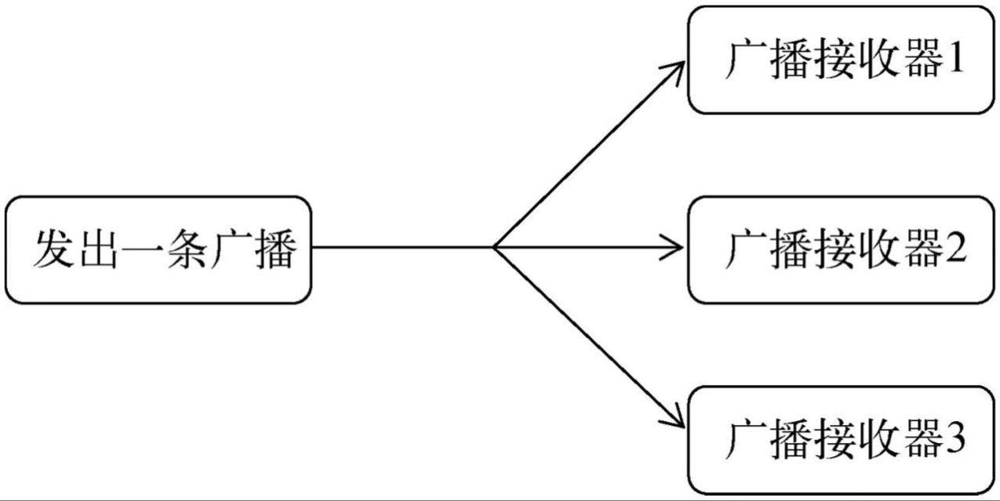
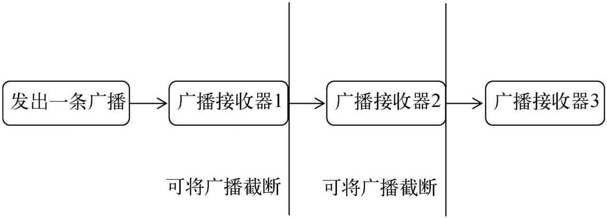
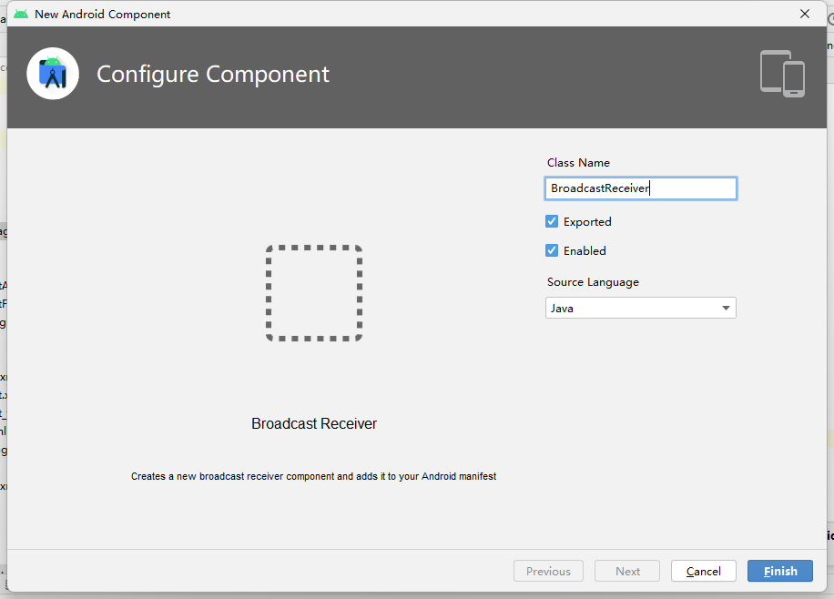
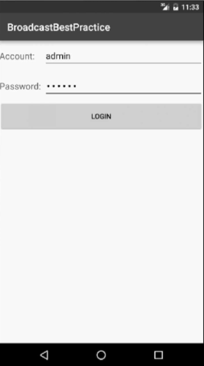
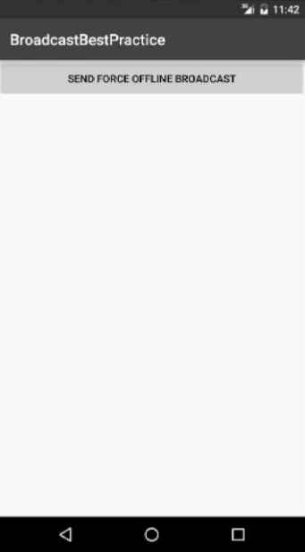

# 广播

## 广播机制简介

Android中的广播机制灵活，主要体现在以下几个方面：

1. **应用自主注册广播**：每个应用程序都可以注册自己感兴趣的广播内容，因此应用只会接收到与其相关的广播消息。这些广播既可以是系统广播，也可以是其他应用程序发送的广播。
2. **发送和接收广播的灵活性**：Android 提供了一整套 API 供应用程序自由地发送和接收广播。发送广播通过 `Intent` 实现，而接收广播则需要通过广播接收器（Broadcast Receiver）来完成。
3. **广播的两种类型**：
   - **标准广播（Normal Broadcasts）**：
     - 异步执行，广播消息几乎同时发送给所有注册的接收器
     - 不存在先后顺序，所有接收器同时接收广播消息
     - 优点是效率高，缺点是广播无法被截断
     - 
   - **有序广播（Ordered Broadcasts）**：
     - 同步执行，广播消息会按优先级顺序传递给接收器
     - 优先级高的接收器优先接收消息，且广播是逐个传递的
     - 前面的接收器可以截断广播，阻止后续接收器收到消息
     - 

## 接受系统广播

**接收系统广播**

Android 提供了很多系统级别的广播，可以通过监听这些广播获取系统状态信息。常见的系统广播有：

- 开机完成广播
- 电池电量变化广播
- 时间或时区变化广播

要接收这些广播，需要使用**广播接收器（Broadcast Receiver）**

**广播接收器的注册方式**

广播接收器可以通过以下两种方式进行注册：

- **动态注册**：在代码中使用 `registerReceiver()` 方法注册广播接收器。这种方式需要在程序运行时主动注册广播接收器。
    * 即必须要在程序启动之后才能接收到广播，因为注册的逻辑是写在`onCreate()`方法中
- **静态注册**：在 `AndroidManifest.xml` 中声明注册广播接收器，使其可以在应用未启动时也能接收到广播。

### 动态注册

通过**动态注册**的方式，可以**监听网络变化广播**。实现步骤如下：

1. **创建广播接收器**：定义广播接收器类，并实现广播接收逻辑
    1. 定义了一个内部类 `NetworkChangeReceiver`，这个类是继承自`BroadcastReceiver`的，并重写了父类的`onReceive()`方法
    2. 每当网络状态发生变化时，`onReceive()`方法就会得到执行，这里只是简单地使用Toast提示了一段文本信息
2. **注册广播接收器**：将广播接收器与具体广播类型绑定，确保接收器可以接收到指定类型的广播
    1. 在 `onCreate()` 方法中创建了一个 `IntentFilter` 的实例，并给它添加了一个值为 `android.net.conn.CONNECTIVITY_CHANGE` 的 `action`
        * 当网络状态发生变化时，系统发出的正是一条值为`android.net.conn.CONNECTIVITY_CHANGE`的广播，也就是说的广播接收器想要监听什么广播，就在这里添加相应的action
    2. 接下来创建了一个`NetworkChangeReceiver`的实例
    3. 调用`registerReceiver()`方法进行注册，将`NetworkChangeReceiver`的实例和`IntentFilter`的实例都传了进去
        * 这样`NetworkChange-Receiver`就会收到所有值为`android.net.conn.CONNECTIVITY_CHANGE`的广播，也就实现了监听网络变化的功能
3. **取消注册**：动态注册的广播接收器一定都要取消注册才行
    * 在 `onDestroy()` 方法中使用 `unregisterReceiver()` 取消注册

**运行流程**

1. 在注册完成的时候收到一条广播，然后按下Home键回到主界面（注意不能按Back键，否则onDestroy()方法会执行）​
2. 接着打开Settings程序→Data usage进入到数据使用详情界面
3. 然后尝试着开关Cellular data按钮来启动和禁用网络，就会看到有Toast提醒网络发生了变化

```java
public class MainActivity extends AppCompatActivity {
    private IntentFilter intentFilter;
    private NetworkChangeReceiver networkChangeReceiver;

    @Override
    protected void onCreate(Bundle savedInstanceState) {
        super.onCreate(savedInstanceState);
        setContentView(R.layout.activity_main);
        intentFilter = new IntentFilter();
        intentFilter.addAction("android.net.conn.CONNECTIVITY_CHANGE");
        networkChangeReceiver = new NetworkChangeReceiver();
        registerReceiver(networkChangeReceiver, intentFilter);
    }

    @Override
    protected void onDestroy() {
        super.onDestroy();
        unregisterReceiver(networkChangeReceiver);
    }

    class NetworkChangeReceiver extends BroadcastReceiver {
        @Override
        public void onReceive(Context context, Intent intent) {
            Toast.makeText(context, "network changes", Toast.LENGTH_SHORT).show();
        }
    }
}
```

**网络状态判断**

为了更准确地提示用户当前的网络状态，可以在 `onReceive()` 方法中**判断网络是否可用**

1. 首先通过`getSystemService()`方法得到了 `ConnectivityManager` 的实例，这是一个系统服务类，专门用于管理网络连接的
2. 然后调用`ConnectivityManager`的`getActiveNetworkInfo()`方法可以得到`NetworkInfo`的实例，接着调用`NetworkInfo的isAvailable()`方法，就可以判断出当前是否有网络
3. **权限声明**：由于访问网络状态需要权限，在 `AndroidManifest.xml` 中声明：
```xml
<uses-permission android:name="android.permission.ACCESS_NETWORK_STATE" />
```

```java
class NetworkChangeReceiver extends BroadcastReceiver {
@Override
public void onReceive(Context context, Intent intent) {
    ConnectivityManager connectionManager = (ConnectivityManager)
        getSystemService(Context.CONNECTIVITY_SERVICE);
    NetworkInfo networkInfo = connectionManager.getActiveNetworkInfo();
    if (networkInfo != null && networkInfo.isAvailable()) {
        Toast.makeText(context, "network is available", Toast.LENGTH_SHORT).show();
    } else {
        Toast.makeText(context, "network is unavailable", Toast.LENGTH_SHORT).show();
    }
}
}
```

### 静态注册

静态注册的广播接收器可以在**应用未启动时接收广播**，常用于**实现开机启动**等功能。

由于静态注册的广播接收器不与具体的活动绑定，当它接收到广播时，没有与之关联的界面上下文，因此无法执行 UI 操作（如弹出对话框）。

- **实现流程**
    1. 当收到这条广播时就可以在`onReceive()`方法里执行相应的逻辑，从而实现开机启动的功能
    2. 静态的广播接收器一定要在`AndroidManifest.xml`文件中注册才可以使用
    3. 使用`Android Studio`提供的快捷方式来创建一个广播接收器，并自动完成在 `AndroidManifest.xml` 中的注册
    4. 右击`com.example.broadcasttest包→New→Other→Broadcast Receiver`
        * 
        * 将广播接收器命名为`BootCompleteReceiver`, `Exported`属性表示是否允许这个广播接收器接收本程序以外的广播，`Enabled`属性表示是否启用这个广播接收器。勾选这两个属性，点击`Finish`完成创建
- **开机广播接收器代码**：
```java
public class BootCompleteReceiver extends BroadcastReceiver {
    @Override
    public void onReceive(Context context, Intent intent) {
        Toast.makeText(context, "Boot Complete", Toast.LENGTH_LONG).show();
    }
}
```
- **在 `AndroidManifest.xml` 中注册**：
    - `<application>`标签内出现了一个新的标签`<receiver>`，所有静态的广播接收器都是在这里进行注册的。
    - 用法其实和<activity>标签非常相似，也是通过`android:name`来指定具体注册哪一个广播接收器，而`enabled`和`exported`属性则是根据刚才勾选的状态自动生成的
    - 由于Android系统启动完成后会发出一条值为`android.intent.action.BOOT_COMPLETED`的广播，因此在`<intent-filter>`标签里添加了相应的`action``
```xml
<receiver
    android:name=".BootCompleteReceiver"
    android:enabled="true"
    android:exported="true">
    <intent-filter>
        <action android:name="android.intent.action.BOOT_COMPLETED" />
    </intent-filter>
</receiver>
```

- **权限声明**：监听系统开机广播需要声明权限：
```xml
<uses-permission android:name="android.permission.RECEIVE_BOOT_COMPLETED" />
```

- **启动广播接收器**：开机广播只会在应用被启动过一次后才能接收。这意味着应用至少需要被用户手动打开一次，才能在系统启动时接收到广播。


静态注册的广播接收器可以在**应用未启动时接收广播**，常用于实现**开机启动**等功能。

**实现流程**

1. **接收广播并执行逻辑**：
   - 当设备完成启动并发送 `BOOT_COMPLETED` 广播时，广播接收器会触发 `onReceive()` 方法，在该方法中可以执行相应的逻辑（如启动某些服务或显示通知），实现开机启动的功能。
2. **注册广播接收器**：
   - 静态广播接收器必须在 `AndroidManifest.xml` 文件中注册，才能在应用未启动时也接收广播。
3. **快捷方式创建广播接收器**：
   - 使用 `Android Studio` 提供的快捷方式来创建广播接收器，并自动在 `AndroidManifest.xml` 中完成注册。
   - 创建步骤：
     - 右击项目包名，如 `com.example.broadcasttest` → `New` → `Other` → `Broadcast Receiver`。
     - 将广播接收器命名为 `BootCompleteReceiver`，并勾选 `Exported` 和 `Enabled` 属性。
     - `Exported` 表示是否允许接收外部广播，`Enabled` 表示是否启用该接收器。
     - 点击 `Finish` 完成创建。

---

**开机广播接收器代码**

```java
public class BootCompleteReceiver extends BroadcastReceiver {
    @Override
    public void onReceive(Context context, Intent intent) {
        Toast.makeText(context, "Boot Complete", Toast.LENGTH_LONG).show();
    }
}
```

- 该代码实现了一个简单的广播接收器，当接收到开机广播时，会显示一个 Toast 提示开机完成。

---

**在 `AndroidManifest.xml` 中注册**

- 静态广播接收器需要在 `<application>` 标签内注册，类似于注册 Activity。
- 通过 `android:name` 指定要注册的接收器类，`enabled` 属性决定是否启用接收器，`exported` 属性决定是否允许接收来自外部的广播。

```xml
<receiver
    android:name=".BootCompleteReceiver"
    android:enabled="true"
    android:exported="true">
    <intent-filter>
        <action android:name="android.intent.action.BOOT_COMPLETED" />
    </intent-filter>
</receiver>
```

---

**权限声明**

- 接收系统的开机广播需要在 `AndroidManifest.xml` 文件中声明 `RECEIVE_BOOT_COMPLETED` 权限。

```xml
<uses-permission android:name="android.permission.RECEIVE_BOOT_COMPLETED" />
```

---

**注意事项**

- **启动广播接收器**：开机广播只有在应用启动过一次后才能接收。这意味着应用必须至少被用户手动启动一次，之后才可以在设备启动时接收到 `BOOT_COMPLETED` 广播。

## 发送自定义广播

### 发送标准广播

**1. 定义广播接收器**

首先，创建一个继承自 `BroadcastReceiver` 的类，用于处理接收到的广播。在 `onReceive()` 方法中可以编写处理逻辑，例如显示一个 `Toast` 提示。

```java
public class MyBroadcastReceiver extends BroadcastReceiver {
    @Override
    public void onReceive(Context context, Intent intent) {
        Toast.makeText(context, "received in MyBroadcastReceiver", Toast.LENGTH_SHORT).show();
    }
}
```

在这个示例中，当 `MyBroadcastReceiver` 接收到广播时，会弹出一个提示，显示 "received in MyBroadcastReceiver"。

**2. 在 `AndroidManifest.xml` 中注册广播接收器**

接下来，需要在 `AndroidManifest.xml` 文件中注册这个广播接收器，并指定它可以接收的广播类型。

```xml
<manifest xmlns:android="http://schemas.android.com/apk/res/android"
    package="com.example.broadcasttest">
    <application
        android:allowBackup="true"
        android:icon="@mipmap/ic_launcher"
        android:label="@string/app_name"
        android:supportsRtl="true"
        android:theme="@style/AppTheme">
        <receiver
            android:name=".MyBroadcastReceiver"
            android:enabled="true"
            android:exported="true">
            <intent-filter>
                <action android:name="com.example.broadcasttest.MY_BROADCAST"/>
            </intent-filter>
        </receiver>
    </application>
</manifest>
```

这里，`MyBroadcastReceiver` 被配置为接收 `com.example.broadcasttest.MY_BROADCAST` 类型的广播。

**3. 设计布局文件**

在 `activity_main.xml` 中定义一个按钮，用于作为发送广播的触发器。

```xml
<LinearLayout xmlns:android="http://schemas.android.com/apk/res/android"
    android:orientation="vertical"
    android:layout_width="match_parent"
    android:layout_height="match_parent" >
    <Button
        android:id="@+id/button"
        android:layout_width="match_parent"
        android:layout_height="wrap_content"
        android:text="Send Broadcast" />
</LinearLayout>
```

此布局文件包含一个按钮，点击该按钮后会触发广播的发送。

**4. 实现发送广播的逻辑**

在 `MainActivity` 中，为按钮设置点击事件，并在点击时发送广播。

```java
public class MainActivity extends AppCompatActivity {
    @Override
    protected void onCreate(Bundle savedInstanceState) {
        super.onCreate(savedInstanceState);
        setContentView(R.layout.activity_main);

        Button button = (Button) findViewById(R.id.button);
        button.setOnClickListener(new View.OnClickListener() {
            @Override
            public void onClick(View v) {
                Intent intent = new Intent("com.example.broadcasttest.MY_BROADCAST");
                sendBroadcast(intent);
            }
        });
    }
}
```

在这个代码段中，**`sendBroadcast(intent)` 被用于发送自定义广播**。

广播的 `Intent` 包含了一个指定的 action，即 `com.example.broadcasttest.MY_BROADCAST`，这样注册了这个 action 的广播接收器就能收到广播。

**5. 运行和效果**

1. 点击按钮时，应用会发送一条名为 `com.example.broadcasttest.MY_BROADCAST` 的广播。
2. `MyBroadcastReceiver` 会接收到这条广播并弹出一个 `Toast` 提示。

**6. 传递数据（可选）**

广播是通过 `Intent` 传递的，因此还可以在发送广播时附带一些数据，广播接收器可以在 `onReceive()` 方法中通过 `Intent` 获取这些数据。例如：

```java
// 发送广播时附带数据
Intent intent = new Intent("com.example.broadcasttest.MY_BROADCAST");
intent.putExtra("extra_data", "Hello, Broadcast!");
sendBroadcast(intent);

// 接收广播时获取数据
@Override
public void onReceive(Context context, Intent intent) {
    String data = intent.getStringExtra("extra_data");
    Toast.makeText(context, "Received data: " + data, Toast.LENGTH_SHORT).show();
}
```

### 发送有序广播

广播是一种跨进程的通信方式，不仅可以在应用内部发送和接收，也可以让其他应用程序接收。

**1. 新建项目并创建广播接收器**


新建项目 `BroadcastTest2`，并定义一个新的广播接收器 `AnotherBroadcastReceiver`，用于接收来自其他应用的广播。

```java
public class AnotherBroadcastReceiver extends BroadcastReceiver {
    @Override
    public void onReceive(Context context, Intent intent) {
        Toast.makeText(context, "received in AnotherBroadcastReceiver", Toast.LENGTH_SHORT).show();
    }
}
```

在 `AndroidManifest.xml` 中注册 `AnotherBroadcastReceiver` 接收 `com.example.broadcasttest.MY_BROADCAST` 广播：

```xml
<manifest xmlns:android="http://schemas.android.com/apk/res/android"
    package="com.example.broadcasttest2">
    <application
        android:allowBackup="true"
        android:icon="@mipmap/ic_launcher"
        android:label="@string/app_name"
        android:supportsRtl="true"
        android:theme="@style/AppTheme">
        ...
        <receiver
            android:name=".AnotherBroadcastReceiver"
            android:enabled="true"
            android:exported="true">
            <intent-filter>
                <action android:name="com.example.broadcasttest.MY_BROADCAST" />
            </intent-filter>
        </receiver>
    </application>
</manifest>
```

运行 `BroadcastTest2` 项目，并确保 `AnotherBroadcastReceiver` 正常注册。此时，`BroadcastTest` 项目中的广播按钮也会触发这个接收器。

**2. 发送标准广播**

在 `BroadcastTest` 项目中点击广播按钮时，`AnotherBroadcastReceiver` 和 `MyBroadcastReceiver` 都会收到广播，证明广播可以跨应用接收。

**3. 发送有序广播**

有序广播可以设置接收顺序，并且广播接收器可以选择截断广播。

在 `MainActivity` 中修改发送广播的代码，将 `sendBroadcast()` 改为 `sendOrderedBroadcast()`。

- `sendOrderedBroadcast()` 接收两个参数：
  - 第一个参数是要发送的 `Intent` 对象。
  - 第二个参数是权限相关的字符串，这里传入 `null` 即可。

```java
public class MainActivity extends AppCompatActivity {
    @Override
    protected void onCreate(Bundle savedInstanceState) {
        super.onCreate(savedInstanceState);
        setContentView(R.layout.activity_main);
        Button button = (Button) findViewById(R.id.button);
        button.setOnClickListener(new View.OnClickListener() {
            @Override
            public void onClick(View v) {
                Intent intent = new Intent("com.example.broadcasttest.MY_BROADCAST");
                sendOrderedBroadcast(intent, null);
            }
        });
    }
}
```

**4. 设置广播接收器的优先级**

**使用 `android:priority` 属性为广播接收器设置优先级**，优先级越高，越先接收广播。优先级范围为 `-1000` 到 `1000`。

**修改 `MyBroadcastReceiver` 的优先级：**

```xml
<receiver
    android:name=".MyBroadcastReceiver"
    android:enabled="true"
    android:exported="true">
    <intent-filter android:priority="100">
        <action android:name="com.example.broadcasttest.MY_BROADCAST" />
    </intent-filter>
</receiver>
```

此时，`MyBroadcastReceiver` 的优先级被设为 `100`，保证它先于其他接收器接收广播。

**5. 终止广播传递**

- 在 `MyBroadcastReceiver` 中通过**调用 `abortBroadcast()` 方法，阻止广播继续传递**给后续的接收器。

```java
public class MyBroadcastReceiver extends BroadcastReceiver {
    @Override
    public void onReceive(Context context, Intent intent) {
        Toast.makeText(context, "received in MyBroadcastReceiver", Toast.LENGTH_SHORT).show();
        abortBroadcast();  // 阻止广播传递
    }
}
```

- 重新运行应用程序，并点击发送广播按钮时，只有 `MyBroadcastReceiver` 会接收到广播，而 `AnotherBroadcastReceiver` 无法接收到，因为广播被截断了。

## 使用本地广播

本地广播是一种只在应用内部进行传递的广播机制，解决了系统全局广播带来的安全性问题。使用本地广播，可以确保广播不会被其他应用程序接收，增强数据的安全性。

**1. 全局广播的安全隐患**

全局广播可以被任何应用接收或发送，这会带来一些安全风险：
- **数据泄漏**：携带敏感信息的广播可能被其他应用截获
- **垃圾广播**：其他应用可能向接收器发送无用的广播信息

**2. 本地广播的引入**

为了应对上述问题，Android 提供了 **LocalBroadcastManager** 进行本地广播管理。

本地广播只能在应用内部传递，不会跨应用传播，增强了安全性。

**3. 使用本地广播的步骤**

- **`LocalBroadcastManager.getInstance(Context)`**  
  获取 `LocalBroadcastManager` 的实例，用于管理本地广播
- **`localBroadcastManager.registerReceiver(BroadcastReceiver receiver, IntentFilter filter)`**  
  动态注册广播接收器，接收本地广播
- **`localBroadcastManager.sendBroadcast(Intent intent)`**  
  发送本地广播
- **`localBroadcastManager.unregisterReceiver(BroadcastReceiver receiver)`**  
  取消广播接收器的注册，避免内存泄漏。

```java
public class MainActivity extends AppCompatActivity {
    private IntentFilter intentFilter;
    private LocalReceiver localReceiver;
    private LocalBroadcastManager localBroadcastManager;

    @Override
    protected void onCreate(Bundle savedInstanceState) {
        super.onCreate(savedInstanceState);
        setContentView(R.layout.activity_main);
        
        // 获取 LocalBroadcastManager 实例
        localBroadcastManager = LocalBroadcastManager.getInstance(this);
        
        // 设置按钮点击事件，发送本地广播
        Button button = (Button) findViewById(R.id.button);
        button.setOnClickListener(new View.OnClickListener() {
            @Override
            public void onClick(View v) {
                Intent intent = new Intent("com.example.broadcasttest.LOCAL_BROADCAST");
                localBroadcastManager.sendBroadcast(intent);  // 发送本地广播
            }
        });

        // 注册本地广播接收器
        intentFilter = new IntentFilter();
        intentFilter.addAction("com.example.broadcasttest.LOCAL_BROADCAST");
        localReceiver = new LocalReceiver();
        localBroadcastManager.registerReceiver(localReceiver, intentFilter); // 动态注册
    }

    @Override
    protected void onDestroy() {
        super.onDestroy();
        // 取消注册接收器
        localBroadcastManager.unregisterReceiver(localReceiver);
    }

    // 定义本地广播接收器
    class LocalReceiver extends BroadcastReceiver {
        @Override
        public void onReceive(Context context, Intent intent) {
            Toast.makeText(context, "received local broadcast", Toast.LENGTH_SHORT).show();
        }
    }
}
```

**5. 本地广播的特点**

- **无法跨应用传递**：本地广播只能在应用内部传播，其他应用无法接收到。
- **只能动态注册**：本地广播不能通过静态方式注册（无法在 `AndroidManifest.xml` 中声明接收器），因为发送本地广播时，应用程序必须处于运行状态。
- **安全性高**：由于广播只在本应用内传播，不存在数据泄漏的风险。
- **性能更高**：相比全局广播，本地广播更加高效，因为它不需要跨进程通信。

## 实现强制下线功能

实现应用中的**强制下线功能**。该功能在实际应用中非常常见，应用程序在别处登录时会强制当前用户下线。

**1. 思路概述**

强制下线功能的基本思路是：当用户在其他设备上登录时，应用程序接收到通知后，弹出对话框阻止用户的其他操作，并要求用户确认后退出当前界面，回到登录界面。

为了避免在每个界面都编写相同的对话框逻辑，可以借助**广播机制**来实现。

**2. Activity 管理**

由于强制下线需要关闭所有的活动，然后回到登录界面，因此可以借助一个**活动管理器**来统一管理应用中的所有活动。

- **ActivityCollector类**：用于添加、移除和关闭所有活动。

    ```java
    public class ActivityCollector {
        public static List<Activity> activities = new ArrayList<>();
        public static void addActivity(Activity activity) {
            activities.add(activity);
        }
        public static void removeActivity(Activity activity) {
            activities.remove(activity);
        }
        public static void finishAll() {
            for (Activity activity : activities) {
                if (!activity.isFinishing()) {
                    activity.finish();
                }
            }
            activities.clear();
        }
    }
    ```

- **BaseActivity类**：作为所有活动的基类，在`onCreate()`和`onDestroy()`中添加和移除活动。

    ```java
    public class BaseActivity extends AppCompatActivity {
        @Override
        protected void onCreate(Bundle savedInstanceState) {
            super.onCreate(savedInstanceState);
            ActivityCollector.addActivity(this);
        }
        @Override
        protected void onDestroy() {
            super.onDestroy();
            ActivityCollector.removeActivity(this);
        }
    }
    ```

**3. 登录界面实现**

- **布局文件**`activity_login.xml`：包含账号输入框、密码输入框和登录按钮的简单布局。

```xml
<LinearLayout xmlns:android="http://schemas.android.com/apk/res/android"
    android:orientation="vertical"
    android:layout_width="match_parent"
    android:layout_height="match_parent">
    <LinearLayout android:orientation="horizontal" ... >
        <TextView ... android:text="Account:" />
        <EditText android:id="@+id/account" ... />
    </LinearLayout>
    <LinearLayout android:orientation="horizontal" ... >
        <TextView ... android:text="Password:" />
        <EditText android:id="@+id/password" ... android:inputType="textPassword" />
    </LinearLayout>
    <Button android:id="@+id/login" ... android:text="Login" />
</LinearLayout>
```

- **LoginActivity类**：在用户输入正确的账号和密码（admin/123456）时，跳转到主界面，否则提示错误信息。

```java
public class LoginActivity extends BaseActivity {
    private EditText accountEdit;
    private EditText passwordEdit;
    private Button login;
    @Override
    protected void onCreate(Bundle savedInstanceState) {
        super.onCreate(savedInstanceState);
        setContentView(R.layout.activity_login);
        accountEdit = (EditText) findViewById(R.id.account);
        passwordEdit = (EditText) findViewById(R.id.password);
        login = (Button) findViewById(R.id.login);
        login.setOnClickListener(new View.OnClickListener() {
            @Override
            public void onClick(View v) {
                String account = accountEdit.getText().toString();
                String password = passwordEdit.getText().toString();
                if (account.equals("admin") && password.equals("123456")) {
                    Intent intent = new Intent(LoginActivity.this, MainActivity.class);
                    startActivity(intent);
                    finish();
                } else {
                    Toast.makeText(LoginActivity.this, "account or password is invalid",
                        Toast.LENGTH_SHORT).show();
                }
            }
        });
    }
}
```



**4. 主界面设计**

- **布局文件**`activity_main.xml`：包含一个按钮，用于发送强制下线广播。

```xml
<LinearLayout xmlns:android="http://schemas.android.com/apk/res/android"
    android:orientation="vertical"
    android:layout_width="match_parent"
    android:layout_height="match_parent" >
    <Button
        android:id="@+id/force_offline"
        android:layout_width="match_parent"
        android:layout_height="wrap_content"
        android:text="Send force offline broadcast" />
</LinearLayout>
```

- **MainActivity类**：点击按钮后发送强制下线广播
    * 在按钮的点击事件里面发送了一条广播，广播的值为`com.example.broadcastbestpractice.FORCE_OFFLINE`，这条广播就是用于通知程序强制用户下线的
    * 也就是说强制用户下线的逻辑并不是写在`MainActivity`里的，而是应该写在接收这条广播的广播接收器里面，这样强制下线的功能就不会依附于任何的界面，不管是在程序的任何地方，只需要发出这样一条广播，就可以完成强制下线的操作了

```java
public class MainActivity extends BaseActivity {
    @Override
    protected void onCreate(Bundle savedInstanceState) {
        super.onCreate(savedInstanceState);
        setContentView(R.layout.activity_main);
        Button forceOffline = (Button) findViewById(R.id.force_offline);
        forceOffline.setOnClickListener(new View.OnClickListener() {
            @Override
            public void onClick(View v) {
                Intent intent = new Intent("com.example.broadcastbestpractice.FORCE_OFFLINE");
                sendBroadcast(intent);
            }
        });
    }
}
```



**5. 动态注册广播接收器**

在 `BaseActivity` 中动态注册广播接收器，因为所有的活动都是继承自BaseActivity的，在接收到强制下线广播时弹出对话框，阻止用户操作，并让用户回到登录界面。

* `ForceOfflineReceiver`
    * 由于广播接收器里面需要弹出一个对话框来阻塞用户的正常操作，但如果创建的是一个静态注册的广播接收器，是没有办法在`onReceive()`方法里弹出对话框这样的UI控件的，在`BaseActivity`中动态注册一个广播接收器就可以了，因为所有的活动都是继承自`BaseActivity`的
* `onResume()` 注册广播接收器
* `onPause()` 取消注册

因为始终需要保证只有处于栈顶的活动才能接收到这条强制下线广播，非栈顶的活动不应该也没有必要去接收这条广播，所以写在`onResume()`和`onPause()`方法里就可以很好地解决这个问题，而不是在`onCreate()`和`onDestroy()`方法里，当一个活动失去栈顶位置时就会自动取消广播接收器的注册

```java
public class BaseActivity extends AppCompatActivity {
    private ForceOfflineReceiver receiver;
    @Override
    protected void onResume() {
        super.onResume();
        IntentFilter intentFilter = new IntentFilter();
        intentFilter.addAction("com.example.broadcastbestpractice.FORCE_OFFLINE");
        receiver = new ForceOfflineReceiver();
        registerReceiver(receiver, intentFilter);
    }
    @Override
    protected void onPause() {
        super.onPause();
        if (receiver != null) {
            unregisterReceiver(receiver);
            receiver = null;
        }
    }
    class ForceOfflineReceiver extends BroadcastReceiver {
        @Override
        public void onReceive(final Context context, Intent intent) {
            AlertDialog.Builder builder = new AlertDialog.Builder(context);
            builder.setTitle("Warning");
            builder.setMessage("You are forced to be offline. Please try to login again.");
            builder.setCancelable(false);
            builder.setPositiveButton("OK", new DialogInterface.OnClickListener() {
                @Override
                public void onClick(DialogInterface dialog, int which) {
                    ActivityCollector.finishAll(); // 销毁所有活动
                    Intent i = new Intent(context, LoginActivity.class);
                    context.startActivity(i); // 重新启动LoginActivity
                }
            });
            builder.show();
        }
    }
}
```

**6. AndroidManifest.xml 配置**

将 `LoginActivity` 作为主活动，确保程序启动时首先进入登录界面。

```xml
<manifest xmlns:android="http://schemas.android.com/apk/res/android"
    package="com.example.broadcastbestpractice">
    <application
        android:allowBackup="true"
        android:icon="@mipmap/ic_launcher"
        android:label="@string/app_name"
        android:supportsRtl="true"
        android:theme="@style/AppTheme">
        <activity android:name=".MainActivity" />
        <activity android:name=".LoginActivity">
            <intent-filter>
                <action android:name="android.intent.action.MAIN" />
                <category android:name="android.intent.category.LAUNCHER" />
            </intent-filter>
        </activity>
    </application>
</manifest>
```