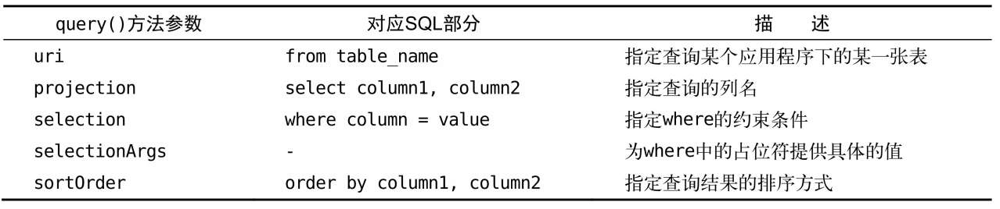

# 内容提供器

**Android数据持久化技术**

1. **数据持久化技术**：
   - 包括文件存储、SharedPreferences存储和数据库存储。
   - 保存的数据通常只能在当前应用程序中访问。

2. **跨程序数据共享的限制**：
   - 原有的`MODE_WORLD_READABLE`和`MODE_WORLD_WRITEABLE`在Android 4.2版本中被废弃。
   - 官方不再推荐这些模式，因其安全性不足。

3. **内容提供器的必要性**：
   - 内容提供器（Content Provider）是Android推荐的跨程序数据共享技术。
   - 它允许程序安全地访问另一个程序中的数据。

**内容提供器简介**

1. **内容提供器的功能**：
   - 提供完整机制，允许数据共享，同时保证数据安全。
   - 可以选择共享特定数据，保护隐私信息不被泄露。

2. **应用场景**：
   - 常用于需要第三方应用访问的数据，如联系人、短信、媒体库等。

**运行时权限的重要性**

Android运行时权限在内容提供器示例中将会使用，且在开发中频繁应用。

## 运行时权限

### Android权限机制详解

**Android权限机制概述**

1. **权限机制的历史**：
   - 自Android第一个版本开始就已存在。
   - 早期机制对用户安全和隐私保护有限，常用软件容易滥用权限。

2. **运行时权限的引入**：
   - Android 6.0引入运行时权限功能，以增强用户的安全和隐私保护。
   - 允许用户在软件使用过程中逐项授权，而非在安装时一次性授权所有权限。

**传统权限机制**

1. **权限声明**：
   - 在`AndroidManifest.xml`中声明需要的权限，例如：
     ```xml
     <uses-permission android:name="android.permission.ACCESS_NETWORK_STATE" />
     <uses-permission android:name="android.permission.RECEIVE_BOOT_COMPLETED" />
     ```

2. **用户保护**：
   - 安装时提供权限提醒，用户可决定是否安装程序。
   - 用户可在应用管理中查看权限申请情况。

3. **滥用问题**：
   - 常用软件往往申请过多权限，用户面临“店大欺客”的困境。
   - 用户可能不认可某些权限，但因依赖软件而不得不接受。

**运行时权限的实现**

1. **权限分类**：
   - **普通权限**：不威胁用户安全和隐私，系统自动授权。
   - **危险权限**：触及用户隐私或影响设备安全，需用户手动授权。

2. **权限管理**：
   - 大多数权限为普通权限，危险权限相对较少（24个）。
   - 使用危险权限时需在`AndroidManifest.xml`中声明，并进行运行时权限处理。

3. **权限组**：
   - 每个危险权限属于一个权限组，授权某一权限时，其组中所有权限同时被授权。

**完整权限列表**

- 用户可访问[Android权限列表](http://developer.android.google.cn/reference/android/Manifest.permission.html)查看完整的权限信息

### 在程序运行时申请权限

1. **项目创建**：
   - 新建`RuntimePermissionTest`项目，使用`CALL_PHONE`权限作为示例。

2. **布局文件**：
   - 修改`activity_main.xml`布局，定义一个拨打电话的按钮：
     ```xml
     <LinearLayout xmlns:android="http://schemas.android.com/apk/res/android"
         android:layout_width="match_parent"
         android:layout_height="match_parent">
         <Button
             android:id="@+id/make_call"
             android:layout_width="match_parent"
             android:layout_height="wrap_content"
             android:text="Make Call" />
     </LinearLayout>
     ```

3. **主活动代码**：
   - `Intent.ACTION_ CALL` 可以直接拨打电话，因此必须声明权限
   - 在`MainActivity`中实现拨打电话逻辑：
     ```java
     public class MainActivity extends AppCompatActivity {
         @Override
         protected void onCreate(Bundle savedInstanceState) {
             super.onCreate(savedInstanceState);
             setContentView(R.layout.activity_main);
             Button makeCall = (Button) findViewById(R.id.make_call);
             makeCall.setOnClickListener(new View.OnClickListener() {
                 @Override
                 public void onClick(View v) {
                     try {
                         Intent intent = new Intent(Intent.ACTION_CALL);
                         intent.setData(Uri.parse("tel:10086"));
                         startActivity(intent);
                     } catch (SecurityException e) {
                         e.printStackTrace();
                     }
                 }
             });
         }
     }
     ```

4. **权限声明**：
   - 在`AndroidManifest.xml`中声明拨打电话权限：
     ```xml
     <manifest xmlns:android="http://schemas.android.com/apk/res/android"
         package="com.example.runtimepermissiontest">
         <uses-permission android:name="android.permission.CALL_PHONE" />
         ...
     </manifest>
     ```

5. **错误处理**：
   - 在Android 6.0及以上系统运行时，直接点击拨打电话按钮将出现“Permission Denial”错误，因为6.0及以上系统在使用危险权限时都必须进行**运行时权限处理**
   - 在低于Android 6.0系统的手机上是可以正常运行的

**运行时权限处理**

1. **代码修改**：
   - 更新`MainActivity`以实现运行时权限请求：
     ```java
     public class MainActivity extends AppCompatActivity {
         @Override
         protected void onCreate(Bundle savedInstanceState) {
             super.onCreate(savedInstanceState);
             setContentView(R.layout.activity_main);
             Button makeCall = (Button) findViewById(R.id.make_call);
             makeCall.setOnClickListener(new View.OnClickListener() {
                 @Override
                 public void onClick(View v) {
                     if (ContextCompat.checkSelfPermission(MainActivity.this, 
                         Manifest.permission.CALL_PHONE) != PackageManager.PERMISSION_GRANTED) {
                         ActivityCompat.requestPermissions(MainActivity.this, 
                             new String[]{ Manifest.permission.CALL_PHONE }, 1);
                     } else {
                         call();
                     }
                 }
             });
         }

         private void call() {
             try {
                 Intent intent = new Intent(Intent.ACTION_CALL);
                 intent.setData(Uri.parse("tel:10086"));
                 startActivity(intent);
             } catch (SecurityException e) {
                 e.printStackTrace();
             }
         }

         @Override
         public void onRequestPermissionsResult(int requestCode, String[] permissions, int[] grantResults) {
             switch (requestCode) {
                 case 1:
                     if (grantResults.length > 0 && grantResults[0] == PackageManager.PERMISSION_GRANTED) {
                         call();
                     } else {
                         Toast.makeText(this, "You denied the permission", Toast.LENGTH_SHORT).show();
                     }
                     break;
                 default:
             }
         }
     }
     ```

2. **权限流程解析**：
   - 使用`ContextCompat.checkSelfPermission()`检查权限是否被授予
        - 第一个参数是Context，第二个参数是具体的权限名
   - 如果未授予，则调用`ActivityCompat.requestPermissions()`请求权限
        - 第一个参数要求是Activity的实例
        - 第二个参数是一个String数组，把要申请的权限名放在数组中即可
        - 第三个参数是请求码，只要是唯一值就可以
   - 用户响应后，结果通过`onRequestPermissionsResult()`回调处理
        - 授权的结果会封装在`grantResults`参数当中

3. **用户操作**：
   - 用户首次点击按钮时，会弹出权限申请对话框。选择“DENY”后提示操作失败
   - 再次点击按钮并选择“ALLOW”后，可以成功拨打电话
   - 用户可随时在设置中更改权限，路径为：`Settings → Apps → RuntimePermissionTest → Permissions`

## 访问其他程序中的数据

### ContentResolver的基本用法

**1. 内容提供器的概述**

- 内容提供器允许应用程序共享数据，其他应用程序可以通过内容提供器访问这些数据。
- Android自带的内容提供器示例：电话簿、短信、媒体库等。

**2. ContentResolver的基本用法**

- 要访问内容提供器中的数据，需要使用`ContentResolver`类
- 通过`Context`中的`getContentResolver()`方法获取`ContentResolver`实例

**3. CRUD操作**

- `ContentResolver`提供的方法与`SQLiteDatabase`类似：
  - `insert()`：添加数据
  - `update()`：更新数据
  - `delete()`：删除数据
  - `query()`：查询数据
- 与`SQLiteDatabase`的不同之处在于，`ContentResolver`方法不接收表名参数，而是使用内容URI

**4. 内容URI的构成**

- 内容URI由`authority`和`path`两部分组成：
  - `authority`：区分不同应用程序，通常为包名
  - `path`：区分同一应用程序中的不同表
- 内容URI的标准格式：
  ```
  content://com.example.app.provider/table1
  content://com.example.app.provider/table2
  ```

**5. 解析内容URI**

- 使用`Uri.parse()`方法将内容URI字符串解析为`Uri`对象：
  ```java
  Uri uri = Uri.parse("content://com.example.app.provider/table1");
  ```

**6. 查询数据**

- 使用`ContentResolver`的`query()`方法查询数据：
  ```java
  Cursor cursor = getContentResolver().query(uri, projection, selection, selectionArgs, sortOrder);
  ```
- 
- 查询完成后返回的是一个Cursor对象，`Cursor`对象用于遍历查询结果：
  ```java
  if (cursor != null) {
      while (cursor.moveToNext()) {
          String column1 = cursor.getString(cursor.getColumnIndex("column1"));
          int column2 = cursor.getInt(cursor.getColumnIndex("column2"));
      }
      cursor.close();
  }
  ```

**7. 添加数据**

- 将待添加的数据组装到ContentValues中，使用`ContentResolver`的`insert()`方法添加数据，将Uri和ContentValues作为参数传入：
  ```java
  ContentValues values = new ContentValues();
  values.put("column1", "text");
  values.put("column2", 1);
  getContentResolver().insert(uri, values);
  ```

**8. 更新数据**

- 使用`ContentResolver`的`update()`方法更新数据：
  ```java
  ContentValues values = new ContentValues();
  values.put("column1", "");
  getContentResolver().update(uri, values, "column1 = ? and column2 = ? ", new String[] {"text", "1"});
  ```

**9. 删除数据**

- 使用`ContentResolver`的`delete()`方法删除数据：
  ```java
  getContentResolver().delete(uri, "column2 = ? ", new String[] { "1" });
  ```

### 读取系统联系人


**1. 手动添加联系人**

- 使用电话簿应用添加联系人，以便后续读取。
- 创建两个联系人，输入姓名和手机号。

**2. 创建ContactsTest项目**

- 新建一个名为`ContactsTest`的项目。

**3. 修改布局文件**

- 在`activity_main.xml`中定义`ListView`用于显示联系人信息：
  ```xml
  <LinearLayout xmlns:android="http://schemas.android.com/apk/res/android"
      android:orientation="vertical"
      android:layout_width="match_parent"
      android:layout_height="match_parent" >
      <ListView
          android:id="@+id/contacts_view"
          android:layout_width="match_parent"
          android:layout_height="match_parent" >
      </ListView>
  </LinearLayout>
  ```
  
**4. 修改MainActivity代码**

- 创建`MainActivity`并编写相关代码：
  ```java
  public class MainActivity extends AppCompatActivity {
      ArrayAdapter<String> adapter;
      List<String> contactsList = new ArrayList<>();

      @Override
      protected void onCreate(Bundle savedInstanceState) {
          super.onCreate(savedInstanceState);
          setContentView(R.layout.activity_main);
          ListView contactsView = findViewById(R.id.contacts_view);
          adapter = new ArrayAdapter<>(this, android.R.layout.simple_list_item_1, contactsList);
          contactsView.setAdapter(adapter);

          if (ContextCompat.checkSelfPermission(this, Manifest.permission.READ_CONTACTS) != PackageManager.PERMISSION_GRANTED) {
              ActivityCompat.requestPermissions(this, new String[]{Manifest.permission.READ_CONTACTS}, 1);
          } else {
              readContacts();
          }
      }

      private void readContacts() {
          Cursor cursor = null;
          try {
              // 查询联系人数据
              cursor = getContentResolver().query(ContactsContract.CommonDataKinds.Phone.CONTENT_URI, null, null, null, null);
              if (cursor != null) {
                  while (cursor.moveToNext()) {
                      String displayName = cursor.getString(cursor.getColumnIndex(ContactsContract.CommonDataKinds.Phone.DISPLAY_NAME));
                      String number = cursor.getString(cursor.getColumnIndex(ContactsContract.CommonDataKinds.Phone.NUMBER));
                      contactsList.add(displayName + "\n" + number);
                  }
                  adapter.notifyDataSetChanged();
              }
          } catch (Exception e) {
              e.printStackTrace();
          } finally {
              if (cursor != null) {
                  cursor.close();
              }
          }
      }

      @Override
      public void onRequestPermissionsResult(int requestCode, String[] permissions, int[] grantResults) {
          switch (requestCode) {
              case 1:
                  if (grantResults.length > 0 && grantResults[0] == PackageManager.PERMISSION_GRANTED) {
                      readContacts();
                  } else {
                      Toast.makeText(this, "You denied the permission", Toast.LENGTH_SHORT).show();
                  }
                  break;
              default:
          }
      }
  }
  ```

**5. 处理运行时权限**

- 在`onCreate()`方法中调用运行时权限的处理逻辑
    - `READ_CONTACTS` 权限是属于危险权限
- 如果权限被授予，调用`readContacts()`方法读取联系人数据

**6. 查询联系人数据**

- 使用`ContentResolver`的`query()`方法查询联系人数据。
- `ContactsContract.CommonDataKinds.Phone.CONTENT_URI`提供了封装好的URI
    - `CONTENT_URI`常量就是使用`Uri.parse()`方法解析出来的结果
- 通过游标遍历查询结果，将联系人姓名和手机号拼接并添加到`contactsList`中
    - 联系人姓名这一列对应的常量是 `ContactsContract.CommonDataKinds.Phone.DISPLAY_NAME`
    联系人手机号这一列对应的常量是 `ContactsContract.CommonData-Kinds.Phone.NUMBER`

**7. 声明权限**

- 在`AndroidManifest.xml`中声明读取联系人权限：
  ```xml
  <manifest xmlns:android="http://schemas.android.com/apk/res/android"
      package="com.example.contactstest">
      <uses-permission android:name="android.permission.READ_CONTACTS" />
      ...
  </manifest>
  ```

**8. 运行程序**

- 启动应用，弹出权限申请对话框，点击“ALLOW”。
- 成功读取并显示已添加的两个联系人的数据。

## 创建自己的内容提供器

### 创建内容提供器的步骤

1. **概述**:

- 内容提供器用于跨程序共享数据，需通过继承`ContentProvider`类创建自己的内容提供器

2. **重写抽象方法**:
   - `ContentProvider`类中有6个抽象方法，必须全部重写
   - 示例代码：
     ```java
     public class MyProvider extends ContentProvider {
         @Override
         public boolean onCreate() { return false; }
         @Override
         public Cursor query(Uri uri, String[] projection, String selection, String[] selectionArgs, String sortOrder) { return null; }
         @Override
         public Uri insert(Uri uri, ContentValues values) { return null; }
         @Override
         public int update(Uri uri, ContentValues values, String selection, String[] selectionArgs) { return 0; }
         @Override
         public int delete(Uri uri, String selection, String[] selectionArgs) { return 0; }
         @Override
         public String getType(Uri uri) { return null; }
     }
     ```

3. **方法介绍**:
    - **onCreate()**: 初始化时调用，完成数据库创建和升级
        - 返回`true`表示内容提供器初始化成功，返回`false`则表示失败
    - **query()**: 查询数据，使用`uri`确定表，`projection`确定列，`selection`和`selectionArgs`约束行，`sortOrder`排序，返回`Cursor`对象
    - **insert()**: 向内容提供器中添加一条数据
        - 使用`uri`参数来确定要添加到的表，待添加的数据保存在`values`参数中。添加完成后，返回一个用于表示这条新记录的`URI`
    - **update()**: 更新内容提供器中已有的数据
         - 使用`uri`参数来确定更新哪一张表中的数据，新数据保存在`values`参数中，`selection`和`selectionArgs`参数用于约束更新哪些行，受影响的行数将作为返回值返回
    - **delete()**: 从内容提供器中删除数据
         - 使用`uri`参数来确定删除哪一张表中的数据，`selection`和`selectionArgs`参数用于约束删除哪些行，被删除的行数将作为返回值返回
    - **getType()**: 根据传入的内容`URI`来返回相应的`MIME`类型

4. **内容URI格式**:
    1. `content://com.example.app.provider/table1` 表示访问所有数据
        - 以路径结尾就表示期望访问该表中所有的数据
    2. `content://com.example.app.provider/table1/1` 表示访问id为1的数据
        - 以id结尾就表示期望访问该表中拥有相应id的数据

5. **URI匹配规则**:
   - 可以使用通配符的方式来分别匹配这两种格式的内容URI
        - `*`：匹配任意长度的字符
        - `#`：匹配任意长度的数字
   - 示例URI格式:
     - `content://com.example.app.provider/*`：匹配任意表
     - `content://com.example.app.provider/table1/#`：匹配table1表中的任意行
   - 再借助`UriMatcher`这个类就可以轻松地实现匹配内容URI的功能

6. **UriMatcher使用**:
   - 创建`UriMatcher`实例并添加URI：
     ```java
     private static UriMatcher uriMatcher;
     static {
         uriMatcher = new UriMatcher(UriMatcher.NO_MATCH);
         uriMatcher.addURI("com.example.app.provider", "table1", TABLE1_DIR);
         uriMatcher.addURI("com.example.app.provider", "table1/#", TABLE1_ITEM);
         uriMatcher.addURI("com.example.app.provider", "table2", TABLE2_DIR);
         uriMatcher.addURI("com.example.app.provider", "table2/#", TABLE2_ITEM);
     }
     ```
        1. MyProvider中新增了4个整型常量
            - `TABLE1_DIR`表示访问table1表中的所有数据
            - `TABLE1_ITEM`表示访问table1表中的单条数据
            - `TABLE2_DIR`表示访问table2表中的所有数据
            - `TABLE2_ITEM`表示访问table2表中的单条数据
        2. 在静态代码块里创建了`UriMatcher`的实例，并调用`addURI()`方法，将期望匹配的内容URI格式传递进去，注意这里传入的路径参数是可以使用通配符的
   - 当`query()`方法被调用的时候，就会通过`UriMatcher`的`match()`方法对传入的`Uri`对象进行匹配：
     ```java
     switch (uriMatcher.match(uri)) {
         case TABLE1_DIR: // 查询所有数据
             break;
         case TABLE1_ITEM: // 查询单条数据
             break;
     }
     ```

7. **实现getType()方法**:
   - 所有的内容提供器都必须提供的一个方法，用于获取`Uri`对象所对应的MIME类型：
   - 一个内容`URI`所对应的MIME字符串主要由3部分组成
        - 必须以`vnd`开头
        - 如果内容`URI`以路径结尾，则后接`android.cursor.dir/`，如果内容URI以id结尾，则后接`android.cursor.item/`
        - 最后接上`vnd.<authority>.<path>`
     ```java
        public class MyProvider extends ContentProvider {
            ...
            @Override
            public String getType(Uri uri) {
                switch (uriMatcher.match(uri)) {
                case TABLE1 DIR:
                    return "vnd.android.cursor.dir/vnd.com.example.app.provider.table1";
                case TABLE1 ITEM:
                    return "vnd.android.cursor.item/vnd.com.example.app.provider.table1";
                case TABLE2 DIR:
                    return "vnd.android.cursor.dir/vnd.com.example.app.provider.table2";
                case TABLE2 ITEM:
                    return "vnd.android.cursor.item/vnd.com.example.app.provider.table2";
                default:
                    break;
                }
                return null;
            }
        }
     ```

8. **安全性考虑**:
   - 只有匹配到相应的内容URI格式才能进行CRUD操作，如果隐私数据的URI不被公开或不在`UriMatcher`中，外部程序就无法访问这些数据

###  实现跨程序数据共享

**1. 项目基础设置**

- 在DatabaseTest项目中加入外部访问接口。
- 去除MyDatabaseHelper中使用Toast弹出创建数据库成功的提示。

**2. 创建内容提供器**

- 右击`com.example.databasetest`包 → New → Other → Content Provider
- 设置内容提供器名称为`DatabaseProvider`，`authority`为`com.example.databasetest.provider`
- 勾选`Exported`和`Enabled`属性，点击Finish完成创建

**3. 修改DatabaseProvider代码**
```java
public class DatabaseProvider extends ContentProvider {
    public static final int BOOK_DIR = 0;
    public static final int BOOK_ITEM = 1;
    public static final int CATEGORY_DIR = 2;
    public static final int CATEGORY_ITEM = 3;
    public static final String AUTHORITY = "com.example.databasetest.provider";
    private static UriMatcher uriMatcher;
    private MyDatabaseHelper dbHelper;

    static {
        uriMatcher = new UriMatcher(UriMatcher.NO_MATCH);
        uriMatcher.addURI(AUTHORITY, "book", BOOK_DIR);
        uriMatcher.addURI(AUTHORITY, "book/#", BOOK_ITEM);
        uriMatcher.addURI(AUTHORITY, "category", CATEGORY_DIR);
        uriMatcher.addURI(AUTHORITY, "category/#", CATEGORY_ITEM);
    }

    @Override
    public boolean onCreate() {
        dbHelper = new MyDatabaseHelper(getContext(), "BookStore.db", null, 2);
        return true;
    }

    @Override
    public Cursor query(Uri uri, String[] projection, String selection, String[] selectionArgs, String sortOrder) {
        SQLiteDatabase db = dbHelper.getReadableDatabase();
        Cursor cursor = null;
        switch (uriMatcher.match(uri)) {
            case BOOK_DIR:
                cursor = db.query("Book", projection, selection, selectionArgs, null, null, sortOrder);
                break;
            case BOOK_ITEM:
                String bookId = uri.getPathSegments().get(1);
                cursor = db.query("Book", projection, "id=? ", new String[]{bookId}, null, null, sortOrder);
                break;
            case CATEGORY_DIR:
                cursor = db.query("Category", projection, selection, selectionArgs, null, null, sortOrder);
                break;
            case CATEGORY_ITEM:
                String categoryId = uri.getPathSegments().get(1);
                cursor = db.query("Category", projection, "id = ? ", new String[]{categoryId}, null, null, sortOrder);
                break;
            default:
                break;
        }
        return cursor;
    }

    @Override
    public Uri insert(Uri uri, ContentValues values) {
        SQLiteDatabase db = dbHelper.getWritableDatabase();
        Uri uriReturn = null;
        switch (uriMatcher.match(uri)) {
            case BOOK_DIR:
            case BOOK_ITEM:
                long newBookId = db.insert("Book", null, values);
                uriReturn = Uri.parse("content://" + AUTHORITY + "/book/" + newBookId);
                break;
            case CATEGORY_DIR:
            case CATEGORY_ITEM:
                long newCategoryId = db.insert("Category", null, values);
                uriReturn = Uri.parse("content://" + AUTHORITY + "/category/" + newCategoryId);
                break;
            default:
                break;
        }
        return uriReturn;
    }

    @Override
    public int update(Uri uri, ContentValues values, String selection, String[] selectionArgs) {
        SQLiteDatabase db = dbHelper.getWritableDatabase();
        int updatedRows = 0;
        switch (uriMatcher.match(uri)) {
            case BOOK_DIR:
                updatedRows = db.update("Book", values, selection, selectionArgs);
                break;
            case BOOK_ITEM:
                String bookId = uri.getPathSegments().get(1);
                updatedRows = db.update("Book", values, "id = ? ", new String[]{bookId});
                break;
            case CATEGORY_DIR:
                updatedRows = db.update("Category", values, selection, selectionArgs);
                break;
            case CATEGORY_ITEM:
                String categoryId = uri.getPathSegments().get(1);
                updatedRows = db.update("Category", values, "id = ? ", new String[]{categoryId});
                break;
            default:
                break;
        }
        return updatedRows;
    }

    @Override
    public int delete(Uri uri, String selection, String[] selectionArgs) {
        SQLiteDatabase db = dbHelper.getWritableDatabase();
        int deletedRows = 0;
        switch (uriMatcher.match(uri)) {
            case BOOK_DIR:
                deletedRows = db.delete("Book", selection, selectionArgs);
                break;
            case BOOK_ITEM:
                String bookId = uri.getPathSegments().get(1);
                deletedRows = db.delete("Book", "id = ? ", new String[]{bookId});
                break;
            case CATEGORY_DIR:
                deletedRows = db.delete("Category", selection, selectionArgs);
                break;
            case CATEGORY_ITEM:
                String categoryId = uri.getPathSegments().get(1);
                deletedRows = db.delete("Category", "id = ? ", new String[]{categoryId});
                break;
            default:
                break;
        }
        return deletedRows;
    }

    @Override
    public String getType(Uri uri) {
        switch (uriMatcher.match(uri)) {
            case BOOK_DIR:
                return "vnd.android.cursor.dir/vnd.com.example.databasetest.provider.book";
            case BOOK_ITEM:
                return "vnd.android.cursor.item/vnd.com.example.databasetest.provider.book";
            case CATEGORY_DIR:
                return "vnd.android.cursor.dir/vnd.com.example.databasetest.provider.category";
            case CATEGORY_ITEM:
                return "vnd.android.cursor.item/vnd.com.example.databasetest.provider.category";
        }
        return null;
    }
}
```

**4. 内容提供器实现详解**

- **定义常量用于表示访问数据的URI类型**
    - 定义了4个常量，分别用于表示访问`Book`表中的所有数据、访问`Book`表中的单条数据、访问`Category`表中的所有数据和访问`Category`表中的单条数据
- **初始化`UriMatcher`，以匹配不同的URI**
- **实现`onCreate()`方法，创建数据库实例**
    - 创建了一个`MyDatabaseHelper`的实例，然后返回`true`表示内容提供器初始化成功，这时数据库就已经完成了创建或升级操作
1. **query() 方法**
   - 获取 `SQLiteDatabase` 实例
   - 根据传入的 `Uri` 参数判断用户访问的表
   - 调用 `SQLiteDatabase.query()` 进行查询，返回 `Cursor` 对象
   - 查询单条数据时，使用 `Uri.getPathSegments()` 方法分割路径，获取 ID 以便进行约束

2. **insert() 方法**
   - 同样获取 `SQLiteDatabase` 实例
   - 根据 `Uri` 判断添加数据的目标表
   - 调用 `SQLiteDatabase.insert()` 方法进行添加
   - 返回的 URI 需要通过 `Uri.parse()` 解析，末尾包含新增数据的 ID

3. **update() 方法**
   - 获取 `SQLiteDatabase` 实例
   - 根据 `Uri` 判断更新的目标表
   - 调用 `SQLiteDatabase.update()` 方法进行更新，返回受影响的行数

4. **delete() 方法**
   - 获取 `SQLiteDatabase` 实例
   - 根据 `Uri` 判断删除的目标表
   - 调用 `SQLiteDatabase.delete()` 方法进行删除，返回被删除的行数

5. **getType() 方法**
   - 按照之前介绍的格式规则编写，返回与 `Uri` 相关的 MIME 类型

**5. 在AndroidManifest.xml中注册内容提供器**

```xml
<manifest xmlns:android="http://schemas.android.com/apk/res/android"
    package="com.example.databasetest">
    <application
        android:allowBackup="true"
        android:icon="@mipmap/ic_launcher"
        android:label="@string/app_name"
        android:supportsRtl="true"
        android:theme="@style/AppTheme">
        ...
        <provider
            android:name=".DatabaseProvider"
            android:authorities="com.example.databasetest.provider"
            android:enabled="true"
            android:exported="true">
        </provider>
    </application>
</manifest>
```

- 在 `<application>` 标签内新增 `<provider>` 标签，用于注册 `DatabaseProvider` 内容提供器。
- **属性说明**：
  - `android:name`：指定 `DatabaseProvider` 的类名。
  - `android:authorities`：指定 `DatabaseProvider` 的 authority。
  - `android:enabled` 和 `android:exported`：根据勾选状态自动生成，表示允许其他应用程序访问 `DatabaseProvider`。

**6. 创建ProviderTest项目**

- 从模拟器中删除DatabaseTest程序，重新安装以清除遗留数据。
- 创建新项目ProviderTest，设计布局文件`activity_main.xml`。

**7. 布局文件示例**

布局文件很简单，里面放置了4个按钮，分别用于添加、查询、修改和删除数据

```xml
<LinearLayout xmlns:android="http://schemas.android.com/apk/res/android"
    android:orientation="vertical"
    android:layout_width="match_parent"
    android:layout_height="match_parent" >
    <Button android:id="@+id/add_data" android:layout_width="match_parent" android:layout_height="wrap_content" android:text="Add To Book" />
    <Button android:id="@+id/query_data" android:layout_width="match_parent" android:layout_height="wrap_content" android:text="Query From Book" />
    <Button android:id="@+id/update_data" android:layout_width="match_parent" android:layout_height="wrap_content" android:text="Update Book" />
    <Button android:id="@+id/delete_data" android:layout_width="match_parent" android:layout_height="wrap_content" android:text="Delete From Book" />
</LinearLayout>
```

**8. MainActivity代码示例**
```java
public class MainActivity extends AppCompatActivity {
    private String newId;

    @Override
    protected void onCreate(Bundle savedInstanceState) {
        super.onCreate(savedInstanceState);
        setContentView(R.layout.activity_main);

        Button addData = findViewById(R.id.add_data);
        addData.setOnClickListener(new View.OnClickListener() {
            @Override
            public void onClick(View v) {
                Uri uri = Uri.parse("content://com.example.databasetest.provider/book");
                ContentValues values = new ContentValues();
                values.put("name", "A Clash of Kings");
                values.put("author", "George Martin");
                values.put("pages", 1040);
                values.put("price", 22.85);
                Uri newUri = getContentResolver().insert(uri, values);
                newId = newUri.getPathSegments().get(1);
            }
        });

        Button queryData = findViewById(R.id.query_data);
        queryData.setOnClickListener(new View.OnClickListener() {
            @Override
            public void onClick(View v) {
                Uri uri = Uri.parse("content://com.example.databasetest.provider/book");
                Cursor cursor = getContentResolver().query(uri, null, null, null, null);
                if (cursor != null) {
                    while (cursor.moveToNext()) {
                        String name = cursor.getString(cursor.getColumnIndex("name

"));
                        String author = cursor.getString(cursor.getColumnIndex("author"));
                        int pages = cursor.getInt(cursor.getColumnIndex("pages"));
                        double price = cursor.getDouble(cursor.getColumnIndex("price"));
                        Log.d("MainActivity", "Book Name: " + name);
                        Log.d("MainActivity", "Author: " + author);
                        Log.d("MainActivity", "Pages: " + pages);
                        Log.d("MainActivity", "Price: " + price);
                    }
                    cursor.close();
                }
            }
        });

        Button updateData = findViewById(R.id.update_data);
        updateData.setOnClickListener(new View.OnClickListener() {
            @Override
            public void onClick(View v) {
                if (newId != null) {
                    Uri uri = Uri.parse("content://com.example.databasetest.provider/book/" + newId);
                    ContentValues values = new ContentValues();
                    values.put("name", "A Clash of Kings (Updated)");
                    getContentResolver().update(uri, values, null, null);
                }
            }
        });

        Button deleteData = findViewById(R.id.delete_data);
        deleteData.setOnClickListener(new View.OnClickListener() {
            @Override
            public void onClick(View v) {
                if (newId != null) {
                    Uri uri = Uri.parse("content://com.example.databasetest.provider/book/" + newId);
                    getContentResolver().delete(uri, null, null);
                }
            }
        });
    }
}
```

**增删改查逻辑实现**

1. **添加数据**：
   - 使用 `Uri.parse()` 方法将内容URI解析成 `Uri` 对象。
   - 将要添加的数据存放到 `ContentValues` 对象中。
   - 调用 `ContentResolver` 的 `insert()` 方法执行添加操作。
   - `insert()` 方法返回一个包含新增数据 ID 的 `Uri` 对象，通过 `getPathSegments()` 方法提取该 ID，后续将用到。

2. **查询数据**：
   - 同样调用 `Uri.parse()` 方法解析内容URI。
   - 使用 `ContentResolver` 的 `query()` 方法查询数据，结果存放在 `Cursor` 对象中。
   - 遍历 `Cursor` 对象，逐一提取并打印查询结果。

3. **更新数据**：
   - 解析内容URI，准备更新数据。
   - 将新数据存放到 `ContentValues` 对象中。
   - 调用 `ContentResolver` 的 `update()` 方法执行更新操作。
   - 为避免影响 `Book` 表中的其他行，在内容URI尾部增加了之前添加数据时返回的 ID，确保只更新特定的数据行。

4. **删除数据**：
   - 解析一个以 ID 结尾的内容URI。
   - 使用 `ContentResolver` 的 `delete()` 方法执行删除操作。
   - 由于指定了 ID，只会删除具有该 ID 的行，其他数据不受影响。

**9. 数据操作步骤**

1. **添加数据**：
   - 点击 **Add To Book** 按钮，数据将添加到 `DatabaseTest` 程序的数据库中。

2. **查询数据**：
   - 点击 **Query From Book** 按钮，检查数据是否成功添加。

3. **更新数据**：
   - 点击 **Update Book** 按钮，更新已存在的数据。
   - 再次点击 **Query From Book** 按钮，检查更新结果。

4. **删除数据**：
   - 点击 **Delete From Book** 按钮，删除指定数据。
   - 最后，点击 **Query From Book** 按钮确认数据已被成功删除。

通过以上操作，可以验证跨程序共享数据功能的成功实现。任何程序都可以轻松访问 `DatabaseTest` 中的数据，同时也无需担心隐私数据泄漏的问题