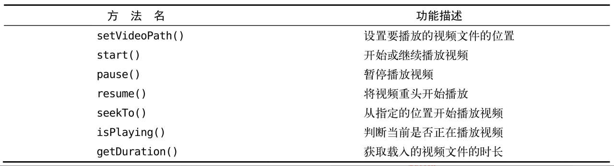

# 运用手机多媒体

## 通知（Notification）

### 通知基本用法

**1. 概述**
通知是Android系统中的一个重要功能，允许应用程序在不处于前台运行时向用户发出提示信息。通知会在手机的状态栏中显示一个图标，用户可以下拉状态栏查看通知的详细内容。Android的通知功能深受用户喜爱，甚至在iOS 5.0版本后也引入了类似功能。

**2. 通知的基本用法**

通知的创建非常灵活，可以在活动（Activity）、广播接收器（BroadcastReceiver）或服务（Service）中进行。但在活动中创建通知的场景较少，通常是在程序进入后台时使用通知。尽管创建通知的地点不同，整体步骤是相同的。

**3. 创建通知的步骤**

- **渠道标识符**
    CHANNEL_ID：这是你在创建通知渠道时定义的标识符，用于将通知关联到特定的通知渠道。它应该是一个字符串，用于管理通知的行为和显示方式

- **通知 ID**
    通知 ID，用于唯一标识这条通知。这个 ID 是一个整数，表示你想要发送或取消的特定通知

- **获取 NotificationManager**
  使用 `getSystemService()` 方法获取通知服务的实例：
  ```java
  NotificationManager notificationManager = (NotificationManager) getSystemService(NOTIFICATION_SERVICE);
  ```

- **在 onCreate 方法中调用 createNotificationChannel() 来创建通知渠道，确保在 Android 8.0 及以上版本中使用通知时不会出现问题**
    ```java
    createNotificationChannel();
    ```

- **使用 NotificationCompat.Builder 创建 Notification 对象**
  使用 `NotificationCompat.Builder` 类创建通知对象：
  ```java
  Notification notification = new NotificationCompat.Builder(this, CHANNEL_ID)
  ```

- **设置通知的内容**
  通过连缀设置方法创建一个丰富的通知对象：
  ```java
  Notification notification = new NotificationCompat.Builder(this, CHANNEL_ID)
                        .setContentTitle("这是内容标题")
                        .setContentText("这是内容文本")
                        .setWhen(System.currentTimeMillis())
                        .setSmallIcon(R.mipmap.ic_launcher)
                        .setLargeIcon(BitmapFactory.decodeResource(getResources(), R.mipmap.ic_launcher))
                        .build();
  ```

  - `setContentTitle()`: 指定通知的标题内容
  - `setContentText()`: 指定通知的正文内容
  - `setWhen()`: 指定通知创建的时间
  - `setSmallIcon()`: 设置通知的小图标，需为纯alpha图层的图片
  - `setLargeIcon()`: 设置通知的大图标

- **显示通知**
  使用 `notify()` 方法显示通知：
  ```java
  manager.notify(1, notification);
  ```

**4. 完整示例**

> demo25

创建一个简单的通知示例，涉及到的代码如下：

- **布局文件 `activity_main.xml`**：
  ```xml
  <LinearLayout xmlns:android="http://schemas.android.com/apk/res/android"
      android:orientation="vertical"
      android:layout_width="match_parent"
      android:layout_height="match_parent">
      <Button
          android:id="@+id/send_notice"
          android:layout_width="wrap_content"
          android:layout_height="wrap_content"
          android:text="Send notice" />
  </LinearLayout>
  ```

- **主活动 `MainActivity.java`**：
  ```java
  public class MainActivity extends AppCompatActivity implements View.OnClickListener {
        private static final String CHANNEL_ID = "notification_channel";

        @Override
        protected void onCreate(Bundle savedInstanceState) {
            super.onCreate(savedInstanceState);
            setContentView(R.layout.activity_main);

            Button sendNotice = findViewById(R.id.send_notice);
            sendNotice.setOnClickListener(this);

            createNotificationChannel(); // 创建通知渠道
        }

        private void createNotificationChannel() {
            if (Build.VERSION.SDK_INT >= Build.VERSION_CODES.O) {
                CharSequence name = "Channel Name";
                String description = "Channel Description";
                int importance = NotificationManager.IMPORTANCE_DEFAULT;
                NotificationChannel channel = new NotificationChannel(CHANNEL_ID, name, importance);
                channel.setDescription(description);
                NotificationManager notificationManager = (NotificationManager) getSystemService(NOTIFICATION_SERVICE);
                notificationManager.createNotificationChannel(channel);
            }
        }

        @Override
        public void onClick(View v) {
            switch (v.getId()) {
                case R.id.send_notice:
                    NotificationManager manager = (NotificationManager) getSystemService(NOTIFICATION_SERVICE);
                    Notification notification = new NotificationCompat.Builder(this, CHANNEL_ID)
                            .setContentTitle("这是内容标题")
                            .setContentText("这是内容文本")
                            .setWhen(System.currentTimeMillis())
                            .setSmallIcon(R.mipmap.ic_launcher)
                            .setLargeIcon(BitmapFactory.decodeResource(getResources(), R.mipmap.ic_launcher))
                            .build();
                    manager.notify(1, notification);
                    break;
                default:
                    break;
            }
        }
    }
  ```
  
***

**PendingIntent 的概念**

PendingIntent 看似与 Intent 相似，两者都能指明某个“意图”，并可用于启动活动、服务或发送广播。但二者的主要区别在于：
- **Intent**：倾向于立即执行某个动作。
- **PendingIntent**：倾向于在适当时机执行某个动作，因此可以理解为延迟执行的 Intent。

**PendingIntent 的用法**

PendingIntent 提供多个静态方法以获取其实例，具体使用如下：
- **getActivity()**：用于启动一个活动。
- **getBroadcast()**：用于发送广播。
- **getService()**：用于启动服务。

每个方法都接收以下参数：
1. **Context**：上下文对象。
2. **请求码**：通常传入 0。
3. **Intent 对象**：用于构建 PendingIntent 的意图。
4. **标志位**：可选择 FLAG_ONE_SHOT、FLAG_NO_CREATE、FLAG_CANCEL_CURRENT 和 FLAG_UPDATE_CURRENT，通常传入 0。

**在 Notification 中使用 PendingIntent**

在 `NotificationCompat.Builder` 中，可以通过 `setContentIntent()` 方法将 PendingIntent 传入。这样，当用户点击通知时，相关的逻辑将会被执行。
***


**5. 添加通知点击功能**

为通知添加点击功能，启动另一个活动。

1. **创建 NotificationActivity**：
   - 在包中右键选择 New → Activity → Empty Activity，命名为 `NotificationActivity`，布局命名为 `notification_layout.xml`。
   - 修改 `notification_layout.xml` 的代码如下：
     ```xml
     <RelativeLayout xmlns:android="http://schemas.android.com/apk/res/android"
         android:layout_width="match_parent"
         android:layout_height="match_parent">
         <TextView
             android:layout_width="wrap_content"
             android:layout_height="wrap_content"
             android:layout_centerInParent="true"
             android:textSize="24sp"
             android:text="This is notification layout"/>
     </RelativeLayout>
     ```

2. **修改 MainActivity 代码**：
   ```java
   public class MainActivity extends AppCompatActivity implements View.OnClickListener {
       @Override
       protected void onCreate(Bundle savedInstanceState) {
           super.onCreate(savedInstanceState);
           setContentView(R.layout.activity_main);

            Button sendNotice = findViewById(R.id.send_notice);
            sendNotice.setOnClickListener(this);
       }

        @Override
        public void onClick(View v) {
        switch (v.getId()) {
            case R.id.send_notice:
                Intent intent = new Intent(this, NotificationActivity.class);
                PendingIntent pi = PendingIntent.getActivity(this, 0, intent, 0);
                NotificationManager manager = (NotificationManager) getSystemService(NOTIFICATION_SERVICE);
                Notification notification = new NotificationCompat.Builder(this, CHANNEL_ID)
                        .setContentTitle("这是内容标题")
                        .setContentText("这是内容文本")
                        .setWhen(System.currentTimeMillis())
                        .setSmallIcon(R.mipmap.ic_launcher)
                        .setLargeIcon(BitmapFactory.decodeResource(getResources(), R.mipmap.ic_launcher))
                        .setContentIntent(pi) // 添加
                        .build();
                manager.notify(1, notification);
                break;
            default:
                break;
        }
     }
   }
   ```

**6. 处理通知的自动取消**

当点击通知后，状态栏上的通知图标默认不会消失。可以通过以下两种方法解决：

1. **使用 `setAutoCancel()`**：
   ```java
   Notification notification = new NotificationCompat.Builder(this)
           ...
           .setAutoCancel(true) // 点击后自动取消
           .build();
   ```

2. **在 `NotificationActivity` 中调用 `cancel()`**：
   ```java
   public class NotificationActivity extends AppCompatActivity {
       @Override
       protected void onCreate(Bundle savedInstanceState) {
           super.onCreate(savedInstanceState);
           setContentView(R.layout.notification_layout);
           NotificationManager manager = (NotificationManager) getSystemService(NOTIFICATION_SERVICE);
           manager.cancel(1); // 根据通知 ID 取消通知
       }
   }
   ```

### 通知的进阶技巧

`NotificationCompat.Builder` 提供了丰富的 API，能够让创建多样的通知效果。

**1. 设置通知声音**

使用 `setSound()` 方法可以在通知发出时播放音频，以更好地告知用户有通知到来。需要获取音频文件对应的 URI。

在 Android 8.0 及以上版本中，设置声音需要在创建通知渠道时进行：

```java
private void createNotificationChannel() {
    if (Build.VERSION.SDK_INT >= Build.VERSION_CODES.O) {
        NotificationChannel channel = new NotificationChannel(CHANNEL_ID, "Channel Name", NotificationManager.IMPORTANCE_DEFAULT);
        channel.setDescription("Channel Description");
        channel.setSound(Uri.fromFile(new File("/system/media/audio/ringtones/Luna.ogg")), null);
        
        NotificationManager notificationManager = getSystemService(NotificationManager.class);
        notificationManager.createNotificationChannel(channel);
    }
}
```

**2. 控制振动**

可以使用 `setVibrate()` 属性让手机在通知到来时进行振动。属性是一个长整型数组，表示静止和振动的时长，以毫秒为单位。

在 Android 8.0 及以上版本中启用振动也需要在通知渠道中设置：

```java
private void createNotificationChannel() {
    if (Build.VERSION.SDK_INT >= Build.VERSION_CODES.O) {
        NotificationChannel channel = new NotificationChannel(CHANNEL_ID, "Channel Name", NotificationManager.IMPORTANCE_DEFAULT);
        channel.setDescription("Channel Description");
        channel.enableVibration(true);
        channel.setVibrationPattern(new long[]{0, 1000, 1000, 1000});
        
        NotificationManager notificationManager = getSystemService(NotificationManager.class);
        notificationManager.createNotificationChannel(channel);
    }
}

// 在发送通知时
Notification notification = new NotificationCompat.Builder(this, CHANNEL_ID)
        ...
        .setVibrate(new long[]{0, 1000, 1000, 1000}) // 兼容性设置
        .build();
```

确保在 `AndroidManifest.xml` 文件中加入权限声明：

```xml
<uses-permission android:name="android.permission.VIBRATE" />
```

**3. 控制 LED 灯显示**

使用 `setLights()` 方法可以控制手机前置 LED 灯的闪烁。

在 Android 8.0 及以上版本中，LED 灯设置应在通知渠道中进行：

```java
private void createNotificationChannel() {
    if (Build.VERSION.SDK_INT >= Build.VERSION_CODES.O) {
        NotificationChannel channel = new NotificationChannel(CHANNEL_ID, "Channel Name", NotificationManager.IMPORTANCE_DEFAULT);
        channel.setDescription("Channel Description");
        channel.enableLights(true);
        channel.setLightColor(Color.GREEN);
        
        NotificationManager notificationManager = getSystemService(NotificationManager.class);
        notificationManager.createNotificationChannel(channel);
    }
}

// 在发送通知时
Notification notification = new NotificationCompat.Builder(this, CHANNEL_ID)
        ...
        .setLights(Color.GREEN, 1000, 1000) // 兼容性设置
        .build();
```

**4. 使用默认效果**

如果不想进行繁琐的设置，可以使用默认效果：

```java
Notification notification = new NotificationCompat.Builder(this, CHANNEL_ID)
        ...
        .setDefaults(NotificationCompat.DEFAULT_ALL)
        .build();
```

**注意事项**

- 上述进阶技巧需要在真实设备上测试，模拟器无法显示振动和 LED 灯等功能。
- 确保在 Android 8.0 及以上版本中创建通知渠道，并根据需要设置声音、振动和 LED 灯效果。

```java
public class MainActivity extends AppCompatActivity implements View.OnClickListener {
    private static final String CHANNEL_ID = "notification_channel";

    @Override
    protected void onCreate(Bundle savedInstanceState) {
        super.onCreate(savedInstanceState);
        setContentView(R.layout.activity_main);

        Button sendNotice = findViewById(R.id.send_notice);
        sendNotice.setOnClickListener(this);

        createNotificationChannel(); // 创建通知渠道
    }

    private void createNotificationChannel() {
        if (Build.VERSION.SDK_INT >= Build.VERSION_CODES.O) {
            NotificationChannel channel = new NotificationChannel(CHANNEL_ID, "Channel Name", NotificationManager.IMPORTANCE_DEFAULT);
            channel.setDescription("Channel Description");

            channel.setSound(Uri.fromFile(new File("/system/media/audio/ringtones/Luna.ogg")), null);

            channel.enableVibration(true);
            channel.setVibrationPattern(new long[]{0, 1000, 1000, 1000});

            channel.enableLights(true);
            channel.setLightColor(Color.GREEN);

            NotificationManager notificationManager = getSystemService(NotificationManager.class);
            notificationManager.createNotificationChannel(channel);
        }
    }

    @Override
    public void onClick(View v) {
        switch (v.getId()) {
            case R.id.send_notice:
                Intent intent = new Intent(this, NotificationActivity.class);
                PendingIntent pi = PendingIntent.getActivity(this, 0, intent, PendingIntent.FLAG_UPDATE_CURRENT);

                NotificationManager manager = (NotificationManager) getSystemService(NOTIFICATION_SERVICE);
                Notification notification = new NotificationCompat.Builder(this, CHANNEL_ID)
                        .setContentTitle("这是内容标题")
                        .setContentText("这是内容文本")
                        .setWhen(System.currentTimeMillis())
                        .setSmallIcon(R.mipmap.ic_launcher)
                        .setLargeIcon(BitmapFactory.decodeResource(getResources(), R.mipmap.ic_launcher))
                        .setContentIntent(pi) // 点击后打开的活动
                        .setAutoCancel(true) // 点击后自动取消
                        .setVibrate(new long[]{0, 1000, 1000, 1000}) // 兼容性
                        .setLights(Color.GREEN, 1000, 1000) // 兼容性
//                        .setDefaults(NotificationCompat.DEFAULT_ALL) // 使用默认效果
                        .build();

                manager.notify(1, notification);
                break;
            default:
                break;
        }
    }
}
```

### 通知的高级功能

在 `NotificationCompat.Builder` 类中，还有更加强大的 API，以构建更加丰富的通知效果。

**1. 使用 `setStyle()` 方法**

`setStyle()` 方法允许构建富文本的通知内容，这意味着通知中不仅可以包含文字和图标，还可以加入更多元素，例如长文本和图片。该方法接收一个 `NotificationCompat.Style` 参数，用于构建具体的富文本信息。

**长文本示例**

可以尝试设置较长的文字内容：

```java
Notification notification = new NotificationCompat.Builder(this)
        ...
        .setContentText("Learn how to build notifications, send and sync data, and use voice actions. Get the official Android IDE and developer tools to build apps for Android.")
        ...
        .build();
```

运行程序并触发通知后，您会发现通知内容无法完全显示，超出部分会用省略号替代。这是因为通知内容应该言简意赅，详细信息可以放在点击后打开的活动中。

如果需要在通知中显示长文本，Android 提供了支持。使用 `setStyle()` 方法如下：

```java
Notification notification = new NotificationCompat.Builder(this)
        ...
        .setStyle(new NotificationCompat.BigTextStyle().bigText("Learn how to build notifications, send and sync data, and use voice actions. Get the official Android IDE and developer tools to build apps for Android."))
        .build();
```

这里创建了一个 `NotificationCompat.BigTextStyle` 对象，调用其 `bigText()` 方法并传入长文本。

**大图片示例**

除了长文本，通知中还可以显示大图片，使用方法相似：

```java
Notification notification = new NotificationCompat.Builder(this)
        ...
        .setStyle(new NotificationCompat.BigPictureStyle().bigPicture(BitmapFactory.decodeResource(getResources(), R.drawable.big_image)))
        .build();
```

在这里，创建了一个 `NotificationCompat.BigPictureStyle` 对象，并调用其 `bigPicture()` 方法传入图片。通过 `BitmapFactory.decodeResource()` 方法将图片解析成 `Bitmap` 对象。

**2. 使用 `setPriority()` 方法**

 `setPriority()` 方法，用于设置通知的重要程度。该方法接收一个整型参数，表示通知的重要程度，有五个常量值可选：

- `PRIORITY_DEFAULT`：默认重要程度，效果与不设置相同
- `PRIORITY_MIN`：最低重要程度，可能只在特定场景显示
- `PRIORITY_LOW`：较低重要程度，可能会缩小显示或排在后面
- `PRIORITY_HIGH`：较高重要程度，可能会放大或排在前面
- `PRIORITY_MAX`：最高重要程度，用户必须立即看到

具体写法如下：

```java
Notification notification = new NotificationCompat.Builder(this)
        ...
        .setPriority(NotificationCompat.PRIORITY_MAX)
        .build();
```

将通知的重要程度设置为最高，表示这是一条非常重要的通知，用户必须立刻看到。重新运行程序并点击发送通知按钮，这次通知会弹出一个横幅，附带详细内容，无论用户在做什么，都会引起注意。

**注意事项**

使用高优先级通知时需谨慎，确保内容确实重要，以免引起用户反感，导致应用程序被卸载。

## 调用摄像头和相册

在日常使用 QQ 或微信时，经常需要与他人分享图片，这些图片可能来自手机摄像头或相册。几乎每个应用程序都会包含这种功能。

### 调用摄像头拍照

> demo26

**1. 调用摄像头拍照**

许多应用会要求用户上传图片作为头像，打开摄像头拍照是最简单的方式。以下是如何在应用程序中调用手机摄像头拍照的示例：

**步骤一：修改布局文件**

在 `activity_main.xml` 中添加以下代码：

```xml
<LinearLayout xmlns:android="http://schemas.android.com/apk/res/android"
    android:orientation="vertical"
    android:layout_width="match_parent"
    android:layout_height="match_parent" >
    <Button
        android:id="@+id/take_photo"
        android:layout_width="match_parent"
        android:layout_height="wrap_content"
        android:text="Take Photo" />
    <ImageView
        android:id="@+id/picture"
        android:layout_width="wrap_content"
        android:layout_height="wrap_content"
        android:layout_gravity="center_horizontal" />
</LinearLayout>
```

该布局包含一个按钮用于打开摄像头，以及一个 ImageView 用于显示拍摄的图片。

**步骤二：编写调用摄像头的逻辑**

在 `MainActivity` 中添加以下代码：

```java
public class MainActivity extends AppCompatActivity {
    private ImageView picture;
    private Uri imageUri;

    // ActivityResultLauncher用于处理拍照结果
    private ActivityResultLauncher<Intent> takePhotoLauncher;

    @Override
    protected void onCreate(Bundle savedInstanceState) {
        super.onCreate(savedInstanceState);
        setContentView(R.layout.activity_main);

        Button takePhoto = findViewById(R.id.take_photo);
        picture = findViewById(R.id.picture);

        // 初始化 ActivityResultLauncher
        takePhotoLauncher = registerForActivityResult(
                new ActivityResultContracts.StartActivityForResult(),
                result -> {
                    if (result.getResultCode() == RESULT_OK) {
                        try {
                            // 显示拍摄的照片
                            Bitmap bitmap = BitmapFactory.decodeStream(getContentResolver().openInputStream(imageUri));
                            picture.setImageBitmap(bitmap);
                        } catch (FileNotFoundException e) {
                            e.printStackTrace();
                        }
                    }
                }
        );

        takePhoto.setOnClickListener(new View.OnClickListener() {
            @Override
            public void onClick(View v) {
                File outputImage = new File(getExternalCacheDir(), "output_image.jpg");
                try {
                    if (outputImage.exists()) {
                        outputImage.delete();
                    }
                    outputImage.createNewFile();
                } catch (IOException e) {
                    e.printStackTrace();
                }

                // 处理不同版本的URI获取
                if (Build.VERSION.SDK_INT >= 24) {
                    imageUri = FileProvider.getUriForFile(MainActivity.this,
                            "com.example.demo26.fileprovider", outputImage);
                } else {
                    imageUri = Uri.fromFile(outputImage);
                }

                // 启动相机程序
                Intent intent = new Intent(MediaStore.ACTION_IMAGE_CAPTURE);
                intent.putExtra(MediaStore.EXTRA_OUTPUT, imageUri);
                takePhotoLauncher.launch(intent); // 使用新的 launcher 启动
            }
        });
    }
}
```

**步骤三：添加依赖**

```
implementation 'androidx.core:core:1.6.0'
```

**2. 注册内容提供器**

在 `AndroidManifest.xml` 中注册内容提供器，代码如下：

```xml
<manifest xmlns:android="http://schemas.android.com/apk/res/android"
    package="com.example.cameraalbumtest">
    <application
        android:allowBackup="true"
        android:icon="@mipmap/ic_launcher"
        android:label="@string/app_name"
        android:supportsRtl="true"
        android:theme="@style/AppTheme">
        ...
        <provider
            android:name="androidx.core.content.FileProvider"
            android:authorities="com.example.demo26.fileprovider"
            android:exported="false"
            android:grantUriPermissions="true">
            <meta-data
                android:name="android.support.FILE_PROVIDER_PATHS"
                android:resource="@xml/file_paths" />
        </provider>
    </application>
</manifest>
```

- `android:name` 属性的值固定，`android:authorities` 属性必须与 `getUriForFile()` 方法中的字符串一致。
- 在 `<provider>` 标签内使用 `<meta-data>` 指定 Uri 的共享路径，并引用 `file_paths.xml`。

**步骤三：创建 file_paths.xml**

在 `res/xml` 目录下创建 `file_paths.xml` 文件，内容如下：

```xml
<?xml version="1.0" encoding="utf-8"?>
<paths xmlns:android="http://schemas.android.com/apk/res/android">
    <external-path name="my_images" path="." />
</paths>
```

`external-path` 用于指定 Uri 共享的路径，设置为`.`表示共享整个 SD 卡。

**3. 声明权限**

在 `AndroidManifest.xml` 中声明写入外部存储的权限：

```xml
<manifest xmlns:android="http://schemas.android.com/apk/res/android"
    package="com.example.cameraalbumtest">
    <uses-permission android:name="android.permission.WRITE_EXTERNAL_STORAGE" />
    ...
</manifest>
```

这样，代码就编写完毕。运行程序并点击 "Take Photo" 按钮即可进行拍照，拍摄的照片将显示在应用界面上。

### 从相册中选择照片

> demo27

1. 修改布局文件 `activity_main.xml`

在布局中添加一个按钮用于从相册中选择照片，代码如下：

```xml
<LinearLayout xmlns:android="http://schemas.android.com/apk/res/android"
    android:orientation="vertical"
    android:layout_width="match_parent"
    android:layout_height="match_parent">

    <Button
        android:id="@+id/take_photo"
        android:layout_width="match_parent"
        android:layout_height="wrap_content"
        android:text="Take Photo" />

    <Button
        android:id="@+id/choose_from_album"
        android:layout_width="match_parent"
        android:layout_height="wrap_content"
        android:text="Choose From Album" />

    <ImageView
        android:id="@+id/picture"
        android:layout_width="wrap_content"
        android:layout_height="wrap_content"
        android:layout_gravity="center_horizontal" />
</LinearLayout>
```

**2. 修改 `MainActivity.java`**

在 `MainActivity` 中加入从相册选择照片的逻辑，代码如下：

```java
public class MainActivity extends AppCompatActivity {

    private ImageView picture;
    private Uri imageUri;

    // ActivityResultLauncher用于处理拍照结果
    private ActivityResultLauncher<Intent> takePhotoLauncher;
    private ActivityResultLauncher<Intent> albumLauncher;

    @Override
    protected void onCreate(Bundle savedInstanceState) {
        super.onCreate(savedInstanceState);
        setContentView(R.layout.activity_main);

        Button takePhoto = findViewById(R.id.take_photo);
        Button chooseFromAlbum = findViewById(R.id.choose_from_album);
        picture = findViewById(R.id.picture);

        // 初始化 ActivityResultLauncher
        takePhotoLauncher = registerForActivityResult(
                new ActivityResultContracts.StartActivityForResult(),
                result -> {
                    if (result.getResultCode() == RESULT_OK) {
                        try {
                            // 显示拍摄的照片
                            Bitmap bitmap = BitmapFactory.decodeStream(getContentResolver().openInputStream(imageUri));
                            picture.setImageBitmap(bitmap);
                        } catch (FileNotFoundException e) {
                            e.printStackTrace();
                        }
                    }
                }
        );

        takePhoto.setOnClickListener(v -> {
            File outputImage = new File(getExternalCacheDir(), "output_image.jpg");
            try {
                if (outputImage.exists()) {
                    outputImage.delete();
                }
                outputImage.createNewFile();
            } catch (IOException e) {
                e.printStackTrace();
            }

            // 处理不同版本的URI获取
            if (Build.VERSION.SDK_INT >= 24) {
                imageUri = FileProvider.getUriForFile(MainActivity.this,
                        "com.example.demo27.fileprovider", outputImage);
            } else {
                imageUri = Uri.fromFile(outputImage);
            }

            // 启动相机程序
            Intent intent = new Intent(MediaStore.ACTION_IMAGE_CAPTURE);
            intent.putExtra(MediaStore.EXTRA_OUTPUT, imageUri);
            takePhotoLauncher.launch(intent); // 使用新的 launcher 启动
        });

        // 初始化 ActivityResultLauncher
        albumLauncher = registerForActivityResult(
                new ActivityResultContracts.StartActivityForResult(),
                result -> {
                    if (result.getResultCode() == RESULT_OK) {
                        Intent data = result.getData();
                        if (data != null) {
                            if (Build.VERSION.SDK_INT >= 19) {
                                handleImageOnKitKat(data);
                            } else {
                                handleImageBeforeKitKat(data);
                            }
                        }
                    }
                }
        );

        chooseFromAlbum.setOnClickListener(v -> {
            if (ContextCompat.checkSelfPermission(MainActivity.this,
                    Manifest.permission.WRITE_EXTERNAL_STORAGE) != PackageManager.PERMISSION_GRANTED) {
                ActivityCompat.requestPermissions(MainActivity.this,
                        new String[]{Manifest.permission.WRITE_EXTERNAL_STORAGE}, 1);
            } else {
                openAlbum();
            }
        });
    }

    private void openAlbum() {
        Intent intent = new Intent(Intent.ACTION_GET_CONTENT);
        intent.setType("image/*");
        albumLauncher.launch(intent); // 使用 ActivityResultLauncher 打开相册
    }

    @Override
    public void onRequestPermissionsResult(int requestCode, String[] permissions, int[] grantResults) {
        super.onRequestPermissionsResult(requestCode, permissions, grantResults);
        if (requestCode == 1) {
            if (grantResults.length > 0 && grantResults[0] == PackageManager.PERMISSION_GRANTED) {
                openAlbum();
            } else {
                Toast.makeText(this, "Permission denied", Toast.LENGTH_SHORT).show();
            }
        }
    }

    @TargetApi(19)
    private void handleImageOnKitKat(Intent data) {
        String imagePath = null;
        Uri uri = data.getData();
        if (DocumentsContract.isDocumentUri(this, uri)) {
            String docId = DocumentsContract.getDocumentId(uri);
            if ("com.android.providers.media.documents".equals(uri.getAuthority())) {
                String id = docId.split(":")[1]; // 解析出数字格式的id
                String selection = MediaStore.Images.Media._ID + "=" + id;
                imagePath = getImagePath(MediaStore.Images.Media.EXTERNAL_CONTENT_URI, selection);
            } else if ("com.android.providers.downloads.documents".equals(uri.getAuthority())) {
                Uri contentUri = ContentUris.withAppendedId(Uri.parse("content://downloads/public_downloads"), Long.valueOf(docId));
                imagePath = getImagePath(contentUri, null);
            }
        } else if ("content".equalsIgnoreCase(uri.getScheme())) {
            imagePath = getImagePath(uri, null);
        } else if ("file".equalsIgnoreCase(uri.getScheme())) {
            imagePath = uri.getPath();
        }
        displayImage(imagePath); // 根据图片路径显示图片
    }

    private void handleImageBeforeKitKat(Intent data) {
        Uri uri = data.getData();
        String imagePath = getImagePath(uri, null);
        displayImage(imagePath);
    }

    private String getImagePath(Uri uri, String selection) {
        String path = null;
        Cursor cursor = getContentResolver().query(uri, null, selection, null, null);
        if (cursor != null) {
            if (cursor.moveToFirst()) {
                path = cursor.getString(cursor.getColumnIndex(MediaStore.Images.Media.DATA));
            }
            cursor.close();
        }
        return path;
    }

    private void displayImage(String imagePath) {
        if (imagePath != null) {
            Bitmap bitmap = BitmapFactory.decodeFile(imagePath);
            picture.setImageBitmap(bitmap);
        } else {
            picture.setImageDrawable(null); // 清空图片显示
            Toast.makeText(this, "Failed to get image", Toast.LENGTH_SHORT).show();
        }
    }
}
```

**代码分析**

* **1. 布局文件**
    布局文件中添加了两个按钮和一个 `ImageView`，用于实现用户与应用的交互：
        - **拍照按钮**：点击后启动相机应用，并指定存储拍照图片的路径。
        - **选择相册按钮**：打开相册，允许用户选择已有的图片。

* **2. 权限请求**
    在 Android 6.0 及以上版本，动态权限管理是必需的。在选择相册前检查是否有写入外部存储的权限，并在权限未被授予时请求权限，这种方式确保了应用在访问用户的存储数据时是合规的。
* **3. 打开相册**
    使用 `Intent.ACTION_GET_CONTENT` 来打开相册，这种方式相对简单易用。返回结果时通过 `ActivityResultLauncher` 处理选中的图片，可以避免传统的 `onActivityResult` 方法，增强了代码的可读性和可维护性。
* **4. 处理不同版本**
    通过 `DocumentsContract.isDocumentUri` 和 URI 的 authority 来判断图片来源，确保可以正确处理 Android 4.4（API 19）及更高版本的不同 URI 格式。这种做法提升了应用的兼容性，避免了潜在的崩溃。
* **5. 获取真实路径**
    `getImagePath` 方法从 URI 中获取真实路径，并在 `displayImage` 方法中将图片显示在 `ImageView` 中。通过 `BitmapFactory.decodeFile` 加载图片，确保了在 `ImageView` 中的高效显示。

**3. 注意事项**

- 确保在 `AndroidManifest.xml` 中声明必要的权限：

```xml
<uses-permission android:name="android.permission.WRITE_EXTERNAL_STORAGE"/>
<uses-permission android:name="android.permission.READ_EXTERNAL_STORAGE"/>
```

- 由于 Android 6.0 及以上版本需要动态请求权限，请确保用户授予相关权限后才能访问相册中的图片。

## 播放多媒体文件

### 播放音频

> demo28

在 Android 中，播放音频文件通常使用 `MediaPlayer` 类，该类提供了对多种格式音频文件的全面控制，使得播放音乐变得简单。下面是对 `MediaPlayer` 类常用控制方法的简要总结。


**1. `MediaPlayer` 工作流程**

1. **创建实例**：首先需要创建一个 `MediaPlayer` 对象。
2. **设置数据源**：调用 `setDataSource()` 方法设置音频文件的路径。
3. **准备**：使用 `prepare()` 方法使 `MediaPlayer` 进入准备状态。
4. **播放**：调用 `start()` 方法开始播放音频。
5. **暂停**：调用 `pause()` 方法暂停播放。
6. **停止**：调用 `reset()` 方法停止播放。

**2. 布局文件**

在 `activity_main.xml` 中，添加三个按钮和一个 `ImageView` 用于实现音频控制：

```xml
<LinearLayout xmlns:android="http://schemas.android.com/apk/res/android"
    android:orientation="vertical"
    android:layout_width="match_parent"
    android:layout_height="match_parent">
    
    <Button
        android:id="@+id/play"
        android:layout_width="match_parent"
        android:layout_height="wrap_content"
        android:text="Play" />
    
    <Button
        android:id="@+id/pause"
        android:layout_width="match_parent"
        android:layout_height="wrap_content"
        android:text="Pause" />
    
    <Button
        android:id="@+id/stop"
        android:layout_width="match_parent"
        android:layout_height="wrap_content"
        android:text="Stop" />
</LinearLayout>
```

**3. MainActivity 实现**

在 `MainActivity.java` 中，编写音频控制逻辑：

```java
public class MainActivity extends AppCompatActivity implements View.OnClickListener {
    private MediaPlayer mediaPlayer = new MediaPlayer();

    @Override
    protected void onCreate(Bundle savedInstanceState) {
        super.onCreate(savedInstanceState);
        setContentView(R.layout.activity_main);

        Button play = findViewById(R.id.play);
        Button pause = findViewById(R.id.pause);
        Button stop = findViewById(R.id.stop);

        play.setOnClickListener(this);
        pause.setOnClickListener(this);
        stop.setOnClickListener(this);

        if (ContextCompat.checkSelfPermission(MainActivity.this, Manifest.permission.WRITE_EXTERNAL_STORAGE) != PackageManager.PERMISSION_GRANTED) {
            ActivityCompat.requestPermissions(MainActivity.this, new String[]{Manifest.permission.WRITE_EXTERNAL_STORAGE}, 1);
        } else {
            initMediaPlayer(); // 初始化MediaPlayer
        }
    }

    private void initMediaPlayer() {
        try {
            File file = new File(Environment.getExternalStorageDirectory(), "music.mp3");
            if (file.exists()) { // 检查文件是否存在
                mediaPlayer.setDataSource(file.getPath()); // 指定音频文件的路径
                mediaPlayer.prepare(); // 让MediaPlayer进入到准备状态
            } else {
                Toast.makeText(this, "音频文件不存在", Toast.LENGTH_SHORT).show();
            }
        } catch (Exception e) {
            e.printStackTrace();
        }
    }

    @Override
    public void onRequestPermissionsResult(int requestCode, String[] permissions, int[] grantResults) {
        super.onRequestPermissionsResult(requestCode, permissions, grantResults);
        switch (requestCode) {
            case 1:
                if (grantResults.length > 0 && grantResults[0] == PackageManager.PERMISSION_GRANTED) {
                    initMediaPlayer();
                } else {
                    Toast.makeText(this, "拒绝权限将无法使用程序", Toast.LENGTH_SHORT).show();
                    finish();
                }
                break;
            default:
                break;
        }
    }

    @Override
    public void onClick(View v) {
        switch (v.getId()) {
            case R.id.play:
                try {
                    if (!mediaPlayer.isPlaying()) {
                        mediaPlayer.start(); // 开始播放
                    }
                } catch (IllegalStateException e) {
                    e.printStackTrace();
                    Toast.makeText(this, "播放失败，请重试", Toast.LENGTH_SHORT).show();
                }
                break;

            case R.id.pause:
                try {
                    if (mediaPlayer.isPlaying()) {
                        mediaPlayer.pause(); // 暂停播放
                    }
                } catch (IllegalStateException e) {
                    e.printStackTrace();
                    Toast.makeText(this, "暂停失败，请重试", Toast.LENGTH_SHORT).show();
                }
                break;

            case R.id.stop:
                try {
                    if (mediaPlayer.isPlaying()) {
                        mediaPlayer.stop(); // 停止播放
                        mediaPlayer.prepare(); // 准备重新播放
                    }
                } catch (Exception e) {
                    e.printStackTrace();
                    Toast.makeText(this, "停止失败，请重试", Toast.LENGTH_SHORT).show();
                }
                break;

            default:
                break;
        }
    }

    @Override
    protected void onDestroy() {
        super.onDestroy();
        if (mediaPlayer != null) {
            mediaPlayer.stop();
            mediaPlayer.release(); // 释放MediaPlayer资源
        }
    }
}
```

**4. 权限声明**

在 `AndroidManifest.xml` 中声明所需权限：

```xml
<manifest xmlns:android="http://schemas.android.com/apk/res/android"
    package="com.example.playaudiotest">
    <uses-permission android:name="android.permission.WRITE_EXTERNAL_STORAGE" />
    ...
</manifest>
```

**5. 使用说明**

完成以上步骤后，可以在手机上运行程序，首先弹出权限申请框，用户同意授权后即可开始播放音乐。点击 **Play** 按钮，音乐开始播放；点击 **Pause** 按钮，音乐暂停；再次点击 **Play** 按钮，音乐会继续播放；点击 **Stop** 按钮，音乐停止，重新点击 **Play** 按钮时，音乐将从头开始播放。

### 播放视频

> demo29

播放视频文件主要使用 `VideoView` 类来实现。

`VideoView` 将视频的显示和控制功能集成在一起，使用它可以轻松构建一个简单的视频播放器。`VideoView` 的用法与 `MediaPlayer` 类似，常用方法也很相似。



**1. 布局文件**

首先，需要定义布局文件，其中包含三个按钮用于控制视频的播放、暂停和重新播放，此外还需要一个 `VideoView` 用于显示视频。

**activity_main.xml**:

```xml
<LinearLayout xmlns:android="http://schemas.android.com/apk/res/android"
    android:orientation="vertical"
    android:layout_width="match_parent"
    android:layout_height="match_parent">
    
    <!-- 控制按钮 -->
    <LinearLayout
        android:layout_width="match_parent"
        android:layout_height="wrap_content">
        
        <Button
            android:id="@+id/play"
            android:layout_width="0dp"
            android:layout_height="wrap_content"
            android:layout_weight="1"
            android:text="Play" />
            
        <Button
            android:id="@+id/pause"
            android:layout_width="0dp"
            android:layout_height="wrap_content"
            android:layout_weight="1"
            android:text="Pause" />
            
        <Button
            android:id="@+id/replay"
            android:layout_width="0dp"
            android:layout_height="wrap_content"
            android:layout_weight="1"
            android:text="Replay" />
    </LinearLayout>

    <!-- 视频展示区域 -->
    <VideoView
        android:id="@+id/video_view"
        android:layout_width="match_parent"
        android:layout_height="wrap_content" />
</LinearLayout>
```

**2. MainActivity 代码**

接下来，在 `MainActivity` 中，需要设置视频路径并处理按钮的点击事件。


```java
    private VideoView videoView;

    @Override
    protected void onCreate(Bundle savedInstanceState) {
        super.onCreate(savedInstanceState);
        setContentView(R.layout.activity_main);

        videoView = findViewById(R.id.video_view);
        Button play = findViewById(R.id.play);
        Button pause = findViewById(R.id.pause);
        Button replay = findViewById(R.id.replay);

        play.setOnClickListener(this);
        pause.setOnClickListener(this);
        replay.setOnClickListener(this);

        checkPermissions();
    }

    private void checkPermissions() {
        if (ContextCompat.checkSelfPermission(MainActivity.this, Manifest.permission.WRITE_EXTERNAL_STORAGE) != PackageManager.PERMISSION_GRANTED) {
            ActivityCompat.requestPermissions(MainActivity.this, new String[]{Manifest.permission.WRITE_EXTERNAL_STORAGE}, 1);
        } else {
            initVideoPath(); // 权限已经授权，初始化视频路径
        }
    }

    private void initVideoPath() {
        File file = new File(Environment.getExternalStorageDirectory(), "movie.mp4");
        if (file.exists()) {
            videoView.setVideoPath(file.getPath()); // 设置视频文件的路径
        } else {
            Toast.makeText(this, "视频文件不存在", Toast.LENGTH_SHORT).show();
        }
    }

    @Override
    public void onRequestPermissionsResult(int requestCode, String[] permissions, int[] grantResults) {
        super.onRequestPermissionsResult(requestCode, permissions, grantResults);
        if (requestCode == 1) {
            if (grantResults.length > 0 && grantResults[0] == PackageManager.PERMISSION_GRANTED) {
                initVideoPath(); // 权限授权后设置视频路径
            } else {
                Toast.makeText(this, "拒绝权限将无法使用程序", Toast.LENGTH_SHORT).show();
                finish(); // 权限未授权则退出应用
            }
        }
    }

    @Override
    public void onClick(View v) {
        switch (v.getId()) {
            case R.id.play:
                if (!videoView.isPlaying()) {
                    videoView.start(); // 开始播放
                }
                break;
            case R.id.pause:
                if (videoView.isPlaying()) {
                    videoView.pause(); // 暂停播放
                }
                break;
            case R.id.replay:
                if (videoView.isPlaying()) {
                    videoView.resume(); // 从暂停的位置恢复播放
                } else {
                    videoView.seekTo(0); // 重置到视频开头
                    videoView.start(); // 从头开始播放
                }
                break;
        }
    }

    @Override
    protected void onDestroy() {
        super.onDestroy();
        if (videoView != null) {
            videoView.stopPlayback(); // 停止播放并释放资源
        }
    }
}

```

**3. 权限声明**

在 `AndroidManifest.xml` 中声明访问外部存储的权限，确保可以读取存储中的视频文件。

```xml
<manifest xmlns:android="http://schemas.android.com/apk/res/android"
    package="com.example.playvideotest">
    
    <!-- 外部存储访问权限 -->
    <uses-permission android:name="android.permission.WRITE_EXTERNAL_STORAGE" />
    
    <application
        android:allowBackup="true"
        android:icon="@mipmap/ic_launcher"
        android:label="@string/app_name"
        android:theme="@style/AppTheme">
        ...
    </application>
</manifest>
```

**4. VideoView 使用注意事项**

1. **基本原理**：
   - `VideoView` 是一个对 `MediaPlayer` 的封装，简化了视频播放的操作，使用起来比 `MediaPlayer` 更加便捷。虽然它封装了很多细节，但底层仍然是通过 `MediaPlayer` 控制视频的播放。

2. **适用场景**：
   - `VideoView` 适用于简单的视频播放需求，例如游戏片头动画、应用的广告视频或宣传片等。它非常适合那些不需要复杂功能的视频播放场景。

3. **局限性**：
   - **视频格式支持**：`VideoView` 对视频格式的支持有限，某些高效的流媒体协议或复杂的编码格式可能无法流畅播放。
   - **播放效率**：相比于更专业的播放器库（如 `ExoPlayer`），`VideoView` 在播放效率和流媒体支持上较为基础，因此不适合用来开发功能复杂的播放器应用。

4. **性能与功能扩展**：
   - 如果需要更多高级功能（如多种流媒体协议支持、精细化的播放控制等），可以考虑使用 `MediaPlayer` 或更专业的视频播放库，如 **ExoPlayer**，这些库能提供更高的效率和灵活性。

5. **内存和资源管理**：
   - 在使用 `VideoView` 时，要确保在 `onDestroy()` 等生命周期方法中释放资源（调用 `stopPlayback()` 或 `suspend()`），以避免内存泄漏。
