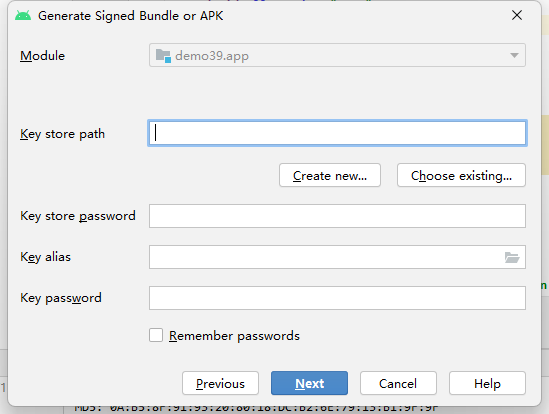
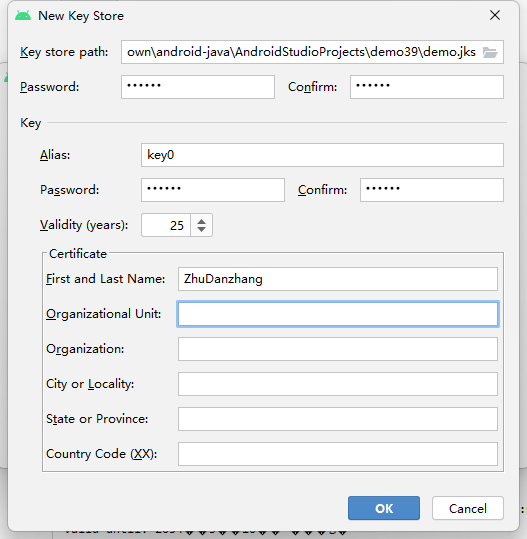
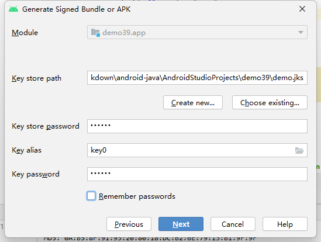
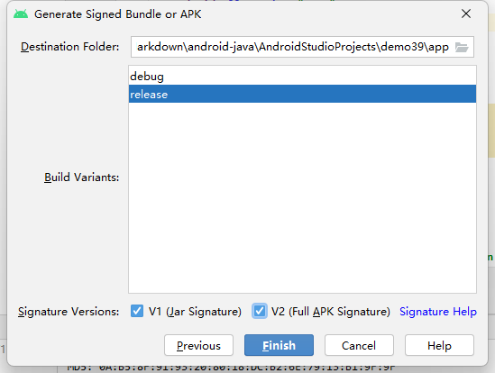
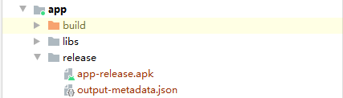
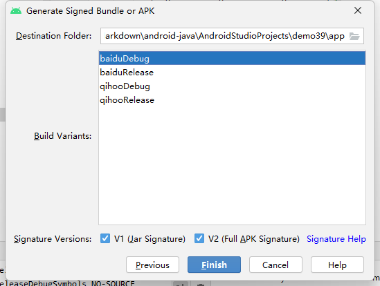

# 将应用发布到360应用商店

**应用推广与发布**

应用开发完成后，下一步需要考虑推广工作，特别是如何让更多用户知道并使用应用程序。在手机领域，最常见的做法是将程序发布到应用商店。这样，用户就能通过商店找到应用，并轻松下载和安装。

**应用商店选择**

在 Android 领域，应用商店可谓百家争鸣，除了 Google 官方的 Google Play 外，中国还有许多知名的应用商店，比如 360、豌豆荚、百度、应用宝等。

虽然这些商店的功能大同小异，发布应用的方法也相似。

## 生成正式签名的 APK 文件

在开发过程中，通常是通过 Android Studio 将程序安装到手机上的。具体流程如下：

1. **Android Studio 打包 APK**  
   Android Studio 会将程序代码打包成一个 APK 文件，然后将这个文件传输到手机上，并执行安装操作。

2. **APK 文件的安装要求**  
   Android 系统会将所有的 APK 文件识别为应用程序的安装包，类似于 Windows 系统中的 EXE 文件。然而，并非所有 APK 文件都能成功安装，Android 系统要求只有 **签名后的 APK 文件** 才能安装。

3. **默认签名的 `debug.keystore` 文件**  
   **疑问**：直接通过 Android Studio 来运行程序时似乎并没有进行签名操作，为什么还能将程序安装到手机上呢？  
   这是因为 Android Studio 在开发阶段使用了一个默认的 `keystore` 文件（即 `debug.keystore`），并自动为 APK 文件进行签名。

   可以通过以下步骤查看默认的 `keystore` 文件：
   - 在 Android Studio 中点击右侧工具栏的 `Gradle → 项目名 → :app → Tasks → android`，双击 `signingReport`，就可以查看默认的签名信息（如图15-1所示）。

   **注意：** 这种签名方式只适用于开发阶段。

4. **发布时需要使用正式签名的 `keystore` 文件**  
   当项目准备发布时，必须使用正式的 `keystore` 文件对 APK 文件进行签名，而不能继续使用开发阶段的 `debug.keystore` 文件


### 使用Android Studio生成正式签名的 APK 文件

**生成签名 APK 的步骤**

1. **启动生成签名 APK**  
   打开 Android Studio，点击导航栏上的 `Build → Generate Signed Bundle or APK`。选择 `APK`

2. **创建签名 APK 对话框**  
   随后会弹出一个对话框，用于创建签名 APK。如果还没有一个正式的 `keystore` 文件，可以点击 `Create new` 按钮。
   

3. **填写 keystore 文件信息**  
   点击 `Create new` 后，会弹出一个新的对话框，要求填写创建 `keystore` 文件所需的信息。根据实际情况填写即可：
   - **Validity**：这是 `keystore` 文件的有效期，单位是年。建议填写较长的时间，例如 30 年。
   - 

4. **确认信息并保存**  
   点击 `OK` 后，刚才填写的 `keystore` 信息会自动填充到创建签名 APK 的对话框中。如果希望以后不再输入 `keystore` 密码，可以勾选 `Remember passwords` 选项。
   

5. **选择 APK 输出地址**  
   点击 `Next` 后，选择 APK 文件的输出路径。默认情况下，APK 会生成到项目的根目录下，通常无需修改。
   建议勾选签名校验
   

6. **生成 APK 文件**  
   点击 `Finish` 后，稍等片刻，APK 文件就会生成成功，并且会在右上角弹出提示
   
   可以点击提示中的 `Show in Explorer` 查看生成的 APK 文件
    - 在文件夹中，生成的 APK 文件通常名为 `app-release.apk`，这就是带有正式签名的 APK 文件。
    


### 使用 Gradle 生成正式签名的 APK 文件

在 **Android Studio** 中，除了使用可视化工具生成签名的 APK 文件，还可以使用 **Gradle** 来实现相同的功能。

Gradle 是一个强大的构建工具，广泛用于 Android 项目中，帮助管理构建流程、依赖关系等。

**1. 配置 `build.gradle` 文件**

首先，需要在 `app/build.gradle` 文件中配置签名信息

找到 `android` 闭包，添加 `signingConfigs` 和 `buildTypes` 配置

- `signingConfigs` 配置了签名的必要信息，包括 keystore 路径、密码、密钥别名等
- `buildTypes.release` 中应用了这个签名配置，以便在生成 **release** 版本的 APK 时使用这些信息

```groovy
signingConfigs {
        config {
            storeFile file('C:/Users/Administrator/Desktop/Markdown/android-java/AndroidStudioProjects/demo39/demo1.jks')  // keystore 文件路径
            storePassword '123456'  // keystore 密码
            keyAlias 'key1'     // 密钥别名
            keyPassword '123456'    // 密钥密码
        }
    }
    buildTypes {
        release {
            minifyEnabled false
            proguardFiles getDefaultProguardFile('proguard-android-optimize.txt'), 'proguard-rules.pro'
            signingConfig signingConfigs.config  // 引用签名配置
        }
    }
```

**2. 生成 APK 文件**

配置完成后，使用 **Gradle** 执行构建任务来生成 APK 文件。

- 打开 Android Studio 中的 **Gradle** 工具窗口（右侧工具栏），依次展开：  
  `Gradle → 项目名 → :app → Tasks → build`
  
- 选择 `assemble` 生成调试版和正式版 APK。

**执行过程：**

1. 在 **Gradle** 中选择 `cleanBuildCache` 任务，先清理当前项目。
2. 选择 `assemble` 任务，Gradle 会开始构建项目并生成 APK 文件。

完成后，Gradle 会显示 `BUILD SUCCESSFUL`，并且生成的 APK 文件将保存在以下路径： 

```
app/build/outputs/apk/release/
```

其中，`app-release.apk` 是带有正式签名的 APK 文件。

**3. 使用 `gradle.properties` 管理敏感信息**

为了提高安全性，避免将敏感信息（如 keystore 密码）直接写入 `build.gradle` 文件中，可以将这些信息存储在 `gradle.properties` 文件中。

**在 `gradle.properties` 中配置：**

```properties
KEY_PATH=C:/Users/Administrator/Documents/guolin.jks
KEY_PASS=1234567
ALIAS_NAME=guolindev
ALIAS_PASS=1234567
```

**在 `build.gradle` 中引用：**

```groovy
signingConfigs {
    config {
        storeFile file(KEY_PATH)  // 从 gradle.properties 中读取路径
        storePassword KEY_PASS    // 从 gradle.properties 中读取密码
        keyAlias ALIAS_NAME       // 从 gradle.properties 中读取别名
        keyPassword ALIAS_PASS    // 从 gradle.properties 中读取密码
    }
}
```

通过这种方式，`gradle.properties` 文件中的敏感数据不再暴露在 `build.gradle` 文件中，增强了安全性。

为了确保敏感数据不被上传到版本控制系统，可以将 `gradle.properties` 文件添加到 `.gitignore` 中。

### 生成多渠道APK文件

生成APK文件后，在大多数情况下，一个APK文件就足够了。

在某些特殊情况下，可能需要生成多渠道APK文件。

Android 领域有许多应用商店，远不止像苹果的App Store那样只有一个。

虽然可以使用同一个APK文件在不同的应用商店上架，但为了满足不同渠道的需求，有时需要为每个渠道生成不同的APK文件。


**1. 配置多个渠道**

为了生成多渠道APK文件，首先需要在`app/build.gradle`文件中配置多个渠道。通过在`android`闭包中添加`productFlavors`，可以定义不同的渠道，每个渠道可以有自己的特定配置。

例如，为了生成360和百度两个渠道的APK文件，可以如下配置：

```gradle
android {
    productFlavors {
        qihoo {
            applicationId "com.example.demo39.qihoo"
        }
        baidu {
            applicationId "com.example.demo39.baidu"
        }
    }
}
```

- `productFlavors`中的每个子项（如`qihoo`和`baidu`）代表不同的渠道配置。
- `applicationId`属性会根据渠道的不同而不同，从而生成不同的APK包名。

**2. 配置渠道特有的资源和代码**

每个渠道可能需要不同的资源和代码。为了满足这个需求，可以在`app/src`目录下创建不同的目录来存放各自渠道的资源和代码。

例如，在`app/src`目录下创建`baidu`目录，在`baidu`目录下创建`java`和`res`两个子目录：

```
app/src/baidu/java/
app/src/baidu/res/
```

在这些目录中，可以为百度渠道编写特有的代码和资源。比如，可以修改`baidu/res/values/string.xml`中的应用名称，使其与其他渠道的版本不同：

```xml
<resources>
    <string name="app_name">酷欧百度版</string>
</resources>
```

同样，可以在`qihoo`目录下做类似的操作：

```xml
<resources>
    <string name="app_name">酷欧360版</string>
</resources>
```

**3. 生成多渠道APK**

在配置完成后，可以通过Gradle任务来生成不同渠道的APK文件。在Gradle工具栏中，会看到为每个渠道自动生成了新的任务。

例如：

- `assembleBaidu`：生成百度渠道的APK文件
- `assembleQihoo`：生成360渠道的APK文件
- `assembleRelease`：生成所有渠道的APK文件

可以选择执行这些任务，来生成所需的APK文件。

**4. 使用Android Studio可视化工具生成多渠道APK**

除了通过`Gradle`命令行来生成多渠道APK，也可以使用`Android Studio`提供的可视化工具来生成。操作步骤如下：

- 在Android Studio中选择“Build”菜单，点击“Generate Signed APK”。
- 选择需要生成的渠道（如百度或360），按住Ctrl键可以多选多个渠道。
    - 
- 点击“OK”，然后Android Studio会开始生成相应的APK文件。

**5. 安装到设备**

一旦生成了多个渠道的APK文件，可以通过`adb install`命令将它们安装到模拟器或真实设备上。使用如下命令：

```bash
adb install <path-to-apk>
```

在模拟器或设备上，将看到每个渠道的应用分别安装在不同的包名下。比如，百度渠道的APK包名为`com.example.demo39.baidu`，360渠道的APK包名为`com.example.demo39.qihoo`，它们可以共存于同一个设备上。

**6. 清理配置**

一旦完成了多渠道APK的生成，可以删除`productFlavors`配置，恢复到原来的单一APK配置，准备进行应用上架
